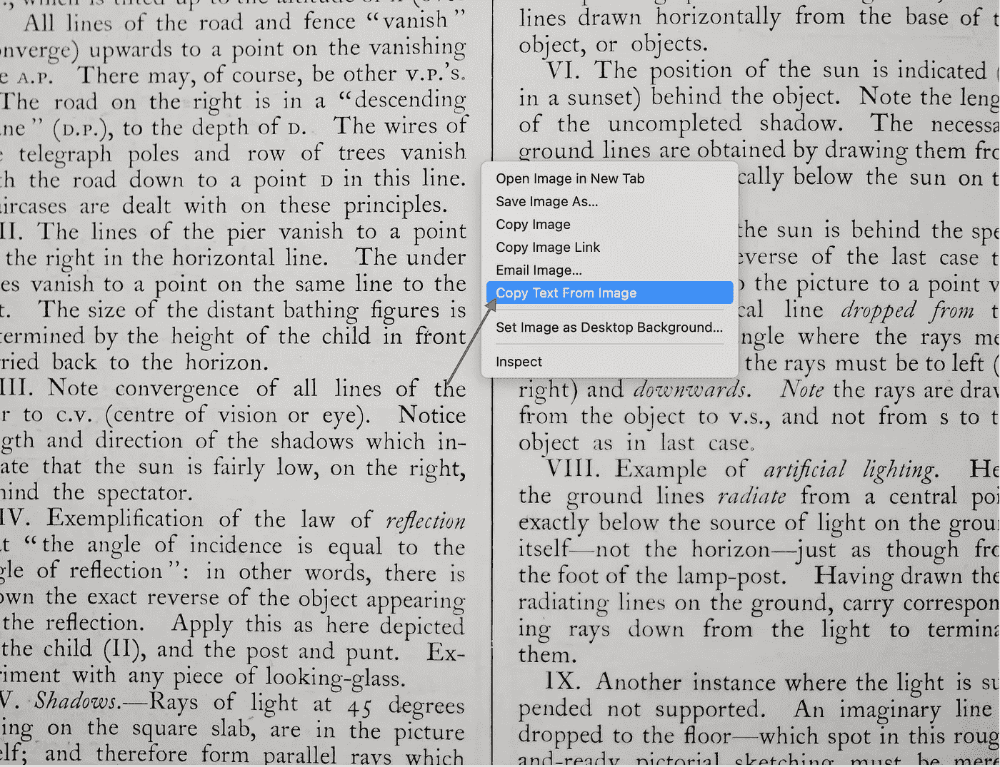
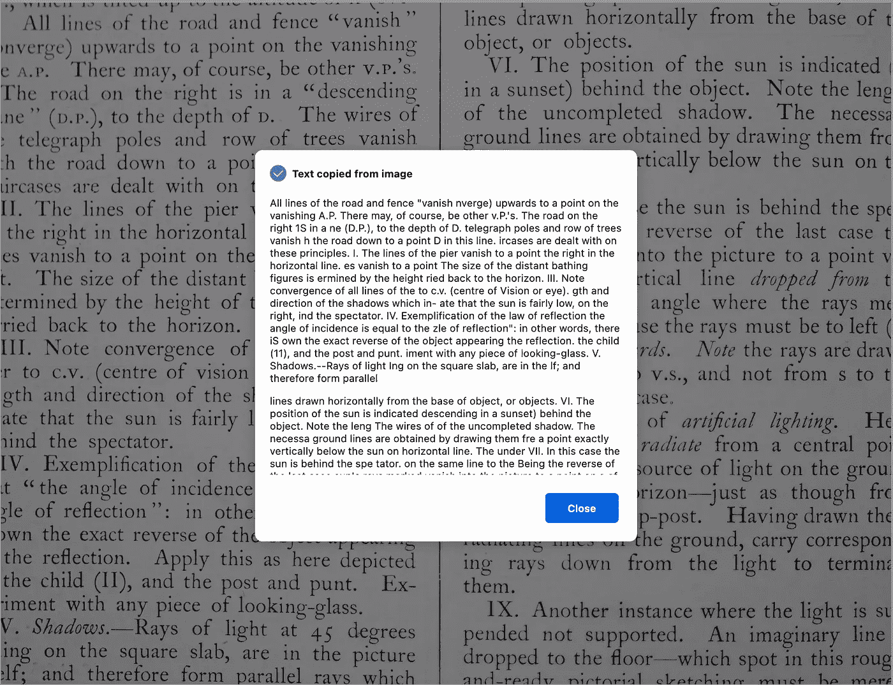

# 火狐最酷的一面

> 原文：<https://blog.devgenius.io/the-coolest-aspect-of-firefox-7427159bd426?source=collection_archive---------6----------------------->

新的火狐版本 **106.0** 已经在**2022 年 10 月 18 日**发布。


照片由[鲁拜图·阿扎德](https://unsplash.com/@rubaitulazad?utm_source=medium&utm_medium=referral)在 [Unsplash](https://unsplash.com?utm_source=medium&utm_medium=referral) 上拍摄

在最新版本中，它提供了许多很酷的功能，例如

*   现在可以编辑 pdf:包括书写文本、绘图和添加签名。
*   将 Firefox 设置为默认浏览器也使其成为 Windows 系统上的默认 PDF 应用程序。
*   你现在可以在 windows 10 和 Windows 11 上把私人窗口钉在你的 Windows 任务栏上，以便更简单的访问。此外，私人窗户已被重新设计，以增加隐私的感觉。
*   滑动导航(两个手指在触摸板上向左或向右滑动，以执行历史后退或前进)现在适用于 Wayland 上的 Linux 用户。

除了这些功能，它还附带了另一个很酷的功能，即 ie。“文本识别”,允许您从当前网页上的选定图像中提取文本。

要做到这一点，你需要遵循以下简单的步骤:

1.  只需右键单击图像，调出菜单，然后选择“**从图像**复制文本”。

转到网址([https://unsplash.com/photos/DwPLi_mvKpw](https://unsplash.com/photos/DwPLi_mvKpw))，然后右击它



点击后，文本将被复制到你的剪贴板，你可以相应地使用它。



文本如下所示:

```
All lines of the road and fence "vanish nverge) upwards to a point on the vanishing A.P. There may, of course, be other v.P.'s. The road on the right 1S in a ne (D.P.), to the depth of D. telegraph poles and row of trees vanish h the road down to a point D in this line. ircases are dealt with on these principles. I. The lines of the pier vanish to a point the right in the horizontal line. es vanish to a point The size of the distant bathing figures is ermined by the height ried back to the horizon. III. Note convergence of all lines of the to c.v. (centre of Vision or eye). gth and direction of the shadows which in- ate that the sun is fairly low, on the right, ind the spectator. IV. Exemplification of the law of reflection the angle of incidence is equal to the zle of reflection": in other words, there iS own the exact reverse of the object appearing the reflection. the child (11), and the post and punt. iment with any piece of looking-glass. V. Shadows.--Rays of light Ing on the square slab, are in the lf; and therefore form paralle

lines drawn horizontally from the base of object, or objects. VI. The position of the sun is indicated descending in a sunset) behind the object. Note the leng The wires of of the uncompleted shadow. The necessa ground lines are obtained by drawing them fre a point exactly vertically below the sun on horizontal line. The under VII. In this case the sun is behind the spe tator. on the same line to the Being the reverse of the last case sun's rays marked vanish into the picture to a point on a of the child in front direction point vertical line dropped from or angle where the the horizon: because the rays me must be to left right) and downwards. rays Note the Notice from the object to v.S., rays are dray and not from S to object as in last case. VIII. Example of artificial lighting. He the ground lines radiate from a central poi exactly below the source of light on the grou itself-not the horizon- just as though fre the foot of the lamp-post. Having drawn the Apply this as here depicted radiating lines on the ground, carry correspon Ex- ing rays down from the light to termina them. at 45 degrees IX. Another instance where the light iS Su pended not supported. An imaginary line picture which dropped to the floor which spot in this roug and_ready a retchinl 
```

注意:*使用此功能，您可以从任何。jpg，。png，还有。webp 图像。请注意,“从图像中复制文本”命令不适用于有意禁用文本复制的图像。*

了解更多关于火狐 106.0 的新特性:[https://www.mozilla.org/en-US/firefox/106.0/releasenotes/?UTM _ source = Firefox-browser&UTM _ medium = Firefox-desktop&UTM _ campaign = about-dialog](https://www.mozilla.org/en-US/firefox/106.0/releasenotes/?utm_source=firefox-browser&utm_medium=firefox-desktop&utm_campaign=about-dialog)