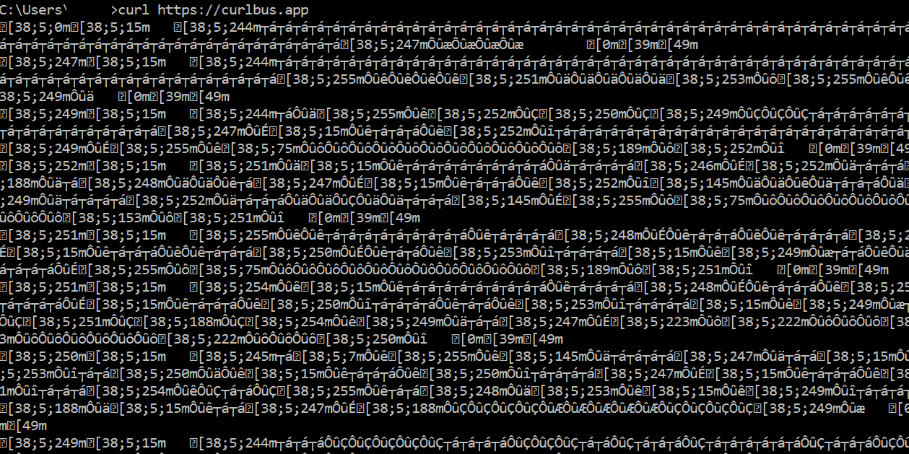

# 科技、生活和激情的重压

> 原文：<https://blog.devgenius.io/the-crushing-weight-of-tech-life-and-passion-5e8141bc5d3c?source=collection_archive---------19----------------------->

很可能你们大多数人都熟悉这种恐惧的感觉，当你意识到有多少事情摆在你面前的时候。无论是在工作中，在家里，甚至是在从事业余爱好的时候。我相信在科技领域，这种粉碎梦想的感觉尤其普遍。这在很大程度上是因为科技是巨大的。数百万个不同的程序中有如此多的层次和细微差别。它变成了一堆不可能的代码。从 DSA(数据结构和算法)到 c 的旋转甜甜圈。

有时甚至比这种胡言乱语更令人困惑

即使对于最聪明的程序员来说，这也常常让人不知所措。对我来说，我称之为代码重量的感觉是一座巨大的隐现的山。当我开始一个新项目或者发现一个以前项目的未探索的方面时，它们经常出现在我面前。在本文的大部分时间里，我将解释如何处理代码权重以及如何将编程与生活联系起来。我**不会**告诉你技巧和窍门或者类似的噱头。我将告诉你冷酷的事实，以及我个人是如何克服代码重量的。不仅如此，我还将向您展示我在常见方法中发现的一些陷阱。代码重量是我们所有人都必须面对的一场斗争，你的任何经历都会在回复中得到重视。编程有无限多的方法和方面。(就像生命一样。)然而，这里我将谈论我发现的最常见的方法。

# 缩小规模(我的方法)

关注树的特定方面

这种方法是我个人使用最多的方法。这是因为我的大多数项目都是长期的，因此我想深入了解它们。这使得缩小比例的方法对我来说是最好的方法。(可能还有你)你所做的是从一个大的、广泛的、潜在的科技概念开始。例如用于整体计算的逻辑门。然后你缩小到 AND、OR、IF 和 ELSE(其他基本逻辑门。)然后你开始学习像 XOR 这样比较晦涩的。最后，你缩小到可以了解特定逻辑门是如何工作的，以及二进制的每一位是如何影响它们的。这是我最喜欢的方法。也许是一些更晦涩的东西，需要在更大的概念上做更多的工作，或者可能是一些几乎完全技术性的东西，就像上面的例子。无论哪种方式，策略都是一样的。

**总结**

全局概念→通用概念→特定概念→利基技术点→项目工作

这就是简化的缩小比例方法。使用这种方法，当您在项目中工作时，代码重量的感觉会减少。这种方法使得开始新项目变得困难，但也意味着当你进入项目的更深层次时，你会有更高的注意力和效率。

**问题**

这种方法的最大问题是，它实际上只适用于长期项目，如果你的项目需要一些你正在学习的类别之外的东西，那么它就变得非常难以使用。此外，它使一切开始时似乎很困难。(这允许它的一些优点。)

**主要陷阱**

只是不要掉进去

这种方法有三个主要缺陷:

1.  拖延:这种方法容易拖延，因为它非常有压力，而且很难开始。我发现自己一次又一次地等待几周，甚至几个月才能开始一个项目。有时候，有动力的刺激很容易克服这种拖延，但你不能总是依赖动力。我推荐解决拖延症的常用方法:时间表、任务清单、刚开始等等。
2.  走得太远:这种方法的最大优势来自于你对项目每个部分的了解程度。虽然它最大的优势与最后的陷阱混在一起会成为它最大的弱点。本质上可能发生的是，你会拖延实际开始项目，把所有的时间都花在学习和准备上。对于很多事情来说，这是一个常见的问题，但是这种方法允许它成为一个更大的问题。这是因为你能学到的晦涩的信息是没有止境的。这经常导致许多开发人员花费数年时间不做他们的项目，而是生活在进展的幻觉中。这种事在我身上发生过几次。(没持续几年)感觉自己知道的还不够开始，就继续学，越学越多，没有尽头。这比上一个问题要复杂一点，也更个人化:为你的项目设定一个学习时间限制，设定一个概念限制，或者试运行你的项目，看看你是否了解足够多。
3.  挖掘侧隧道:这是这种方法的次要问题之一，但它仍然可能成为一件非常危险的事情。这个问题本质上是你缩减你的程序需要的每一个边概念。例如，一个网站项目是关于建立一个网站，但你需要一个电子邮件服务，你的网站和…你忘乎所以，并最终进入 SMTP 兔子洞。这不是什么大问题，但类似于上一个陷阱。这是因为你可能最终会为一个更大的项目挖几十个洞。虽然这本身不是一个问题，但这些新的*洞*所代表的落入另一个陷阱的机会往往是有问题的。这个问题其实有一个非常简单的解决方法。(下一种方法)

# 向上扩展(配套方法)

慢慢缩小一个话题(不要一直放大。)

虽然这种方法通常对商业计划很有用，但在其他事情上却很难使用。它有一个相当小的代码重量开始。(除非你开始考虑以后的代码量会有多大。)尽管随着时间的推移，码重以指数方式增加。这是因为你从非常小众的概念或代码开始。虽然它们本身可能很容易理解。他们的类别通常不是。从小众概念扩大规模极其困难。例如回到逻辑门的例子。如果你从异或门开始，回到基本概念。这不仅会花费更长的时间，而且会让你更加心力交瘁。但是，这种方法确实有它的用处。这对于使用上述缩小方法的人来说尤其有用。它可以很容易地用来解决挖掘侧隧道的陷阱。当你需要一个快速的解决方案，或者你正在构建一个快节奏的小项目时，这种方法是至高无上的。

**总结**

从一个小创意开始→扩展到更广泛的概念→继续扩展，直到你的项目完成。

这种方法非常有助于避免拖延。它的启动时间非常快，最适合以前做过的项目。(这样更容易找到教程。)导致对一个话题的理解更加浅薄，缺乏对更长远项目的支持。这可能是开始编程时最糟糕的方法之一。不幸的是，这也可能是大多数自学成才的开发人员开始使用的方法。(也没有简单的方法来改变这一点。)

**陷阱**

请不要掉进去

这种方法有两个主要缺陷:

1.  当你挖穿天花板时:我知道这在技术上不是一个坑，甚至不是一个你可以掉进去的洞，但它符合本文的运行主题。本质上，这是当你开始做一些应该用扩大规模的方法缩小规模的事情的时候。这通常会在几天或几周内导致困惑和沮丧。这主要是因为你很可能没有足够的知识来完全理解更广泛的概念。如果你连基本的加减法都没学过，你不会从一个晦涩难懂的微积分问题开始，但你可能会试着把它当成一个有趣的副业。尽管你不懂微积分。唯一真正的解决办法就是:体验。找出你的天花板在哪里，当你开始使用这种方法时，要留意它。
2.  向上看:就像不要在高高的梯子上向下看一样，你永远不要用小范围的特征向上看得太远。这是因为只要抬头，你就能看到一个主题的全部内容。这挫败了这种方法的随和风度，并将导致比按比例缩小方法更具毁灭性的沉重负担。这是因为你是从下面而不是从上面看一座山。这使得代码的重量要重得多。所以无论你做什么，不要看得太远。解决方法:不要抬头！！！

奖金陷阱:

从技术上来说，这并不是一个陷阱，尽管它肯定会让你看起来像一个白痴。

宏伟的幻想:大多数开发人员在职业生涯的某个阶段都会遇到这种情况。没有什么办法可以完全阻止它。有时候你会觉得自己站在世界之巅，这没什么不对。然而，有一些开发人员使用这种方法来逃避他们所知甚少的现实。这导致了一个非常肤浅的开发者认为他们什么都知道。(这适用于每一个职业。)本质上，这种方法可以让你假装自己知道的比实际多。有时候这是一件好事，因为它给了你开始的信心，但是当你一直认为自己是最好的时候，你可能会成为一个傲慢的白痴。(外面的每个人都知道我在说什么。)

# 编织方法(适用于每个高级开发人员)

当你建立模糊的联系时

这可能是最好的方法之一。它是基于以前其他两种方法的经验。在很大程度上，当你获得经验时，它会自然发生。这种方法的基本概念是使用类似类别的背景知识来联系你当前正在学习的内容。这可以让你轻松很多。它还可以带来不同领域之间惊人的想法和联系。对这种方法的唯一警告是，它需要大量的经验来完成。有时，它可以用一些完全不同的背景知识来完成，但这主要适用于这种方法的新思想方面。这也可能是更模糊的方法之一。(最大的回旋余地)

**总结**

寻找新主题→寻找它和之前的主题之间的联系→利用背景知识更好地理解新主题→可选:利用联系提出独特的想法和解决方案。

这绝对是最有创意和最有效的方法。主要是因为它依赖于以前建立的知识。这是非常困难的，而且只适用于高级开发人员或对一个主题有深刻理解并能联系到另一个主题的人。一个简单的例子是:一个数学爱好者开始学习编程，并发现两者之间有许多相似之处。这使他能够比其他大多数初级程序员更快地创建和理解 DSA。我们每个人都有一个特定的东西，让我们在生活的利基类别中成长。当你缩小对编程的视角时也是如此。经验不是一切，但它确实有帮助。

**问题**

这种方法没有任何真正的内在缺陷。大多数问题来自使用这种方法的人。(或试图使用它)

**陷阱**

坑在哪里？

这种方法有一个缺陷:

1.  没有出路的隧道:这是试图使用这种方法的人的主要陷阱。在很大程度上，这种方法的好处和使用是自动的。可以通过有意识的使用来改善。然而，有意识的使用也会导致人们试图在大脑中建立不存在的联系。他们试图建立一个不存在的基础。这可能会导致问题，并且是该方法唯一真正的陷阱。避免这个陷阱的最好方法是:尽量少用这种方法。不管你是否意识到，它的好处会随着时间的推移而显现出来。

# 结论

正如我早些时候提到的那样，有无数种方法。以上只是我*亲身*经历的三个。欢迎在回复中分享你的方法。我相信读者可以很好地利用它们。

你在思考一种方法。

这篇文章的目的是告诉你抛开代码的重量，直接开始工作。(无论是代码重量还是任何其他类型的恐惧。)我们所有人面前都有一段漫长的旅程。即使对我们这些已经落后几十年的人来说。无论经历，领域，年龄，性格，我们都面临着一条有许多曲折路径的道路。希望你找到自己理想的高速公路，把生活过得充实。