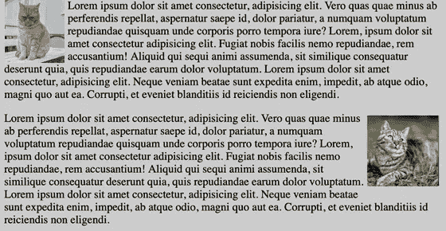
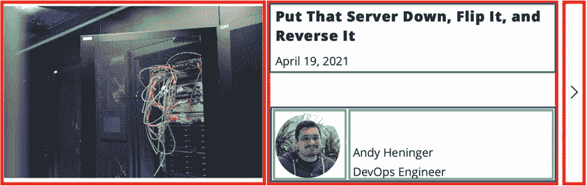
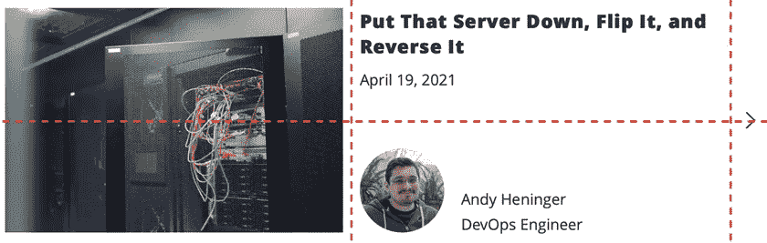
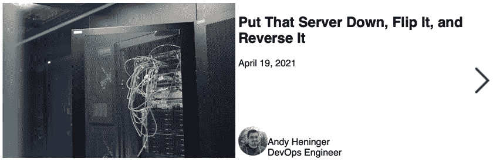

# CSS 文件—布局方法

> 原文：<https://blog.devgenius.io/the-css-files-layout-methods-55b8c3f6f51e?source=collection_archive---------7----------------------->


自从 web 出现以来，开发人员和设计人员就想为页面创建越来越复杂的布局。随着 web 的发展，创建复杂布局的技术也在发展。过去我们使用表格将页面分为页眉、菜单、侧栏和页脚，现在我们有了一系列的选择，可以帮助我们布局整个页面或小而简单的组件。

了解哪些选项可用以及每个选项的功能对于创建复杂的布局至关重要。让我们深入了解现代 web 开发提供的主要选项。

# 漂浮物

在使用表格进行布局不再流行之后，这是一件好事，浮动成为了创建布局的新方式。这是一个完美的逻辑选择:普通的块元素从上到下堆叠，而浮动允许并排堆叠。这就是浮动在最初的引导网格系统中的使用方式。但是，浮动的问题是，它们并不打算用于构建整个页面布局，甚至更小的组件布局。像桌子一样，它们的用途更窄。它们被设计成模仿纸质的布局，图像可以左右浮动，文字可以环绕它们。浮动在这方面很棒:



使用浮动布局的许多问题都是浏览器特有的(比如看着你)。但是，即使在现代浏览器中，浮动也有自己的怪癖。例如，如果您有一个所有子元素都是浮动的元素，那么父元素将没有高度。这是因为浮动元素从文本流中移除，因此不会向父元素报告高度。有几种方法可以解决这个问题，最流行的是“clearfix ”,但是有了更新的选项，浮动就不值得争论了，应该让文本围绕元素流动。

# Flexbox

Flexbox，或“CSS 灵活框布局模块”，是一个新的 CSS 显示选项，用于沿单个轴创建灵活的布局。您可以设置父元素的属性(flex-flow、justify-content 等。)而孩子们会自动回复。您可以轻松控制子元素的间距、对齐、大小和顺序，从而创建复杂而有用的布局。

flexbox 相对于 floats 的一个主要优势是我们使用的轴是一个属性，可以被改变。浮动只适用于水平方向，flexbox 对方向更加不确定。您可以按行或列排列项目，甚至颠倒方向，以便项目从右到左或从下到上排列。


AWH 的站点是 flexbox 的一个很好的例子。看看上面的主页横幅，我们有一个作为 flex 容器的标题。它的方向是一排，所以两个主要区块并排排列。为了沿着主(水平)轴分隔元素，我们使用 justify-content: space-between 将元素保持在容器的边缘，并在它们之间放置任何额外的空间。由于图像的大小是固定的，所以它只是停留在右侧，允许文本块根据需要扩展和收缩。



在 [AWH](http://awh.net) 站点上的博客文章列表是使用嵌套 flexbox 容器实现更复杂布局的另一个很好的例子。列表中的每个帖子都是一个水平容器，由图像、文本和箭头(红色轮廓)组成。文本块本身是一个垂直容器，所以我们可以在顶部对齐标题，在底部对齐作者标签(蓝色轮廓)。author 标签是另一个嵌套的 flexbox 容器，这次是水平的，所以我们可以将图像放在文本(绿色轮廓)旁边。

这种嵌套非常好，非常实用，尽管它会导致一些混乱的 HTML。在下一节中，我们将看到如何简化这个复杂的布局。

# 格子

网格是 CSS 中最新的布局选项。它允许复杂的多维布局。像 flexbox 一样，大多数属性都是在父元素上定义的。当您将一个元素声明为网格时，您可以定义所需的行数和列数。子元素将自动落入这些槽中，但是您也可以手动将它们分配到它们需要去的地方。最后一部分对于响应式布局特别有用，在这种布局中，您可以保持 HTML 在源代码中的顺序不变，同时改变这些元素的显示顺序。

让我们回头看看上一节中的博客文章组件，看看如何使用网格来改进它。首先，我们应该确定组成组件的行和列。我认为作者标签应该保持为 flexbox，所以我们应该需要两行三列，划分如下:



知道一个元素可以跨越多个单元格是很重要的。我们会好好利用这个事实。现在让我们构建一些简单、干净的 HTML 来表示这个组件:

```
<div class="blog-post">
    
    <div class="blog-post__title">
        <h2>Put That Server Down, Flip It, and Reverse It</h2>
        <p>April 19, 2021</p>
    </div>
    <div class="blog-post__author">
        <div>
            
        </div>
        <div>
            <div class="blog-post__author-name">Andy Heninger</div>
            <div>DevOps Engineer</div>
        </div>
    </div>
    
</div>
```

HTML 比相应的 flexbox 代码简单得多。我们不需要*任何*深度嵌套。现在是 CSS:

```
.blog-post {
    display: grid;
    grid-template-columns: 1fr 1fr 30px;
    grid-template-rows: 1fr 1fr;
    grid-template-areas:
        "image title arrow"
        "image author arrow";
    grid-gap: 5px;
}.blog-post__image {
    grid-area: image;
}.blog-post__title {
    grid-area: title;
}.blog-post__author {
    grid-area: author;
    align-self: end;
    display: flex;
    align-items: flex-end;
}.blog-post__arrow {
    grid-area: arrow;
    justify-self: center;
    align-self: center;
}
```

我删除了一些额外的行，以使代码片段更短。你可以[在这里](https://codepen.io/amoscardino/pen/vYgwpYz?editors=1100)查看完整代码。我没有做太多的工作来使它看起来完美，只关注布局，但它匹配得很好:



一些需要注意的事项:

*   当定义行和列时，我使用 fr，这是一个分数单位，其中 1fr 表示可用空间的分数。
*   定义行和列时，有更多的单元和函数可用。您可以使用 repeat()、minmax()、min-content、clamp()等等。
*   我们正在创建可以分配内容的“区域”。这是因为有些内容跨越了多个单元格，而有些内容使用默认排序不会被分配到正确的单元格。因此，我们创建命名区域，并手动将每个孩子分配到一个区域。
*   请注意我们如何独立调整每个单元格内的内容对齐方式。这允许我们将箭头居中，并将作者信息放在单元格的底部。
*   还要注意网格单元是如何成为 flex 容器的。我们将它用于 author 标签，以保持父网格的简单。

# 用哪个？

以下是我的一般原则:

*   用于将文本像图像一样环绕在元素周围:floats。
*   当您需要沿单个轴对齐内容时:flexbox。
*   当您需要沿两个轴对齐内容时:grid。

我看到过一些建议将 flexbox 用于组件布局，将 grid 用于页面布局。这是一个不错的经验法则，但我的偏好是考虑特定布局的需求，并基于此进行选择。

在过去的 20 年里，CSS 已经成熟了很多。我们不再需要用表格、框架或浮动来拼凑布局。我们现在有了强大的选项，如 grid 和 flexbox。我鼓励你了解所有这些选项，这样你就可以为手头的工作选择最好的一个。

*   [关于浮动的一切——CSS 技巧](https://css-tricks.com/all-about-floats/)
*   [彩车— MDN](https://developer.mozilla.org/en-US/docs/Learn/CSS/CSS_layout/Floats)
*   [Flexbox 完全指南——CSS 技巧](https://css-tricks.com/snippets/css/a-guide-to-flexbox/)
*   [Flexbox — MDN](https://developer.mozilla.org/en-US/docs/Learn/CSS/CSS_layout/Flexbox)
*   [CSS 网格完全指南——CSS 窍门](https://css-tricks.com/snippets/css/complete-guide-grid/)
*   [网格— MDN](https://developer.mozilla.org/en-US/docs/Learn/CSS/CSS_layout/Grids)
*   [布局网格，组件柔性盒——Ahmad Shadeed](https://ishadeed.com/article/grid-layout-flexbox-components/)
*   [快！Flexbox 和 Grid 有什么区别？— CSS 技巧](https://css-tricks.com/quick-whats-the-difference-between-flexbox-and-grid/)

## ——安德鲁·莫斯卡迪诺，AWH 公司的软件开发员。我们正在帮助企业通过技术推动增长。