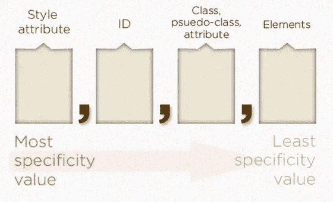

# CSS 文件—特异性

> 原文：<https://blog.devgenius.io/the-css-files-specificity-20f790e068c6?source=collection_archive---------4----------------------->


尽管有一些迷因，CSS 还是很棒的。它简单、强大，而且非常灵活。但是对于一些开发人员来说，CSS 可能会令人困惑。你写了一堆你认为适用于 HTML 元素的规则，但是有些地方不对劲，或者有些属性没有被使用。沮丧之余，你求助于 CSS 工具的大锤:！重要。很管用，但是你不知道为什么。

对我来说，看见！CSS 中重要的是代码味道。这表明一个更大的问题隐藏在表面之下。如果我看到了！重要的是，在代码审查期间，这是开发人员需要重新考虑他们的方法的明确信号。

通常，这类问题归结为对浏览器如何选择将哪些 CSS 规则应用于元素以及给这些规则什么优先级的误解。让我们深入了解规则的优先级是如何确定的，并揭开 CSS 的一些神秘面纱。

# 特征

特异性是浏览器为每个 CSS 规则生成的值。它由四部分组成，基于所用选择器的类型和数量:



要填充每个点，你只需数一下类型的数量，然后填空。例如，考虑以下规则:

```
.foo {
    color: red;
}
```

因为只使用了一个选择器，并且因为它是一个类选择器，所以特异性值是“0，0，1，0”。现在让我们看看这个:

```
#bar div {
    color: red;
}
```

该规则使用两种类型的选择器，即元素和 ID，但每种只使用一种，从而产生“0，1，0，1”的特异性值。

如何使用这些值很简单:值越大，优先级越高。浏览器对每个 CSS 规则都这样做。通过去掉逗号，只比较数字，可以很容易地比较数值。101 大于 10，因此如果第二个规则都应用于同一个元素，则第二个规则优先。

逗号很重要，因为特异性值不是以 10 为基数的值。你不能打败一个超过 10 个类的 ID 选择器。

让我们再看一些例子，看看你是否能明白我是如何得到这些数字的:

```
ul#menu li > a {
    /* 0,1,0,3 */
}ul#menu li.active > a {
    /* 0,1,1,3 */
}html body.js h1 + p.lead {
    /* 0,0,2,4 */
}p.sample > * + * {
    /* 0,0,1,1 */
}a[href^="#"] {
    /* 0,0,1,1 */
}ul li ~ li div:not(.foo) {
    /* 0,0,1,4 */
}<!-- 1,0,0,0 -->
<span style="color: red;"></span>
```

一些需要考虑的事项:

*   通用选择器*没有增加特异性。
*   伪类(如:hover)像类一样计数，而伪元素(如:first-child)像元素一样计数。
*   :not()的特殊之处在于它不添加任何特定性，但它内部的子句添加了特定性。在上面的示例中。在:not()中的 foo 是在第三个位置添加 1 的原因。这也适用于:is()。
*   如果一个选择器重复，它将被多次计数。因此. test.test 的值为“0，0，2，0 ”,而。测试只有“0，0，1，0”。我不建议在实践中使用这个。

**关于重要的**

！重要信息允许单个属性上移，因此其规则的特殊性通常无关紧要。它可以被认为是在特异性计算中增加了一个额外的数字，从而得到值“1，0，0，0，0”。这是覆盖内联样式的唯一方法之一。

领带呢？

```
<style>
    span {
        display: inline-block;
        height: 100px;
        width: 100px;
    } .red {
        background-color: red;
    } .blue {
        background-color: blue;
    }
</style><span class="blue red"></span>
<span class="red blue"></span>
```

你认为盒子会是什么颜色？如果你一直在跟踪，当你发现它们都是蓝色的时候，你应该不会太惊讶。[自己看](https://codepen.io/amoscardino/pen/oNBOmEb?editors=1100)。

> 理解特殊性可以揭开 CSS 的许多神秘面纱。了解选择器如何进行比较可以帮助您确定实际将应用哪些属性。这反过来可以帮助您找到缺失属性的问题，并可以避免您不得不求助于！重要。

# 了解更多信息

*   [特异性— MDN](https://developer.mozilla.org/en-US/docs/Web/CSS/Specificity)
*   [关于 CSS 特异性的细节](https://css-tricks.com/specifics-on-css-specificity/)
*   [CSS 特异性:你应该知道的事情—粉碎杂志](https://www.smashingmagazine.com/2007/07/css-specificity-things-you-should-know/)

**引文**

克里斯·科伊尔。" CSS 特异性的细节:CSS 技巧."2021 年 1 月 20 日，css-tricks.com/specifics-on-css-specificity/.

## ——安德鲁·莫斯卡迪诺，AWH 公司的软件开发员。我们正在帮助企业通过技术推动增长。