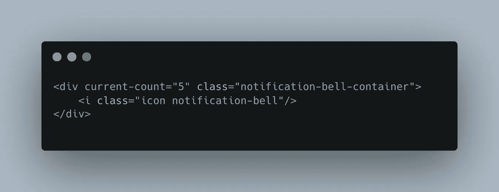
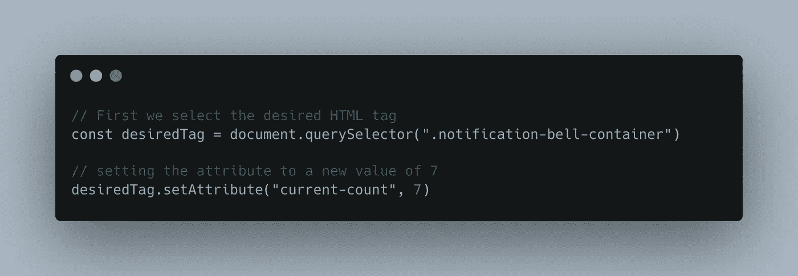
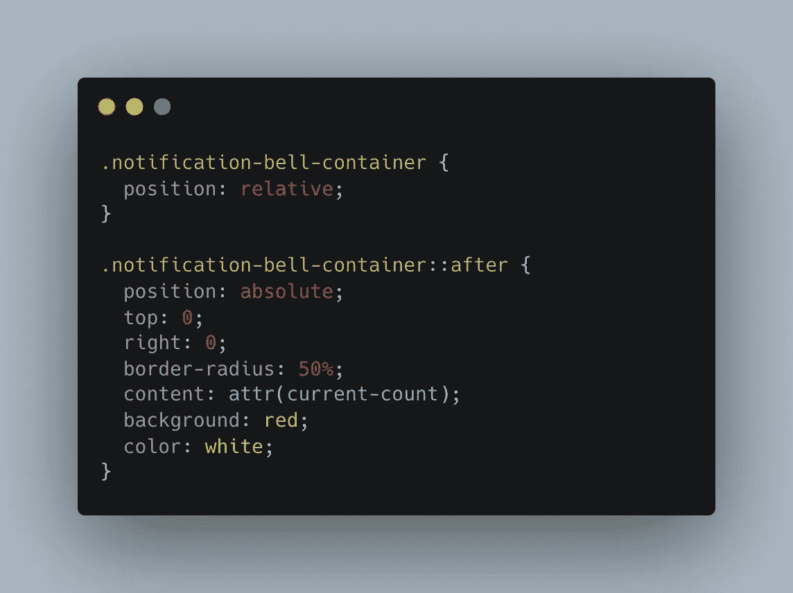

# 你需要知道的 CSS 黑客！

> 原文：<https://blog.devgenius.io/the-css-hack-you-need-to-know-7a3c2f7a8ce1?source=collection_archive---------1----------------------->

## 我希望我能早点知道这些…

上课了，在今天的课程中，我们将讨论 CSS 中鲜为人知的`attr()`属性选择器。它是如何工作的？为什么很神奇？以及如何将它与`::before` & `::after`伪选择器一起使用，以使您的代码更干净、更精简！

# 场景

如果您是一名开发人员，那么您可能会发现自己正在编写具有以下效果的代码:


具体来说，我们说的是右上角的通知图标。

这种效果在各种通知类型中都很常见，对用户参与度也很重要。也许用户有十条新消息，或者他们的购物篮中有四件商品。无论哪种方式，我们都有无数种方法可以编码出这种特殊的特性，然而有一种方法比其他方法更胜一筹。

# 最佳实践实现 Attr()选择器

这种特性的一个常见实现是在一个元素中使用一个额外的 span，也许它有一个绝对位置并覆盖在一个图标上。跨度值根据需要更新。公平合理的解决方案。然而，有一个更好的方法。

Attr()选择器允许我们的 CSS 样式表代码与我们的 HTML 进行通信。选择器允许我们读入特定于目标 HTML 标签或元素的属性值。例如:



具有“当前计数”和“类”属性的 Div。

在上面的例子中，有问题的 HTML 元素是 div。`Divs`可以有子内容；在这种情况下，我们有一个图标，似乎是一个通知钟。这个`div`标签也有两个属性: ***当前计数*** & ***类*** 。

类是最常见的标记属性之一，用于设计样式。***current-count***属性是我心血来潮分配和命名的自定义属性，其中所述属性的值等于用户可能未读的通知的当前数量。

我可以使用一些简单的 javascript 轻松地更新分配给“current-count”属性的值:



更新属性值。

这个解决方案的真正神奇之处在于，现在我们可以快速制作一个通知徽章，显示计数 ***，而不需要任何额外的 html*** 。没有跨度，没有额外的 div，CSS 代码中只有一个简单的伪选择器。

我们所要做的就是在我们的 CSS 表中编码所说的伪选择器，对于内容属性，执行以下操作:

```
content: attr(current-count);
```

完成后的类可能看起来有点像:



content 参数将确保显示我们分配给“当前计数”属性的值。

就像这样，我们在图标的顶部有一个整洁的小徽章，显示分配给父标签内属性的值。因为属性清楚地描述了价值的目的和意图，所以对于其他试图通读你的代码的人来说，更干净、更简洁、更整齐和更明显。