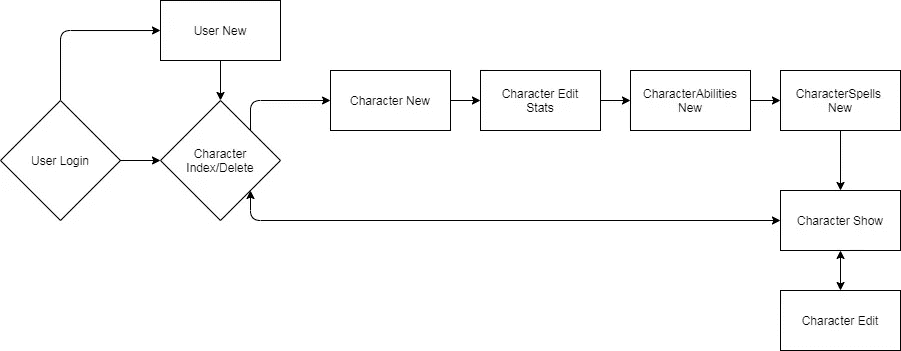
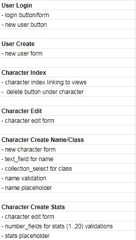

# 让我成为更好的程序员的烹饪哲学

> 原文：<https://blog.devgenius.io/the-culinary-philosophy-that-made-me-a-better-coder-73aea691bf62?source=collection_archive---------12----------------------->

开始编写第一行代码通常会令人望而生畏。网站上的每一个小动作都需要错综复杂的代码层，才能在一个复杂的 Rube Goldberg 代码机器中运行。

代码期望

代码现实

# 那么你从哪里开始呢？

在我短暂的编码生涯的早期，我会一头扎进我的编码中。

学校的

这种“冒险、犯错、变得混乱”的处理代码的哲学最初适用于简单的代码问题。然而，当编码项目变得更加复杂时，这种先入为主的策略很快导致了一个泥潭。我试着编码越快，实际上我的编码越慢。

正是在这个十字路口，我在熨斗学校的优秀导师告诉我“慢下来”这个简单的建议一开始让我很困惑，但最终让我将烹饪哲学作为我编码的思维框架。

查尔斯·海恩斯/Flickr/知识共享

Mise en place ，这是一个法国烹饪短语，意思是“把一切都放在适当的位置”，这既是一种理念，也是大多数餐馆的一种做法。正如《米其林指南》所言，mise en place 是“[在开始烹饪之前组装食材和设备的艺术](https://guide.michelin.com/us/en/washington/washington-dc/article/features/mise-en-place-cooking)

事先做好一切准备会让整个过程变得混乱，因此厨师可以专注于烹饪最终产品。在组装整体之前有一个清晰定义的任务集可以让你更加专注，提高效率。

# 那么这如何应用于编码呢？

我对编码的误解是，在我开始编码之前，严格地计划出一个可交付产品工作所需的所有细节。我用来完成这项工作的技术因情况而异，但是它可以从伪代码到创建用户流程图。

龙与地下城角色生成器的用户流

龙与地下城角色建造者大纲

通过首先进行所有的设计和解决问题，我创建了一个编码路线图，我可以简单地按照它来创建我的可交付成果。结果，当我最终开始编码时，我被解放出来，只关注代码和语法的粒度。

简而言之，在开始时后退一步，整体上提高了效率。