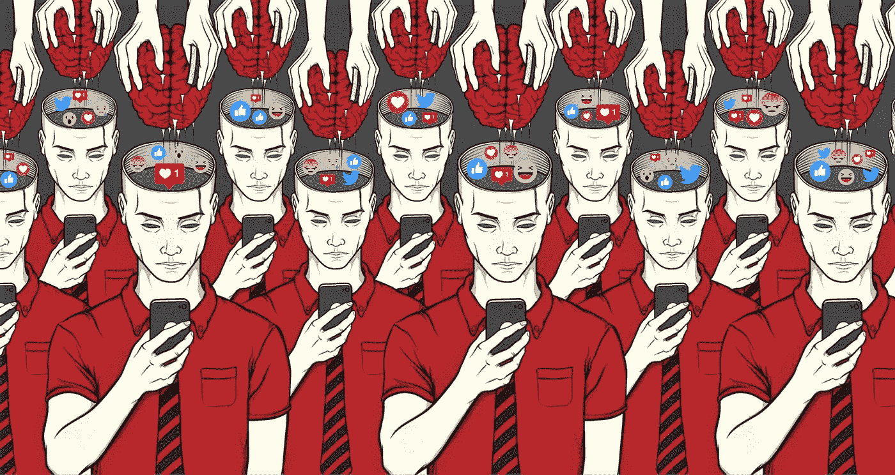

# 技术和数据的阴暗面

> 原文：<https://blog.devgenius.io/the-dark-side-of-tech-and-data-36218f046105?source=collection_archive---------44----------------------->

图片来自:[乔伊·克拉伦比克](https://www.behance.net/conspire)

在我的上一篇博客中，我提到我并不确定我想从事什么行业，科技行业是一个很好的地方，因为那里是大部分招聘的地方。我对加入这个行业表示了一些保留，因为技术似乎对社会有负面影响。我想在这篇博文中详细阐述一下我的想法。明确地说，我热爱技术，因为如果明智地使用，它有很大的潜力来改善我们的生活。也就是说，我认为我们社会痛苦的根源在于我们不能足够快地适应技术带来的不断变化的环境。

自从我进入数据科学，我开始意识到它的力量和被滥用的潜力。对于不知道什么是数据科学领域的读者，让我给你一个快速的背景介绍。数据科学可以被认为是编程、统计和商业之间的交叉点。这是一个相当新的领域，在过去十年中，由于大企业需要分析他们收集的大量数据，这个领域迅速发展。数据科学家的工作是收集原始数据，并将其转化为可操作的业务知识。在幕后，数据科学家利用他们在编程、统计和机器学习方面的技能和知识，从大数据中做出预测。

数据科学中最容易吸引大多数人注意力的领域是机器学习领域，这是一个宽泛的术语，包含许多不同类型的算法，可以做看似聪明或智能的事情。例如，你可以训练一个神经网络算法，将手写数字分类到 99%的荒谬准确率。一些更复杂的算法被用于无人驾驶汽车、你的手机或你的亚马逊订购设备 Alexa 中。但为了让算法变得擅长它所做的事情，它需要从大量数据中“学习”。你给机器输入的数据越多，它们就越聪明。

谷歌、Youtube 和网飞等大型科技公司喜欢收集大量数据，原因如下:因此它们的算法可以更智能地学习你喜欢什么，以及如何更有效地抓住你的注意力。虽然这对产生巨额利润的科技公司来说很好，但这是以牺牲消费者的数据隐私和其他许多事情为代价的。收集到的许多数据经常被重新打包，出售给其他公司以获取利润，而作为消费者，你对谁获得了你的数据以及他们如何使用这些数据几乎没有发言权。除了隐私问题，社交媒体应用被称为多巴胺老虎机还有一个原因。这些算法不断提供你喜欢的新视频、关于谁对你的帖子发表了评论的通知，以及你的订阅源中的新文章，以保持你的滚动，向你的大脑提供多巴胺，以加强每次回来的习惯。当你这样想的时候，难怪有些人会对手机上瘾。我的意思是，它甚至不再是一部真正的电话，因为没有人真的用它来打电话。我们总是保持联系，不断被信息、通知和内容轰炸，却没有有意义的互动，这让我们更加焦虑、不安全，最终更没有成就感。我们不可能摆脱这一切，因为这是我们生活中不可或缺的一部分。我们在工作和学习中需要它，现在它是我们娱乐的一个巨大来源，因为现在流行病已经成为一件事情。我并不是说我们应该抛弃技术。但是需要负责任的使用。现在，没有利润刺激来改变这个系统。正因为如此，作为一个社会，我们有责任意识到这对我们的影响，尤其是对我们的孩子和年轻人。

互联网也对我们的社会生活产生了非常有害的影响，这又回到了我们关于社会萧条的讨论中。在我看来，很明显，我们通过手机与社交媒体的不断接触让我们在现实生活中变得不那么社交化了。每当谈话暂停时，我们都会默认使用电话。问题是现在几乎都是。现在每个人的注意力持续时间都变短了，因为我们经常被社交媒体过度刺激。视频变得越来越短，推文变得越来越短，使得任何细微的讨论都没有空间。再也没有安静的自我反省或真正的无聊了。我说的是当我们无事可做时的无聊感。无聊可能是一件好事，因为它迫使我们寻找新的活动，我们实际上会发现充实。社交媒体让我们处于无聊的边缘，同时刺激我们不断参与其中。总有事情可做，有东西可读，有东西可发。

多年来，在现实生活中与人交往变得越来越难，甚至在疫情之前，似乎没有人再有任何共同点，我认为很大一部分原因是因为互联网。有这么多不同类型的电视节目、电影、游戏和音乐，人们最终只会消费算法推荐给他们的东西。这最终在网络社区制造了许多与自然地理毫无关联的文化泡沫。除了我们的文化分裂，互联网也没有让我们变得更聪明。一些专家认为，《平地球》的复兴可以归咎于 Youtube 的推荐系统。你可能会认为更多地接触世界上所有的信息会根除这些信念，但事实恰恰相反。不幸的是，人们倾向于阅读和观看验证他们自己信仰体系的内容。当人们开始只消费推荐给他们的新闻时，这变得更加危险，这可能解释了为什么美国在政治上如此两极化。算法只是给你更多你想要的东西，没有给智力增长或理解不同想法留下多少空间。

如果你觉得未来还不够可怕，那就等着听 deepfakes 吧。deepfake 使用机器学习来操纵图像或视频中的人脸，使其与他人相似。你可能已经看过一些了，并且已经看到其中一些是多么的令人信服。看着比尔·哈德尔在模仿阿诺德·施瓦辛格的时候无缝地转变成他是一件很棒的事情。但是，当我说这项技术有可能摧毁整个文明时，我并没有夸大其词，人们需要意识到这一点。幸运的是，我们仍然可以使用机器学习算法来识别 deepfakes。然而，有一个薄薄的门槛阻止这项技术完全接管社会。这个门槛就是我们不能区分事实和虚构的时候。对于没有看过 deepfake 的读者来说，去 Youtube 上看看，告诉我你不会同时感到敬畏和害怕。

既然我已经吓到你了，读者，有很多事情值得乐观。虽然技术绝对可以毁灭我们，但它也可以带来一个更美好的世界。这也是我投身科技的原因之一。另一个原因是因为我是一个懒惰的人，喜欢别人为我做事。因为一旦机器崛起，它们唯一能接管的就是我们所有的工作。拿我来说，我会很高兴在机器人仆人修剪草坪的时候啜饮一口马提尼。也许我会在未来的博客文章中更多地谈论技术的好处。