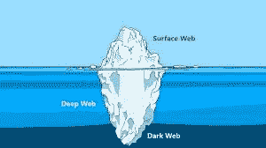
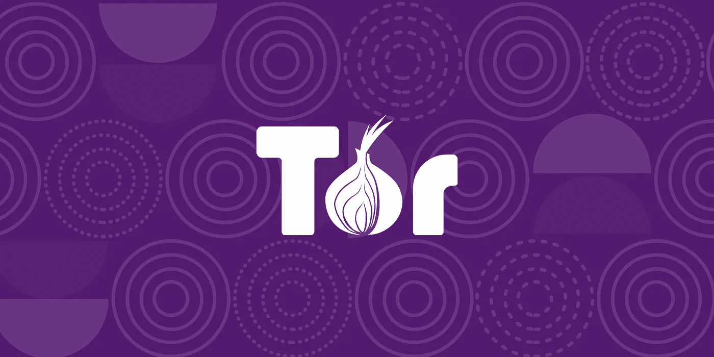
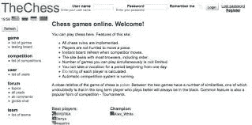

# 黑暗之网

> 原文：<https://blog.devgenius.io/the-dark-web-2e3d6148fcea?source=collection_archive---------8----------------------->

根据我的经验，普通大众从电影和电视中了解职业。当我还是一名护士时，我会听到家人和朋友说“护士们做得很好”。我从来没有想过我会在一个编码训练营中制作 web 应用程序，但是我做到了。我开始意识到编码和技术比我过去做的要少得多。黑暗之网是我一直好奇的东西之一，但我认为它是一个只有罪犯才会去的地方。

## 深度网络与黑暗网络

许多人认为它们是一回事，但事实并非如此。所有的暗网网站都是深网的一部分，但并不是所有的深网网站都是暗网的一部分。deep web 包含一些不能被标准搜索引擎(如 google)搜索到的站点。deep web 包含没有正常命名约定或路由约定的站点。电子邮件等受密码保护的网站、流媒体服务等付费订阅网站以及通过表单访问的网站。想象一下，如果你只需输入 netflix.com/index，就会弹出一个展示页面，或者我可以为你的电子邮件编制索引。互联网将是一个更加危险的地方。

暗网更有趣一点。互联网的这一部分并不都是合法的材料，尽管根据 Daniel Moore 的一项研究[Thomas Rid 在 2016 年完成了大约 57%的网站进行非法活动。](https://www.tandfonline.com/doi/full/10.1080/00396338.2016.1142085)深度网络仅占总网络的 5%。虽然很难说。由于非法活动，许多网站被关闭和移动，以防止所有者被抓住。

## 如何进入 Deep Web

深度网页不是。他们有一个洋葱地址。这些地址是由数字和字母组成的神秘而随机的字符串。你需要下载一个名为 Tor 的新浏览器。

Tor 或洋葱浏览器是一项免费服务，它通过创建一个由伯爵夫人节点或中继点组成的覆盖网络来实现匿名通信，这些节点或中继点将加密信息传递给服务器。它被称为洋葱浏览器，因为数据被包裹在加密层中，当它通过每个节点时，一层被删除。有点像洋葱。Tor 被生活在有互联网审查、执法和记者的国家的人们使用。

## 黑暗网络上的合法网站

如果你正在寻找一个象棋伙伴，你可以和来自世界各地的人一起玩。暗网的隐藏答案就像雅虎的答案一样。有书友会，网站上有未受版权保护的材料可供下载。如果你对网站[感兴趣，隐藏的维基](http://thehiddenwiki.org)是网站和博客的绝佳资源。洋葱链接。

## 最后

不要让一本书的封面吓跑了你。我的意思是，我从未想过我会在科技行业工作。我认为这是“我力所不及”的事情，是我力所不及的事情。我不建议你在一个黑暗的网页上做更多的研究。即使 Tor 是一个很好的资源，你也可以很容易地下载病毒或者让自己陷入麻烦。做让你开心的事，尝试新事物。你永远不知道你会学到什么。