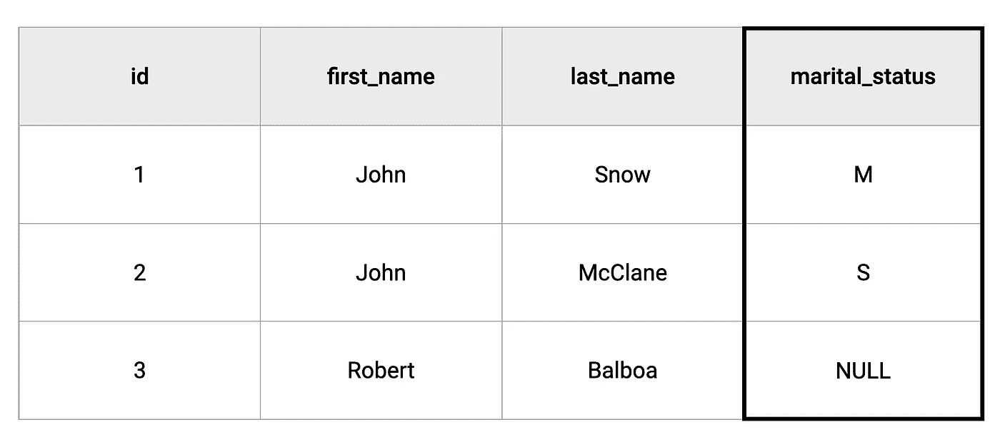
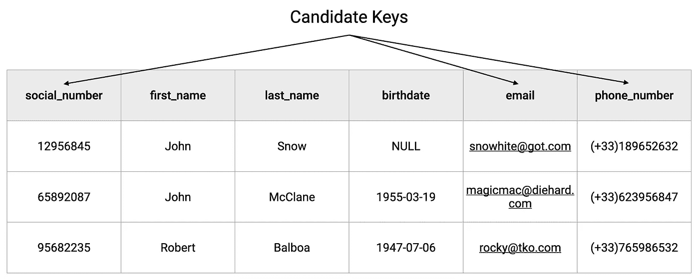
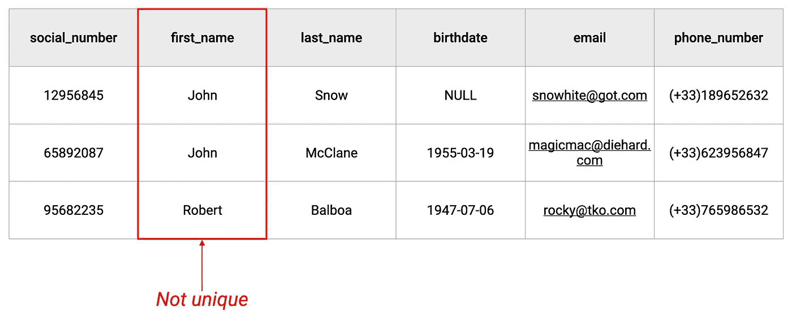
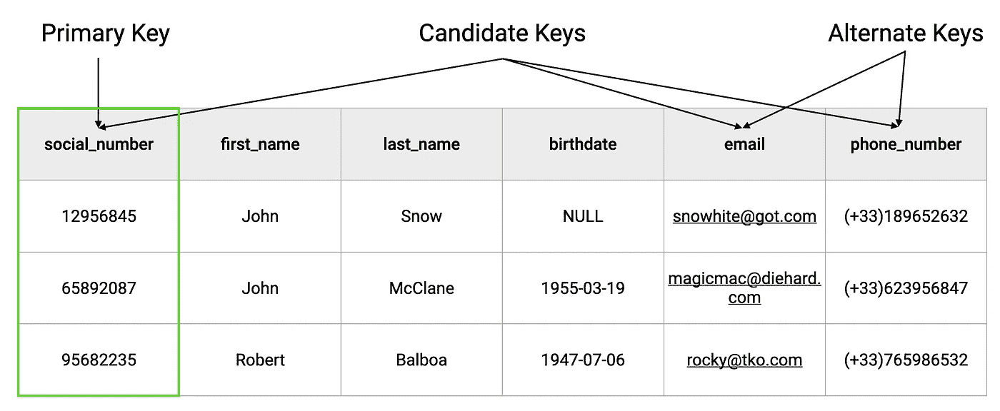
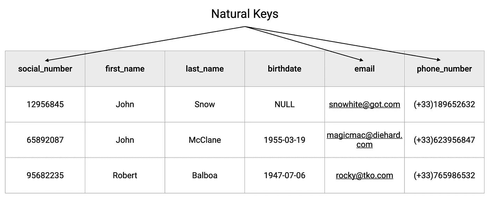
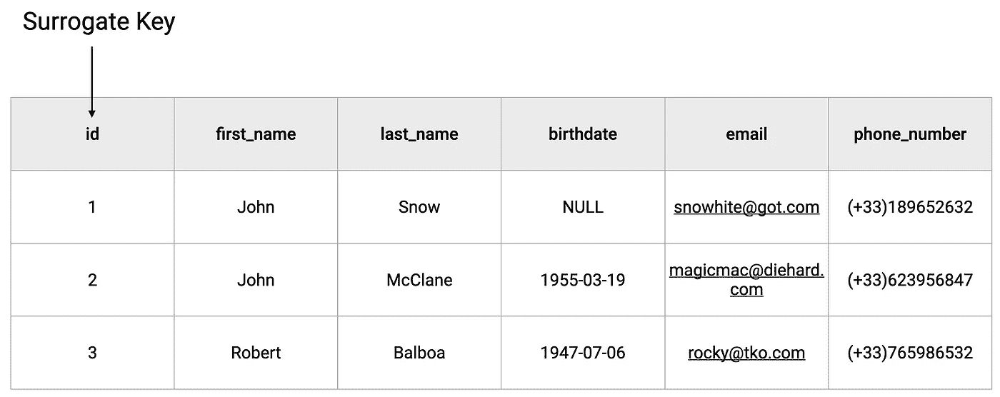
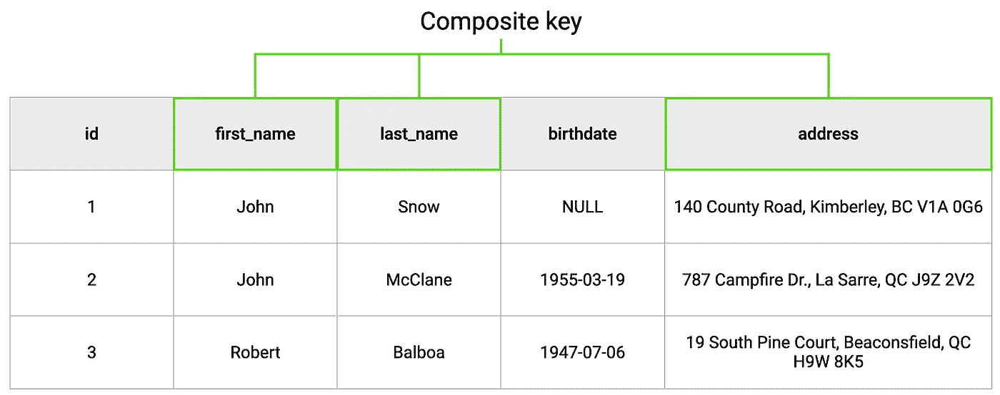
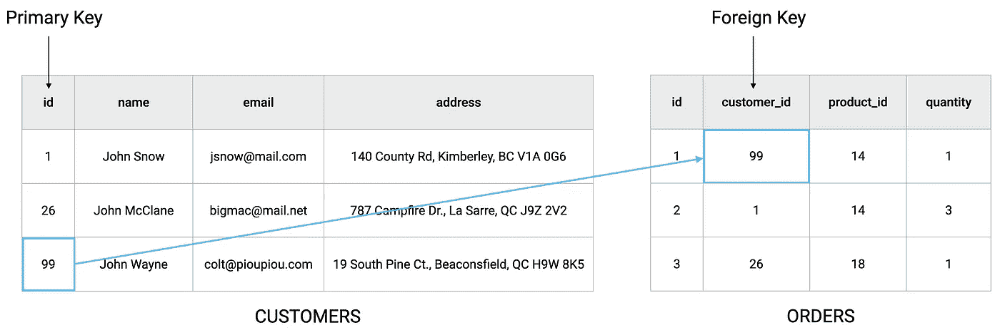
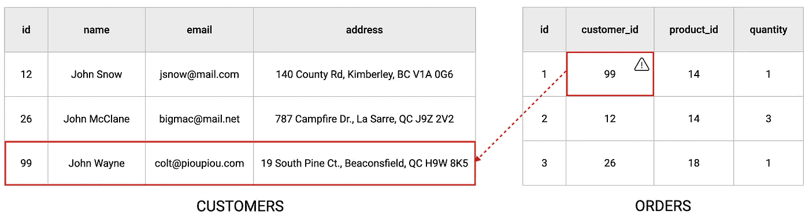

# 数据完整性约束(RDBMS 第 2 部分)

> 原文：<https://blog.devgenius.io/the-data-integrity-constraints-rdbms-part-2-19e0cd10d6dd?source=collection_archive---------4----------------------->

《打造分层微服务 之书 [**现已在 https://learnbackend.dev/接受预购。**](https://learnbackend.dev/books/build-layered-microservices)

**数据完整性**是在数据的整个生命周期中维护和保证数据的准确性和一致性。

它由三个完整性约束组成，称为:**实体**完整性、**引用**完整性和**域**完整性。

如果应用得当，这些约束可以确保所有数据都可以被跟踪、连接、恢复和搜索，从而提高数据库的稳定性、性能和可维护性。

# 域完整性

域完整性约束声明关系的所有属性必须在定义的域上声明。

事实上，每当在关系中创建新属性时，必须定义一定数量的属性，以便控制可以存储在其中的数据类型，例如:

*   数据类型
*   长度
*   接受或不接受空值
*   允许值的集合
*   默认值

例如，如果我们要创建一个包含一个人的婚姻状况的属性，我们可以将其定义如下:一个长度为 1 的字符串，它只允许字母 *M* 中的一个表示已婚， *S* 表示单身，或者如果状况未知，则默认为 *null* 值。

# 实体完整性

实体完整性约束规定关系必须有一个唯一且不为空的主键。

简而言之，主键是一个指定的属性或一组属性，它有助于在关系中唯一地标识一条记录。

## 候选键

为了选择主键，我们必须首先识别与主键标准匹配的关系的所有可能属性，然后这些属性被称为**候选键**。

例如，像电子邮件地址或社会保险号这样的属性通常是很好的候选关键字，因为我们可以确定它的值对于每个关系记录都是唯一的和非空的。

相反，选择一个人的名字作为候选关键字会与实体完整性约束相矛盾，因为在数据库中搜索“John”或“Alice”不会得到一个特定的记录，而可能会得到几十个记录。

一旦候选键被选择成为关系的主键，剩下的所有其他候选键被指定为**备用键**。

## 主键

主键可以有两种类型:**自然**或**代理**。

当主键的值基于现实世界的可观察值时，例如电子邮件地址、社会保险号或电话号码，主键将被称为**自然主键**。

另一方面，当它的值基于一个专门创建的属性时，它将被称为**代理**，该属性被用作数据库边界内的一个键，并且在现实世界中没有任何意义。

这种类型的键通常是一个整数，每当在一个关系中创建新记录时，它就会由数据库自动递增。

最后值得一提的是，也可以组合两个或更多属性，当单独考虑时，这些属性可能不是唯一的，但当一起考虑时，它们肯定是不确定唯一的，这种组合被称为**组合键**。

# 参照完整性

参照完整性约束规定任何外键都必须是对现有主键的有效引用。

实际上，每当在另一个关系中引用主键时，它就被称为**外键**。

为了保证数据的一致性，我们必须确保外键所指向的记录确实存在，因为如果不先删除引用该记录的记录，就会破坏引用完整性。

# 下一步是什么？

不要忘记👏🏻x50 如果你喜欢读我的作品！

👉你喜欢这种内容？请查看 https://learnbackend.dev 上的书籍[**Build Layered micro services**](https://learnbackend.dev/books/build-layered-microservices)了解如何使用 Express framework 构建生产就绪的分层认证微服务，从第一行代码到最后一行文档，该服务在开发实践和软件架构方面符合行业标准。