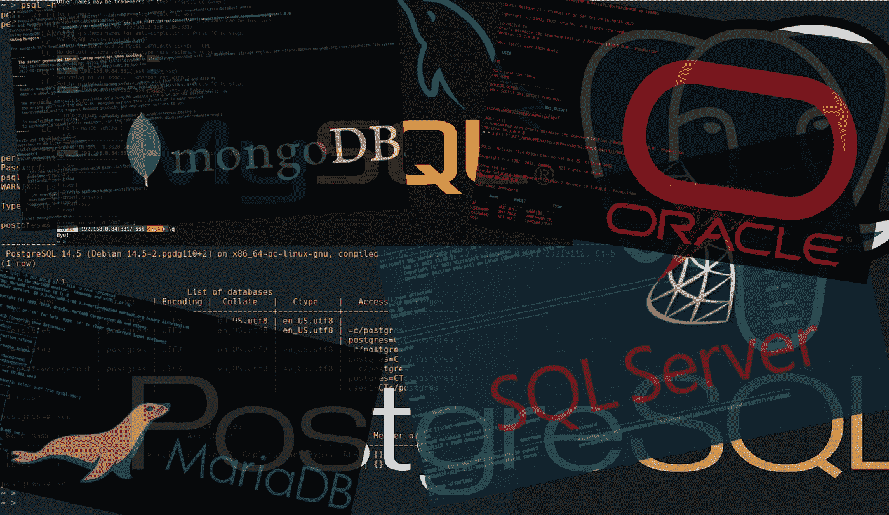

# 您需要的所有数据库命令行工具—无需安装数据库！

> 原文：<https://blog.devgenius.io/the-database-command-line-tools-you-can-add-to-your-dev-environment-without-database-installation-9091dd0c0277?source=collection_archive---------6----------------------->

如何获得、安装并开始使用官方支持的主要数据库工具:MariaDB/MySQL、PostgreSQL、MS SQL Server、Oracle 和 MongoDB CLI，而无需安装任何数据库本身。



# 介绍

这个行业有很多强大的基于 GUI 的工具，这些工具要么是私有的，要么是第三方提供的。其中一些也是免费的，并被广泛使用。【在这里找到一份令人敬畏的名单】。

然而，这篇文章是关于主要数据库官方支持的命令行工具( [CLI](https://en.wikipedia.org/wiki/Command-line_interface) )。这些工具都是作为相应的数据库安装包的一部分提供的。然而，在这里我们将看到如何获得并安装它们作为独立的工具，而不需要安装相应的数据库。

对于使用远程或 docker 运行的数据库实例的任何人来说，这可能特别方便，她/他希望登录并使用该特定数据库的官方命令行界面(CLI)。

我们将浏览每一个最常用的数据库，并了解如何为 Linux/Ubuntu、macOS 和 Windows 安装各自的官方支持工具。那么，我们开始吧。


通常，到目前为止，mysql 和 MariaDB 数据库常用的命令行工具共享相同的名称，这就是' MySQL '。即使你还没有在你的 Linux (Ubuntu)系统中安装它，并且试着运行它，你也能得到信息，你总是能安装它，例如:

```
ubuwsl@panoshome10:~$ mysql

Command 'mysql' not found, but can be installed with:

sudo apt install mysql-client-core-8.0     # version 8.0.22-0ubuntu0.20.04.2, or
sudo apt install mariadb-client-core-10.3  # version 1:10.3.25-0ubuntu0.20.04.1

ubuwsl@panoshome10:~$
```


[https://tutorial.eyehunts.com/memes/corporate-life-memes/](https://tutorial.eyehunts.com/memes/corporate-life-memes/)

不过现在 MySQL 使用的 shell 命令默认名称是' **mysqlsh** '。实际上，**这个工具不仅仅是执行 SQL 命令，它为 JavaScript 和 Python 提供了更强大的脚本功能。默认为 JavaScript 模式。您可以使用 CLI 命令之一来切换模式:\sql、\py 和\js。**

## 人的本质

访问官方[下载页面](https://dev.mysql.com/downloads/shell/)并选择适合您的 Debian 软件包:

[](https://dev.mysql.com/downloads/shell/)

例如，对于 Ubuntu 20.04 版本，您必须下载'**MySQL-shell _ 8 . 0 . 31–1 Ubuntu 20.04 _ amd64 . deb**'文件。然后使用 [apt](https://en.wikipedia.org/wiki/APT_(software)) 包管理器安装它:

```
~$ sudo apt install $HOME/Downloads/mysql-shell_8.0.31–1ubuntu20.04_amd64.deb
```

安装后，您可以检查它是否工作:

```
~$ mysqlsh -V
mysqlsh Ver 8.0.31 for Linux on x86_64 - for MySQL 8.0.31 (MySQL Community Server (GPL))
~$
```

## 马科斯

Mac 的安装非常相似。你只需为你的 Mac 选择合适的 DMG/TAR 文件，例如，如果你有一个 M1 芯片，那么你应该为 ARM 选择一个 64 位的安装文件。

[](https://dev.mysql.com/downloads/shell/)

对于我们这里的例子，我们已经下载了'**MySQL-shell-8 . 0 . 31-MAC OS 12-arm 64 . dmg**'文件。然后，您可以按照逐步指导安装，在您的系统中安装它。


成功安装后，您可以检查它:

```
~ % mysqlsh -V
mysqlsh Ver 8.0.31 for macos12 on arm64 — for MySQL 8.0.31 (MySQL Community Server (GPL))
~ %
```

您还可以连接到正在运行的 Mysql/MariaDB 实例:


## Windows 操作系统

以类似的方式，对于 Windows PC，您可以通过官方[下载页面](https://dev.mysql.com/downloads/shell/)下载. msi 安装文件或. zip 压缩文件:

[](https://dev.mysql.com/downloads/shell/)

在这里我决定下载'**MySQL-shell-8 . 0 . 31-windows-x86–64 bit . zip**文件。压缩文件包含了所有必要的文件夹结构，你必须把它解压到你喜欢的位置/文件夹。


然后，使用完整路径名运行 mysqlsh，或者可以将/bin 子文件夹添加到 PATH 变量中，即:

```
C:\> PATH=%PATH%;<…your/path/here/…>
C:\> mysqlsh -V
mysqlsh Ver 8.0.31 for Win64 on x86_64 — for MySQL 8.0.31 (MySQL Community Server (GPL))
C:\>
```

MySQL 的 **mysqlsh** CLI 工具到此为止。你可以在官方文档[这里](https://dev.mysql.com/doc/mysql-shell/8.0/en/mysqlsh.html)阅读更多内容。让我们来看看 MariaDB 提供了什么。


MariaDB 的 CLI 工具传统上用于使用' **mysql** '名称。然而，这种情况似乎有所改变。在 MariaDB 10.4.6 中， **mariadb** 作为一个符号链接提供给 **mysql** ，在 MariaDB 10.5.2 中， **mariadb** 是命令行客户端的二进制名称，mysql 是符号链接。这个工具不如 MySQL 提供的工具强大，但是它以一种兼容的方式执行 SQL 命令。

## 人的本质

您可以在这里访问官方的 MariaDB 命令行客户端页面:

[](https://mariadb.com/docs/connect/clients/mariadb-client/)

实际上，对于 Linux 安装，没有什么可下载的。您可以使用 apt 包管理器来安装 MariaDB mysql 客户端:

```
~$ sudo apt install mariadb-client
```

成功安装后，您可以检查它并连接到正在运行的 MariaDB(或 MySQL)实例:

```
~ $ mysql -V
mysql Ver 15.1 Distrib 10.3.34-MariaDB, for debian-linux-gnu (x86_64) using readline 5.2
~ $
```


## 马科斯

不幸的是，(与 Linux/Debian/Ubuntu 和 Windows 不同)MariaDB 没有**而不是**提供 mysql/mariadb CLI 工具作为 macOS 计算机上的独立安装。因此，要么必须[安装](https://mariadb.com/kb/en/installing-mariadb-on-macos-using-homebrew/)完整的 MariaDB 数据库(使用[自制](https://brew.sh/)包管理器)，要么使用 MySQL 提供的 MySQL 外壳。

## Windows 操作系统

同样，我们有两个选择。我们可以下载视窗。msi 安装程序，或者我们可以下载。zip 文件。请注意，如果您决定下载。msi 安装程序，这包括整个 MariaDB 安装文件，所以在安装。msi 安装程序，只能选择“**客户端**程序”。在这里，我们的选择是。zip 文件，其中也包括所有的 MariaDB 可执行文件。但是，我们将使用它来提取 CLI 工具所需的可执行文件(mysql.exe)。

你可以得到压缩的。在官方[下载页面](https://dlm.mariadb.com/browse/mariadb_server/205/1506/winx64-packages/)的 zip 文件中选择一个适合你的 Debian 软件包:


下载完'**mariadb-10 . 9 . 3-winx 64 . zip**'文件后，使用您首选的解压缩工具( [WinZip](https://www.winzip.com/en/) )找到包含 Maria db 所有可执行文件的 **/bin** 文件夹。然后只找到 mysql.exe，并提取到您选择的文件夹。


同样，您可以使用 mysl.exe 的完整路径名来运行它，或者您可以将其包含的文件夹添加到 PATH 变量中并测试它(类似于 mysqlsh):

```
C:\> PATH=%PATH%;<…your/folder-path/here/…>
C:\> mysql -V
mysql Ver 15.1 Distrib 10.9.3-MariaDB, for Win64 (AMD64), source revision 50c6090107d582a39e5be018c9fb4f40202210f9
C:\>
```

点击阅读更多关于 MariaDB **mysql** 工具[的信息。](https://mariadb.com/kb/en/mysql-command-line-client/)

注意:你可能会对相关的帖子感兴趣:

[](https://medium.com/@zzpzaf.se/mariadb-in-docker-65130d77959b) [## 码头工人中的 MariaDB

### 三分钟指南。轻松全面！

medium.com](https://medium.com/@zzpzaf.se/mariadb-in-docker-65130d77959b) [](/salts-and-uuids-for-your-mariadb-mysql-databases-470dbcf23a5) [## MariaDB/MySQL 数据库的 Salts 和 UUIDs

### 一篇简洁的文章，展示了 UUIDs 和 Salts 在 MariaDB/MySQL 数据库中的实际实现。

blog.devgenius.io](/salts-and-uuids-for-your-mariadb-mysql-databases-470dbcf23a5) 

就这样，让我们继续使用 Postgres CLI 工具。


PostgreSQL 提供了' **psql** '命令，这是它的交互式终端工具。

## 人的本质

通过安装 postgesql-client，使用 apt 包 [](https://en.wikipedia.org/wiki/APT_(software)) 管理器进行安装:

```
~$ sudo apt install postgresql-client
```

成功安装后，您可以检查它:

```
~$ psql — version
psql (PostgreSQL) 12.12 (Ubuntu 12.12–0ubuntu0.20.04.1)
~$
```

## 马科斯

对于 macOS 系统，可以获得 [LibPQ](https://www.postgresql.org/docs/9.5/libpq.html) PostgreSQL 客户端 API (C-Library)工具集。 **psql** 是那套工具的一部分。libpq 可以通过[自制软件](https://brew.sh/)安装(然而，在某些情况下，你可能会发现它已经被安装了)。

首先，我们必须安装它:

```
~$ brew install libpq
```

然后我们可以将二进制文件的文件夹添加到我们的路径中:

```
~$ brew link — force libpq
```

最后，您可以测试它:

```
➜ ~ psql — version
psql (PostgreSQL) 15.0
➜ ~ psql -h 192.168.0.17 -p 5462 -U postgres -W
Password:
psql (15.0, server 14.5 (Debian 14.5–2.pgdg110+2))
Type “help” for help.
postgres=#
```


## Windows 操作系统

遵循官方文档[这里](https://www.postgresql.org/download/windows/)，关于 Windows 安装程序，我们可以下载压缩的(。zip)文件，包含所有 PostgreSQL 二进制文件，由 EDB 提供，[此处为](https://www.enterprisedb.com/download-postgresql-binaries)(EDB:PostgreSQL(Rel 8.2–15)最后 16 个主要版本的主要贡献者)

[](https://www.enterprisedb.com/download-postgresql-binaries)

在我们的例子中，下载的文件是“**PostgreSQL-15.0–1-windows-x64-binaries . zip**”。类似于我们下载之前案例中的 CLI 工具。zip 文件，是为了找到我们感兴趣的二进制文件。给你。zip 文件只包含 **psql** 文件夹。您可以将其完全提取为首选位置的子文件夹。然而，由于我们只需要 **psql** 工具，最好只提取**psql.exe**文件以及库(即。 **dll** )文件。所有必需的文件如下所示:


然后，您可以使用 psql.exe 的完整路径名来运行它，或者您可以将它包含的文件夹添加到 PATH 变量中并测试它:

```
C:\> PATH=%PATH%;<…your/folder-path/here/…>
C:\>
C:\> psql — version
psql (PostgreSQL) 15.0
C:\> psql -h 192.168.0.17 -p 5462 -U postgres -W
Password:
psql (15.0, server 14.5 (Debian 14.5–2.pgdg110+2))
Type “help” for help.
postgres=#
```

点击阅读更多关于 **psql** 工具[的信息。](https://www.postgresql.org/docs/current/app-psql.html)

注意:你可能会对相关的帖子感兴趣:

[](https://medium.com/@zzpzaf.se/postgresql-database-in-docker-876dc60467e9) [## Docker 中的 PostgreSQL 数据库

### 三分钟指南。轻松全面！

medium.com](https://medium.com/@zzpzaf.se/postgresql-database-in-docker-876dc60467e9) [](/salts-and-uuids-for-your-postgresql-database-7c144e228097) [## PostgreSQL 数据库的 Salts 和 UUIDs

### 使用 PostgreSQL 数据库时 UUIDs 和密码加盐散列的实际实现步骤。

blog.devgenius.io](/salts-and-uuids-for-your-postgresql-database-7c144e228097) 

现在，让我们继续使用 MS SQL Server 工具。


微软的 SQL Server 提供了 **sqlcmd** CLI 工具。

## 人的本质

访问官方下载和安装页面[这里](https://learn.microsoft.com/en-us/sql/linux/sql-server-linux-setup-tools?view=sql-server-ver16&viewFallbackFrom=sql-server-ver17#ubuntu)，你会找到在 Ubuntu 系统中安装它的所有必要说明。

[](https://learn.microsoft.com/en-us/sql/linux/sql-server-linux-setup-tools?view=sql-server-ver16&viewFallbackFrom=sql-server-ver17#ubuntu)

这实际上包括以下 3 个主要步骤:

导入公共存储库 GPG 密钥。

```
~$ curl https://packages.microsoft.com/keys/microsoft.asc | sudo apt-key add -
```

注册微软 Ubuntu 库。

```
~$ curl https://packages.microsoft.com/config/ubuntu/20.04/prod.list | sudo tee /etc/apt/sources.list.d/msprod.list
```

更新源列表并运行安装命令。

```
~$ sudo apt-get update
~$ sudo apt-get install mssql-tools
```

所有的二进制文件都安装在 **/opt/mssql-tools/bin** 文件夹中，因此，在安装之后，您还可以将 bin 文件夹添加到 PATH 环境变量中。例如:

```
~$ export PATH=$PATH:/opt/mssql-tools/bin
```

最后，您可以检查它:

```
~$ sqlcmd ‘-?’
```

## 马科斯

目前，微软提倡使用 [pip](https://pypi.org/project/pip/) 包管理器安装 **mysql-tools** (以及附带的 **sqlcmd** CLI 工具)。【注意: [pip](https://pypi.org/project/pip/) 是用于安装和管理 Python 软件包和库的安装程序】。然而，我更喜欢用[自制的](https://brew.sh/)来代替，就像最初的公告一样【见[这里](https://cloudblogs.microsoft.com/sqlserver/2017/05/16/sql-server-command-line-tools-for-macos-released/)。

[](https://cloudblogs.microsoft.com/sqlserver/2017/05/16/sql-server-command-line-tools-for-macos-released/)

因此，您可以使用下面的命令，如这里描述的:

```
~ % brew tap
~ % brew install mssql-tools
```

之后，您可以测试它:

```
~ % sqlcmd ‘-?’
```


## Windows 操作系统

对于 Windows，您必须下载相应的安装程序。msi 文件。在这里找到它:

[](https://learn.microsoft.com/en-us/sql/tools/sqlcmd-utility?view=sql-server-ver16&viewFallbackFrom=sql-server-ver17)

注意:安装 SQLcmd 要求您的 PC 上已经安装了用于 SQL Server 的 Microsoft ODBC 驱动程序 17。

下载的安装程序是“ **MsSqlCmdLnUtils.msi** ”文件，所以运行它并按照说明操作。安装后，您可以检查它:

```
C:\**>** sqlcmd -?
```

在这里阅读更多关于 [**sqlcmd**](https://learn.microsoft.com/en-us/sql/tools/sqlcmd-utility?view=sql-server-ver16&viewFallbackFrom=sql-server-ver17) 工具的信息。

注意:你可能会对相关的帖子感兴趣:

[](https://medium.com/@zzpzaf.se/ms-sql-server-in-docker-b0397a55859c) [## Docker 中的 MS SQL Server

### 4 分钟指南。轻松全面！

medium.com](https://medium.com/@zzpzaf.se/ms-sql-server-in-docker-b0397a55859c) [](/salts-and-uuids-for-your-ms-sql-server-database-5f8d34b85265) [## MS SQL Server 数据库的 Salts 和 UUIDs

### 一篇简明的帖子，介绍了使用 MS SQL 时 UUIDs 和密码加盐散列的实际实现步骤…

blog.devgenius.io](/salts-and-uuids-for-your-ms-sql-server-database-5f8d34b85265) 

接下来，我们必须了解如何安装和开始使用 Oracle 的命令行工具。


Oracle 命令行工具是 **SQLcl** 开发者命令行接口。这是一个基于 Java 的实用程序，所以人们安装和使用它的方式与任何安装了 [JRE](https://docs.oracle.com/javase/8/docs/technotes/guides/install/install_overview.html) 的操作系统非常相似。

您可以访问官方下载页面[这里](https://www.oracle.com/database/sqldeveloper/technologies/sqlcl/)下载。

[](https://www.oracle.com/database/sqldeveloper/technologies/sqlcl/)

单击上一页中的下载按钮后，下一页会提示您下载可用的最新版本。在我写这篇文章的时候，最新的版本是“版本 22 . 3 . 1 . 285 . 1825-2022 年 10 月 18 日”,如下所示:


但是，如果在您的系统中使用的是旧版本的 Java，例如: **Java 8** ，那么您可以下载与 Java 8 兼容的以前的 SQL 版本。为此，你必须点击下载窗口底部左侧的**前一版本**，如上图所示。在这里，我们将获得与 Java 8 JRE 兼容的版本。

“最老的”可用版本只需要 **Java 8** (JRE 1.8)和更高版本，就是**SQL**[版本 21.4.1](https://www.oracle.com/tools/downloads/sqlcl-downloads-2141.html) 。(版本 21 . 4 . 1 . 17 . 1458—2022 年 1 月 19 日)。【参见发布说明[此处](https://www.oracle.com/tools/sqlcl/sqlcl-relnotes-2141.html)】。

[](https://www.oracle.com/tools/downloads/sqlcl-downloads-2141.html)

通过单击下载按钮，您会得到一个名为“**sqlcl-21 . 4 . 1 . 17 . 1458 . zip**”的. zip 文件。它只包含 SQL 文件夹，其中包含了所有必需的文件。

## 人的本质

对于 Ubuntu 系统，解压缩文件的合适位置。zip 文件，并解压**文件夹下的**文件夹下的 **/opt** 文件夹:

如您所见，/bin 子文件夹包含可执行文件 sql(适用于 Unix/Linux 基础系统)和 sql.exe(适用于 Windows 系统)。作为一种良好的做法，我总是为 sql 到 sqlcl 创建一个符号链接，以避免将来与其他 SQL 命令概念混淆:

```
~$ ln -s /opt/sqlcl/bin/sql /opt/sqlcl/bin/sqlcl
```

接下来，我们可以将/opt/SQL/bin 添加到 bash 配置文件中:

```
~$ export PATH=$PATH:/opt/sqlcl/bin
```

最后，我们可以测试一下:

```
~$ sqlcl -V
SQLcl: Release 21.4.1.0 Production Build: 21.4.1.17.1458
~$
```

## 马科斯

在 macOS 系统中，我们可以使用类似的方法，从下载的。将文件压缩到 **/Library/Java** /文件夹中的一个子文件夹，默认情况下 Java JDKs 也放在这个文件夹中。同样，我们也可以创建一个符号链接，但这次我们可以将它放在/usr/local/bin 文件夹中，该文件夹已经包含在我们的 system＄PATH 中。

```
~% sudo ln -s /Library/Java/sqlcl/bin/sql /usr/local/bin/sqlcl
```

就是这样！你可以测试一下:


## Windows 操作系统

同样，在 Windows 系统中，我们可以从下载的文件中提取/sqlc 文件夹。zip 文件压缩到我们喜欢的子文件夹中，之后，我们可以将它添加到我们的%PATH%并测试它:

```
C:> PATH=%PATH%;<…your-sqlcl-folder-path-here…>
C:>
C:> sqlcl -V
SQLcl: Release 20.2.0.0 Production Build: 20.2.0.174.1557
C:\>
```


点击阅读更多关于如何使用**SQL**T2 的信息。

注意:你可能会对相关的帖子感兴趣:

[](/oracle-database-in-docker-65da9c96ed56) [## Docker 中的 Oracle 数据库

### 5 分钟指南。轻松全面！

blog.devgenius.io](/oracle-database-in-docker-65da9c96ed56) [](/salts-and-uuids-for-your-oracle-database-990af1e361a1) [## Oracle 数据库的 Salts 和 UUIDs

### 一篇简明的帖子，介绍了在使用 Oracle 时 UUIDs 和密码加盐散列的实际实现步骤…

blog.devgenius.io](/salts-and-uuids-for-your-oracle-database-990af1e361a1) 

现在是时候看看我们如何安装和开始使用 MongoDB 命令行工具了。


**mongosh** 是官方的 MongoDB Shell。这是“连接、配置、查询和使用 MongoDB 数据库的最快方式。它充当 MongoDB 服务器的命令行客户端”。

点击访问官方下载页面[。根据您使用的系统，它会引导您找到合适的下载文件](https://www.mongodb.com/try/download/shell)

## 人的本质

对于 Debian/Ubuntu 64 位系统，你要下载'**MongoDB-mongosh _ 1 . 6 . 0 _ amd64 . deb**'文件。

[](https://www.mongodb.com/try/download/shell)

这里没什么特别的。使用您的 apt 软件包管理器安装它:

```
~$ sudo apt install $HOME/Downloads/mongodb-mongosh_1.6.0_amd64.deb
```

安装后，您可以通过询问版本来测试它:

```
~$ mongosh -version
1.6.0
~$
```

甚至通过连接到正在运行的 MongoDB 实例:


## 马科斯

对于 macOS 系统，你必须下载'**mongosh-1 . 6 . 0-Darwin-x64 . zip**'压缩文件:

[](https://www.mongodb.com/try/download/shell)

的。zip 包文件只包含一个名为“**mongosh-1 . 6 . 0-Darwin-x64**”的压缩文件夹。它包含/bin 子文件夹和**mongosh**——mongo shell 可执行文件、共享库 **mongosh_crypt_v1** ，以及可以使用 man 命令行实用程序查看的手册页面文件“mongosh.1.gz”和它们各自的许可文件。提取文件夹的适当位置可以考虑为 **/usr/local** 文件夹:


提取之后，我们可以为 mongosh 创建一个符号链接，这样就可以从我们的$PATH 访问它:

```
~% sudo ln -s /usr/local/mongosh-1.6.0-darwin-x64/bin/mongosh /usr/local/bin/mongosh
```

就是这样。让我们来测试一下:

```
~% mongosh -version
1.6.0
~%
```

还可以使用它来连接到 Atlas 集群:


## Windows 操作系统

同样的游戏也适用于 Windows。下载'**mongosh-1 . 6 . 0-win32-x64 . zip**'文件，并将其内容(即'**mongosh-1 . 6 . 0-win32-x64**文件夹)解压缩到您的首选位置。

[](https://www.mongodb.com/try/download/shell)

之后，我们可以将它添加到我们的%PATH%中并测试它(mongosh.exe**位于/bin 子文件夹中):**

```
C:**>** PATH=%PATH%;**<**…mongosh-1.6.0-win32-x64/bin-folder-path-here…**>** C:**>** C:**>** mongosh -version
1.6.0
C:\**>**
```

注意:你可能会对相关的帖子感兴趣:

[](https://medium.com/@zzpzaf.se/mongodb-in-docker-bfa77346b389) [## Docker 中的 MongoDB

### 4 分钟指南。轻松全面！

medium.com](https://medium.com/@zzpzaf.se/mongodb-in-docker-bfa77346b389) [](/salts-uuids-with-mongodb-atlas-triggers-75caad51bec8) [## 带有 MongoDB 和 ATLAS 触发器的 Salts 和 UUIDs

### 在使用 MongoDB 和 ATLAS 集群触发器时，UUIDs 和 Salts & Hashes 的方便实用的实现。

blog.devgenius.io](/salts-uuids-with-mongodb-atlas-triggers-75caad51bec8) [](https://medium.com/@zzpzaf.se/mongodb-atlas-free-shared-database-cluster-891435bec3a9) [## MongoDB Atlas 免费共享数据库集群

### 关于在 MongoDB ATLAS 云平台上使用免费共享数据库集群的快速介绍。

medium.com](https://medium.com/@zzpzaf.se/mongodb-atlas-free-shared-database-cluster-891435bec3a9) 

# 不再有了！

就这些了！如果你希望保留这篇文章以供将来参考。
感谢阅读👏敬请关注！