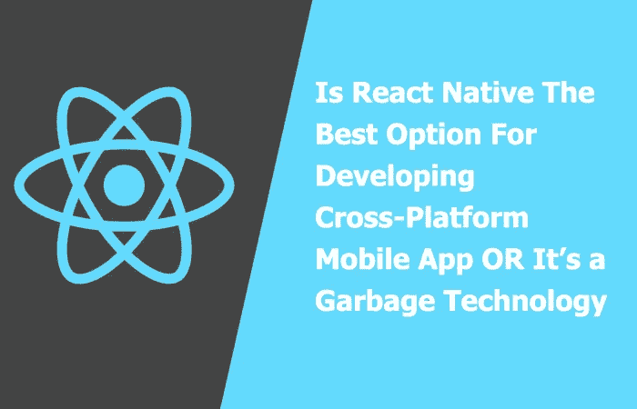
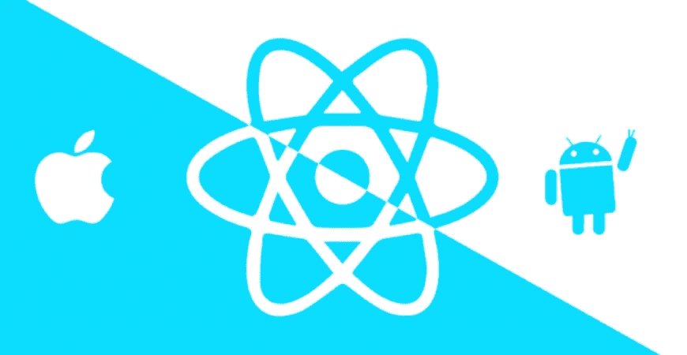

# React Native 背后的争论

> 原文：<https://blog.devgenius.io/the-debate-behind-react-native-db73a1824cc3?source=collection_archive---------22----------------------->

React Native 背后的争论

在过去的十年中，移动开发世界经历了它的复兴时代，到 2010 年初，许多移动开发人员通过将简单的想法转化为移动应用程序并将其放入应用程序商店而成为百万富翁，我们已经看到了大量相对简单和容易开发的应用程序的成功，如 flappy bird。

从那时起，移动开发领域开始呈指数增长，我们开始注意到大公司和企业投入的大量投资，用于增强该领域使用的现有技术，以及创造更好的技术来更好地开发移动应用程序，其中一项技术是 react native，它开始成为编写移动应用程序的一个好选择。

简而言之，React Native 是一个 JavaScript 框架，用于为 IOS 和 Android 编写真实的、本地呈现的移动应用程序。它基于 React，脸书用于构建用户界面的 JavaScript 库，但它的目标不是浏览器，而是移动平台。换句话说:web 开发人员现在可以编写看起来和感觉上都真正“原生”的移动应用程序，所有这些都来自我们已经熟悉和喜爱的 JavaScript 库。此外，因为您编写的大部分代码可以在平台之间共享，React Native 使同时为 Android 和 IOS 开发变得很容易。

React native 自 2015 年 3 月 26 日发布以来，已经引起了开发人员社区的兴趣，从那时起，一场新的辩论开始在社区内出现:“react native 是编写移动应用程序的可行和有效的方式，还是它只是一个垃圾，很快就会消失？”。

为了清楚地回答这个问题，我们必须确定它的优点和缺点，对这个“怪异”的技术有一个大概的了解。

# **React native Pros:**

混合移动开发技术

react native 基本上包括编写一次代码并在任何地方运行(在 Android 和 IOS 上)，这意味着使用 react native，您只需编写一次代码，它就可以在两个平台上运行，我认为这是一个很好的功能，因为它将大大降低开发成本，因为现在您不必雇佣两个开发团队，一个用于 IOS，另一个用于 Android，您只需雇佣一个 react native 开发团队，他们将完成两个团队的所有工作。作为一名开发人员，我认为使用 react native 的另一个有趣的优点是热重新加载，如果你是一名 web 开发人员，你会确切地知道我在说什么，通过这个功能，你可以保存代码中的修改，你会立即看到应用程序中的所有变化，我认为这是一个非常棒的功能。从开发人员的角度来看，另一个有趣的功能是大型社区支持，这对开发人员来说很重要，它极大地影响了制作工作的质量，有了大量的帮助资源、模板和第三方插件，开发人员可以更容易地用更少的时间交付更高质量的工作。

此外，react native 中有一个方便的功能，它与任何其他混合技术(允许您用一个单一代码库编写 Android 和 IOS 应用程序的技术)的区别在于，您可以将您的本机代码和功能添加到 react 本机应用程序中，这意味着您可以用本机平台代码(Java、Kotlin 或 Swift)开发功能，并将其链接到 react 本机应用程序，它将完美地工作。

# **反应本土弊:**

使用 react native 的缺点

现在，我们将看看使用 react native 作为编写移动应用程序的方式的缺点。

在使用 react native 开发的移动应用程序时，最值得注意的一个问题是性能，react native 与用本机代码编写的应用程序相比太慢，这个问题限制了 react native 的扩展和不断增长。我们必须考虑的另一个明显问题是，react native 不是 100%的单一代码基础，我的意思是，出于某些目的，您必须添加本机代码并将其链接到 react 本机代码，以使其在两个平台上完全兼容。

重要的是要考虑到脸书的 react native 团队正在努力解决这些问题，他们每天都在努力让 react native 的开发者和用户体验更加愉快。

# **最终决定:**

反应自然

现在，这是最后的决定，我应该在我的下一个项目中使用 react native，还是它是一种垃圾技术，我们不应该投资它。

答案很简单:“视情况而定”，这意味着在某些情况下，react native 将是实现该目的的完美解决方案，但在其他一些情况下，react native 将是一个糟糕的决定。

现在，你可能想知道，什么时候我应该使用 react native，什么时候不应该。所以，如果你有一个简单的应用程序，在这种情况下，简单的应用程序意味着应用程序只是渲染一些文本和图像，可能是一些视频，没有什么疯狂的，在这种情况下，react native 是最好的选择，因为你不必雇佣两个开发团队来开发这种项目，一个 react native 开发团队就足够了。但是，如果你想制作一个做一些疯狂事情的应用程序，比如在你的应用程序中包括面部识别，或者一些 3D 游戏，请绝对不要使用 react native，因为你的应用程序将是历史上最慢的应用程序。

我们必须提到，有许多初创公司和大公司在他们的移动应用程序(如 Airbnb)中使用 react native。此外，还有一些其他大公司正在认真考虑移民，以适应本土市场，如 Wix 和沃尔玛。

# **预测:**

我总是说预测比盲从更安全，这就是我现在要做的。在我看来，尽管 react native 有一些严重的竞争对手(混合移动技术)，最持久的竞争对手是 flutter，但 react native 仍将缓慢增长。我认为，在未来，脸书将继续在这项技术上投资，以填补其中的空白，并使其成为开发简单移动应用的头号技术。

# **我自己用 React Native 的经验:**

我过去使用过 react native，并使用它开发了许多应用程序，对我来说，react native 的体验非常棒，我很喜欢使用它，我不需要接触任何一行本机代码。因此，从我自己的角度来看，如果你真的想在下一个项目中使用 react native，我肯定鼓励你仔细看看它，如果 react native 满足了你的需求，那么就去使用它。

最后，希望这篇短文赢得您的赞赏，感谢您的关注。