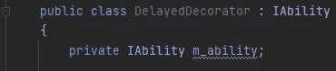
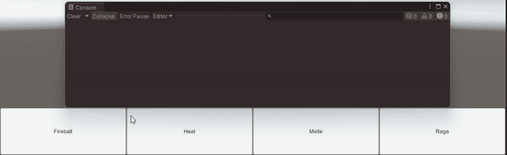

# Unity 中的装饰模式

> 原文：<https://blog.devgenius.io/the-decorator-pattern-in-unity-6791ab10b64?source=collection_archive---------2----------------------->

## 也称为包装


看看能力系统，我可以通过添加一个延迟装饰器来使它更加模块化。装饰者将是一种能力，并且有它自己的使用实现。现在它不再重新实现火球术的代码或者继承火球术，而是使用合成来获得一个延迟的能力。所以我们可以延迟任何包含另一个延迟装饰器的能力。

我最后得到的是 Runner 指向 Delay Decorator 的一个实例的能力，该实例指向 Fire Ball 能力。


延迟装饰添加到混合

这就是所谓的装饰模式。


作为装饰模式的延迟能力

# 装饰图案已定义


装饰图案

> 在[面向对象编程](https://en.wikipedia.org/wiki/Object-oriented_programming)中，**装饰模式**是一种[设计模式](https://en.wikipedia.org/wiki/Design_pattern_(computer_science))，它允许动态地将行为添加到单个[对象](https://en.wikipedia.org/wiki/Object_(computer_science))，而不会影响来自同一[类](https://en.wikipedia.org/wiki/Class_(computer_science))的其他对象的行为。[【1】](https://en.wikipedia.org/wiki/Decorator_pattern#cite_note-1)decorator 模式通常对于遵守[单一责任原则](https://en.wikipedia.org/wiki/Single_responsibility_principle)非常有用，因为它允许在具有独特关注领域的类之间划分功能。装饰器的使用比子类化更有效，因为一个对象的行为可以在不定义一个全新的对象的情况下被增强。
> 
> 来源:[https://en.wikipedia.org/wiki/Decorator_pattern](https://en.wikipedia.org/wiki/Decorator_pattern)

这意味着它允许用户在不改变现有对象结构的情况下向其添加新功能。这种类型的模式属于结构化模式，因为这种模式充当现有类的包装器。它实现接口并将所有请求转发给它。它还在转发请求之前/之后执行附加功能。作为替代，它们也是适配器模式和门面模式，以它们自己的方式解决问题。装饰模式有时与外观模式结合使用。在 https://w3sdesign.com/?gr=s04[的](https://w3sdesign.com/?gr=s04&ugr=struct#) [w3sDesign](https://w3sdesign.com/?gr=s04&ugr=struct#) 上阅读更多关于这种模式的内容& ugr=struct#

这允许我添加修改或者改变技能的工作方式。

## 作为抽象类的装饰者

有时候你会看到它是这样实现的。将 decorator 作为从接口继承的抽象类，然后具体的 Decorator 从接口继承。这在这里的例子中可以看到【https://en.wikipedia.org/wiki/Decorator_pattern#C# 


混凝土装饰图案

# 履行

## 延迟能力


装饰图案

我创建了延迟装饰器，让它使用 IAbilty 接口。


我让延迟的装饰包含一个责任



当然，我需要确保这个能力在构造函数中被设置。


最后，我实现了可靠性接口。


我现在有一个可以使用的延迟装饰能力。在我的能力跑者职业中，我把这个能力设置为火球术，而不是一个包含火球术的新的延迟装饰能力。


现在当我使用火球术的时候，我使用的是延迟术。


## 冷却能力

当然，装饰者也可以在能力之后运行代码。


现在我的狂怒技能要冷却才能使用。

```
m_currentAbility = new CoolDownDecorator(new RageAbility())
```



# 获取代码

和往常一样，这方面的代码可以在我的 Git hub 上找到。

[https://github . com/JamesLaFritz/Design-Patterns-For-Unity/tree/release-decorator pattern](https://github.com/JamesLaFritz/Design-Patterns-For-Unity/tree/release-DecoratorPattern)