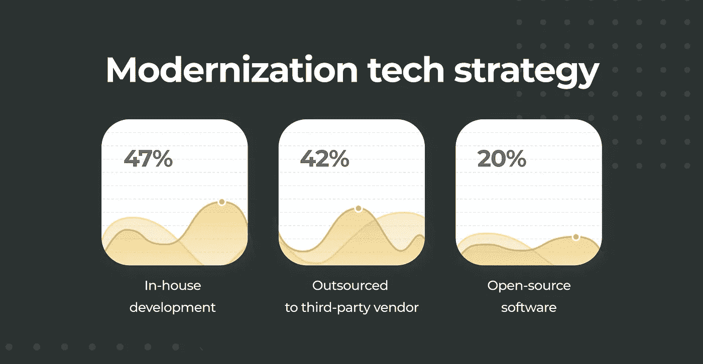
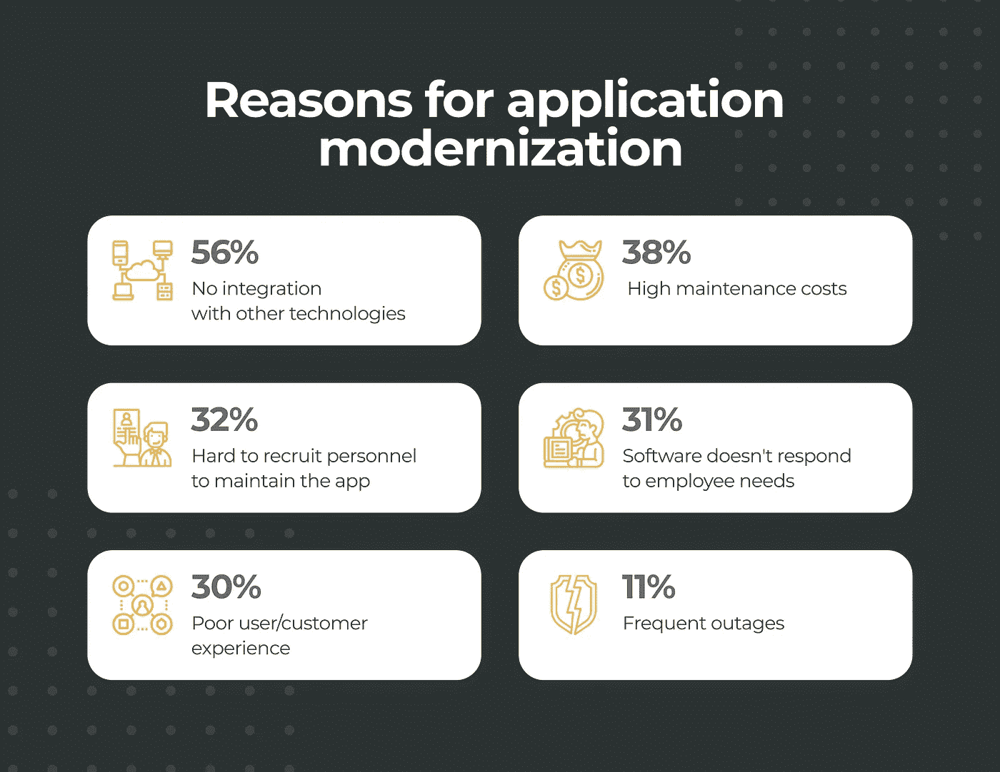
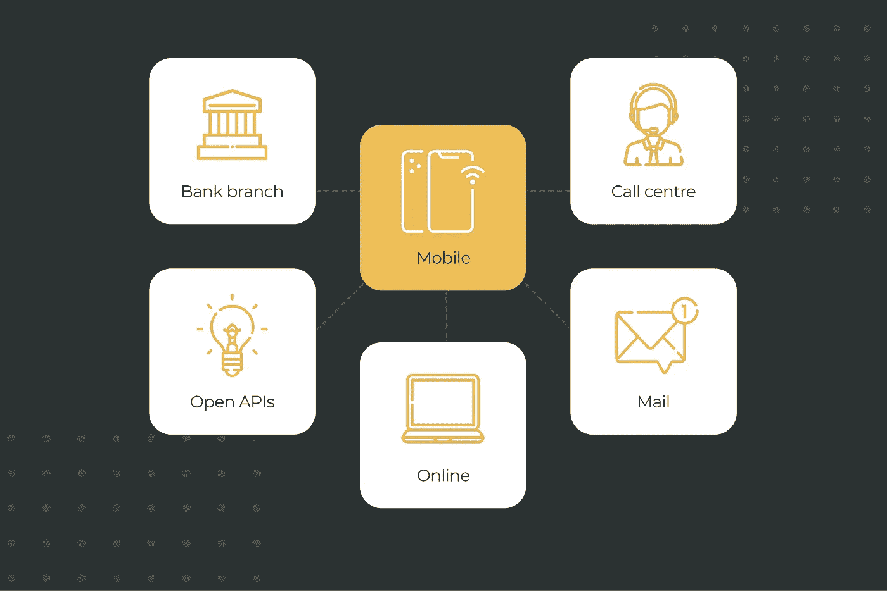

# 应用程序现代化的定义

> 原文：<https://blog.devgenius.io/the-definition-of-application-modernization-e9a36b15703d?source=collection_archive---------8----------------------->

众所周知，任何软件都有自己的生命周期，而根据[研究](https://resources.flexera.com/web/pdf/Research-DP-Manufacturer-Product-EOL-EOS-Report-2018.pdf)，这样一个周期的平均持续时间是五年。软件越老，就越难保持最新，也越难增加解决现代商业问题的功能。这种支持会严重影响业务预算，其可行性也成问题。

然而，有一种方法可以解决这种情况，即应用程序现代化。它的任务是将一个过时的应用程序转变成一个符合所有现代标准的现代软件产品。

在本文中，我们将进一步了解什么是应用程序现代化，以及它能为您的企业带来什么好处。所以，事不宜迟，我们开始吧。

# 什么是应用程序现代化？

总结整个术语，现代化不仅仅是将应用程序从一种编程语言重写为更现代的语言。这是对整个应用程序结构的全面重建，并将其转移到符合现代标准并提供更好的可伸缩性的基础架构。

让我们假设您的企业基于一个过时的 CRM 系统，这个系统是您在创业初期创建的。然而，随着时间的推移，您的业务得到了显著的发展和扩展，而以前，一个好的 CRM 已经不能满足新的业务需求。例如，您可能会遗漏一些能让经理们的生活更轻松的功能，比如高级搜索或客户快速发票等等。

旧的技术解决方案很少能够方便地更新，因此，您的企业将不得不选择不同的 CRM 或从头开发自己的 CRM。

这个问题旨在通过应用程序现代化来解决，应用程序现代化需要将过时的数字解决方案转移到更现代的技术和云结构，从而更容易维护软件并在未来引入新功能。

例如，您的系统是用过时的编程语言 Visual Basic 编写的。在现代社会，你很难找到可以用这种语言支持你的应用程序的开发人员。更不用说编程语言的局限性了，它会阻止你实现许多现代功能

# 如何找到现代化的技术人员

众所周知，你需要合格的人员来使用这个软件。对于应用程序现代化来说，这也不例外。你有几个选择，每个都有自己的优点和缺点。

**找一个自由职业者**

如果你的经济来源有限，这是一个不错的选择。然而，这就是这种方法的优势所在。自由职业只适合非常小的项目。例如，修复小错误、添加简单的功能等等。

**创建自己的团队**

这是最昂贵的选择之一，因为你需要租一间办公室，装备它，并且[自己雇佣应用开发者](https://www.cleveroad.com/blog/hire-app-developers)和所有必要的专家。此外，每个专家都需要支付工资、病假等等。但是，作为回报，您可以完全控制升级，并且几乎有无限的机会来改进您的遗留产品。

**联系外包公司**

最佳选择结合了成本效益和大量现代化机会。你总是可以从另一个地区雇佣一个团队，那里的服务价格要低几倍，但质量却和你的祖国一样高。此外，你不需要担心招聘专家，因为这些公司已经配备了所有必要的人员。

# 使用应用程序现代化的原因

如果您仍然不相信应用程序现代化，我们已经收集了最重要的原因，这些原因将帮助您选择升级您的软件产品。

# 昂贵的维护费用

维护遗留系统的高成本是您需要关注应用程序现代化的首要原因之一。为了避免毫无根据，值得一提的是，根据公共首席信息官的一项研究，支持州 ERP 系统每年花费 700 万美元。这只是一个例子。有大量类似的旧系统，它们的支持成本每年约为 3000 万美元。这只是在美国范围内。在私人企业的规模上，这个数字会稍微低一些，但是想象一下，你仅仅通过升级你的软件就可以把自己从这些费用中解放出来。

# 安全漏洞

网络威胁每年都在改善，许多系统成为受害者。由于过时的架构和安全协议，传统系统无法完全抵御病毒、恶意软件和网络攻击。例如，赛门铁克声称传统软件更容易发生数据泄露。这一切都是因为这种软件没有能够抵御新的网络威胁的必要补丁。因此，这些后门被网络犯罪分子用来窃取数据。应用程序现代化旨在使软件在安全性方面保持最新，从而防止攻击者利用软件的不完善和过时。

# 有限的商业机会

应用程序过时是企业在开发和客户满意度方面的坚实纽带。我们以银行业为例。这个行业目前的趋势是手机银行，仅在美国就有[5700 万](https://www.statista.com/topics/2614/mobile-banking/)手机银行应用的用户。

如果你的银行业务还停留在旧的软件上，不跟随潮流，你将很快失去竞争优势，你将更难吸引新客户。及时实施最新的技术解决方案就像一块磁铁一样吸引着用户。在一个普通客户眼里，你看起来像是一个紧跟潮流、紧跟时代、值得信赖的企业。

# 如何开始应用程序现代化

升级软件是一个复杂的过程，需要做一些准备。我们汇总了几个步骤来帮助您开始升级。

## 第一步。确定软件的当前状态

如果你不知道你的软件下面有什么，你就很难弄清楚要升级什么。检查代码库、设计和其他方面，并列出要升级的功能。

## 第二步。选择现代化道路

与您的技术团队讨论这一方面是极其重要的。这将帮助你做出最适合你具体情况的正确决定。

## 第三步。选择您的技术组合

你必须选择满足你的需求和当前计划的技术堆栈，这将使你无需任何额外的工作就能实现所有的想法。您可以向专家团队寻求建议，或者与您的家庭编程团队讨论技术选择。

## 第四步。进行适当的入职培训

当你拥有一个完全现代化的系统时，你已经迈出了这一步。您必须为适当的入职预算，以帮助您的员工学会使用新系统。

# 包装东西

如您所见，应用程序现代化是一个非常有用的过程，它将使您过时的软件重获新生，并使您的业务在现代现实中受益。最重要的是雇佣一个专业的开发团队，正确评估应用程序的当前状态。并且您已经准备好升级您的软件。