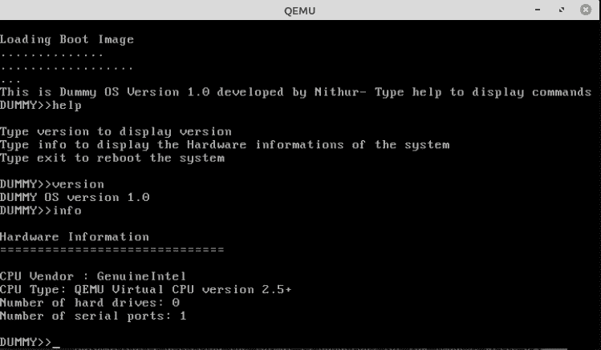
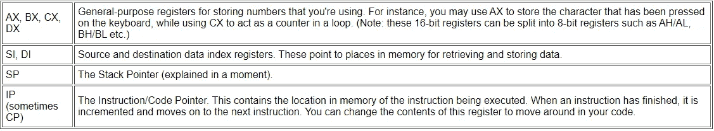
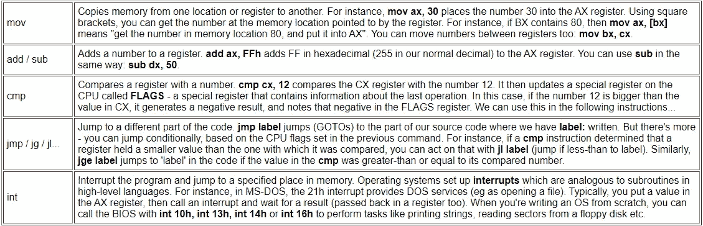
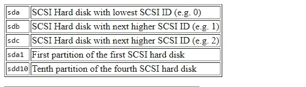

# 虚拟操作系统的开发过程

> 原文：<https://blog.devgenius.io/the-development-process-of-dummy-os-77d4c5d4fb4c?source=collection_archive---------13----------------------->

## 你也可以创建一个操作系统



这就是你要建造的东西。

**什么是哑 OS？**

像 MS-DOS 一样，它是用汇编语言开发的中断驱动的单任务操作系统。虚拟操作系统的目的是显示系统的硬件细节。我开发这个操作系统是为了获得低级操作系统概念和底层硬件的抽象概念。

这是我的 GitHub 库到虚拟操作系统的链接:

[](https://github.com/Nithur-M/DummyOS) [## Nithur-M/DummyOS

### 用汇编语言开发的简单操作系统，用来显示系统的硬件信息。GitHub 是超过…

github.com](https://github.com/Nithur-M/DummyOS) 

**要求:**

*   Linux(如果你不想双引导安装虚拟盒子)
*   QEMU PC 仿真器
*   NASM 汇编程序

当您在 Linux 中时，通过在终端中输入以下命令来获得上面提到的所有工具(仿真器和汇编器):

```
sudo apt-get install build-essential qemu nasm
```

**一些关键点**

BIOS(基本输入输出系统)在计算机加电时执行。它检查内存并进行其他硬件测试。完成后，它检查你的操作系统在任何媒体，它可以找到。通常它在你的硬盘上，BIOS 在主引导记录(MBR)中找到执行代码，一个 512 字节的部分。但这完全取决于你的开机顺序。BIOS 将所选介质中的 512 字节段加载到其内存中，并开始执行。这被称为**引导加载程序**，运行主操作系统内核的一小段代码。引导加载程序负责加载您的操作系统，并为操作系统的正确运行创造环境。

**内核**是操作系统的核心。它提供了对系统中一切的完全控制。它总是留在主内存中。因此，尽可能小是很重要的。通常，内核负责内存管理、进程和任务管理以及磁盘管理。内核将系统硬件连接到应用软件。

在汇编语言中，没有叫做变量的东西。相反，我们使用寄存器来存储数字。以下是典型 CPU 中的寄存器列表:



来源:[mikeos.sourceforge.net](http://mikeos.sourceforge.net/)

这里列出了常用的汇编指令。它们移动内存，比较它们并执行计算。我们大部分时间都会用到这些说明:



来源:mikeos.sourceforge.net

**让我们深入开发流程**

首先，我们必须创建一个引导加载程序。您可以查看我的引导加载程序以获得帮助:

```
[DummyOS/source/bootload/bootload.asm](https://github.com/Nithur-M/DummyOS/blob/master/source/bootload/bootload.asm)
```

复制代码并粘贴到文本编辑器中，保存为`.asm`文件。然后转到包含新操作系统文件的文件目录，打开终端并输入以下内容:

```
nasm -f bin -o bootload.bin bootload.asm
```

这将把你的汇编文件转换成机器代码指令的二进制文件。我们使用`-f bin`标志告诉 NASM 我们想要一个普通的二进制文件。而`-o bootload.bin`用于在名为 bootload.bin 的文件中生成结果二进制文件。

现在我们的引导加载程序已经准备好了。让我们为我们的操作系统创建内核文件。在这里签出我的内核文件:

```
[DummyOS/source/kernel.asm](https://github.com/Nithur-M/DummyOS/blob/master/source/kernel.asm)
```

复制代码并粘贴到文本编辑器中，保存为一个`.asm`文件。然后在终端中输入以下命令，将其转换为二进制文件:

```
nasm -f bin -o kernel.bin kernel.asm
```

现在我们来玩玩`build-linux.sh`文件。你可以在这里访问它[。在创建了以上两个文件(bootload.asm 和 kernel.asm)之后，您可以只使用 build-linux.sh 来编译它们，而不需要像我前面提到的那样执行。在终端的当前目录中输入以下内容:](https://github.com/Nithur-M/DummyOS/blob/master/build-linux.sh)

```
su ./build-linux.sh
```

这将简单地使用 NASM 来组装引导程序、内核和提供的程序，然后将引导程序写入到 **disk_images/** 目录中的`dummyos.flp`软盘映像。它还将`dummyos.flp`安装到文件系统上，这样它就可以作为真正的软盘使用。该脚本还生成虚拟操作系统的 CD-ROM iso 映像。因此，将在 disk_images 目录中创建两个文件。

开发过程完成。

**如何从 USB 引导虚拟 OS？**

Linux 使用普通文件来表示各种 I/O 设备，这些文件位于 */dev* 目录中。当插入 USB 笔时，Linux 在/ *dev* 目录下创建 **ansdb** 文件和 **sdb1** 文件。这些文件是实际驱动程序的接口，驱动程序反过来访问硬件。



资料来源:Debian.org

通过在终端中输入以下内容，将 USB 驱动器格式化为 FAT32 文件系统:

```
sudo /sbin/mkdosfs -F 32 -I /dev/sdb
```

然后在磁盘映像目录中输入以下内容:

```
sudo dd if=dummyos.flp of=/dev/fd0
```

实时检查你的操作系统

在您的终端中输入以下内容(在您的主目录中) :

```
qemu-system-i386 -fda ./disk_images/dummyos.flp
```

就是这样。你的操作系统准备好了。

我的资源:

 [## JOSH -操作系统教程

### 编辑描述

www.cs.bgu.ac.il](https://www.cs.bgu.ac.il/~yagel/dolev/MinimalOS/josh/)  [## 如何编写一个简单的操作系统

### 本文向您展示了如何用 x86 汇编语言编写和构建您的第一个操作系统。它解释了什么…

mikeos.sourceforge.net](http://mikeos.sourceforge.net/write-your-own-os.html) [](https://medium.com/setublog/hands-on-to-operating-systems-a847e9dc75f7) [## 动手操作系统

### 本文为学习操作系统基础知识和概念提供了指导，这些内容在 SENG 21213——

medium.com](https://medium.com/setublog/hands-on-to-operating-systems-a847e9dc75f7) 

谢谢你。