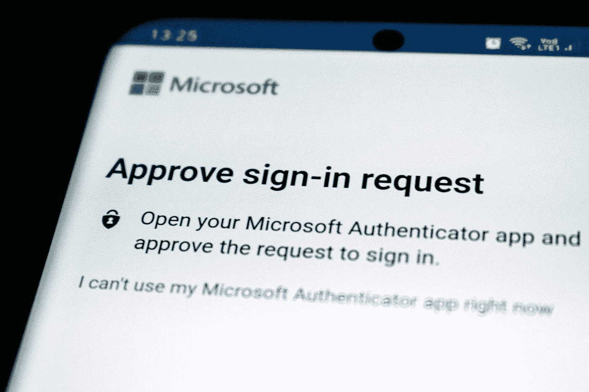
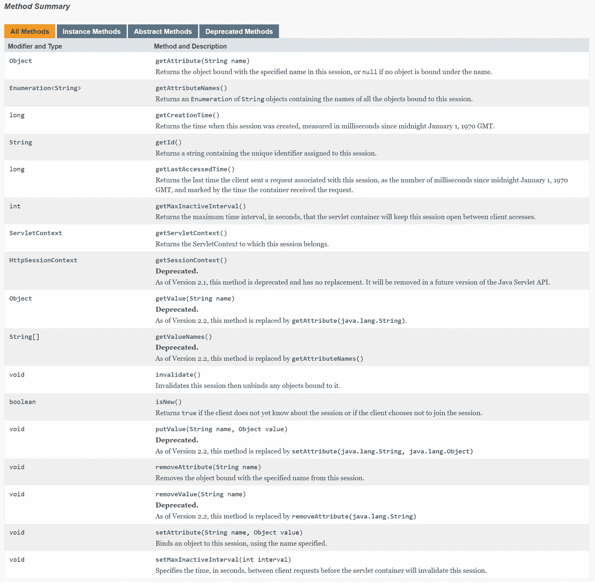

# Cookie、会话和令牌之间的区别

> 原文：<https://blog.devgenius.io/the-difference-between-cookie-session-and-tokens-79b62df6f860?source=collection_archive---------3----------------------->

[埃德·哈迪](https://unsplash.com/@impelling?utm_source=medium&utm_medium=referral)在 [Unsplash](https://unsplash.com?utm_source=medium&utm_medium=referral) 上拍摄的照片

## cookie—维护服务器和客户端之间的活动状态
会话—记录服务器和客户端会话状态
令牌—服务器生成的字符串

> 如果你觉得我为你贡献了价值，请支持我！

我爸上周被查出肝外胆管癌复发。我在这里会减少分享的频率。

你可以阅读我的文章来更好地理解。

 [## Cookies、会话、令牌

### HTTP 是一种无状态协议。为了知道哪个设备发起请求，cookie、会话和令牌是 2…

medium.com](https://medium.com/geekculture/cookies-session-token-d9f068cccdc6)  [## 计算机网络—加密和解密算法

### 数据签名和加密是前端和后端开发中经常使用的技术。的…

medium.com](https://medium.com/thedevproject/computer-network-encryption-decryption-algorithm-5281f03e512c)  [## 系统设计基础知识(十)——一致性散列

### 它是一种分布式哈希方案，独立于分布式环境中的服务器或对象的数量运行

medium.com](https://medium.com/interviewnoodle/the-fundamental-knowledge-of-system-design-10-consistent-hashing-18fcefbfd749)  [## 系统设计基础知识——(1)

### 今天我就来分享一下系统设计的基础知识。

medium.com](https://medium.com/interviewnoodle/the-fundamental-knowledge-of-system-design-1-84a2cc8a3a8d) 

**Cookie V.s 会话**

**饼干**

1.  **创建一个 cookie**
2.  **更新 cookie —** 更新键值
3.  **删除 cookie—**设置 cookie 的到期日期

> 1.名称=值；
> 
> 2.expires =日期；
> 
> 3.path =路径；
> 
> 4.domain =域；
> 
> 5.安全的
> 
> 6.maxAge
> 
> 7.仅 HTTP

*   cookie 记录您的登录信息、浏览活动、在线活动、购买活动、设备等。
*   **基本 cookie**—存储在您的本地存储上，关注用户体验

1.  **会话 cookie**—让您在浏览网页时保持登录您的帐户
2.  **用户输入的 cookies**——跟踪用户输入到你网站的项目
3.  **认证 cookie**—通过用户的登录凭证识别用户
4.  **以用户为中心的安全 cookie**—检测认证错误和滥用，例如不正确的登录信息
5.  **负载平衡 cookie**—连接客户端和服务器

*   **非必要的 cookie**—仅在用户允许时存储在本地存储器上

1.  **分析和定制 cookie**—跟踪用户的浏览活动
2.  **广告 cookie**—根据用户的浏览历史定制用户的广告体验
3.  **社交网络跟踪 cookie**—在网站和社交媒体(第三方平台)之间分享活动

*   **功能主导同意还是用户主导同意**——用户希望网站运行的设置

1.  **多媒体内容播放器会话 cookie(flash cookie)**—存储数据(图像质量、回放速度、缓冲参数等)以回放视频或音频内容
2.  **用户界面定制 cookie**—存储用户体验偏好

*   服务器将检查是否有上次留下的 cookies。如果有，它会读取 cookie 中的数据来确定用户并传送相应的网页内容，要么允许您在没有用户名和密码的情况下登录，要么在您喜欢的网页上显示内容。
*   如果没有，服务器会在处理客户端请求时生成 cookies。cookie 信息将被添加到响应标头中。客户端收到响应并创建一个 cookie 并将其存储在本地。下次客户端发出请求时，cookie 将一起发送到服务器。
*   哪些数据存储在 cookies 中非常重要，因为它可以提高 web 性能。

**应用场景**

1.  根据用户的喜好定制内容
2.  实现永久登录(直接登录)
3.  简化登录过程
4.  实现自动登录
5.  记录访问次数
6.  实现弹出功能

**会话**

*   服务器以 session 的方式记录客户端信息。
*   当客户端再次访问网站时，服务器仅通过查找会话信息来找到客户端的状态。
*   会话=在服务器上创建的用户配置文件
*   为了获得更高的访问速度，服务器通常将会话信息存储在内存中。每个用户将有一个单独的会话。如果会话内容过于复杂，当大量客户端访问服务器时，可能会造成 [**缓冲区溢出**](https://en.wikipedia.org/wiki/Buffer_overflow) 。但是，如果服务器的本地存储中存储了太多会话，可能会影响服务器的性能。因此，会话信息应该尽可能简洁。
*   当客户端第一次向服务器发送请求时，会自动创建会话。生成会话后，只要用户继续访问会话，服务器就会更新会话的上次访问时间。当大量用户访问服务器时，将会有许多会话，因为每个用户都有一个单独的会话。为了避免缓冲区溢出，服务器会删除长时间不活动的会话(会话超时)。

**会话的常用方法**

图像来源: [**甲骨文**](https://docs.oracle.com/javaee/7/api/javax/servlet/http/HttpSession.html)

**会话和 cookies 的区别**

*   会话存储在服务器上。cookie 存储在客户端。
*   会话使用会话 ID 来查找信息。cookie 将与请求一起发送到服务器。会话 id 包含在 cookie 中，因为会话需要客户端的支持才能将 cookie 用作标识符。换句话说，会话可以根据 cookie 识别是否是同一个用户。
*   cookie 不是很安全，因为有人可以分析 cookie 并执行 [**cookie 欺骗**](https://www.willmaster.com/library/security/cookie-spoofing-and-security.php) 。
*   当访问次数增加时，它会影响服务器的性能，因为每个用户都有一个单独的会话，会话信息将在服务器上存储一定的时间。
*   单个 cookie 数据大小不能超过 4K。许多浏览器限制在客户端最多存储 20 个 cookies。但是，许多浏览器在服务器端没有限制。

**令牌**

这是验证用户身份的方法

*   用户的唯一身份(uid)
*   当前时间的时间戳(时间)
*   签名(由令牌的前几个数字组成的一定长度的十六进制字符的字符串)
*   不变参数(避免多次数据库搜索)

**流程:**

1.  服务器使用哈希算法生成一个令牌值，然后在用户首次成功登录时将该令牌值返回给客户端。
2.  客户端获得令牌值后，将其存储在本地
3.  当客户端再次请求时，它会将令牌值附加到请求中，并发送给服务器
4.  在服务器收到客户端的请求后，它将提取令牌值，并将其与服务器上本地存储的令牌值进行比较
5.  来自客户端的令牌值=来自服务器的令牌值-用户成功登录
6.  令牌值=/来自服务器的令牌值-原始登录信息已过期，用户需要再次登录
7.  没有这样的令牌值—登录不成功

**令牌和会话的区别**

1.  令牌的安全性优于会话，因为每个请求都有一个签名，它可以避免恶意攻击，而会话只依靠通信链路来确保安全性
2.  手机 app 一般使用 RESTful API 来处理服务器。因此，移动应用程序不像浏览器那样使用 cookie 来运行会话。所以使用令牌来标识自己就足够了。令牌可以提供认证和授权。认证是针对用户的，授权是针对移动应用的。因此，移动应用程序可以访问用户信息。此外，令牌是唯一的，因为它不能转移到其他应用程序和其他用户。如果用户信息可能需要与第三方应用程序共享，则允许 API 接口授权使用令牌。Cookies 包括会话 ID 和登录信息，存储在客户端的本地存储中。会话将查找会话 ID 以建立通信链路。当用户发出请求时，cookie 被发送到服务器进行处理，要么自动登录，要么显示首选内容。
3.  令牌可以抵抗[**【CSRF】**](https://owasp.org/www-community/attacks/csrf)的跨站请求伪造，但是 cookie 和会话机制的结合不能做到这一点。当用户访问银行网页时，他们容易受到 CSRF 的攻击，并可能被利用来访问其他网站。

**代币和曲奇的区别**

1.  令牌和 cookies 是在您首次登录时由服务器发出的。两者都用于验证，并为无状态 HTTP 提供持久化机制。
2.  令牌可以存在于任何地方，但是 cookie 只存储在客户端的本地存储上
3.  令牌用于通过通知服务器它是谁来自动登录。
4.  Cookies 不能在多个应用程序之间共享。如果实现单点登录(SSO)，很难使用 cookies 登录一次来访问所有相互信任的应用系统。
5.  移动终端的请求中没有 cookies。会话 ID 依赖于 cookie，因此 cookie 不能接受会话 ID。令牌不将会话存储在服务器的本地存储上，因此它是高度可扩展的。大多数移动应用程序都使用令牌。

**参考文献**

 [## Cookie、会话和令牌之间没有人谈论的真正区别是什么？

### 为了理解 cookies、会话和令牌之间的区别，我们需要回到基础。假设你想要…

戴夫。到](https://dev.to/dev_emmy/what-is-really-the-difference-between-cookie-session-and-tokens-when-it-comes-to-authentication-4164#:~:text=SO%20YOU%20ARE%20PROBABLY%20WONDERING,but%20they%20may%20have%20one)  [## 解释了不同类型的互联网 Cookies

### 无论你是网站所有者还是互联网用户，你可能都很熟悉 cookies 但不是你所熟悉的那种美味

termly.io](https://termly.io/resources/articles/types-of-internet-cookies/)  [## 你应该接受饼干吗？

### 数字 cookies，也称为 HTTP cookies 或浏览器 cookies，是一种小型文本文件，以…

allaboutcookies.org](https://allaboutcookies.org/information-in-cookies)  [## Cookie 欺骗和安全性

### 很容易恶搞一块曲奇。你知道吗？Firefox 的扩展允许用户输入自己的 cookie。一个 PHP 或者…

www.willmaster.com](https://www.willmaster.com/library/security/cookie-spoofing-and-security.php)  [## joepie91 的漫谈

### 更新-2016 年 6 月 19 日:很多人一直在建议相同的“解决方案”来解决下面的问题，但没有一个…

cryto.net](http://cryto.net/~joepie91/blog/2016/06/13/stop-using-jwt-for-sessions/)  [## 互联网 Cookies 的工作原理

### 大多数互联网 cookies 都非常简单，但它们是拥有自己生命的事物之一…

computer.howstuffworks.com](https://computer.howstuffworks.com/cookie.htm)  [## 跨站点请求伪造(CSRF)

### 作者:KirstenS 供稿人:戴夫·威彻斯，戴维斯纽，保罗·皮特菲什，阿达尔·魏德曼，迈克尔·布鲁克斯，阿赫桑·米尔，Dc…

owasp.org](https://owasp.org/www-community/attacks/csrf)  [## 用于安全认证的 Cookies 和令牌的比较

### 网站和 web 应用程序中的访问控制是安全性的重中之重，但是如何设置访问取决于…

developer.okta.com](https://developer.okta.com/blog/2022/02/08/cookies-vs-tokens#:~:text=The%20main%20difference%20between%20cookies,store%20authentication%20on%20the%20browser%3F)  [## Web 身份验证:Cookies 与令牌

### 如何在网络认证中选择 Cookies 和令牌？

blog.bitsrc.io](https://blog.bitsrc.io/web-authentication-cookies-vs-tokens-8e47d5a96d34)  [## 令牌认证与 Cookies

### 对于谷歌员工:不要将状态和状态转移机制混为一谈

stackoverflow.com](https://stackoverflow.com/questions/17000835/token-authentication-vs-cookies)  [## Cookie 与令牌认证

### 为了保护客户机和服务器之间的通信，我们经常需要将一个传入的请求与一组…

www.section.io](https://www.section.io/engineering-education/cookie-vs-token-authentication/)  [## 身份验证:基于 Cookie 还是基于令牌

### 身份验证就是确认用户就是他们所说的那个人。而授权是关于…的许可

blog.jannikwempe.com](https://blog.jannikwempe.com/authentication-cookie-vs-token-based)  [## session 和 cookies 有什么区别？

### 用户输入到网站多个页面的数据可以使用 cookies 和会话的组合来保存…

www.tutorialspoint.com](https://www.tutorialspoint.com/What-is-the-difference-between-session-and-cookies#:~:text=Comparison%20between%20Cookie%20and%20Session&text=Cookies%20are%20client%2Dside%20files,files%20that%20store%20user%20information.&text=Cookies%20expire%20after%20the%20user%20specified%20lifetime)  [## 会话和 Cookies 的区别

### 1.会话:会话用于暂时保存服务器上的信息，以便可以跨各种…

www.geeksforgeeks.org](https://www.geeksforgeeks.org/difference-between-session-and-cookies/)  [## Cookie 和会话之间的区别

### cookie 是一个最大大小为 4KB 的小文件，web 服务器存储在客户端的计算机上。曾经是一块饼干…

www.guru99.com](https://www.guru99.com/difference-between-cookie-session.html)  [## 会话与 Cookies |会话与 cookie 的区别-Java point

### 不同的网站使用会话和 cookies 来存储网站不同页面上的用户数据。两者都…

www.javatpoint.com](https://www.javatpoint.com/session-vs-cookies)  [## Cookies 与会话

### 按优先级排序的规则:规则 1。永远不要相信用户输入:cookies 是不安全的。对敏感数据使用会话。规则…

stackoverflow.com](https://stackoverflow.com/questions/6253633/cookies-vs-sessions)  [## 会话和 Cookies 之间的区别(比较图表)

### 会话和 cookie 的区别会话和 cookie 的主要区别在于 cookie 存储在…

alldifferences.net](https://alldifferences.net/difference-between-session-and-cookies/)  [## 基于会话和令牌的身份验证

### 基于会话和令牌的身份验证方法用于使服务器信任任何由经过身份验证的…

www.geeksforgeeks.org](https://www.geeksforgeeks.org/session-vs-token-based-authentication/#:~:text=The%20main%20difference%20is%20session,one%20the%20client%20stores%20them)  [## 会话与基于令牌的身份验证

### 为什么我们需要会话或令牌进行身份验证？

sherryhsu.medium.com？](https://sherryhsu.medium.com/session-vs-token-based-authentication-11a6c5ac45e4)  [## 使用 Node.js 和 Auth0 进行 JSON Web 令牌(JWT)身份验证

### JSON Web Token (JWT)是一个低开销的身份验证选项，易于实现并可随您的…

蛋头](https://egghead.io/courses/json-web-token-jwt-authentication-with-node-js-and-auth0)  [## 基于令牌的认证的来龙去脉|数字海洋

### 如今，基于令牌的认证在网络上随处可见。随着大多数网络公司使用 API，令牌…

www.digitalocean.com](https://www.digitalocean.com/community/tutorials/the-ins-and-outs-of-token-based-authentication) 

[https://pony foo . com/articles/JSON-we b-tokens-vs-session-cookies](https://ponyfoo.com/articles/json-web-tokens-vs-session-cookies)

 [## 身份验证安全性:密码重置最佳实践及更多

### 我们总结了以下一系列值得注意的“陷阱”。我们将逐一检查，找出可能的安全漏洞，并…

www.authgear.com](https://www.authgear.com/post/session-vs-token-authentication)  [## 会话和基于令牌的身份验证之间的真正区别是什么

### 一个刚刚开始使用 Nodejs 进行后端开发的朋友让我解释一下使用……

戴夫。到](https://dev.to/thecodearcher/what-really-is-the-difference-between-session-and-token-based-authentication-2o39)  [## 用于安全认证的 Cookies 和令牌的比较

### 网站和 web 应用程序中的访问控制是安全性的重中之重，但是如何设置访问取决于…

developer.okta.com](https://developer.okta.com/blog/2022/02/08/cookies-vs-tokens)  [## JSON Web 令牌与会话 Cookies:有什么区别？

### JSON Web 令牌和会话 cookies 都为网站和应用程序提供用户认证，但它们并不相同…

WP-火箭。我](https://wp-rocket.me/blog/difference-json-web-tokens-vs-session-cookies/) 

***如果你发现我的任何文章有帮助或有用，那么请考虑给我一杯咖啡，帮助支持我的工作或给我赞助😊，通过使用*中的**

[**Patreon**](https://www.patreon.com/jinlowmedium)

[**Ko-fi.com**](https://ko-fi.com/jinlowmedium)

[buymeacoffee](https://www.buymeacoffee.com/jinlowmedium)

*最后但同样重要的一点是，如果你还不是灵媒会员，并打算成为灵媒会员，我恳请你使用以下链接。我将收取你的一部分会员费，不增加你的额外费用。*

 [## 用我的推荐链接金加入媒体

### 阅读金(以及其他成千上万的作家)的每一篇小说。你的会费直接支持金和…

jinlow.medium.com](https://jinlow.medium.com/membership)