# React 的不同注释语法

> 原文：<https://blog.devgenius.io/the-different-comment-syntaxes-of-react-1ee67f909762?source=collection_archive---------4----------------------->

## 在 React 应用程序的不同部分使用哪些注释

Patrick Perkins 在 [Unsplash](https://unsplash.com?utm_source=medium&utm_medium=referral) 上拍摄的照片

最近，我试图在我的反应式应用程序中注释一行，但是注释打断了它。我很困惑，因为我使用了 Mac 快捷键来注释一行`cmd + /`，所以我认为考虑到我已经设置了语言来反应，VS 代码会为我正确地格式化它。为什么没用？

# React 的语法

React 有几种不同的方式在代码中编写注释。这些也不能互换。代码的一部分中的一个合法注释可能会在另一部分中被破坏。这主要取决于注释是来自 Javascript 代码还是 JSX 代码。

## 带斜线和星号的大括号

在 JSX 代码中(**在**标签`<>`之间)，需要花括号`{}`来添加注释。在我们的 JSX 代码中，使用花括号添加注释有几种不同的方法。我们可以将我们的注释夹在大括号、斜线和星号之间。

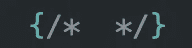

为什么这样做，为什么花括号看起来在基于语法高亮的注释之外？在 JSX 代码中，我们仍然可以使用 Javascript，但是我们必须在花括号内完成。本质上，花括号只是说，“我们之间的任何东西都应该被理解为 Javascript，而不是 JSX。”斜杠-星号夹层是经典的 Javascript 注释语法，可用于单行或多行注释。

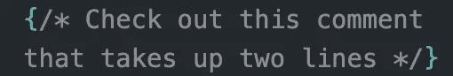

斜杠星号三明治`/* */`并不是我们可以在 React 应用中使用的唯一 Javascript 注释语法。

## 带双斜线的大括号

我们也可以使用以双斜线`//`开头的 Javascript 单行注释语法。我们必须小心使用这个语法，因为它有能力注释掉结束 Javascript 表达式的右花括号`}`。这会破坏我们的代码。

另一个注释在一行中运行良好，因为结束星号和斜线`*/`告诉程序接下来的内容在注释之外。双斜线注释的工作原理是告诉应用程序，该行后面的所有内容都是注释。因此，如果右花括号与双斜线`//`出现在同一行，应用程序不会注册它已经关闭了 Javascript 表达式。该应用程序将因语法错误而中断。

如果你想在多行上使用单行注释语法，还有一个简单的方法。由于双斜线`//`注释掉了该行的其余部分，我们必须将右花括号`}`放在下一行。

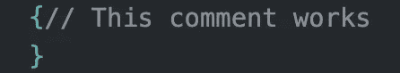

但是它可以看起来更好

如果您想使用单行注释语法，我强烈建议您将它放在花括号之间的单独一行，这样可以提高可读性。

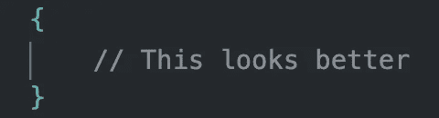

## 没有花括号

在 React 应用程序的 JSX 代码之外，Javascript 是默认的。因此，我们可以使用刚才提到的语法来编写我们的注释，但是不用花括号。

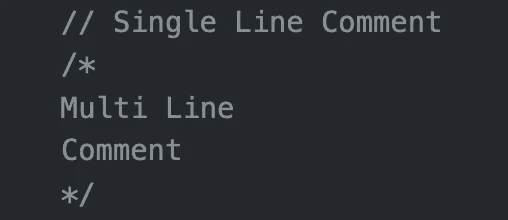

# 用例及注意事项

现在我们知道了如何编写不同的注释语法，是时候回顾一下什么时候使用什么了。虽然我们讨论了多种方法来编写这些注释，但是我们只需要考虑一件事:我们是否需要花括号？除了一个注意事项之外，它非常简单，我稍后将对此进行介绍。

## 规则

如果你在 JSX 代码中的**和**标签之间的**，你需要花括号。否则你不会。这是 JSX 的样子。**

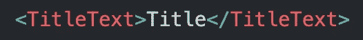

任何涉及这些标签的都是 JSX，所以为了在这些 JSX 标签中添加注释，我们必须使用花括号。

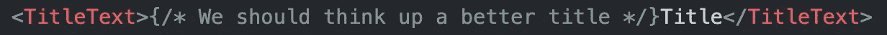

当这些 JSX 标签嵌套在一起时，情况会变得更加混乱。这是常态，所以你会一直看到这种情况。

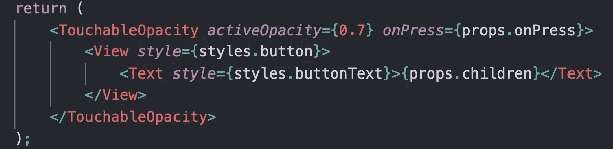

你需要用花括号注释掉在你的父标签之间的任何东西，也就是上图中的`<TouchableOpacity></TouchableOpacity>`标签。但是，如果在 JSX 父标签之外的任何地方使用花括号，就会出现语法错误。

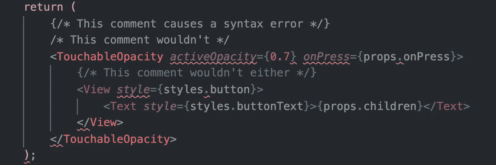

花括号只在 JSX 标签中有效

## 例外

现在我们知道了使用花括号的主要规则，是时候讨论这个规则的例外了。我们不能在 JSX 标签中使用括号注释**。这听起来真让人困惑。我刚刚告诉过你，你必须在 JSX 代码中使用花括号来注释，但是不要在 JSX 标签中使用花括号。这是一个带有风格道具的 JSX 开幕视图标签:**

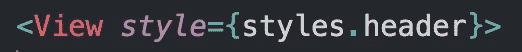

JSX 元素有道具是很常见的。有些元素有多个属性，你可能想注释掉其中一个属性或者在其中加入一个注释。由于这些道具在 JSX 标签中，我们不能使用花括号注释。这里我们必须使用普通的 Javascript 注释。

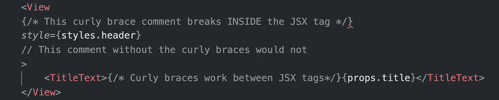

这变得特别令人困惑，因为如果你像我一样用快捷键注释，你的代码编辑器可能会出错。在我的 React 应用程序的所有其他场景中，当我使用行注释键盘快捷键时，VS 代码会正确格式化我的注释。在 JSX 标签之间，它用花括号注释；在 JSX 标签之外，它的注释没有花括号，就像它应该的那样。但是当我在 JSX 标签中使用键盘快捷键**时，它用花括号注释并破坏了我的代码。**

该规则的例外是您必须记住的内容，这样您就不会因为一个非常可预防的语法错误而意外破坏您的代码。

 [## ReactJS -如何使用注释？

### 感谢贡献一个堆栈溢出的答案！请务必回答问题。提供详细信息并分享…

stackoverflow.com](https://stackoverflow.com/questions/30766441/reactjs-how-to-use-comments)