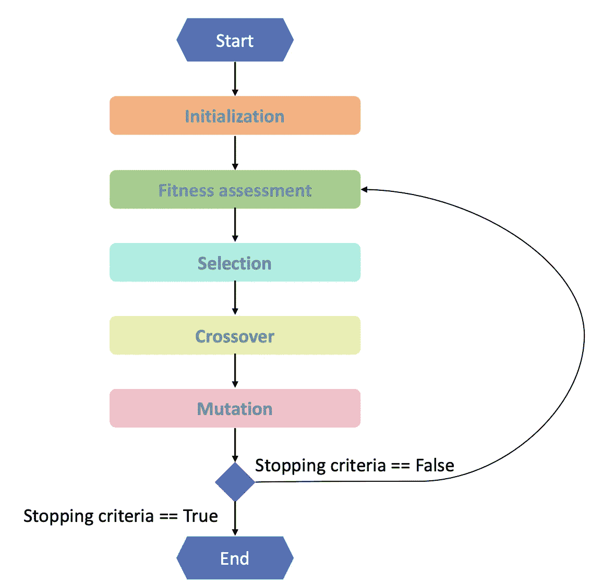

# 遗传算法的不同部分

> 原文：<https://blog.devgenius.io/the-different-parts-of-a-genetic-algorithm-487c5443e165?source=collection_archive---------13----------------------->

## 遗传算法

## 了解不同的功能，使遗传算法的工作。

遗传算法是模拟自然进化的进化算法的一个子类。达尔文的自然选择理论认为，最适合的个体就是那些能够繁衍后代的个体。根据这一理论，遗传算法由三个主要阶段组成:选择、繁殖和试图复制自然工作机制的突变。遗传算法主要用于启发式地寻找全局最优解。

([来源](https://unsplash.com/photos/iar-afB0QQw))

# 遗传算法应用

遗传算法已经被应用于许多行业中的许多不同问题。这套算法被计算机科学专业的学生广泛用于解决像**旅行推销员问题** (TSP)或**背包问题**这样的问题，但它也被广泛应用于许多领域。所有以下几点也是进化算法的应用，因为它们是一组更大的遗传算法。

*   在[实物期权分析](https://www.sciencedirect.com/science/article/abs/pii/S0167923610002344)的金融投资组合优化中，作者对之前的算法进行了重大改进。
*   为了改进决策过程，航空公司为[终端预订](https://dl.acm.org/doi/10.1145/2345396.2345426)实施了遗传算法。
*   在这项研究中，作者使用它来寻找[递归神经网络](http://arimaa.com/arimaa/about/Thesis/)的最佳参数。同样在计算机科学领域，其他小组已经研究了使用[遗传算法进行特征选择](https://www.kdnuggets.com/2017/11/rapidminer-evolutionary-algorithms-feature-selection.html)的改进结果。

# 遗传算法步骤

用 python 从头开始编写整个遗传算法可能会令人生畏。因此，我们将一步一步地研究遗传算法。下图显示了实现完整 ga 算法所涉及的其他任务。

遗传算法分步流程图。

# 1.开始

首先，随机定义问题的 N 个可能的解决方案。首先要做的是随机生成问题的解决方案。他们不需要成为最好的，也不需要遵循任何特定的模式，他们将是一颗种子，在这颗种子上，以后会找到最好的解决方案。如果您有信心，您可以尝试在可能找到最佳解决方案的区域中创建初始的可能解决方案集。您可以尝试提供伪随机猜测，而不是随机生成解决方案，这可能是理想的解决方案。如果你做得太多，你可能会陷入局部最优而不是全局最优解。

# 2.健康评估

对于一组 N 个可能的解决方案，是时候单独评估它们中的每一个，并逐个评估适合度。适合度是一个指标，代表每个解决方案在我们的模型中的表现。如果一个解决方案看起来很好并且经过了很好的优化，那么适合度将会很高，而一个错误的解决方案将会有很低的分数。然而，有时我们可能想寻找函数的最小值。如果我们有一个最小化问题，那么最好的解决方案将是一个最低的价值。

# 3.祖细胞选择

基于先前计算的适合度，选择祖先。个体解的适应度越高，它交配和生育后代(后代)的概率就越高。我们只需要根据它们的交配概率选择一组祖先。选择过程根据需要执行多次，直到我们获得足够的祖先来产生 N 个孩子来代替最初的 N 个解决方案。应该注意的是，每个祖先可以不止一次和不同的伴侣交配。选择双亲有几种策略(从最常见到最不常见排序):

## 轮盘赌选择

[轮盘赌是一种基于适合度概率的选择方法](https://rocreguant.com/roulette-wheel-selection-python/2019/)。因此，要做到这一点，您需要将每个解决方案的所有适合度指标相加，并给出每个解决方案被选中的概率，因此该概率为个体适合度/总体适合度。

## 等级选择

顾名思义，应该使用适应度函数从差到好对解决方案进行排序。然后给它们编号，最差的是 1，第二差的是 2，依此类推。然后，我们将这些数字相加，并像之前的个人排名/总和排名一样计算概率。

## 锦标赛选择

这个选择策略稍微长一点。我们随机选择一个子集的解决方案，并挑选足够好的时间作为我们需要的解决方案。请注意，如果子集的大小为 1，我们实际上是随机选取的。

# 4.交配或繁殖

两种不同的解决方案有望匹配。为了简单起见，这里我们将假设在两个解之间进行复制，尽管似乎有[证据](https://link.springer.com/chapter/10.1007/3-540-58484-6_252)表明更多的祖先提高了算法的性能。交配包括将两种溶液合并成一种溶液，保留双亲中的一部分。交配可以通过交换解决方案的固定部分来完成，但也可以选择每个亲本的随机位。无论哪种情况，我们都需要确保解决方案仍然是一致的。例如，如果不允许重复，我们需要检查子代中是否存在重复，否则，需要进行纠正，以便解决方案满足问题约束。

# 5.变化

变异步骤对于防止我们的算法陷入局部最优很重要。局部最优是一个看起来最好的解决方案，如果我们看附近的解决方案，但它不是最好的可能的解决方案。最佳可能的解决方案或全局最优可能在低谷之后，因此我们需要随机性来跳过山丘。突变步骤产生了这种必要的随机性。根据选择的随机性，变异步骤任意改变解的不同部分。如果太少，我们会陷入局部最优，如果太多，它会打破最佳解决方案，阻止他们巩固和不断改善一般人群的健康。应该注意的是，一些实现确实具有后代的包含标准。一些应用程序有一个过滤器，防止真正不好的后代被添加到解决方案的集合中。其他解决方案包括防止为了变异而产生的后代过于相似的机制。变化越大，获得更好解决方案的机会就越大，否则它会收敛到所有解决方案都是相同的。

# 6.停止标准

如果满足停止标准，那么我们停止执行。否则，我们转到第二步，再次重复整个过程。因为最佳解是未知的，所以可以定义一组规则来停止计算。

*   有一个满足最低标准的解决方案。这意味着有一个解决方案的适应度等于或好于我们预期的满意程度。
*   我们已经执行了太多的迭代。该算法已经循环了足够多的时间，所以我们认为没有更好的方法了。
*   我们花了预算。计算/时间/金钱已经被使用，没有剩余的资源继续迭代。
*   这个解决方案已经停滞不前了。解决方案似乎没有改善，也许也没有恶化。算法似乎找不到更好的。
*   我们认为这个解决方案已经足够好了。在手动检查结果后，我们可以决定对结果感到满意，并决定停止实验。
*   所有的结合。我们可以将它们全部合并，找到符合我们口味的最佳停止规则。

你喜欢吗？我也在我的 [*个人博客*](https://rocreguant.com/) *上发表。你有问题吗？在*[*Twitter*](https://twitter.com/rocreguant)*或*[*LinkedIn*](https://www.linkedin.com/in/rocreguant/)*上打我。这个故事最初发表于*[https://rocreguant . com/genetic-algorithm-python-example/1977/](https://rocreguant.com/genetic-algorithm-python-example/1977/)