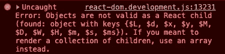

# JavaScript 中处理日期和时间的最简单方法

> 原文：<https://blog.devgenius.io/the-easiest-way-to-deal-with-dates-and-times-in-javascript-5c74db8fb535?source=collection_archive---------2----------------------->

## Day.js 简介及有用函数的示例


照片由[伊莱扎·戴蒙德](https://unsplash.com/@eliza28diamonds?utm_source=medium&utm_medium=referral)在 [Unsplash](https://unsplash.com?utm_source=medium&utm_medium=referral) 上拍摄

在 JavaScript 中处理日期和时间是众所周知的挑战。这就是为什么像 [Moment.js](https://www.npmjs.com/package/moment) 这样的图书馆在 npm 上有将近 1500 万的周下载量。

然而，如果你检查 Moment.js 的文档，你会看到，当涉及到现代开发时，甚至他们也推荐一些替代方案。Moment.js 的一个问题是包的大小。如果您需要国际化或时区支持，包的大小会变得很大。

一个替代方案是 [Day.js](https://day.js.org/) 包，只有 2kb。

> Day.js 是一个极简主义的 JavaScript 库，它通过一个很大程度上与 Moment.js 兼容的 API 为现代浏览器解析、验证、操作和显示日期和时间。

如果你之前用过 Moment.js，用 Day.js 会让你觉得很舒服。

在本文中，我们将看看 Day.js 包，其中包含一些您将使用的最常见函数的示例。

# 使用 Day.js

对于我们的例子，我们将使用 JavaScript 在 React 应用程序中工作。

要开始使用 Day.js，将[包](https://www.npmjs.com/package/dayjs)安装到您的项目中。

```
npm install dayjs
```

导入`dayjs`，现在你可以在你的文件中使用它了。

```
import dayjs from 'dayjs';
```

## 现在

要获得当前日期，调用`dayjs()`。但是，如果我们试图将它呈现到页面上，我们将会得到一个错误。这是因为 Day.js 为`Date`对象创建了一个包装器。



要查看 ISO8601 格式的日期和时间，将一个`.format()`链接到`dayjs()`函数调用的末尾。

```
dayjs().format(); *// 2021-05-26T07:43:28+09:00*
```

## 格式

我们可以向`.format()`函数传递参数，将日期和时间转换成可读性更好的字符串。

例如，如果我们调用`.format("YYYY-MM-DD")`，我们将看到以下内容:

```
dayjs().format("YYYY-MM-DD"); *// 2021-05-26*
```

您可以将**“YYYY-MM-DD”**更改为任何其他可用的格式。查看[文档](https://day.js.org/docs/en/display/format)以查看完整列表。

## 得到

如果只想获得日期或时间的一个值，可以调用其中一个 getter 方法。

例如，要获得年份，在一个`dayjs()`函数调用的末尾添加一个`.year()`。这将返回代表当前年份的数字 2021。

```
dayjs().year(); *// 2021*
```

或者，您也可以调用字符串 getter 来返回相同的信息。

```
dayjs().get('year'); *// 2021*
```

## 一组

你能得到的每一个单位，你也可以设定。

如果我们想将年份设置为 2025 年，将 2025 年作为参数传递给`.year()`函数。这将把年份设定为 2025 年。

```
dayjs().year(2025).format('YYYY'); *// 2025*
```

或者，您也可以调用`.set()`，它接受一个单位作为第一个参数，一个值作为第二个参数。

```
dayjs().set('year', 2025).format('YYYY'); *// 2025*
```

您可以获取和设置以下单位的日期和时间:

*   毫秒
*   第二
*   分钟
*   小时
*   月份日期
*   星期几
*   月
*   年

## 增加

假设您想要获取当前日期 1 年后的日期。您可以使用`.add()`功能来完成。这个函数将一个值作为第一个参数，将一个单位作为第二个参数。

例如，要获得一年后的日期，调用`.add(1, 'year')`。

```
dayjs().add(1, 'year').format("YYYY-MM-DD"); *// 2022-05-26*
```

## 减去

类似于加法，我们可以用减法做同样的事情。

例如，如果您想获得 1 个月前的日期，请调用`.subtract(1, 'month')`。

```
dayjs().subtract(1, 'month').format("YYYY-MM-DD"); *// 2021-04-26*
```

如需查看所有可用单元的列表，请点击此处的列表。

# 结论

感谢阅读！这些只是我发现自己在使用 Day.js 时使用最多的几个函数。

在未来，还有另一个 API 正在开发中，叫做 Temporal。它将是 JavaScript 中一个新的全局对象，充当顶级名称空间，类似于`Math`。Temporal 目前处于 TCP39 流程的第 3 阶段，因此还没有准备好用于生产，但可能很快就会了。希望这将使 JavaScript 中的日期和时间更容易处理。但是现在，请为您的下一个项目访问 Day.js。

如果您想了解另一个有用的 JavaScript 库，请查看下面的文章来了解 Chroma.js。

[](https://levelup.gitconnected.com/build-a-color-scale-generator-with-chroma-js-810b7cf7b587) [## 用 Chroma.js 构建色标生成器

### 让我们来看看 chroma.js 缩放函数

levelup.gitconnected.com](https://levelup.gitconnected.com/build-a-color-scale-generator-with-chroma-js-810b7cf7b587)