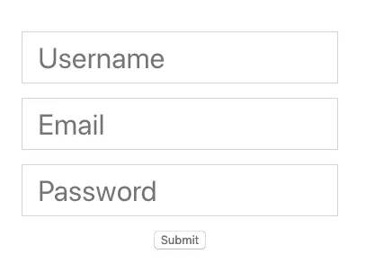
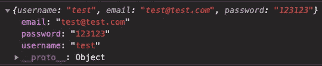
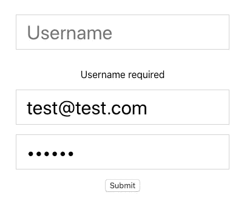

# React 中处理表单的最简单方法

> 原文：<https://blog.devgenius.io/the-easiest-way-to-deal-with-forms-in-react-ad6bc1250829?source=collection_archive---------0----------------------->

## 使用 React 钩子形式来提高应用程序的性能


莱昂·德维耶在 [Unsplash](https://unsplash.com?utm_source=medium&utm_medium=referral) 上的照片

表单是任何网站或应用程序的重要组成部分。从登录/注册屏幕到添加和更新数据，你会发现它们无处不在。

当使用 React 时，我们通常希望在处理输入时创建一个受控组件。

例如，我们需要创建一个状态变量，并将其设置为输入的值。然后，我们需要在输入中添加一个 onChange 事件监听器。现在，每当输入被更新时，我们在应用程序中就有了一个受控状态。

正如您从上面所看到的，要实现这一点还需要几行额外的代码。想象一下，如果我们有一个有多个输入的表单呢？我们需要为每个输入创建一个单独的状态，并为每个输入添加值和 onChange 侦听器。而且，每次我们改变输入的值，都会导致组件的重新渲染。

为了使事情变得简单，欢迎使用 [React Hook Form](https://www.npmjs.com/package/react-hook-form) 库。它被描述为，

> "高性能，灵活和可扩展的形式，易于使用的验证."

听起来不错，不是吗？在本文中，我们将看看 React 钩子表单库。我们将从学习如何在我们的应用程序中实现它开始，然后看看如何处理验证。

# 入门指南

为了展示这个库，我们将构建一个简单的表单。首先，让我们在 React 项目中创建一个表单，如下所示。这是一个简单的表单，有三个输入字段和一个提交按钮。

```
const App = () => {
  return (
    <form className="App">
      <input type="text" placeholder="Username" name="username" />
      <input type="email" placeholder="Email" name="email" />
      <input type="password" placeholder="Password" name="password" />
      <input type="submit" />
    </form>
  );
};
```

我也添加了一些基本的风格，只是为了让它看起来更好一点。现在，如果我们打开我们的应用程序，它将看起来像这样。



# 使用 React 挂钩形式

要使用 React Hook 表单库，让我们首先将它安装到我们的项目中。你可以在这里找到 npm 包。

我们将从库中导入`useForm`钩子。

```
import { useForm } from 'react-hook-form';
```

然后，在函数组件内部调用它。这个钩子在我们调用的时候会给我们三个变量，`register` `handleSubmit`和`errors`。

```
const { register, handleSubmit, errors } = useForm();
```

为了跟踪我们输入的变化，我们将传递`register`作为我们想要跟踪的每个输入的引用。现在每个输入看起来像这样。

```
<input
  type="text"
  placeholder="Username"
  name="username"
  ref={register}
/>
```

接下来，让我们来处理表单的提交功能。我们将创建一个`onSubmit`函数，它将接受数据。现在，我们将把它输出到控制台。

```
const onSubmit = (data) => {
  console.log(data);
};
```

在表单上，添加`handleSubmit`函数作为道具，并传递`onSubmit`作为回调函数。

```
<form className="App" onSubmit={handleSubmit(onSubmit)}>
```

现在，当我们向表单添加数据并提交它时，我们将在控制台中看到输出。我们现在有了一个包含所有表单数据的漂亮对象。



不要忘记在输入中添加一个名称属性。我们传递给输入的名称将被用作我们的数据对象中的键。

# 添加验证

为了向表单添加验证规则，我们可以将一个可选对象作为参数传递给`register`。

例如，如果我们想要一个必需的输入，我们可以简单地将下面的内容添加到任何输入中。

```
<input
  type="text"
  placeholder="Username"
  name="username"
  ref={register({ required: true })}
/>
```

现在，如果我们尝试在没有用户名的情况下提交表单，它将无法工作。

我们可以通过使用之前的`errors`值来显示一条错误消息。发生的任何错误都将成为 errors 对象上的一个道具，我们可以用它来显示错误。

例如，如果用户没有输入用户名(这是我们要求的)，我们可以显示这样的错误。

```
{errors.username && <p>Username required</p>}
```



支持的验证规则列表包括:

*   需要
*   部
*   最大
*   最小长度
*   maxLength
*   模式
*   使生效

如果您按照代码进行了操作，我们现在应该有一个带有验证设置的表单，如下所示。

# 包扎

感谢阅读！我希望这篇文章对你开始使用 React Hook 表单库有所帮助。

它易于使用，性能良好，并且需要的代码少得多。在下一个需要表单的应用程序中尝试一下。

如果您想查看我们创建的示例的完整源代码，请在这里查看 GitHub 库。

要了解另一个有用的 React 库，请查看下面我们查看 React 图标库的文章。

[](https://javascript.plainenglish.io/tutorial-and-beginners-guide-to-using-react-icons-77c614696301) [## 使用 React 图标的初学者指南

### 在一个地方获得您需要的所有图标

javascript.plainenglish.io](https://javascript.plainenglish.io/tutorial-and-beginners-guide-to-using-react-icons-77c614696301)