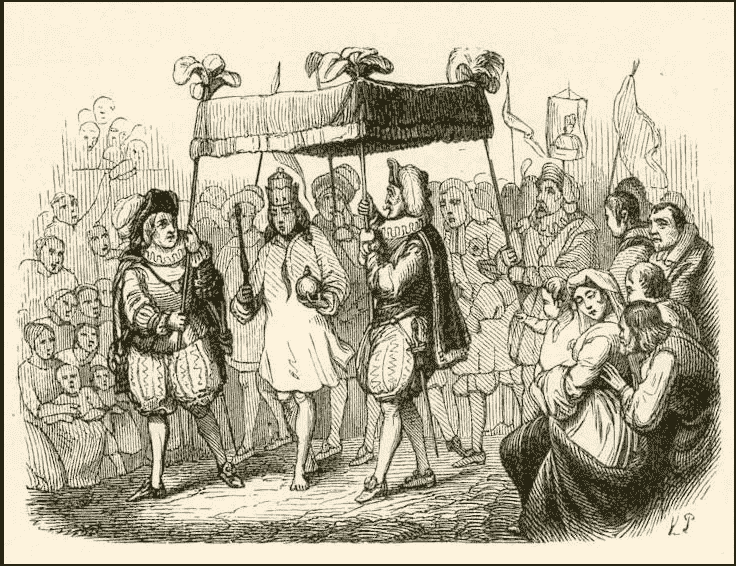

# 皇帝的新衣

> 原文：<https://blog.devgenius.io/the-emperors-new-clothes-5d55f0a9aa0e?source=collection_archive---------9----------------------->

这个寓言是一个很好的例子，说明为什么遵循的过程不会以理想的结果结束。

[https://en.wikipedia.org/wiki/The_Emperor%27s_New_Clothes](https://en.wikipedia.org/wiki/The_Emperor%27s_New_Clothes)

寓言里，大家都看到了皇帝一丝不挂，却没有人愿意说真话。每个人都只是按照描述做好自己的工作，但是没有人会因为这种恐惧而试图推翻别人的决定(看起来像个傻瓜)。

让我们来看看软件，当我们在筒仓中构建我们的软件时，没有人对整个创建的东西负责。我们害怕推翻别人的决定，因为我们认为这是他们部门的问题。

## 停止在筒仓中工作

对整个产品的一个层面负责并不能保证产品足够好。[为了解决这个问题，我们通常引入检验步骤来验证工作是否完成，](/short-feedback-loops-137d075aa67d?sk=3716efe911938f7c8de7bcf49cc45b1a)只是因为我们维护了筒仓。但是，如果我们消除筒仓，我们一起工作来解决整个事情。
这种想法在软件世界中的一些例子:

> 业务人员和开发人员必须在整个项目中每天一起工作。
> [https://agilemanifesto.org/principles.html](https://agilemanifesto.org/principles.html)
> 
> **DevOps** 是一套结合了软件开发( *Dev* )和 IT 运营( *Ops* )的实践。它旨在缩短系统开发生命周期，并提供高质量的连续交付。
> [https://en.wikipedia.org/wiki/DevOps](https://en.wikipedia.org/wiki/DevOps)
> 
> **质量协助**是一个由 Atlassian 首次推广的术语，用来描述他们在迭代了试图减少从开发到发布的摩擦和时间的各个阶段后最终确定的 QA 模型。它提倡一种理念，即在理想世界中，开发人员应该自己编写代码并将其发布到生产环境中，而不需要任何单独的功能(即质量保证)参与对工作进行质量检查。
> [https://medium . com/clear score/taking-a-phased-approach-to-adopting-quality-assistance-3f 91335 c02e 6](https://medium.com/clearscore/taking-a-phased-approach-to-adopting-quality-assistance-3f91335c02e6)

## 过程

寓言里，大家都按照流程走，最后的结果却惨不忍睹。这是典型的责任问题。我们相信过程，而不是人。我们确定我们的过程正把我们带到正确的道路上吗？

> 系统性能中 95%的变化是由系统本身引起的；只有 5%是人民造成的。"
> 
> W.爱德华兹·戴明，*团队手册简介*

让我们想象一下，我们接受一次又一次地迭代系统，以改进它来满足使用它的人的需求。
让我们想象一下，按照流程工作的人可以改变流程的任何部分，测试并改进它。
但这是有代价的，代价就是信任，我们需要信任那些人。我们需要信任他们什么？。让我们专注于我们需要的东西，让它们发生，然后相信人们会改变这个系统。

> 团队定期反思如何让
> 变得更有效，然后相应地调整和调整
> 其行为。
> https://agilemanifesto.org/principles.html

一个生产软件的公司应该优化什么？。作为任何公司的结果，有更好的产品和更高的质量。能够适应客户，倾听他们的意见，等等。因此，我们的产品需要具备以下功能:

*   把质量放在里面意味着更好地工作，提高我们的技能来写更好的用户故事，写更好的代码，写更好的测试。[让我们优化学习](/software-teams-karate-421ff1ce5425?sk=35ae3ddbd707d5d86d681e1d8a08524b)。
*   适应客户意味着有办法从产品中获取信息(A/B 测试，快速响应)。尽可能删除所有手动步骤以进入生产( [CI/CD](https://javi-kata.medium.com/ci-cd-for-dummies-b45ed917f9dc?sk=28eede1d5fec71121eea4954583130e9) )。
*   反馈和更多的反馈，但是好的反馈([彻底的坦白](https://youtu.be/4yODalLQ2lM))是为了避免一个孩子尖叫“国王是裸体的”。