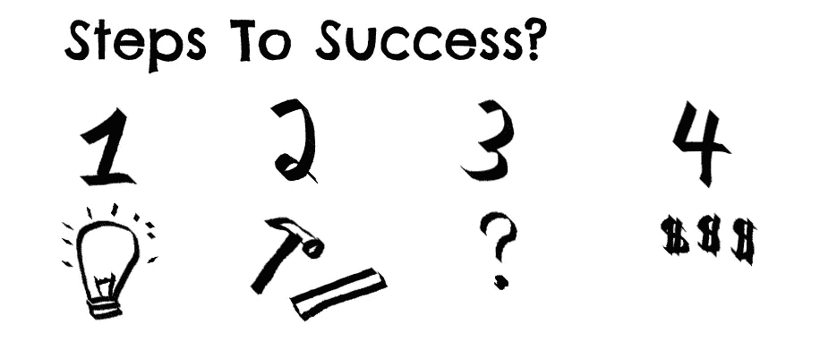

# 工程师的陷阱——验证前构建

> 原文：<https://blog.devgenius.io/the-engineers-trap-building-before-validating-22afc0155153?source=collection_archive---------18----------------------->

这是我经常从我的同龄人身上看到的，从应届毕业生一直到非常有经验的前辈和技术领导者；完全专注于开发一个产品，很少或根本不去验证它是否能在市场上找到任何吸引力或用途。

本文的观点主要是从创建一个产品来创建一个创业公司或企业的共同目标出发。如果你是为了娱乐或者个人用途，以学习为目标来构建一些东西，那么验证过程可能对你来说没有什么意义(尽管我认为它仍然非常有帮助)。在大公司推出新产品和新功能时，我也遇到过这个问题，但与我作为技术领导者在创业环境中开发产品的经历相比，谈论这个问题就没那么有趣了。

请放心，我不会在这篇文章中向你出售或直接命名任何产品。

# 场景

因为这是如此普遍，你们中的许多人可能以前见过或做过这种事。

你想出一个新主意，肾上腺素激增。你甚至可以很快地向一位认为这听起来很酷的工程师同事提及。你会想到所有可以用来建造它的神奇技术。你马上开始，事情进展很快，你有一个简单的默认模板前端指向一个全新的开箱即用(甚至可能是无服务器)的 NoSQL 数据库后端。这只花了几个小时。你的内部宣传空前高涨。

许多人在这之后很快就变得没有动力了。但是，这不是讨论的重点。重点是那些不断向前冲的人。那些可怜的人往往比那些已经失去兴趣的人情况更糟。

这张照片的质量与计划相符

# 验证的重要性

其中一些看起来很明显，但是很容易选择忽略它们并马上开始构建。这绝对不是一个详尽的列表，事实上，它是非常平凡的，但应该有助于说明其重要性。

## 你怎么知道人们想要它？

最明显的问题，也是大多数人没有尽职调查的问题。你问过你的密友和家人吗？太好了，不幸的是这不值什么钱。这些人是你的目标受众吗？你的目标受众是谁？他们想要吗？努力回答这些问题意味着你已经花了一些时间来充实想法和定义目标市场，我认为这是建立想法的第一步，但很多人选择跳过。

好吧，你的目标说他们想要它(或者你转向一个不同的目标)。他们说“是”就足够了吗？

## 你怎么知道人们会为此买单？

你的目标答应了，你很兴奋。但是等等，他们说他们会付钱吗？对大多数人来说，将所有这些工作投入到产品和业务的建设中，只有在赚钱的情况下才有意义。

他们确实说过他们会付钱的？太好了！多少钱？您建造和运营的大概成本是多少？获取客户需要多少成本？

## 他们说他们会付钱，有什么问题？

与那些“造好了，他们就会来”的人相比，你现在的状态相当好。你已经花了几天甚至更长的时间试图定义这个想法和市场。你甚至有一些人说，他们会支付它。这有多有价值？你能达到初始验证的最终形式吗？

在你建造它之前让他们付钱给你。不管是客户还是投资者，这一次可能会很艰难，但这是值得的。如果你能说服人们在这个阶段付钱给你，这通常意味着你真的做了功课。一个仔细研究的市场和专业的执行计划是实现这一目标的保证。这意味着你从工程上退一步，采取了一种更全面的方法，然后真正验证了有人会发现它是有用的，因为他们可以说“把他们的钱用在了他们的嘴上”。

希望你能通过这些成功企业通常执行的步骤推断出验证的所有好处。现在你有了一个执行计划，一个资源网络，甚至可能还有一些钱。为了强调这一点，我将从正反两方面概述我的一些具体经历。

# 当你犯这个错误的时候是什么样子

不幸的是，这篇文章最能引起共鸣的是那些犯了这个错误的人，因为对于许多人(尤其是包括我自己)来说，你必须经历它才能真正理解它的意义。

## 尝试#1

工作进行得很顺利，技术上没有什么太大的挑战，每天结束时我都精力充沛。我已经准备好开始兼职创业了。

我对最近想到的一些想法进行了内部推理，并选择了我最喜欢的。我知道在构建之前进行验证的想法，所以我决定明智地把它推销给我的兄弟(非技术人员)。他喜欢它！跟几个朋友提过，他们很喜欢。听起来像是对我的认可。让我们建造它。

大约一年后，在建立了一个完整的系统后，我们开始接触那些显然是系统目标的人。我们联系了数百人，十几个人回复。几个试试吧。没人喜欢。重复几次会得到同样的结果。

\_(ツ)_/·伍普斯

一年的工作就这样结束了。我们仍然获得了知识和经验，但这不是我们期望或想要的结果。

## 尝试#2

过了一段时间，在做了一些小项目之后，我决定尝试一下创业游戏。这一次，我从一个我知道别人也有过的痛点中得到一个想法，并对自己说“我可以解决这个问题”。一个稍微好一点的开始。

我联系了我的兄弟，他恰好是这个领域的专家，并向他推销这个产品。他真的很喜欢。从我们的错误中吸取教训后，我们决定不再谈论工程，除了它是否可能。我们利用他的关系网，与该领域的几个人交谈。他们喜欢它。我们缩小并细分目标市场，他们喜欢这样。我们甚至抛出了一些可能的定价选项，没有人会对这些数字做鬼脸。我们制定执行计划，识别风险和当前市场。

在中途，我们甚至让其他人参与进来，帮助构建它。这是一个好迹象，既得利益少得多的人相信它足以投入他们的时间。

一年半后，我们有了一个非常好的 MVP，并投入使用。我们获得了牵引力，这是可以销售的，但这很难，需要很长时间。

Woops？是的，喔普斯。我们刚刚花了一年半的时间来建立一些我们可以在 20%的时间里得到承诺的东西。现在，我们的主要目标并不真正关心系统的某些部分，而必须快速侵入其他部分以满足他们的需求。为什么我们花了这么多时间，还加入了一些不必要的东西？我们本可以通过反复验证来解决这个问题，并且比现在领先一年。

图片来自 [Pixabay](https://pixabay.com/?utm_source=link-attribution&utm_medium=referral&utm_campaign=image&utm_content=4444990)

# 当你不犯这个错误的时候是什么样子

在最后两个例子之后，这应该开始变得更加明显了。这里有两个好处显而易见的场景。

## 尝试#1

在上述时间线的某个地方，我想到了另一个想法。看起来很有前途，而且做起来很酷。跟几个喜欢的人提一下。细化我的目标市场并开始联系。接收没问题。看起来他们不会出太多钱。

好吧，酷，让我们旋转。改变商业模式和执行。将目标市场重新定义给那些似乎更感兴趣的人。体面的接待。还是不会出多少钱。

决定真正投入市场，确定理想的契合度。有利基市场，但没有我感兴趣的或对我个人来说很适合的。

成功！验证过程成功了。我放弃了这个项目，尽管从工程角度来看它非常有趣。我的目标是做生意，但这不再合适。

图片由 [StartupStockPhotos](https://pixabay.com/users/StartupStockPhotos-690514/?utm_source=link-attribution&utm_medium=referral&utm_campaign=image&utm_content=593313) 来自 [Pixabay](https://pixabay.com/?utm_source=link-attribution&utm_medium=referral&utm_campaign=image&utm_content=593313)

## 尝试#2

与一些同事一起集思广益，提炼一个想法。在目标市场做大量的上述研究，并定义一个商业计划，执行计划，经营和获得客户的成本细节等等。

我们迎合投资者的需求并推销这些文件。我们吃点东西。一个天使投资者进来并开始提供资本(没什么大的)。

成功！我们已经达到了一个重要的验证点，业务是有价值的。我们没有机会达到最终形式，与付费客户，因为我们解散了个性驱动的原因。我仍然认为这是一个成功的过程，并且学到了很多关于投资者驱动的创造的利与弊。

希望这些经验驱动的账户能帮助你理解为什么你不应该落入“工程师陷阱”。努力为任何类型的项目做一些验证对你的过程、你对项目的想法以及项目本身都是非常有价值的！