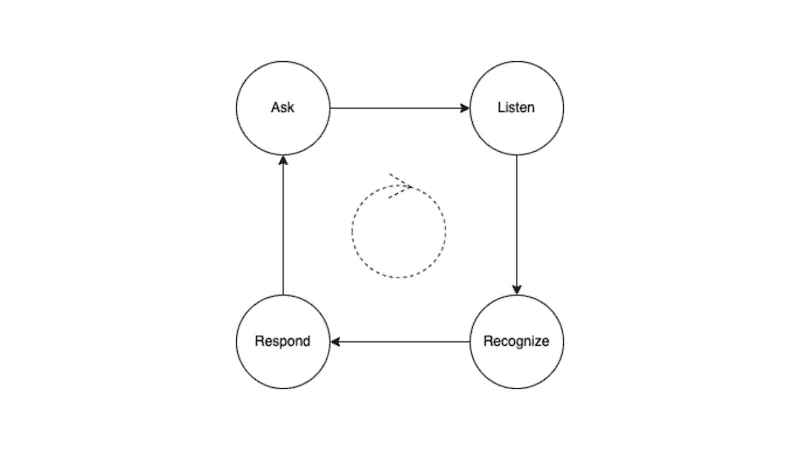
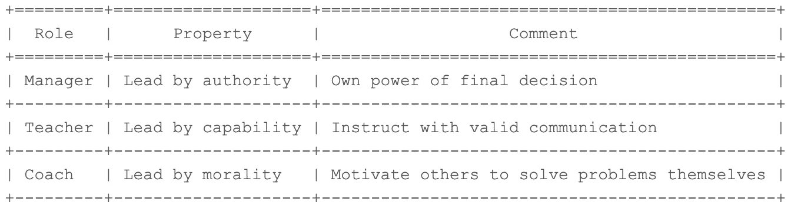

# 教练的本质——从萨提亚模型的观点看

> 原文：<https://blog.devgenius.io/the-essence-of-coaching-from-viewpoints-of-the-satir-model-ec552c0731c5?source=collection_archive---------10----------------------->

# 改变解决问题的模式

这几天我被邀请以一个被辅导者的身份参加了一个辅导活动，来帮助自己理清一些头脑中的盲点。幸运的是，我也在研究萨提亚模型的冰山理论，试图将它应用到我的生活中，帮助我周围的人。

昨晚有人问了我一个重要的问题，关于我对教练的总体看法。对我来说，这个过程似乎和我编程解决一个算法的现有模型时几乎是一样的。

> 辅导课程旨在帮助他人调整他们的行为模式，而不是直接解决他们的问题。

以一个产品线为例，如果你被通知一个产品意外工作，你可能会立即为某个客户服务，并在短时间内帮助他解决问题。但是，根据不同的场景，类似的问题可能会以不同的形式出现。最后你没有找到根本原因，因此你会收到很多客户的投诉。

如果你跳出框框，开始观察流程，你可能会发现你真正需要修复的是一个产品线的缺陷，它会导致类似的问题，然后投诉大大减少。

教练应该能够帮助人们或机构认识到他们目前面临的盲点，并带领他们解决核心问题。

# 引导他人自己寻找解决方案

> 教练倾向于提问，而不是给出直接的解决方案。

教练的目的是帮助你改变你的模式。因此，教练通常不会给你明确的指示。相反，他会问你各种各样的问题，让你透露现在的行为、感觉、观点、期望和欲望。

教练的一项重要技能是采取开放的态度，对他人的回答保持好奇心，并帮助他人找到自己的答案。永远不要质疑你的教练，因为他们很可能会关闭心扉，分享他们所知道的一切。它也不会帮助他们识别他们的行为和内心想法之间的一些微妙差异，这些差异通常隐藏着有效的解决方案。

一般来说，辅导活动有 4 个步骤:提问、倾听、识别和回应。

*   **提问**:教练会咨询他的学员他应该支持什么。然后通过提问来探索各个方面，帮助他们找出自己的盲点。
*   **倾听**:一个好的倾听者会激励被辅导者分享更多，因为这含蓄地满足了被尊重的愿望，无论他们何时透露他们的观点。
*   **识别**:教练从不同的问题中收集大量有效信息；然后，他应该从他们身上发现一些线索。
*   **回应**:教练根据挖掘出的线索，反馈给学员，并进一步邀请他们加入更深入的谈话，挖掘核心观点。

教练会反复重复上述程序，以确定学员目前拥有的盲点，帮助他们感知，并制定可行的计划来处理问题。

# 你在不同角色下戴的 3 顶帽子

在我看来，我们在不同的情况下会戴三顶帽子。

首先，我们戴着经理的帽子。通常这个角色通过权威来领导一个团队，所以他可以运用他的权力来要求成员做他希望他们做的事情。如果他过多地干涉成员的工作，就会使他们对自己的所作所为不负责任。从本质上来说，一个经理会拥有更多的权力来推动团队的进步。

其次，我们戴着老师的帽子。在这个职位上，我们有足够的能力指导他人学习一些特定领域的知识。然而，如果我们过于依赖这个角色，结果是成员们永远不会试图自己拓宽视野，而是总是等待你的指示，这与教师的最初目标——让成员们拥有自主学习的能力——背道而驰。

最后，我们戴一顶教练帽。这个角色不同于其他两个角色，因为他既没有任何权力，也没有特定的技能。他所做的是帮助其他人澄清盲点，并推动学员制定可行的计划。然而，如果你过于依赖这个角色，学员在一些紧急情况下可能不会迅速做出反应。毕竟不是所有的情况都适合教练领导。我们需要根据我们所处的条件改变我们的帽子。

总之，在不同的环境中，我们可能会戴三种不同类型的帽子。作为一名经理，你应该根据情况来判断我们应该戴哪顶帽子，因此，在你的帮助下，同事们可能会最大限度地发挥他们的绩效。

# 给领导者的 3 堂课

在缓存领导中，当领导者决定进入教练领域时，他/她需要解决 3 个问题。

*   **信任他人**

我们在童年时就被训练要跟随权威。因此，当我们开始学习如何指导他人时，我们可能会继续我们对他人的现有印象，这将是你成为一名合格教练的途径。而是要调整自己的态度；要相信任何人都有改变现状的潜力。

*   **心胸开阔&好奇心**

我们不可避免地会对他人有自己固定的看法。然而，正是这种固定的思维模式阻碍了我们与学员一起探索可能性。我们应该有一个信念，在冰山下面有我们没有看到的无尽的解决方案，并对任何选择持开放态度。好奇心也很重要，因为它帮助教练探索他的学员周围的环境；进一步澄清他们的盲点。

*   **调整关系**

如果你是一名经理或领导，试着在辅导课上调整你的位置，因为那时你有责任帮助你的员工自己探索任何解决方案。在这个时候，你们是合作伙伴，你不应该期望他们必须遵循你的指示。相信他们能够提出适合他们的解决方案，即使从你的角度来看不合适。这样做可以让他们承担起面对困难局面的责任。

# 蔻驰杂音

我仍然在成为一名合格的敏捷教练的路上。因此，我不仅要学习工程实践，还要采用心理学理论来帮助其他人探索改变他们模式的任何选择。

在 OOAD 中，我们习惯于讨论机制，即类和对象之间的交互。因此，我们可以找到**的行为模式**，并通过分析其中的关键抽象来进一步改进自己。

同样，我们可能会坚持某些观点，这使我们对其他可用选项视而不见。我有责任帮助你意识到自己的盲点；触发相应的动作。

—

如果你承认我与你分享的价值，请做如下:
1。**拍**条
2。**为我订阅**最新内容
3。**在其他平台关注**我了解更多信息
-IG:[@ ur _ Agile _ coach](https://www.instagram.com/ur_agile_coach/)
-播客(中文):[敏捷火箭](https://player.soundon.fm/p/7f7dc3df-d738-405c-8cf9-02157a92ec61)
- Youtube: [你的敏捷蔻驰](https://www.youtube.com/channel/UCzD0wQmD1n4MuTKk-JocACA)
- LinkedIn: [吴宗祥](https://www.linkedin.com/in/tsung-hsiang-wu-8542409b/)

如果您需要咨询或其他形式的合作，请发送邮件至:**urscrummaster@gmail.com**