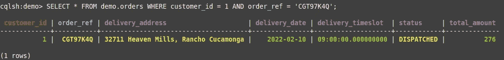

# 高速分布式数据库的基本概念— Cassandra

> 原文：<https://blog.devgenius.io/the-essential-concepts-of-high-speed-distributed-database-cassandra-b87267d5f83e?source=collection_archive---------4----------------------->

## Cassandra 分区键、簇键、查询设计实用指南


SpaceX 在 [Unsplash](https://unsplash.com?utm_source=medium&utm_medium=referral) 上拍摄的

快速响应对成功的在线业务至关重要。如果你的网站超过 1 秒钟才做出回应，你的在线业务可能会受到影响，因为大多数潜在客户没有耐心，只是简单地转向其他网站。尽管有快速的 CPU 和强大的基础设施，系统 I/O(如数据库访问)仍然是大多数系统进程的瓶颈。然而，系统 I/O 是不可避免的，因为大多数业务功能都涉及数据检索和更新。

尽管大多数现代关系数据库都针对性能进行了优化，但要满足不断增长的性能需求仍是一个挑战。如果数据库的性能仍然困扰着您，并且在微调后不能满足需求，那么您的关系数据库可能已经达到了极限。因此，您最好考虑替代选项，例如为高性能而构建的 NoSQL 数据库类型。

Cassandra 数据库以其卓越的性能而闻名。传统数据库在毫秒内响应数据查询，而 Cassandra 数据库可以达到微秒级的性能，它大约快 10 倍甚至 100 倍。因此，许多科技公司采用 Cassandra 来实现他们的高性能系统。

不幸的是，如果你不完全理解它的用法，一个强大的工具是完全无用的。同样，如果你把 Cassandra 当作一个关系数据库来使用，你的系统不会加快速度，只会有缺点。如果您是 Cassandra 的新手，并且想快速了解一下，您会发现这篇文章很有用，因为它为您提供了从创建表到数据查询的一步步的 Cassandra 实践。您将了解 Cassandra 数据库的数据分区和表设计的概念。

# 什么是 Cassandra 数据库？

十多年前，Cassandra 最初是在脸书为其收件箱搜索功能而建立的。然后它在 2008 年被开源。Cassandra 的基本设计是一个分布式数据库，它将数据表分割成多个分区，并分布在多个节点上。传统数据库主要依靠主节点来处理查询，而 Cassandra 的设计是无主的，允许多个节点并行处理大量查询。这也意味着可以通过向群集中添加节点来实现纵向扩展。

当我们看一个表模式时，它非常类似于关系数据库的表定义。例如，这是电子商务**订单**表的模式:

模式语法在很大程度上与列名列表和带有主键的相应数据类型相同

```
CREATE TABLE IF NOT EXISTS demo.orders (
  customer_id int,
  order_ref text,
  status text,
  total_amount double,
  delivery_date date,
  delivery_timeslot time,
  delivery_address text,
  PRIMARY KEY (customer_id, order_ref)
);
```

卡珊德拉的查询被称为卡珊德拉查询语言(CQL)。事实上，语法看起来像传统的 SQL。以下是检索订单记录列表的查询:

```
SELECT customer_id, order_ref, status, total_amount, delivery_date, delivery_timeslot, delivery_address FROM orders;
```


查询语法的设计有助于那些熟悉关系数据库的人掌握 Cassandra 的知识。虽然 CQL 类似于 SQL，但 Cassandra 上的查询是基于不同的概念。请记住，记录存储在分布式节点中。这是一种折衷，实现高性能意味着某些查询不应该得到支持。例如，Cassandra 不支持任何需要数据节点间协调的查询，比如连接表。

数据分布的处理对开发人员来说并不完全透明，Cassandra 允许应用程序开发人员通过表主键定义来控制设置。让我们在接下来的几节中研究一下细节。

# 开始你的第一个卡珊德拉节点

让我们从头开始，在您的本地机器上启动您的 Cassandra 节点并进行探索。与其经历复杂的安装步骤，不如在 docker 容器上运行实例。

只要您的 PC 上安装了 docker，就可以运行以下命令来启动 Cassandra 节点:

```
docker run -d --name cassandra -p 9042:9042 cassandra:latest
```

该命令获取最新 Cassandra 的 docker 图像。截至本文撰写之时，Cassandra 的最新版本是 v 4 . 0 . 3。Docker 公开了端口 9042，以便您可以连接到它来执行查询。

Cassandra 为您提供了一个名为 **cqlsh** 的工具来运行查询。运行这个命令，您将在 Cassandra 容器上启动一个 CQLSH 命令会话:

```
docker exec -it cassandra cqlsh localhost 9042 --cqlversion='3.4.5'
```

如果您已经成功连接到 docker 容器，您将会看到 CQLSH 的这个命令提示符。

```
Connected to Test Cluster at localhost:9042
[cqlsh 6.0.0 | Cassandra 4.0.3 | CQL spec 3.4.5 |Native protocol v5]
Use HELP for help.
cqlsh>
```

执行查询 **describe keyspaces** 来验证您的 Cassandra 节点是否正在响应您的命令:

该查询将显示 Cassandra 节点上的键空间列表:

```
cqlsh> describe keyspacessystem       system_distributed  system_traces  system_virtual_schema system_auth  system_schema       system_views
```

恭喜你！你已经启动并运行了卡珊德拉节点。接下来，让我们探索数据库和表的创建。

# keyspace 是数据库吗？

在关系数据库的世界中，数据库是一个保存大量数据表的容器。但是，在 Cassandra 中没有什么叫做数据库的东西。相反，Cassandra 中的**键空间**类似于关系世界中的数据库。

要定义密钥空间，在 CQLSH 上运行以下语句来创建一个名为 **demo** 的密钥空间:

```
CREATE KEYSPACE IF NOT EXISTS demo
WITH REPLICATION = {'class':'SimpleStrategy','replication_factor':'1'};
```

Keyspace 不仅充当名称空间，还定义数据复制策略。上面的例子使用了带有 1 个复制因子的简单策略，这意味着在键空间中没有数据复制。在生产环境中，**网络拓扑策略**应用于数据中心的复制。

# 创建表格

创建了键空间之后，数据表的创建就简单了。在 CQLSH 上运行这个表创建语句，在 keyspace **演示:**下创建**订单**表

```
CREATE TABLE IF NOT EXISTS demo.orders (
  customer_id int,
  order_ref text,
  status text,
  total_amount double,
  delivery_date date,
  delivery_timeslot time,
  delivery_address text,
  PRIMARY KEY (customer_id, order_ref)
);
```

Cassandra 支持最常见的数据类型，如字符串、整数、双精度、日期和时间。详见[官方文件](https://cassandra.apache.org/doc/latest/cassandra/cql/types.html)。

然后，使用下面的 insert 语句插入一些示例数据。语法也类似于 SQL。

```
INSERT INTO demo.orders (customer_id, order_ref, status, total_amount, delivery_date, delivery_timeslot, delivery_address) VALUES
(3, 'PW9QBN4S', 'DISPATCHED', 232.00, '2022-02-25', '14:00:00', '203 Johns Harbor, New York');INSERT INTO demo.orders (customer_id, order_ref, status, total_amount, delivery_date, delivery_timeslot, delivery_address) VALUES
(2, 'RFGBIIHM', 'DISPATCHED', 478.00, '2022-02-10', '09:00:00', '655 Gorczany Plain, Everett');INSERT INTO demo.orders (customer_id, order_ref, status, total_amount, delivery_date, delivery_timeslot, delivery_address) VALUES
(2, 'K8V8E0IM', 'SUBMITTED', 203.00, '2022-02-10', '14:00:00', '4329 Grayce Station, Frisco');INSERT INTO demo.orders (customer_id, order_ref, status, total_amount, delivery_date, delivery_timeslot, delivery_address) VALUES
(1, '75TPT70S', 'DISPATCHED', 246.00, '2022-02-25', '12:00:00', '246 Alessandro Stream, Mount Prospect');INSERT INTO demo.orders (customer_id, order_ref, status, total_amount, delivery_date, delivery_timeslot, delivery_address) VALUES
(1, 'YQPZ6M4V', 'SUBMITTED', 465.00, '2022-02-25', '14:00:00', '309 Reichert Common, Biloxi');INSERT INTO demo.orders (customer_id, order_ref, status, total_amount, delivery_date, delivery_timeslot, delivery_address) VALUES
(1, 'CGT97K4Q', 'DISPATCHED', 276.00, '2022-02-10', '09:00:00', '32711 Heaven Mills, Rancho Cucamonga');
```

用下面的 SELECT 语句检查 orders 表上新插入的数据:

```
SELECT * FROM demo.orders;
```

查询结果显示订单记录列表:


现在，您已经在 Cassandra 节点上创建了样本表。接下来，让我们看看表主键。

# 分区键—确定数据分区

Cassandra 中的主键显然与关系世界中的主键相同。orders 表中的记录可以由一个组合主键 **customer_id** 和 **order_ref** 唯一标识

```
SELECT * FROM demo.orders WHERE customer_id = 1 AND order_ref = ‘75TPT70S’;
```

上面的查询通过唯一键检索单个记录:


让我们尝试按客户 id 进行查询，结果中有 3 条记录。

```
SELECT * FROM demo.orders WHERE customer_id = 1;
```


按 **order_ref** 列查询怎么样？

```
SELECT * FROM demo.orders WHERE  order_ref = ‘75TPT70S’;
```


哎呀，Cassandra 不允许通过订单参考进行查询。为什么？

```
InvalidRequest: Error from server: code=2200 [Invalid query] message="Cannot execute this query as it might involve data filtering and thus may have unpredictable performance. If you want to execute this query despite the performance unpredictability, use ALLOW FILTERING"
```

关系世界中合法的查询语句并不意味着它在 Cassandra 中是允许的。Cassandra 中的查询要求 WHERE 子句中存在所有分区键。

分区键是 Cassandra 表模式中的一个关键元素。Cassandra 通过分区键分割表行，分区是分开存储的。orders 表中有 3 个不同的客户 id，表记录存储在 3 个独立的分区中。


Cassandra 数据分区

如果 Cassandra 集群由多个节点组成，则分区可以存储在单独的节点上。当执行一个查询时，Cassandra 将首先根据 WHERE 子句中的分区键识别维护目标分区的节点。然后，查询被发送到节点进行处理。

分区键的设计使得基于不同分区键的查询能够并行执行，因为查询由多个节点同时处理。


卡珊德拉查询

如果 Cassandra 收到一个没有指定分区键的查询会发生什么？正如我们在上面通过 **order_ref** 字段进行的查询实验一样，它失败了，因为 Cassandra 不知道应该对哪个分区执行查询。


由于缺少分区键，查询失败

相反，错误消息建议在查询语句中使用 **ALLOW FILTERING** 。它实际上是指示 Cassandra 在每个分区上运行查询。

```
SELECT * FROM demo.orders WHERE  order_ref = ‘75TPT70S’ 
**ALLOW FILTERING**;
```

查询现在得到了结果:


使用**允许过滤**通常不是一个好主意。扫描所有分区是一个开销很大的过程，如果数据表包含许多带有大量记录行的分区，这将花费很长时间。


允许过滤的查询

# 多节点集群上的分区分布

## **设置多节点 Cassandra 集群**

为了查看分区键的细节，现在应该运行一个具有多个节点的 Cassandra 集群。同样，在 docker 容器上运行集群是一种轻松加速集群的简单方法。首先，使用以下命令终止现有的 Cassandra docker 容器:

```
docker container rm -f cassandra
```

将这个 docker 撰写定义保存到本地机器上的***docker-compose . yml***中。请注意，您的本地计算机应该至少有 4 GB 的可用内存来运行集群。

将目录更改为 docker-compose.yml 的文件夹路径，并运行以下命令:

```
docker compose up
```

docker compose 启动一个由 3 个 Cassandra 节点组成的集群。3 个节点的容器名分别是 **cassandra-1** 、 **cassandra-2** 和 **cassandra-3** 。

该容器不在卷上保存任何数据，因此以前的所有表数据都消失了，每次启动时都是一个全新的集群。

使用以下命令连接到 **cassandra-1** 上的命令外壳:

```
docker exec -it cassandra-1 /bin/bash
```

然后，使用 Cassandra 为管理任务提供的**节点工具**查看集群状态:

```
nodetool status
```

如果集群启动并成功运行，那么输出应该有 3 个节点:

```
root@2c98f5e6a3c1:/# nodetool statusDatacenter: datacenter1
=======================
Status=Up/Down
|/ State=Normal/Leaving/Joining/Moving
--  Address     Load       Tokens  Owns (effective)  Host ID                               Rack
UN  **172.19.0.2**  69.05 KiB  16      64.7%             34a4bbf7-0fa0-43f9-98c6-3156fc5269f0  rack1UN  **172.19.0.4**  69.04 KiB  16      59.3%             839ac44f-f3a6-4bb8-bc04-5592d1b2af76  rack1UN  **172.19.0.3**  69.04 KiB  16      76.0%             82977a1d-1850-4186-bc7a-0d13b9da2120  rack1
```

## **如何定位集群中的分区？**

再次运行前面的所有步骤，在新启动的 Cassandra 集群上创建 keyspace、table 并插入样本订单记录。

现在，您已经将分区数据分发到了 Cassandra 节点。为了定位客户 id = 1 的分区， **nodetool** 命令告诉您节点的 IP 地址。

```
root@2c98f5e6a3c1:/# nodetool getendpoints demo orders 1172.19.0.4
```

此外，客户 id = 3 的分区数据在另一个节点上

```
root@2c98f5e6a3c1:/# nodetool getendpoints demo orders 3172.19.0.2
```

# 群集键—分区内的唯一标识符

当我们再次查看 orders 表定义时，您可能想知道为什么 **order_ref** 列在主键下，但它不是分区键。

```
CREATE TABLE IF NOT EXISTS demo.orders (
  customer_id int,
  order_ref text,
  …
  …
  PRIMARY KEY (customer_id, **order_ref**)
);
```

这是另一种类型的主键，称为**群集键**。它唯一地标识一个分区中的一条记录，并定义排序顺序。

分区键+簇键形成记录的唯一标识符。


使用分区键+簇键的查询

例如，下面的查询返回一个具有 customer_id + order_ref 的唯一记录:

```
SELECT * FROM demo.orders WHERE customer_id = 1 AND order_ref = 'CGT97K4Q';
```



簇键还定义了分区中记录的自然顺序。如果我们指定记录按 **order_ref** 列使用**按降序排序，聚类顺序按**排序，那么查询结果默认为预定义的顺序。

```
CREATE TABLE IF NOT EXISTS demo.orders (
  customer_id int,
  order_ref text,
  …
  …
  PRIMARY KEY (customer_id, **order_ref**)
)
**WITH CLUSTERING ORDER BY (order_ref DESC);**
```

以下查询显示记录按 **order_ref** 降序排序:

```
SELECT customer_id, order_ref FROM orders WHERE customer_id = 1;
```


我们可以改变群集键的顺序。例如，下面的查询显示了按 order_ref 升序排序的结果，而不是默认排序。

```
SELECT customer_id, order_ref FROM orders WHERE customer_id = 1 **ORDER BY order_ref ASC**
```


但是，Cassandra 不允许您按不是集群键的列进行排序。

```
SELECT customer_id, order_ref FROM orders WHERE customer_id = 1 **ORDER BY status ASC**InvalidRequest: Error from server: code=2200 [Invalid query] message="Order by is currently only supported on the clustered columns of the PRIMARY KEY, got status"
```

# 复合键

用组合键定义表在关系世界中很常见。同样的道理也适用于卡珊德拉。主键语法支持多个分区键和簇键:

```
CREATE TABLE <table name> (
  …
  …
  **PRIMARY KEY ((<partition key 1>,<partition key 2>...), 
               <cluster key 1>, <cluster key 2>, …)** );
```

该示例将**customer _ id**+**delivery _ date**设置为分区键，集群键为 **order_ref** 和 **status** :

```
CREATE TABLE IF NOT EXISTS demo.orders (
  customer_id int,
  order_ref text,
  …
  …
 **PRIMARY KEY ((customer_id, delivery_date), order_ref, status)**
);
```

有了复合分区键，现在您需要在 WHERE 子句中包含客户 id 和交付日期，以便进行数据查询。有趣的是，由于具有相同客户 id 的记录具有不同的交付日期，复合分区键导致创建更多的分区。

因此，开发人员可以通过定义分区键来控制数据表的分区大小。在性能调优方面，控制分区大小的能力至关重要。什么样的分区大小可以实现最佳性能？没有放之四海而皆准的答案，它取决于您的应用程序查询模式和负载测试结果。请注意，分区的硬限制是 20 亿个单元，因此如果数据量急剧增长，您最好重新组织分区。


具有复合分区键的数据分区

# 如何支持非分区键查询？

除了客户之外，交付团队还需要根据交付日期获得订单列表，以便进行物流安排。假设交付日期不是分区键的一部分，我们如何按特定的交付日期运行查询呢？

解决方案选项包括:

*   辅助索引
*   在交货日期用分区键分隔一个表

## 辅助索引

下面的语句在交付日期创建一个辅助索引。

```
CREATE INDEX demo.orders_by_delivery_date ON demo.orders (delivery_date);
```

创建辅助索引后，不管分区键是什么，按传递日期查询都会得到一个记录列表。

```
SELECT * FROM demo.orders WHERE delivery_date = ‘2022-02-10’;
```


但是，应该谨慎使用二级索引，二级索引的不当使用可能会对集群的性能产生不利影响。详情请参考[何时不使用步进](https://docs.datastax.com/en/cql-oss/3.3/cql/cql_using/useWhenIndex.html)。

## 维护一个单独的表

传统关系数据库的数据建模从实体设计开始，然后是规范化，而 Cassandra 的数据模型设计是基于查询的。为了实现高性能，冗余在 NoSQL 世界并不是一个问题。

解决方案是维护两个单独的订单记录表，即 **orders_by_customer** 和 **orders_by_delivery_date** ，分别为客户 id 和交付日期分配分区键。因此，交付团队在 **orders_by_delivery_date** 上运行查询，而客户在 **orders_by_customer_id 上检查他们的订单。**

缺点是每当有新的订单提交或更新时，都要在两个数据表上插入记录。应用程序逻辑负责确保原子性，因为 Cassandra 没有事务会话或表锁定。

有关数据建模的更多信息，请参考[官方网站](https://cassandra.apache.org/doc/latest/cassandra/data_modeling/index.html)。


为不同的查询维护单独的表

# 最后的想法

Cassandra 是一个强大的数据库，它提供了跨多个节点的高性能数据。分区键和簇键的设计提供了一种灵活的方法来控制数据的分区和分布。虽然 Cassandra 查询语言(CQL)类似于 SQL 的语法，但 Cassandra 肯定不是关系数据库。它是为高速运行查询而设计的，假设集群中的所有节点都独立处理请求。实现高性能意味着不能支持某些特性，例如表连接和通过任意数据字段的查询。

如果你来自关系世界，那么关键是首先忘记规范化和关系模型设计的概念。接受查询优先设计的概念，基于查询开始模型设计，并拥有基于查询的数据模型。