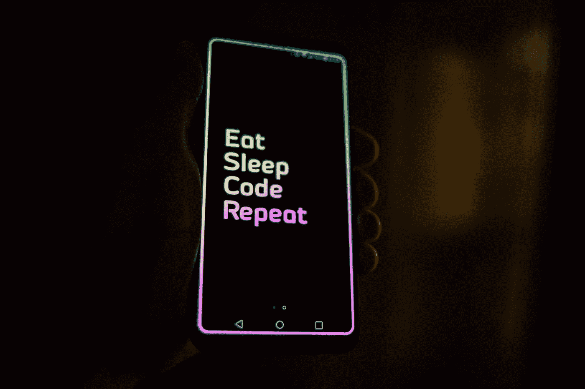

# 擅长编码的确切步骤(从初学者到 FAANG)

> 原文：<https://blog.devgenius.io/the-exact-steps-to-get-good-at-coding-from-beginner-to-google-5f6893945287?source=collection_archive---------9----------------------->

## 你想学习如何编码。但是你从哪里开始呢？

由[罗曼·辛克维奇](https://unsplash.com/@synkevych?utm_source=medium&utm_medium=referral)在 [Unsplash](https://unsplash.com?utm_source=medium&utm_medium=referral) 上拍摄的照片

我认为知道如何编码是一项非常有价值和解放的技能。无论你多大，来自哪里，我认为每个人都可以，也应该学习如何编码(如果他们有电脑和互联网接入的话)。这不是一件容易或快速的事情，但我认为只要稳步前进，任何人都可以做到，只要他们用心去做！我写这篇文章是因为我希望它在我第一次接触编程时就存在了。

# 擅长编码的确切步骤:

1.  确定**为什么**你想学习如何编码。
2.  从免费的编码网站学习 Python，比如 Codecademy。
3.  从类似于 Coursera 的课程中学习数据结构和算法。
4.  **你觉得有趣，已经做好的模仿项目**。
5.  在 [Leetcode](https://leetcode.com/) 上练习**编码面试问题**和[破解编码面试](https://www.amazon.com/Cracking-Coding-Interview-Programming-Questions/dp/0984782850)。
6.  去所有的科技公司面试，然后找到一份工作。
7.  **做你觉得有意思的，还没有做出来的项目**！

如果你完全按照这些步骤去做，我保证:至少，你会成为一个称职的程序员，最好有一天你会成为谷歌的下一任首席技术官。

# 1.确定你为什么想学习如何编码。

你应该想自己编码。我真的很喜欢编码，所以这里有一些你可能会考虑它的原因:

*   你可以用编程来解决现实世界的问题(像优步、脸书、谷歌都是建立在编程基础上的)。
*   挺好玩的(试试吧！).
*   它改变了你思考解决问题的方式，让你变得更聪明。
*   你可以赚很多钱。

如果这些原因中的任何一个足够重要，以至于你想花时间学习如何编码，那么你应该这样做。但是如果你真的不想，那就真的不值得你浪费时间。你只需要决定你想不想做，然后就去做。:)

# 2.在免费的编码网站上学习 Python，比如 Codecademy。

当人们问“我应该先学哪种语言？”大多数资料继续说这没关系，以及你选择的任何一种语言都很好，却没有给初学者提供任何指导。虽然这在某种程度上是正确的，但我认为有一种清晰的语言可以让对编码的介绍更加流畅。

你绝对应该把 **Python 作为你的第一语言**，因为与 C++和 Java 等其他语言相比，它是最容易理解的。它是最直接的，并且处理了许多令人困惑的底层问题，所以在开始时，您可以严格地将注意力集中在编程上。此外，它在现实世界中被大量使用，因为它是世界上第二大最常用的编程语言(第一名是 Javascript，但 Python 更好，尤其是对初学者来说)。然而，如果你决定要学习一门不同的语言，那完全没问题——所有的方法都有效！

你可以在很多网站上免费学习基础编程，但是我强烈推荐 [Codecademy 的](https://www.codecademy.com/learn/learn-python-3)免费课程。你绝对不应该为任何基础的、入门的编程课程付费，更好的课程是免费的。

# 3.从课程中学习数据结构和算法。

一旦你了解了编程基础，学习数据结构和算法对所有程序员来说都是必不可少的。脸书、谷歌、优步等科技公司的所有技术面试。测试这些知识。

要学习这个，网上有免费的课程，比如在 Coursera 上。不过，我认为在这一点上，如果你找到了一个不太贵(< $50)的优质课程，如果你喜欢的话，付费是合理的。

虽然在线课程有效，但我认为如果你能去大学学习数据结构和算法课程，那是一个更好的选择。原因不是课程材料或教授，而是同学。这个话题可能会变得相当棘手，所以在学习的时候有同伴来提问和合作是非常有帮助的。

# 4.模仿你觉得有趣的已经做好的项目。

至此，您将知道如何编码。现在，是时候做一些很酷的东西了！如果你不熟悉所需的技术(可能是一种新的语言、框架、API 等等)，从头开始做一个项目是相当困难的。).所以，现阶段，这是我推荐的。首先，找一个你觉得相当有趣并且已经做好的项目。然后，试着用已经做好的项目和谷歌做指导，做同样的东西。在我看来，这样做可以学到很多东西。

您可以通过搜索“[初级/初级编程项目制作](https://www.makeuseof.com/tag/beginner-programming-projects/)”找到要制作的项目。你也可以通过思考你想做的东西，然后简单地搜索它来寻找灵感或资源。

例如，如果你想做一个个人网站，你可以通过搜索“如何编写个人网站代码”来找到资源。同样，如果你想学习一些更实际的东西，比如 Arduino，你可以搜索“Arduino 项目”并做一些很酷的东西。

你选择制作什么样的项目并不重要，因为你会从制作*任何东西*中学习。这只是可能的，因为您已经在前面的步骤中学习了如何编码！:)

# 5.在 Leetcode 上练习编码面试问题，破解编码面试。

在你有编码经验后，这是一个重要的部分。这对于在软件工程领域找工作很重要。众所周知，几乎所有的科技公司都会在技术面试中问你 Leetcode 上的问题。所以，只有善于回答这些问题才有意义！

在 [Leetcode](https://leetcode.com/) 上，从简单的问题开始，对你所涉及的话题进行彻底的研究。你会想要涵盖所有的数据结构和算法主题，一旦你可以轻松地做它们，移动到中等问题。制定一个每隔一天在空闲时间做一道题的时间表，并坚持下去。在你知道之前，你会超级擅长解决问题。此外，请记住，你必须善于在面试问题期间传达你的想法。

[破解编码面试](https://www.amazon.com/Cracking-Coding-Interview-Programming-Questions/dp/0984782850)是一本我个人从来没有用过的书，但是听说对准备技术面试真的很有帮助！

此外，如果你刚上高中或者更年轻，可以参加 USACO 的比赛。这是一个任何人都可以参加的在线高中编程竞赛，它将帮助你进入大学。

# 6.去所有的科技公司面试，然后找份工作。

一旦你擅长编写面试问题，尽可能多地申请职位空缺！如果你获得了一次面试机会，并能很好地解释如何解决 Leetcode 问题，我认为你已经成功了 76%。

你只需要在面试的行为部分表现出色，但实际上只是尽量表现正常。在一天结束的时候，他们雇佣你来制作软件，所以在我看来，行为部分的门槛很低。

# 7.做你觉得有意思的，还没有做过的项目。

不管有没有工作，在这一点上你肯定非常擅长编码！所以，你现在可以做任何你想要的东西！我发现制作项目是编程中最令人满意和最吸引人的部分。此外，如果你做出很酷的东西并解决问题，你也可以改善其他人的生活。

我做的一些东西包括一个火绒机器人、我自己的加密货币和一个付费墙旁路扩展。所以想想你想做的任何酷的东西，然后用你的编程技能和互联网的帮助去做吧！

# 外卖食品

要记住的一件主要事情是**没有知识会被浪费**。你学的任何东西都是加分的，你学什么并不重要，所有的知识都是有用的。特别是当涉及到编程这样一个广泛的话题时，任何一个子领域的知识，比如 Web 开发或系统，都会增加你的知识积累，帮助你成为一个更好的程序员。

此外，如果你有机会在大学学习计算机科学，我认为这门课程会让你准备好如何编码，这是一个非常好的选择。这确实让这个过程变得正式了一点，而且人们重视学位。我目前在卡耐基梅隆大学学习——然而，我在上大学之前完成了第 1 步到第 3 步，并且觉得第 3 步到第 7 步在学校工作之外对于取得好成绩仍然是非常必要的(我在 CMU 的学习更侧重于理论和技术，因为我觉得我可以自己学习实用的一面)。所以，如果大学不是一个选项，我仍然认为任何人都可以学习如何编码。

这肯定不容易，但如果你承诺遵循这些步骤，无论是作为主要还是次要的事情，我保证你会成为一个非常称职的程序员，并有能力在结束时做出任何你想要的东西。祝你好运！