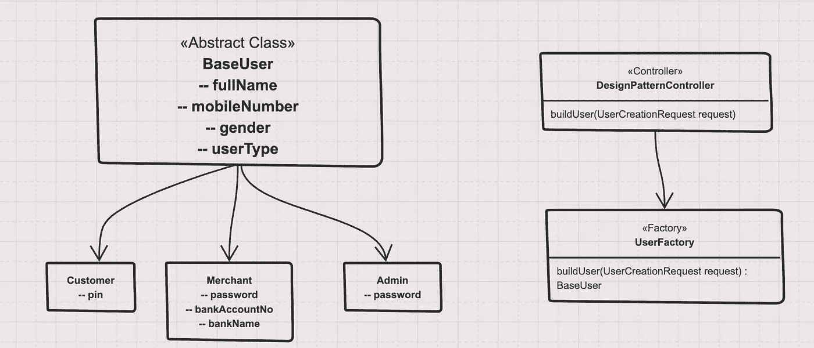
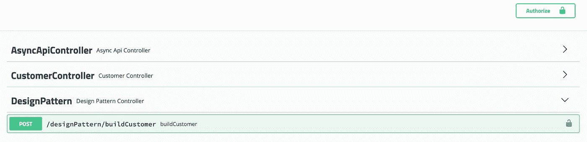

# 工厂方法模式及其在 JAVA 中的实现

> 原文：<https://blog.devgenius.io/the-factory-method-pattern-and-its-implementation-in-java-b51d307b8dd8?source=collection_archive---------2----------------------->

## 在软件工程中，**设计模式**是软件**设计**中常见问题的通用可重复解决方案。—维基百科

[斯科特·格雷厄姆](https://unsplash.com/@homajob?utm_source=medium&utm_medium=referral)在 [Unsplash](https://unsplash.com?utm_source=medium&utm_medium=referral) 上拍照

设计模式是软件开发人员在健壮的可伸缩软件开发过程中面临的一般问题的解决方案。

设计模式可以通过提供经过测试和验证的开发范例来加速开发过程。有效的软件设计需要考虑可能直到实现的后期才变得可见的问题。

重用设计模式有助于防止可能导致重大问题的微妙问题，并提高熟悉模式的编码人员和架构师的代码可读性。

在本文结束时，您将了解到

1.  什么是设计模式？
2.  设计模式的类型
3.  为什么设计模式在软件工程中很重要？
4.  关于工厂设计模式的细节
5.  工厂设计模式的实际实现

你可以从我下面的文章中找到可靠的设计原则及其 JAVA 实现

 [## 固体原理及其 JAVA 实现概述

### 创建可理解的、可读的和可测试的代码，许多开发人员可以协作工作。

levelup.gitconnected.com](https://levelup.gitconnected.com/overview-of-solid-principles-and-its-java-implementations-4ae37fa5bb1b) 

## **1。什么是设计模式？**

*   设计模式代表了有经验的面向对象软件开发人员使用的最佳实践。
*   设计模式是软件开发人员在健壮的可伸缩软件开发过程中面临的一般问题的解决方案。
*   这些解决方案是由许多软件开发人员在相当长的时间内通过反复试验获得的。
*   在所谓的四人组(GoF: Gamma、Helm、Johson 和 Vlissides)出版了他们的书《设计模式:可重用面向对象软件的元素》之后，设计模式在 90 年代后期成为了一个热门话题。
*   这本书将设计模式描述为解决软件中反复出现的问题的核心设计方案，并根据问题的性质将每个设计模式分类。
*   在项目中实现设计模式并不是强制性的。设计模式并不意味着项目开发。设计模式是用来解决常见问题的。
*   每当有需要时，您都必须实现一个合适的模式来避免将来出现这样的问题。要找出使用哪种模式，你只需要试着理解设计模式和它们的目的。

## **设计模式的类型**

主要有三种设计模式

1.  **创意设计模式**

*   这些模式是为类实例化设计的。它们可以是类创建模式，也可以是对象创建模式。
*   这些设计模式提供了一种在隐藏创建逻辑的同时创建对象的方法，而不是使用 new 运算符直接实例化对象。
*   当你利用**多态性**并且需要在运行时而不是编译时在不同的类之间进行选择时，它们特别有用。
*   这使得程序在决定给定用例需要创建哪些对象时更加灵活。
*   创造性设计模式是**工厂方法、抽象工厂、构建器、单例、对象池和原型。**

## **2。结构设计模式**

*   这些模式是根据类的结构和组成设计的。
*   结构模式从单个部分形成更大的结构，通常属于不同的类。
*   结构模式变化很大，这取决于为了什么目的创建什么样的结构。
*   结构模式关注的是类和对象如何组成更大的结构。
*   大多数这些模式的主要目标是增加相关类的功能，而不改变其组成。
*   继承的概念用于组合接口，并定义组合对象以获得新功能的方式。
*   结构设计模式是**适配器、桥、复合、装饰、门面、Flyweight、私有类数据和代理。**

## **3。行为设计模式**

*   行为模式描述了对象之间的交互，并关注对象如何相互通信。
*   它们可以将复杂的流程图简化为不同类别的对象之间的相互联系。
*   行为模式也用于生成算法，一个类简单地使用另一个在运行时可调整的参数。
*   行为模式不仅描述了对象或类的模式，还描述了它们之间的通信模式。
*   行为模式是**责任链、命令、解释器、迭代器、中介器、备忘录、空对象、观察者、状态、策略、模板方法、访问者**

## **4。为什么设计模式很重要**

*   它们使得代码可重用、可测试、无 bug 并且干净。
*   它们为您提供了一种使用经过验证的解决方案来解决软件开发相关问题的方法。
*   该解决方案促进了具有最小耦合的高内聚模块的开发。它们隔离了系统需求中可能存在的可变性，使得整个系统更容易理解和维护
*   设计模式使得设计者之间的交流更加有效。
*   当开发人员熟悉设计模式时，他们可以更容易地就给定问题的潜在解决方案进行交流。
*   为此，加快开发进程。
*   通过遵循，设计模式的改变或修改变得更加容易。如果这样的解决方案是更新的，那么它们可以被任何优秀的软件开发者无缝地应用，并且不会引起任何问题。
*   减少开发人员在开发过程中面临的常见问题。
*   因为设计模式通常是优雅和最佳的解决方案，它们通常比其他解决方案需要更少的代码。这并不总是如此，因为许多开发人员会编写更多的代码来提高理解能力。

## **5。关于工厂设计模式的细节**

*   "定义一个创建对象的接口，但让子类决定实例化哪个类。工厂方法让一个类将它使用的实例化推迟到子类。(四人帮)
*   工厂模式是 Java 中最常用的设计模式之一。
*   这种类型的设计模式属于创建模式，因为这种模式提供了创建对象的最佳方式之一。
*   在基于类的编程中，**工厂方法模式**是一种创造性的模式，它使用工厂方法来处理创建对象的问题，而不必指定将要创建的对象的确切类。
*   这是通过调用工厂方法创建对象来实现的，工厂方法可以在接口中指定并由子类实现，也可以在基类中实现并可选地由派生类重写，而不是通过调用构造函数。
*   工厂模式或工厂方法模式只是定义一个接口或抽象类来创建一个对象，但是让子类决定实例化哪个类。
*   换句话说，子类负责创建类的实例。
*   在工厂模式中，我们创建对象而不向客户端公开创建逻辑，并使用公共接口引用新创建的对象。

查看传统电子商务应用程序的图表

这里，假设它只有 3 种类型的用户。所有类型的客户都有 4 个共同的属性:全名、移动号码、用户类型和性别。

1.  **客户**

*   用户类型为 1
*   那些都是只会买产品的普通客户。
*   客户可以通过 4 位密码登录系统。
*   这里不需要额外的字段

**2。商家**

*   用户类型为 2
*   上传产品，销售产品的电商商家。
*   他们使用密码登录，密码长度至少为 8 位数
*   他们需要银行信息才能在我们的系统中开户

**3。管理**

*   用户类型为 3
*   系统管理员。他们可以控制系统中的所有东西。
*   他们使用密码登录，密码长度至少为 8 位数
*   他们需要一个电子邮件帐户才能在我们的系统中开户

**分析当前需求**

1.  现在仔细检查需求。每种类型的用户都有不同类型的需求。
2.  有些需要 PIN，有些需要密码。
3.  有些需要银行信息，有些不需要。
4.  有些需要电子邮件地址，有些不需要。
5.  将来，在我们的系统中，可能会有 n 种用户类型。我们如何有效地管理他们不同的需求？

软件实体…应该对扩展开放，但对修改关闭。—打开关闭本金

为了减轻这些需求，工厂设计模式可以帮助我们。

1.  在这里，我们创建了基类和子类。在这里，子类将持有自己的业务和变化。
2.  对于新的用户类型，我们将创建一个新的子类。在子类中实现新的变化。没有旧业务会妨碍。
3.  用户工厂将重定向到新用户类型的新子类。不需要新的更改。

理论讨论够了。让我们展示一些作品。假设我们公开了一个名为 **buildUser 的 API 端点。**该 API 接受以下请求。

这里，UserCreationRequest 将所有组合字段作为请求参数。

基类: **BaseUser**

这里添加了所有必填字段。它有 **setCommonData()** 方法。通过这种方法，子类推送公共数据。

子类:**客户**

这里，它在构造函数中采用了 **UserCreationRequest** 。基于逻辑，它正在构建自己的对象。检查这里，是检查**引脚**的有效性。

子类:**商户**

这里也是一样的东西。它只检查**密码**和**银行信息**。

子类:**管理员**

在这里，管理员正在检查**电子邮件**和**密码**验证。

现在是最后一部分。什么是工厂类？

工厂类:**用户工厂**

这里，在工厂中，它检查用户类型并基于类型构建对象。如果添加了新的用户类型，那么它将添加新的案例。不需要进一步的更改。

这是控制器中的代码

这里，它用请求对象调用 **UserFactory** buildUser 静态方法。

您可以将此代码签入[这个库](https://github.com/mesuk/SpringReadyApp)。
**控制器名称**:设计模式控制器

Swagger 网址:[http://localhost:8080/springreadyapp/swagger-ui . html #/](http://localhost:8080/springreadyapp/swagger-ui.html#/)

希望你喜欢这篇文章。快乐编码:)

 [## 使用 JUnit 和 Mockito 进行控制器、服务和存储库层单元测试

### "软件测试的主要目标是给软件以信心."—匿名。

medium.com](https://medium.com/dev-genius/spring-boot-deep-dive-on-unit-testing-92bbdf549594)