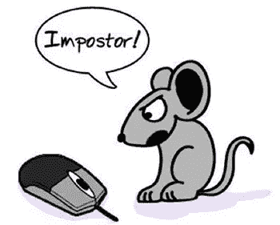

# 冒名顶替综合症背后的感觉

> 原文：<https://blog.devgenius.io/the-feeling-behind-the-impostor-syndrome-ab3f7524a071?source=collection_archive---------0----------------------->

> **作为一名新的软件工程师如何克服冒名顶替综合症**

我在大学大四正式进入就业市场，是在 2016 年。然而，即使在高中获得了电子工业技术文凭，行政管理和计算机网络学位，计算机科学和信息技术学士学位，目前正在攻读软件工程硕士和人工智能和机器学习的证书课程。当谈到评估我的专业能力和成就时，我仍然很纠结。

我从 2016 年开始从事 IT 行业软件工程师的职业。我有几年的 DevOps 工程师、全栈开发人员、软件工程师和站点可靠性工程师的经验。然而，我无法摆脱这样一种感觉:我还没有真正完成任何有价值的事情。

我不断有欺骗的感觉，觉得自己还没有完全获得“ ***软件工程师*** 的称号；虽然我周围的许多人似乎觉得我的教育背景和技能有些令人印象深刻。

此外，我已经从我所有的前主管那里得到了积极的反馈和很好的推荐，他们是 ***FAAMG Alum*** 以及一些我迄今为止合作过的优秀软件工程师。

> **FAAMG 代表:(脸书、苹果、亚马逊、微软和谷歌)**

我最近一直受到那些看到我 LinkedIn 个人资料的招聘人员的关注，以至于我甚至问那些联系我了解谷歌、亚马逊、Canonical 和微软工作机会的招聘人员:“ ***是什么让你选择了我？*** “仅仅是因为我认为我目前的技能还不值得其他人的关注，也不值得像招聘人员和客户经理那样关注。

我正在浏览我的脸书页面，无意中发现了 Ted Talk 视频演示，是关于 ***由* Elizabeth Cox** 制作的冒名顶替综合症。从某种程度上说，那时我意识到我正经历着冒名顶替综合症。

> 什么是冒名顶替综合症？

维基百科将冒名顶替综合征(也称为冒名顶替现象、冒名顶替主义、欺诈综合征或冒名顶替体验)定义为一种个人怀疑自己成就的心理模式。

然而，伊丽莎白·考克斯指出，冒名顶替综合症不是一种疾病或异常，它与抑郁、焦虑或自尊没有必然联系。

> 作为一名初级软件工程师，我一直在做些什么来克服冒名顶替综合症

我最近搬到了明尼苏达州的明尼阿波利斯；我在那里攻读软件工程和人工智能的理学硕士。所以我一直在寻找一个新的职位，在接下来的几周内，我已经安排了一些本地和外地的大公司的面试，包括五大巨头中的两家，FAAMG(脸书、苹果、亚马逊、微软和谷歌)总部。

当我得到 DevOps 工程师的第一份实习工作时，我觉得自己是世界上最后一个配得上这个职位的人，因为我对 DevOps 一无所知，我从未用我的项目将要使用的编程语言编写过代码。简而言之，我得到了一个千载难逢的机会，一个证明自己的机会。

所以，我努力克服了冒名顶替综合症。我一直在学习，看教程，看书，学习新的编程语言，并尽可能快地赶上我的团队。我也开始指导那些还在上大学、还在学习基础知识的人。我开始在工作中承担越来越多的责任，在工作之外为开源项目做贡献。

我遇到了像 Chris Shellenbarger 这样的人，他们帮助我养成了一种习惯，那就是研究并写下我的经历、新的技术概念，并发布关于我如何解决我在从事一些项目时遇到的一些问题的教程。我开始定期写代码，并在我的 GitHub 个人资料上变得更加活跃，甚至在 StackOverflow 上写答案。

所以，现在我把冒名顶替综合症作为不断学习和接受新挑战的动力。众所周知，作为一名软件工程师，需要在一个不断发展的行业中工作。学习曲线是陡峭的，信息永远不会停止演变，我们都在与落后于曲线的感觉作斗争，适应、克服和学习新事物的能力非常重要。

> **我已经意识到，永远不会有一个时刻，我可以说:“嘿，就是这样！我想我已经全部掌握了。”这永远不会发生。**
> 
> **接受我并非无所不知或知之甚少的事实，敞开心扉去学习。**

作为一名 ***初级软件工程师*** —你获取*知识的能力和学习新事物的渴望比你现有的知识更重要。定义你的不是你知道什么，而是你愿意学习什么。 ***明知是水坑；学习是一片海洋。****

> 如果你喜欢这个故事，你可能也会喜欢“ [**如何编写算法**](https://medium.com/coinmonks/coding-interview-problem-solving-techniques-ae6a82d98dbb) ”
> 
> 请给它几个掌声支持！

> 干杯！！！