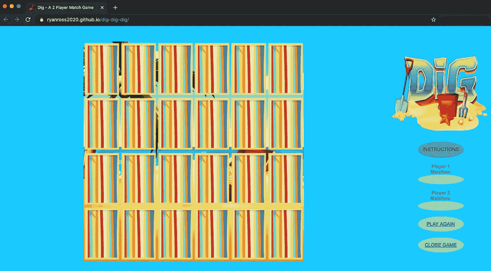

# 我为训练营创作的第一个游戏

> 原文：<https://blog.devgenius.io/the-first-game-i-created-for-bootcamp-84e59d5d9cc8?source=collection_archive---------28----------------------->

赖安·罗斯的纸牌游戏

目前，我参加了大会的软件工程师沉浸。我想展示我的第一个项目。尽管这个概念是基于一个纸牌游戏，但我还是很乐意提出来的。

项目的目标:

1.必须是两个人的游戏

2.获胜的州

3.失败的国家

4.游戏结束后继续玩的方法

5.多轮比赛

游戏的简单性为所有五个目标提供了理想的互动。使用基本的 HTML、CSS 和普通的 JavaScript，我能够创建基本的东西。

“说明”按钮是一个模态按钮。这样，当点击时，指令会从屏幕的一侧弹出。背景会根据玩家的回合改变颜色。第一圈是蓝色的，第二圈变成黄色。

一旦玩家找到所有的配对。然后卡片后面的背景会显示三个不同的公告。取决于玩家的结果。如果是平手，它会说“你平手了！请再玩一次！”如果一号玩家赢了，它只会说“一号玩家赢了！”。玩家 2 说“玩家 2 赢了”

在玩家匹配下，它显示每个玩家获得了多少对。“再玩一次”按钮将重置棋盘并洗牌。最后，关闭按钮关闭窗口。

我想让这个游戏吸引所有年龄的人，并使用了有趣的配色方案。我还在标题中提供了一个红色的铲子图标。

作为一个开始的项目，我对自己能够做的事情感到非常自豪，我对如何在以后创建一个更强大的应用程序有其他想法。

这里有个直播链接可以玩:[https://ryanross2020.github.io/dig-dig-dig/](https://ryanross2020.github.io/dig-dig-dig/)