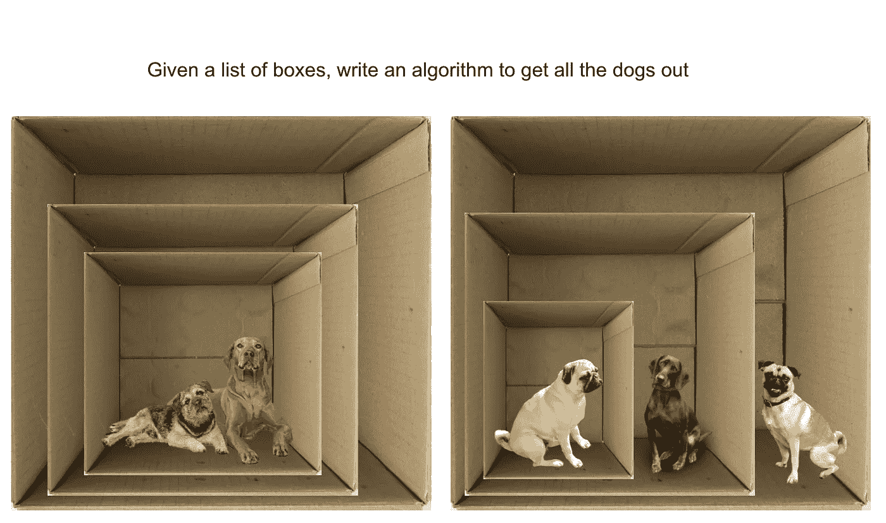
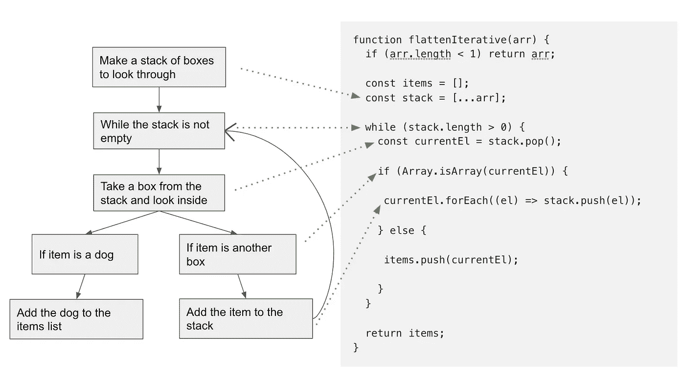
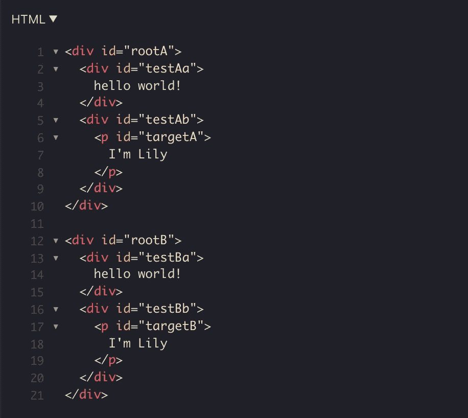

# 任何 DFS 算法的首要原则。

> 原文：<https://blog.devgenius.io/the-first-principles-of-any-dfs-algorithms-232610953ce6?source=collection_archive---------16----------------------->

## 如何用迭代和递归来实现 DFS 算法面试



作者图片

说到编码，我喜欢寻找模式。**模式揭示第一原则，从第一原则思考任何问题都会更清晰。**

这里有一些在编码面试中经常出现的首要原则。

1.  [递归可以转化为迭代(反之亦然)](https://www.ocf.berkeley.edu/~shidi/cs61a/wiki/Iteration_vs._recursion)。
2.  递归类似于深度优先搜索(DFS)。
3.  对于迭代方法，DFS 使用堆栈和 while 循环。旁注，DFS 的堂兄，BFS，使用队列和 while 循环。
4.  如果你看到一个采用嵌套数据结构的算法问题，你可能需要 DFS。

从这些首要原则出发，许多 DFS 练习变得直观且易于理解。

让我用一些例子向你展示我的思考过程。

# 例 1:“把狗放出来！”

让我们写我们的算法把狗放出来！这相当于展平嵌套数组。

```
Input: [["corgi", "husky"], [["pug","shiba inu",["labrador"]]]]
Output: ["corgi", "husky", "pug", "shiba inu", "labrador"]
```

我认为这是 DFS 的问题，因为我们试图搜索数组中的数组，直到找到叶子，即一个非数组项(本例中为整数)。

对于 DFS，我发现递归比迭代更容易理解，但是迭代更容易解释。因此，让我从迭代开始，然后递归会变得非常直观。

***第一原理:DFS 使用堆栈和 while 循环。***

对于迭代方法，算法的主干应该具有以下结构:

```
function flattenIterative(arr) {
  const items = [];
  const stack = [];
  while (stack.length > 0) {
    const currentEl = stack.pop(); }
  return items;
}
```

我们使用堆栈来跟踪元素，在 while 循环中，我们需要向`items`添加元素。

返回的`items`是我们展平的数组。

当然，这个主干功能还不做任何事情。现在，下一个问题是:

1.  堆栈最初应该是什么样子？
2.  何时添加到堆栈？
3.  何时添加到项目？

最后一个问题很简单。如果`currentEl`不是一个数组，我们可以把它添加到`items`列表中。

```
function flattenIterative(arr) {
  const items = [];
  const stack = [];
  while (stack.length > 0) {
    const currentEl = stack.pop(); // if the currentEl is not an array, add it to the items list
    if (!Array.isArray(currentEl)) {
      items.push(currentEl); }
  }
  return items;
}
```

第一个问题也很简单。假设输入只是一个普通的、非嵌套的 1D 数组。在 while 循环中，我们需要弹出堆栈并将元素添加到`items`列表中。因此，算法工作的唯一方式是堆栈是输入数组本身的副本！

```
function flattenIterative(arr) {
  const items = [];
  const stack = [...arr];
  while (stack.length > 0) {
    const currentEl = stack.pop(); // if the currentEl is not an array, add it to the items list
    if (!Array.isArray(currentEl)) {
      items.push(currentEl); }
  }
  return items;
}
```

因此，第二个问题也变得简单明了。如果`currentEl`是一个数组，我们需要将`currentEl`中的每个元素添加到堆栈中，这样它们就可以在后面的迭代中添加到`items`中。

最终的迭代算法如下所示:

只剩下一个问题了。这种算法会展平，但会反转输入的顺序。这是因为我们从输入的后面弹出，但是推到了`items`。因此，要解决这个问题，我们可以将**从**列表中移除。

下面是 DFS 迭代方法的总结。



作者图片

现在，让我们继续讨论递归。

递归的原理很简单:

我们遍历输入数组中的每个元素，如果当前元素不是一个数组，我们将它添加到`items`列表中。如果它是一个数组，我们用当前元素中的每一项来调用函数本身。

在这个算法中，当你用一个内部数组元素调用`flattenRecursive`时，最终，`Array.isArray(item)`将为假，所以它被添加到`items`列表中。

递归的工作方式类似于迭代，但是递归使用调用堆栈本身，而不是手动管理“堆栈”。

# 示例 2:解析嵌套的 DOM 树。

DFS 通常用在树和图的上下文中。所以让我们看另一个例子，我们使用 DFS 来解析 DOM 树。

在这个例子中，我们给定了两个结构相同的 DOM 树(树 A 和树 B ),以及树 A 中的一个目标节点。我们希望在树 B 中找到相应的目标节点。



策略是找到从 rootA 到 targetA 的“路径”。然后我们走同样的路到达我们的目标 b。为了找到这条路径，我们需要做 DFS。

```
function findCorrespondingNode(rootA, rootB, targetA) {
   if (!targetA || !rootA || !rootB) return null; const childrenIndices = findPath(rootA, targetA);

   let currentNode = rootB;

   childrenIndices.forEach((idx) => {
      const children = Array.prototype.slice.call(currentNode.children); currentNode = children[idx];
   });

   return currentNode;
}
```

这里的路径基本上是一个子索引列表，它将我们从根索引引导到目标索引。所以在上面的 html 结构中，我们的目标`<p id="targetB">`是`rootB`的第二个子节点(索引 1)的第一个子节点(索引 0)。因此路径是[1，0]。

为了找到路径，我们可以使用迭代或递归。这个稍微复杂一点的例子的基本前提与我们的数组展平练习相同。

您可以在下面的 Github 要点中找到这两种方法:

在迭代方法中，我们使用堆栈来跟踪我们的路径。一旦我们找到正确的路径，我们就返回。在递归方法中，我们用每个子节点调用函数本身，传递路径。一旦我们找到目标，我们返回路径。

# 迭代与递归的利弊

递归需要更多的内存，因为每个递归函数调用都必须存储在调用堆栈中。这也会导致堆栈溢出的问题。

我的理念是迭代应该是生产环境中的首选，尤其是当应用程序的性能是一个关注点时。

查看这篇文章，了解更多关于递归利弊的细节:[https://medium . com/@ William dale/recursion-the-pros-and-cons-76d 32d 75973 a](https://medium.com/@williambdale/recursion-the-pros-and-cons-76d32d75973a)

当你遇到一个新的挑战，或者一个需要解决的复杂问题时，从基本原则开始总是一个好主意。就 DFS 而言，首要原则很简单:使用堆栈和 while 循环进行迭代。在递归中用“内部”元素调用函数本身。