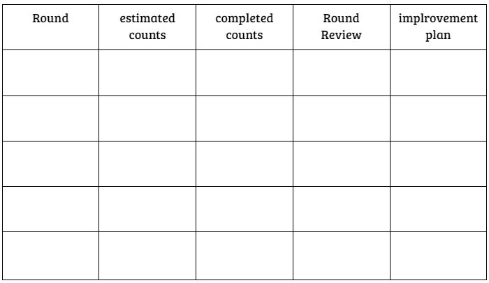

# 第一届 Scrum 游戏设计回顾

> 原文：<https://blog.devgenius.io/the-first-scrum-game-design-retrospective-f1fc627516b8?source=collection_archive---------13----------------------->

# 机会来的时候没有任何线索

自 2021 年 12 月以来，我一直在区块链的一家初创公司担任技术项目经理，负责敏捷转型，帮助他们简化工作流程。在进入目前的公司之前，我已经被告知，团队正遭受缓慢的进展以及旧的管理工件的困扰，这似乎与我曾经所在的地方相似。

一开始，我认为在接下来的项目中训练成员遵守 Scrum 原则就足够了。令我惊讶的是，我的经理让我为团队设计一个活动，让他们尽快熟悉 Scrum 框架。

嗯，我以前从来没有做过这样的任务，因为我总是只做一个关于 Scrum 在工作场景中如何工作的口头演示，然后直接开始一个新项目。过去，我认为直接推动团队体验 Scrum events 的力量而不需要进一步的活动是很直接的，因为这些活动被设计得足够简单，以至于成员可能会将其视为一种娱乐游戏，而不是真实环境中会发生的事情。

从一个不同的角度来思考，对我来说，这似乎是一个很好的机会，来挑战如何在一个简单的活动中引发人们对现代敏捷框架的兴趣。我接受了任务；开始头脑风暴。

# 一场球赛

如果我们不包含额外的 2 小时口头陈述，我只有 1 小时来领导培训活动。理论上，Scrum 本身是一个**经验**过程，因此只有那些参与框架的人才能感觉到它在旅程中带来了什么。因此，让我们的成员在 1 小时内体验 Scrum 的力量是很有挑战性的。

我曾经调查过几个开发 Scrum 活动来模仿的在线例子，比如纸牌游戏、棋盘游戏甚至硬币游戏。不幸的是，我只有 1 周的训练准备时间，所以我不能设计一个复杂的游戏来打乱我的思路，更不用说一个看起来没有挑战性的太简单的游戏了。最重要的是，我必须让团队在每个冲刺阶段实现团队建设的特定目标。

最后，我决定设计一个球类游戏，因为它既不会太容易玩，也不会太复杂操作。我把我们的成员分成两组，他们要做的是**尽可能多的在他们中间扔球**。

*   目标:对每一组来说，试着在他们的组里尽可能多地扔一个球。获得最多总数的人赢得比赛。

> **获得最多总点数的小组赢得游戏**

*   **规则**

**【1】**当球扔给另一个人时，总次数加 1。
**【2】**禁止向你左边/右边的人扔球。如果发生这种情况，总计数保持不变，并从原来的人重新开始。
**【3】**禁止丢球。如果发生这种情况，总计数保持不变，并从原来的人重新开始。
**【4】**球应该有一个滞空时间。也就是说，人们不应该用手传球。
**【5】**每回合 2 分钟；每轮结束时报告总计数。
**【6】**花 5 分钟思考需要改进的地方和下一步的计划。

# 我对这两组的观察

嗯，我为每组选择了两个弹力球来玩，以增加难度。在这个游戏中，我希望他们在重复的循环中感受到 Scrum 框架的 3 个支柱，并逐步完善他们的投球策略。

在第一轮中，我看到他们都不确定会投出多少个球，这似乎类似于我们通常没有足够的信息来估计我们应该在开始时承担多少任务。谈到这一点，我总是说:**随便拿一些项目，随着你从过程中学到的越来越多，对其进行调整**。

随着每一轮比赛的进行，我看到他们确实开始改进他们的集体投球策略。例如，缩短他们彼此之间的距离，改变投球的方式，甚至在他们周围移动桌子，以使游戏进行得更舒适。

当所有轮次结束时，他们被要求在同一块白板上画出估计计数和完成计数的趋势。

有 3 个有趣的发现值得一提:

1.  在第一轮中，每组的估计计数和完成计数之间有很大差距。
2.  随着时间的推移，每组在将行动计划付诸实践后，都能够提供更高/近似的球数。
3.  两组人都开始调查他们所处环境中影响他们表现的因素。

在这个活动中，我试图让团队在一个较小的场景下体验 Scrum events 的力量，这个场景相对容易操作。然而，现实世界不会是这样的，会更加复杂。我做了一些比喻来描述他们在比赛中遇到的各种阶段。

# 蔻驰杂音

对我来说，设计一个 Scrum 游戏让我们的团队享受运行 Scrum 事件的过程是一次宝贵的经历。当然，真实的情况不会如此顺利和有趣。在软件开发中，总是有许多意想不到的因素影响他们消除消耗。

在软件工程中，我们致力于寻找“高内聚、松耦合”的软件，Scrum 团队也是如此。对于每个 sprint，Scrum 框架提供了 5 个事件来建立一个跨职能团队。所有成员都为同一个目标奋斗；形成一个紧密合作的团队，而不是一个简单的团队。

—

如果你认可我与你分享的价值，请做如下:
1。**鼓掌**文章
2。**订阅**我最新内容
3。**在其他平台关注**我了解更多信息
-IG:[@ ur _ Agile _ coach](https://www.instagram.com/ur_agile_coach/)
-播客(中文):[敏捷火箭](https://player.soundon.fm/p/7f7dc3df-d738-405c-8cf9-02157a92ec61)
- Youtube: [你的敏捷蔻驰](https://www.youtube.com/channel/UCzD0wQmD1n4MuTKk-JocACA)
- LinkedIn: [吴宗祥](https://www.linkedin.com/in/tsung-hsiang-wu-8542409b/)

如果您需要咨询或其他形式的合作，请发送邮件至:【urscrummaster@gmail.com】