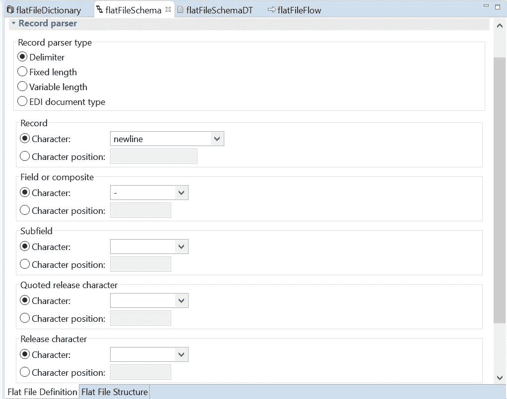

# 带演示的 webMethods 中的平面文件。

> 原文：<https://blog.devgenius.io/the-flat-file-in-webmethods-with-demo-97979ea0535e?source=collection_archive---------11----------------------->

# webMethods 中的平面文件是什么？

平面文件模式是包含解析或创建平面文件的指令的蓝图。该模式作为 webMethods Integration Server 中的名称空间元素存在。这个蓝图详细描述了文档的结构，包括分隔符、记录和重复的记录结构。平面文件的一个例子是姓名-电子邮件-雇员 ID 和电话号码列表。这个手写在纸上的列表是一个平面文件数据库。

我们可以在 webMethods 中使用两种类型的平面文件:
1 .没有记录标识符。
2。带有记录标识符。

**1。没有记录标识符**

根据记录解析方法，有多少种不同类型的平面文件？

根据记录解析方法的类型，平面文件可以大致分为三种不同的类型，这三种类型是:
-分隔平面文件
-固定长度平面文件
-可变长度平面文件

同样，基于字段提取器的类型，平面文件可以分为两种不同的类型，它们是:
1-固定长度
2-第 n 个字段
在固定长度提取器类型中，每个字段由其起始索引和结束索引定义，在这种情况下，字段的长度对于每个记录都是恒定的。

在第 n 个字段提取器中，按照字段的位置提取字段，如 0，1，2 等..位置从 0 开始。这是平面文件最广泛使用的提取器类型，因为它不像固定长度提取器那样限制字段的大小。

带分隔符的平面文件:-在这类平面文件中，记录由某种分隔符分隔，如换行符、管道符(|)、制表符等。场提取器可以是两个即固定长度或第 n 个场提取器中的任何一个。

# 平面文件有什么用途？

平面文件由一个数据表组成。它允许用户指定数据属性，比如一个表接一个表的列和数据类型，并将这些属性与应用程序分开存储。这种类型的文件通常用于在数据仓库项目中导入数据。

# webMethods 如何处理大型平面文件？

现在我们将看看如何在平面文件的情况下处理大型文件。我们可以使用 webMethods FilePolling Port，pub。文件:获取文件，或使用 FTP(即使用这个服务发布。客户端:ftp)来获取文件，这取决于文件是在本地系统上还是在远程 FTP 系统上。

# 什么是平面模式？

平面文件模式是描述由集成设备处理的平面文件数据的格式和结构的元数据。创建平面文件模式时，还会生成相应的基于内部 XML 模式的元数据表示。

# 什么是文件模式？

XML 模式定义了 XML 文件可能包含的元素。它为 XML 数据提供了特定的结构，这在多个系统之间共享 XML 文件时非常重要。定义 XML 模式可以确保 XML 文档或提要不包含可能导致解析错误的未知值。

# 如何在 webMethods 中使用平面文件模式？

平面文件字典 **(FF 字典)**:平面文件字典是作为集成服务器中的名称空间元素创建的，包含记录、组合和字段的定义。当您更改在多个平面文件模式中引用的平面文件字典中的定义时，元素定义会在所有平面文件模式中自动更新。

平面文件模式 **(FF 模式)**:为了使用平面文件进行通信，我们必须创建一个包含特定平面文件的结构信息的平面文件模式，包括如何识别记录和将这些记录分成字段。

当创建 **FF 模式**时，选择分隔符(大多数情况下我们只使用分隔符)，并根据文本文档给出字段:
- **记录:**记录由“；”分隔类型'**；**'否则如果你不给任何记录结尾那么就简单地给一个新行。
- **字段:**字段以'，'
- **子字段:**给出为':'
- **引用的释放字符**:引用的释放字符用于保留平面文件中提到的平面文件的部分，引用的释放字符中包含的任何分隔符都不计算在内。

FF 模式中的平面文件定义— SAG designer 10.7

# 处理平面文件—创建一个演示—