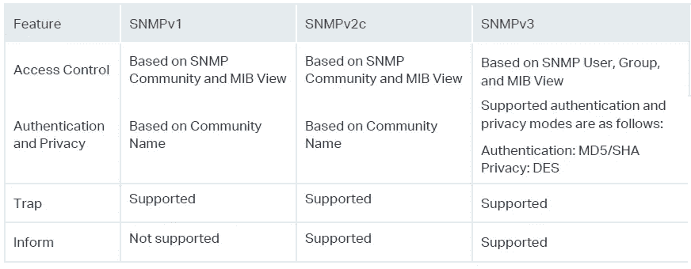
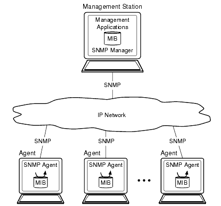
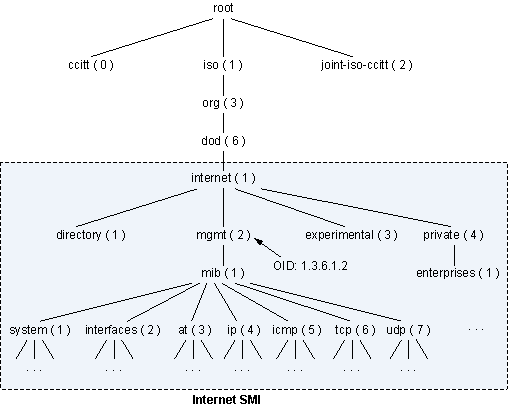
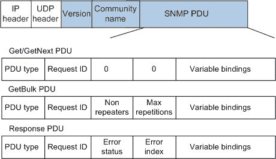
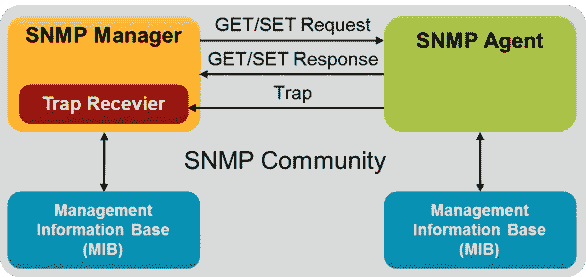
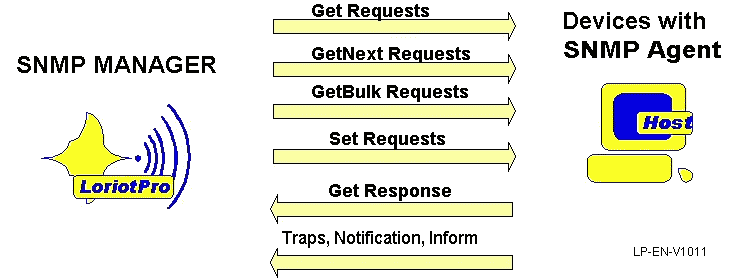

# 系统设计基础知识(17)——简单网络管理协议(SNMP)

> 原文：<https://blog.devgenius.io/the-fundamental-knowledge-of-system-design-17-simple-network-management-protocol-snmp-4f145bae37f3?source=collection_archive---------5----------------------->

照片由[乔丹·哈里森](https://unsplash.com/@jordanharrison?utm_source=medium&utm_medium=referral)在 [Unsplash](https://unsplash.com?utm_source=medium&utm_medium=referral) 上拍摄

## 它是由 [**互联网工程任务组**](https://www.ietf.org/) **定义的一套网络管理协议。**该协议基于 [**简单网关监控协议**](https://en.wikipedia.org/wiki/Simple_Gateway_Monitoring_Protocol) (SGMP)，是专门为管理 IP 网络中的网络节点(服务器、工作站、路由器、交换机、集线器等)而设计的标准协议。

> 如果你觉得我为你贡献了价值，请支持我！

过去 5 个月，我越来越难达到我想要的收入。

它是系统设计基础知识的第十七个系列。可以看看我之前的文章。

 [## 系统设计基础知识——(1)

### 今天我就来分享一下系统设计的基础知识。

medium.com](https://medium.com/interviewnoodle/the-fundamental-knowledge-of-system-design-1-84a2cc8a3a8d)  [## 系统设计基础知识——(2)

### 喜欢这篇文章请鼓掌分享。

medium.com](https://medium.com/interviewnoodle/the-fundamental-knowledge-of-system-design-2-250dbadf1e1)  [## 系统设计基础知识——(3)

### 服务器是当今计算世界的核心。服务器性能取决于吞吐量和延迟。一般来说…

medium.com](https://medium.com/interviewnoodle/the-fundamental-knowledge-of-system-design-3-26810ae3126d)  [## 系统设计基础知识——(4)

### 系统可用性=可用性=正常运行时间÷(正常运行时间+停机时间)

medium.com](https://medium.com/interviewnoodle/the-fundamental-knowledge-of-system-design-4-a1443657723e)  [## 系统设计基础知识——(5)

### 高速缓存是一个中间层，用于连接高速设备和低速设备，以…

medium.com](https://medium.com/interviewnoodle/the-fundamental-knowledge-of-system-design-5-b69bd2942917)  [## 系统设计基础知识——(6)

### 缓冲区的主要目的是执行流量整形，将大量小规模 I/o 组织成一个流量整形器。

medium.com](https://medium.com/interviewnoodle/the-fundamental-knowledge-of-system-design-6-ff53c28d917)  [## 系统设计基础知识——(7)

### 代理——网络代理，是一种特殊的网络服务，它允许网络终端，尤其是客户端应用程序…

medium.com](https://medium.com/interviewnoodle/the-fundamental-knowledge-of-system-design-7-c98f76de5e8f)  [## 系统设计基础知识(八)——了解 IP 地址和端口

### IP 地址—网络端口中的系统地址—系统 IP 地址+…

medium.com](https://medium.com/interviewnoodle/the-fundamental-knowledge-of-system-design-8-understanding-ip-address-ports-75e098ebe92a)  [## 系统设计基础知识——(9)——负载均衡器

### 负载平衡—将一组任务分配给一组资源的过程。有两种主要方法…

medium.com](https://medium.com/thedevproject/the-fundamental-knowledge-of-system-design-9-load-balancer-c55ff4feae5)  [## 系统设计基础知识(十)——一致性散列

### 它是一种分布式哈希方案，独立于分布式环境中的服务器或对象的数量运行

medium.com](https://medium.com/interviewnoodle/the-fundamental-knowledge-of-system-design-10-consistent-hashing-18fcefbfd749)  [## 系统设计基础知识(11)——域名系统(DNS)

### 这是互联网的核心服务。作为一个分布式数据库，可以将域名和 IP 地址映射到每个…

经验堆栈。总裁](https://experiencestack.co/the-fundamental-knowledge-of-system-design-11-domain-name-system-dns-8f33341e387f)  [## 系统设计基础知识(十二)——web socket 协议

### Websocket 使浏览器具有实时双向通信能力。它可以打开一个交互式的…

medium.com](https://medium.com/geekculture/the-fundamental-knowledge-of-system-design-12-websocket-protocol-af105e758f48)  [## 系统设计基础知识(13)——Raft 一致性算法

### 在容错和性能上和 Paxos 相当。

medium.com](https://medium.com/geekculture/the-fundamental-knowledge-of-system-design-13-the-raft-consensus-algorithm-2f42ef7a88e7)  [## 系统设计基础知识(14)——内容分发网络

### 它是由代理服务器及其数据中心组成的地理上分布的网络，以提供高可用性和…

medium.com](https://medium.com/thedevproject/the-fundamental-knowledge-of-system-design-14-content-delivery-network-cdn-d5d16af9153)  [## 系统设计基础知识(15)——文件传输协议

### 它是一个标准的 TCP/IP 协议套件，用于将计算机文件从服务器传输到客户端。FTP…

medium.com](https://medium.com/thedevproject/the-fundamental-knowledge-of-system-design-15-file-transfer-protocol-994a67a49b7e)  [## 系统设计基础知识(十六)——地址解析协议(ARP)

### 它是一种通信协议，用于发现链路层地址，如与…

medium.com](https://medium.com/interviewnoodle/the-fundamental-knowledge-of-system-design-16-address-resolution-protocol-arp-3ec4164fd3e2) 

SNMP 用于管理网络设备。有各种类型的网络设备。不同的网络设备制造商提供不同的管理接口，如命令行接口，这使得网络管理更加复杂。SNMP 提供了统一的接口，从而解决了不同类型、不同厂商的网络设备之间的管理。因此，网络管理员通过工作站远程管理和监控计算机、路由器和其它网络设备。例如，监控网络状态、修改网络设备配置和接收网络事件警告。

SNMP 协议分为 3 个版本。

**版本**

*   **版本 1:** 最小网络管理功能。它基于社区名称认证，安全性较低。
*   **第二版**:第一版，在性能、安全性、保密性和经理间沟通方面进行了大量改进。它使用社区名称认证。引入 GetBulk 和 Inform 操作是为了支持更多的标准错误代码信息和更多的数据类型。
*   **版本 3** :版本 2，具有认证和密文传输功能，提高协议安全性。协议号为 RFC3411-RFC3418 (STD0062)。它基于用户安全模块(USM)和基于视图的访问控制模型(VACM)提供身份验证和加密。

**比较**

图片来源: [**TP-link**](https://www.tp-link.com/us/configuration-guides/configuring_snmp_rmon/?configurationId=18105#_idTextAnchor005)

**结构**

它由 4 部分组成

图片来源: [**甲骨文**](https://docs.oracle.com/cd/E13203_01/tuxedo/tux91/snmpmref/1tmib.htm)

*   **网络管理工作站** —管理控制台或装有管理服务器软件的计算机，用于管理和监控网络上的设备。它可以向设备上的代理发送请求，以查询或修改一个或多个特定的参数值。它还可以接收设备上的代理主动发送的 SNMP 陷阱，以了解被管理设备的当前状态。
*   **网络节点(代理)** —网络上的被管理设备。它维护被管理设备的状态信息。代理收到管理器的请求后，通过管理信息库表完成相应的指令，并将操作结果回复给管理器。当设备出现故障或发生其他事件时，设备会主动向管理器发送 SNMP 陷阱，并向管理器报告设备状态的变化。
*   **管理对象** —每个设备可以包含多个被管理对象。它可以是设备中的一个硬件，也可以是硬件或软件上配置的一组参数。
*   **管理信息库(MIB)** —它是管理器和代理之间的接口。通过这个接口，管理人员可以查询/设置被管理设备维护的变量。此外，它还是一个数据库，用于指定受管理设备维护的变量。它定义了数据库中被管理设备的一系列属性(对象的名称、对象的状态、对象的访问权限和对象的数据类型。MIB 使用树结构来存储数据。

图片来源: [**华为**](https://support.huawei.com/enterprise/en/doc/EDOC1100086963)

*   **社区** —同一管理框架下的网络管理工作站和所有网络节点的集合

**数据格式**

图片来源: [**华为**](https://support.huawei.com/enterprise/en/doc/EDOC1100086963)

*   **版本** : SNMP 版本
*   **社区**:社区名称，用于代理和 NMS 之间的认证。有两种类型的社区名称:可读和可写的。如果执行 Get 和 GetNext 操作，则使用可读的社区名称进行身份验证；如果执行 Set 操作，则使用可写团体名称进行身份验证。
*   **请求 ID** :匹配请求和响应。SNMP 为每个请求分配一个全局唯一的 ID
*   **错误状态**:处理请求时出现的状态，包括 noError、noSuchName、badValue、readOnly、tooBig 等。
*   **错误索引:**当异常发生时，在变量绑定列表中提供导致异常的变量信息
*   **变量绑定:**变量绑定列表

**机制**

图片来源: [**ARMKEIL 网络组件**](https://www.keil.com/pack/doc/mw6/Network/html/using_snmp_agent.html)

工作流程可分为 4 个步骤

1.  当网络管理员在被管理设备中查询被管理对象的相关参数时，通过网络管理工作站中的 MIB 找到相关对象。
2.  网络管理工作站向 SNMP 代理请求 MIB 中定义的对象的相关参数
3.  SNMP 代理在自己的 MIB 库中查找
4.  它将找到的与对象相关的值返回给网络管理工作站

**通信方式**

SNMP 是一种客户机/服务器模型。

*   客户端=网络管理系统(NMS)
*   服务器= SNMP 代理
*   NMS 向 SNMP 代理请求 MIB 定义的信息的参数值
*   SNMP 代理接收并返回关于 MIB 定义的信息的各种查询

**查询操作**

1.  **获取** —从 SNMP 代理获取参数值
2.  **GetNext** —从 SNMP 代理获取一个或多个参数的下一个参数值
3.  **GetBulk** —连续执行多个 GetNext 操作

**常见操作类型**

图片来源: [**Loriotpro**](https://www.loriotpro.com/Products/On-line_Documentation_V5/LoriotProDoc_EN/C3-Introduction_to_Network_Supervision/C3-C3_SNMP_Protocol_EN.htm)

*   get-request — NMS 从 SNMP 代理中提取一个或多个参数值
*   get-response-返回一个或多个参数的值
*   get-next-request-检索下一个参数值
*   set-request —在 SNMP 代理上设置 MIB 的相关参数值
*   陷阱—主动向 NMS 发送消息

**改进版(第三版)**

*   **USM** —提供认证和数据加密服务。NMS 和代理必须共享同一个密钥。
*   **认证** —两种基于哈希的消息认证码，HMACs(HMAC-MD5–96 和 HMAC-SHA-96)。HMAC-MD5–96 的哈希函数使用 MD5 和 128 位 authKey 作为输入。HMAC-SHA-96 的散列函数使用 SHA-1 和 160 位 authKey 作为输入
*   **加密** —通过对称密钥系统(DES —用 56 位密钥加密 64 位明文块，3DES —用三个 56 位 DES 密钥或 168 位密钥加密明文，AES —用 AES 算法加密明文，密钥长度为 128 位、192 位或 256 位)。
*   **VACM** —用户必须首先配置一个视图并指定权限。用户可以加载该视图来限制读写操作。

你可以阅读我的文章来更好地理解。

 [## Cookies、会话、令牌

### HTTP 是一种无状态协议。为了知道哪个设备发起请求，cookie、会话和令牌是 2…

medium.com](https://medium.com/geekculture/cookies-session-token-d9f068cccdc6)  [## 计算机网络—加密和解密算法

### 数据签名和加密是前端和后端开发中经常使用的技术。的…

medium.com](https://medium.com/thedevproject/computer-network-encryption-decryption-algorithm-5281f03e512c)  [## 系统设计基础知识(十)——一致性散列

### 它是一种分布式哈希方案，独立于分布式环境中的服务器或对象的数量运行

medium.com](https://medium.com/interviewnoodle/the-fundamental-knowledge-of-system-design-10-consistent-hashing-18fcefbfd749)  [## 系统设计基础知识——(1)

### 今天我就来分享一下系统设计的基础知识。

medium.com](https://medium.com/interviewnoodle/the-fundamental-knowledge-of-system-design-1-84a2cc8a3a8d)  [## Cookie、会话和令牌之间的区别

### Cookie —维护服务器和客户端会话之间的活动状态—记录服务器和客户端会话…

blog.devgenius.io](/the-difference-between-cookie-session-and-tokens-79b62df6f860)  [## JSON Web 令牌

### 它是目前最流行的跨域认证解决方案。

jinlow.medium.com](https://jinlow.medium.com/json-web-token-9bd75630b06a)  [## 麻省理工学院开发的安全认证系统

### “Kerberos”一词来源于古希腊神话中的“Cerberus”一词，代表三头犬…

jinlow.medium.com](https://jinlow.medium.com/kerberos-efbbe680624d)  [## 公钥基础设施(PKI)

### 它是一组角色、策略、硬件、软件和程序，有助于安全的电子传输…

blog.devgenius.io](/public-key-infrastructure-pki-d0d513ba8819)  [## OAuth2.0

### 开放式认证

medium.com](https://medium.com/geekculture/oauth2-0-b763f865995)  [## 安全声明标记语言(SAML)

### 它是一个开放的标准，用于在各方之间交换认证和授权数据，特别是在…

medium.com](https://medium.com/geekculture/security-assertion-markup-language-saml-b653aa06e2dd)  [## 轻型目录访问协议(LDAP)

### 它是一个开放的行业标准应用协议，用于访问和维护分布式目录信息…

经验堆栈。总裁](https://experiencestack.co/lightweight-directory-access-protocol-ldap-33fcc527e6ee)  [## OpenID 连接

### OIDC=(身份验证)+ OAuth 2.0

medium.com](https://medium.com/thedevproject/openid-connect-95b192acf7d4)  [## 基于角色的访问控制(RBAC)模型

### 角色-权限、用户-角色和角色-角色关系

medium.com](https://medium.com/geekculture/role-based-access-control-rbac-model-7d8e7b7350d2) 

**参考文献**

 [## snmp 代理

### 简单网络管理协议(SNMP)主要用于网络管理系统，以监控网络连接的…

www.keil.com](https://www.keil.com/pack/doc/mw6/Network/html/using_snmp_agent.html)  [## 什么是 SNMP？-华为

### NMS 可以向 SNMP 代理发送 get 请求来获取数据，如图 1-3 所示。收到 get 请求后…

support.huawei.com](https://support.huawei.com/enterprise/en/doc/EDOC1100086963)  [## 什么是 SNMP v3 MIB，消息格式，架构，引擎 ID，安全服务？

### SNMP v3 MIB: * SNMP 代理将受管系统上的管理数据作为变量公开。*该协议还允许…

www.ques10.com](https://www.ques10.com/p/19573/what-is-snmp-v3-mib-message-format-architecture-en/)  [## 简单网络管理协议-维基百科

### 简单网络管理协议(SNMP)是收集和组织信息的互联网标准协议

en.wikipedia.org](https://en.wikipedia.org/wiki/Simple_Network_Management_Protocol)  [## 什么是 SNMP，它是如何工作的？

### 我们邀请了像您这样的网络专业人士来分享帮助他们生存和成功的技巧和工具。本指南…

www.fortra.com](https://www.fortra.com/resources/articles/snmp-basics-what-it-and-how-it-works)  [## 网络基础:什么是 SNMP，它是如何工作的？

### 简单网络管理协议(SNMP)是网络上不同设备之间共享信息的一种方式

www.auvik.com](https://www.auvik.com/franklyit/blog/network-basics-what-is-snmp/)  [## ManageEngine OpManager 的网络监控软件

### 简单网络管理协议(SNMP)是由互联网架构委员会定义的应用层协议

www.manageengine.com](https://www.manageengine.com/network-monitoring/what-is-snmp.html)  [## SNMP 端口和协议-是什么？

### 简单网络管理协议(SNMP)是一种网络协议，用于管理和监控…

www.thousandeyes.com](https://www.thousandeyes.com/learning/techtorials/snmp-simple-network-management-protocol)  [## SNMP 监控:它是什么和它是如何工作的

### 简单网络管理协议(SNMP)是 IP 网络固有的网络协议，与大多数…

www.datadoghq.com](https://www.datadoghq.com/knowledge-center/network-monitoring/snmp-monitoring/) 

如果你发现我的任何文章有帮助或有用，那么请考虑给我一杯咖啡，帮助支持我的工作或给我赞助😊，通过使用

[帕特里翁 ](https://www.patreon.com/jinlowmedium)

[**Ko-fi.com**](https://ko-fi.com/jinlowmedium)

[buymeacoffee](https://www.buymeacoffee.com/jinlowmedium)

*最后但同样重要的一点是，如果你还不是灵媒会员，并打算成为灵媒会员，我恳请你使用以下链接。我将收取你的一部分会员费，不增加你的额外费用。*

 [## 用我的推荐链接金加入媒体

### 阅读金(以及其他成千上万的作家)的每一篇小说。你的会费直接支持金和…

jinlow.medium.com](https://jinlow.medium.com/membership)