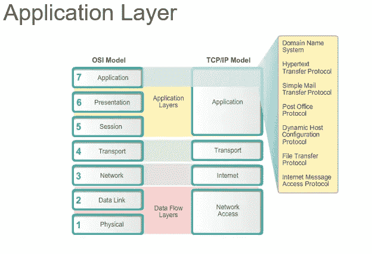
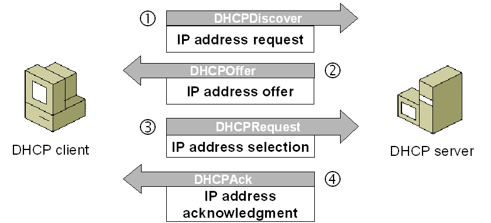
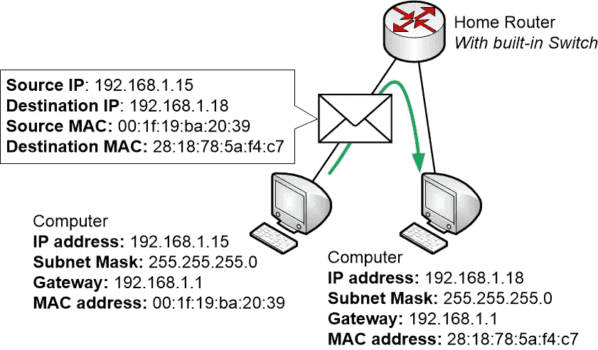
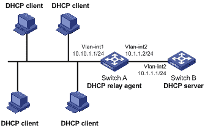
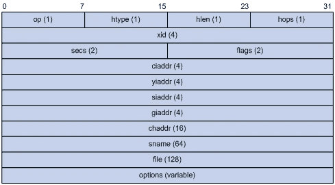
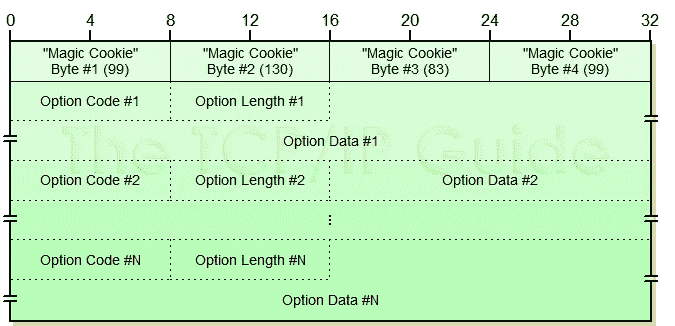

# 系统设计基础知识(十九)——动态主机配置协议

> 原文：<https://blog.devgenius.io/the-fundamental-knowledge-of-system-design-19-dynamic-host-configuration-protocol-6ef9d7789be5?source=collection_archive---------2----------------------->

照片由[马尔特·赫尔姆霍尔德](https://unsplash.com/@maltehelmhold?utm_source=medium&utm_medium=referral)在 [Unsplash](https://unsplash.com?utm_source=medium&utm_medium=referral) 上拍摄

## 它是在互联网协议(IP)网络上使用的一种网络管理协议，用于使用客户端-服务器体系结构向连接到网络的设备自动分配 IP 地址和其他通信参数。

> [如果你觉得我为你贡献了价值，请支持我！](https://ko-fi.com/jinlowmedium)

如果你觉得我的文章对你有价值，请成为我的推荐会员来支持我。它能为我带来一些收入。

它是系统设计基础知识的第十九个系列。可以看看我之前的文章。

 [## 系统设计基础知识——(1)

### 今天我就来分享一下系统设计的基础知识。

medium.com](https://medium.com/interviewnoodle/the-fundamental-knowledge-of-system-design-1-84a2cc8a3a8d)  [## 系统设计基础知识——(2)

### 喜欢这篇文章请鼓掌分享。

medium.com](https://medium.com/interviewnoodle/the-fundamental-knowledge-of-system-design-2-250dbadf1e1)  [## 系统设计基础知识——(3)

### 服务器是当今计算世界的核心。服务器性能取决于吞吐量和延迟。一般来说…

medium.com](https://medium.com/interviewnoodle/the-fundamental-knowledge-of-system-design-3-26810ae3126d)  [## 系统设计基础知识——(4)

### 系统可用性=可用性=正常运行时间÷(正常运行时间+停机时间)

medium.com](https://medium.com/interviewnoodle/the-fundamental-knowledge-of-system-design-4-a1443657723e)  [## 系统设计基础知识——(5)

### 高速缓存是一个中间层，用于连接高速设备和低速设备，以…

medium.com](https://medium.com/interviewnoodle/the-fundamental-knowledge-of-system-design-5-b69bd2942917)  [## 系统设计基础知识——(6)

### 缓冲区的主要目的是执行流量整形，将大量小规模 I/o 组织成一个流量整形器。

medium.com](https://medium.com/interviewnoodle/the-fundamental-knowledge-of-system-design-6-ff53c28d917)  [## 系统设计基础知识——(7)

### 代理——网络代理，是一种特殊的网络服务，它允许网络终端，尤其是客户端应用程序…

medium.com](https://medium.com/interviewnoodle/the-fundamental-knowledge-of-system-design-7-c98f76de5e8f)  [## 系统设计基础知识(八)——了解 IP 地址和端口

### IP 地址—网络端口中的系统地址—系统 IP 地址+…

medium.com](https://medium.com/interviewnoodle/the-fundamental-knowledge-of-system-design-8-understanding-ip-address-ports-75e098ebe92a)  [## 系统设计基础知识——(9)——负载均衡器

### 负载平衡—将一组任务分配给一组资源的过程。有两种主要方法…

medium.com](https://medium.com/thedevproject/the-fundamental-knowledge-of-system-design-9-load-balancer-c55ff4feae5)  [## 系统设计基础知识(十)——一致性散列

### 它是一种分布式哈希方案，独立于分布式环境中的服务器或对象的数量运行

medium.com](https://medium.com/interviewnoodle/the-fundamental-knowledge-of-system-design-10-consistent-hashing-18fcefbfd749)  [## 系统设计基础知识(11)——域名系统(DNS)

### 这是互联网的核心服务。作为一个分布式数据库，可以将域名和 IP 地址映射到每个…

经验堆栈。总裁](https://experiencestack.co/the-fundamental-knowledge-of-system-design-11-domain-name-system-dns-8f33341e387f)  [## 系统设计基础知识(十二)——web socket 协议

### Websocket 使浏览器具有实时双向通信能力。它可以打开一个交互式的…

medium.com](https://medium.com/geekculture/the-fundamental-knowledge-of-system-design-12-websocket-protocol-af105e758f48)  [## 系统设计基础知识(13)——Raft 一致性算法

### 在容错和性能上和 Paxos 相当。

medium.com](https://medium.com/geekculture/the-fundamental-knowledge-of-system-design-13-the-raft-consensus-algorithm-2f42ef7a88e7)  [## 系统设计基础知识(14)——内容分发网络

### 它是由代理服务器及其数据中心组成的地理上分布的网络，以提供高可用性和…

medium.com](https://medium.com/thedevproject/the-fundamental-knowledge-of-system-design-14-content-delivery-network-cdn-d5d16af9153)  [## 系统设计基础知识(15)——文件传输协议

### 它是一个标准的 TCP/IP 协议套件，用于将计算机文件从服务器传输到客户端。FTP…

medium.com](https://medium.com/thedevproject/the-fundamental-knowledge-of-system-design-15-file-transfer-protocol-994a67a49b7e)  [## 系统设计基础知识(十六)——地址解析协议(ARP)

### 它是一种通信协议，用于发现链路层地址，如与…

medium.com](https://medium.com/interviewnoodle/the-fundamental-knowledge-of-system-design-16-address-resolution-protocol-arp-3ec4164fd3e2)  [## 系统设计基础知识(17)——简单网络管理协议(SNMP)

### 它是由互联网工程任务组定义的一组网络管理协议。该协议基于…

blog.devgenius.io](/the-fundamental-knowledge-of-system-design-17-simple-network-management-protocol-snmp-4f145bae37f3)  [## 系统设计基础知识(18)——快速 UDP 网络连接(QUIC)

### QUIC 是 Google 提出的基于 UDP 的传输层网络协议。目前，常见的实施包括…

jinlow.medium.com](https://jinlow.medium.com/the-fundamental-knowledge-of-system-design-18-quick-udp-internet-connection-quic-5444bb2349ce) 

**概述**

动态主机配置协议(DHCP)是在 UDP/IP 网络上使用的应用层网络管理协议，通过该协议，DHCP 服务器将每个服务器的 IP 地址和网络配置参数设置动态分配给子网中的每个设备。使用 UDP 协议有两个主要目的:自动将 IP 地址分配给内部网络或网络服务提供商或内部网络管理员，作为通过客户端/服务器模式集中管理所有计算机的一种手段，这在 [**RFC 2131**](https://www.ietf.org/rfc/rfc2131.txt) 中有详细描述。DHCP 有 2 个端口，其中 UDP67(服务器使用的端口)和 UDP68(客户端使用的端口)是正常的 DHCP 服务端口。端口 546 用于 DHCPv6 客户端，端口 547 用于 DHCPv6 服务器。端口 546 和端口 547 用于 DHCP 故障转移，该故障转移用于“双机热备份”。

图片来源: [**网络论坛**](https://networkingforbeginners.weebly.com/blog/the-application-layer-in-detail)

**优点**

1.  IP 地址可以由 DHCP 集中管理
2.  IP 地址可以重复使用，以最大限度地减少 IP 地址需求的总数
3.  DHCP 服务器上的 IP 地址可以很容易地重新配置，而不必单独重新配置 DHCP 客户端上的 IP 地址
4.  新的 DHCP 客户端可以很容易地添加到网络中
5.  网络管理员可以从中央服务器配置网络，例如验证网络参数的正确性，静态和动态分配 IP，以及限制特定服务器使用的 IP 地址

**缺点**

1.  [**IP 地址冲突**](https://www.linksys.com/support-article?articleNum=132159) **—** 当 IP 地址被分配给不同的设备时，就会发生这种情况

DHCP 由互联网工程任务组(IETF)创建，并于 1993 年成为基于 [**引导协议**](https://en.wikipedia.org/wiki/Bootstrap_Protocol) 的标准。

**操作**

如果 DHCP 客户端配置网卡的 IP 地址来动态获取 IP 地址，它会发送一个 DHCP 请求来查找 DHCP 服务器。在这个过程中，DHCP 客户端与 DHCP 服务器进行通信，这个过程总共产生 4 个数据包。

图片来源: [**Tcpipguide**](http://www.tcpipguide.com/free/t_DHCPGeneralOperationandClientFiniteStateMachine.htm)

**工作流程:**

图片来源:[**Computernetworkingnotes**](https://www.computernetworkingnotes.com/ccna-study-guide/how-dhcp-works-explained-with-examples.html)

1.  **DHCP 发现**

*   当客户端连接到启用 DHCP 的网络时，它会发出广播。这种广播称为 DHCP 发现。也就是说，DHCP 客户端发起 **DHCP discover** 包来寻找 DHCP 服务器。
*   源 MAC 是客户端自己的 MAC 地址，目的 MAC 是广播(FFFF.FFFF.FFFF)。如果没有 IP 地址，源 IP 地址是 0.0.0.0，目的 IP 地址是 255.255.255.255 第 3 层广播。

图片来源: [**HomeNet**](https://www.homenethowto.com/switching/mac-addresses/)

**2。DHCP 报价**

*   DHCP 服务器收到来自客户端的 DHCP discover 数据包后，将取出其自己的 IP 地址池中未分配的地址和支持参数，如子网掩码、DNS、网关、域名和租用期限。
*   租用期限决定了客户端可以使用从服务器获得的 IP 信息多长时间。
*   它向客户端发送一个 DHCP offer 数据包。
*   源 MAC 是服务器自己的 MAC 地址，目的 MAC 是广播(FFFF.FFFF.FFFF)。源 IP 地址是 DHCP 服务器的 IP 地址，目的 IP 地址是 255.255.255.255 第 3 层广播。
*   如果客户端没有获得 IP 地址，DHCP 服务器仍然无法找到客户端，因此它以广播来响应。

**3。DCHP 请求**

*   在客户端收到 DHCP Offers 之后，它将向服务器发送一个 DHCP 请求，告诉 DHCP 服务器信息确实已被接收和接受。
*   DHCP 服务器发起广播，通知其他可能的 DHCP 服务器它们不应该向客户端发布 IP 信息，因为客户端已经获得了必要的 IP 信息。因此，每个网络接口卡可以获得一个请求。

**4。DHCP 确认**

*   这是服务器和客户端之间信息交换的最后阶段。
*   服务器从客户端接收 DHCP 请求
*   客户端发送回一个 DHCP 确认，确认该 IP 地址可以分配给客户端。
*   DHCP 确认包括租用期限以及客户端可能请求的任何配置信息。
*   因此，客户端可以相应地配置其 IP 信息。

**DHCP 中继**

*   在简单网络中，同一局域网(LAN)中的网络设备使用 DHCP 服务器。
*   但是，在一些复杂的情况下，DHCP 服务器可能为多个子网提供服务。因此，DHCP 服务器和 DHCP 客户端不在同一个网络中。
*   在局域网中转发 DHCP 消息需要 DHCP 中继代理。通常，DHCP 中继代理不会在客户端和服务器之间转发所有 DHCP 消息，而是只转发那些广播消息。

图片来源: [**techhub**](https://techhub.hpe.com/eginfolib/networking/docs/switches/5120si/cg/5998-8491_l3-ip-svcs_cg/content/436042714.htm)

**DHCP 续租**

*   DHCP 的默认租期是 1 天。
*   当租期达到 50%时，DHCP 客户端会自动以单播方式向 DHCP 服务器发送 DHCP 请求消息，请求更新 IP 地址的租期。
*   如果租期达到 50%并且没有收到响应，则当租期达到 87.5%时，客户端将请求新的有效 IP 地址或续订 IP 地址的租期。
*   如果 DHCP 客户端收到了 **DHCP 确认**，则租用期被成功更新。
*   如果 DHCP 客户端收到了 **DHCP 否定确认(NAK)** ，DHCP 发现包将被重新发送以请求新的 IP 地址。
*   如果租约到期时没有收到来自服务器的响应，客户端将停止使用该 IP 地址，并重新发送 DHCP discover 包来请求新的 IP 地址。
*   如果客户端在租约到期前拒绝使用分配的 IP 地址，将触发客户端向服务器发送 DHCP 释放包，告知服务器释放该 IP 地址，并将其列为之前分配的 IP 地址。

**DHCP 报文格式**

图片鸣谢:[Techhub](https://techhub.hpe.com/eginfolib/networking/docs/switches/5120si/cg/5998-8491_l3-ip-svcs_cg/content/436042653.htm)

*   **运算(OP)** : 8 位。标识消息是请求(1)还是回复(2)
*   **硬件地址类型(HTYPE)** : 8 位。网络数据链路层的协议类型指定了硬件地址类型。以太网的类型是 1。
*   **硬件地址长度(HLEN)** : 8 位。硬件地址的长度(单位:八位字节)。以太网的长度是 6。
*   **跳数(HOPS)** : 8 位。DHCP 中继代理将每个 DHCP 请求中的跃点计数增加 1。消息发送方将该值设置为 0，然后每个 DHCP 请求增加一个值。
*   **交易标识(XID)** : 32 位。客户端选择一个随机数来标识消息。当服务器响应时，该字段被复制到响应消息中，以确保响应与请求相匹配。
*   **秒(SECS)** : 16 位。第一次尝试声明或回收地址所用的秒数。当多个客户端请求未完成时，繁忙的 DHCP 服务器可能会使用此功能来区分响应的优先级。
*   **标志(FLAGS)** : 16 位。只有第一位用作广播标志。如果设置了广播标志，则意味着客户端只能接收广播消息。其他位被保留并设置为 0。
*   **客户端 IP 地址(CIADDR)** : 32 位。请求者的 IP 地址(如果知道的话)。否则为 0。
*   **“您的”IP 地址(YIADDR)** : 32 位。该地址由 DHCP 服务器提供。
*   **服务器 IP 地址(SIADDR):** 32 位。在引导过程的下一步中，客户端应该使用服务器的地址。
*   **网关(中继)IP 地址(GIADDR)** : 32 位。由 DHCP 中继填充，当转发 DHCP 消息时，它将自己的地址填充到 GIADDR 中。
*   **客户端硬件地址(CHADDR)** : 128 位。它存储客户端的硬件地址。
*   **服务器名称(SNAME)** : 64 位。可选。当服务器发送 DHCP offer 或 DHCP ACK 消息时，它可以在 SNAME 中填写自己的名称。
*   **引导文件名(File):** 128 位。可选。客户端可以选择在 DHCP 发现消息中请求特定类型的引导文件。
*   **选项(VEND)** :可变。DHCP 选项格式如下所示。DHCP 选项包括 DHCP 发现(1)、DHCP 提供(2)等。

图片鸣谢:[tcpip guide](http://www.tcpipguide.com/free/t_DHCPOptionsOptionFormatandOptionOverloading-2.htm)

**参考文献**

 [## 动态主机配置协议-维基百科

### 动态主机配置协议(DHCP)是一种用于互联网协议(IP)的网络管理协议…

en.wikipedia.org](https://en.wikipedia.org/wiki/Dynamic_Host_Configuration_Protocol)  [## 用简洁的图表解释 DHCP 的转换状态。

### DHCP 是为网络上的设备分配 IP 地址的动态主机配置协议，一个设备可以有…

www.ques10.com](https://www.ques10.com/p/20664/explain-the-transition-states-of-dhcp-with-neat--1/)  [## 举例说明 DHCP 的工作原理

### 本教程通过一个例子详细解释了 DHCP 是如何工作的。了解 DHCP 客户端如何获取 IP 配置…

www.computernetworkingnotes.com](https://www.computernetworkingnotes.com/ccna-study-guide/how-dhcp-works-explained-with-examples.html)  [## DHCP |服务器沙箱

### 动态主机配置协议(DHCP)是互联网协议(IP)上使用的标准化网络协议…

kikobeats.github.io](https://kikobeats.github.io/server-sandbox/03.%20Services/DHCP/01.%20Introduction.html)  [## 什么是 DHCP(动态主机配置协议)？

### 动态主机配置协议(DHCP)是网络不可或缺的一部分，它控制设备接收哪些 IP 地址…

www.howtogeek.com](https://www.howtogeek.com/404891/what-is-dhcp-dynamic-host-configuration-protocol/)  [## TCP/IP 指南- DHCP 消息格式

### DHCP 消息格式当 DHCP 被创建时，它的开发人员有一个关于他们应该如何…

www.tcpipguide.com](http://www.tcpipguide.com/free/t_DHCPMessageFormat.htm)  [## 我的 CCIE 博客

### 编辑描述

ccie.lmd.in.ua](http://ccie.lmd.in.ua/tag/packet-format/) 

如果你发现我的任何文章有帮助或有用，那么请考虑给我一杯咖啡，帮助支持我的工作或给我赞助😊·通过使用和

[**Patreon**](https://www.patreon.com/jinlowmedium)

[**Ko-fi.com**](https://ko-fi.com/jinlowmedium)

[buymeacoffee](https://www.buymeacoffee.com/jinlowmedium)

最后但同样重要的是，如果你还不是灵媒会员，并打算成为灵媒会员，我恳请你使用下面的链接。我将收取你的一部分会员费，不增加你的额外费用。

 [## 用我的推荐链接金加入媒体

### 作为一个媒体会员，你的会员费的一部分会给你阅读的作家，你可以完全接触到每一个故事…

jinlow.medium.com](https://jinlow.medium.com/membership)