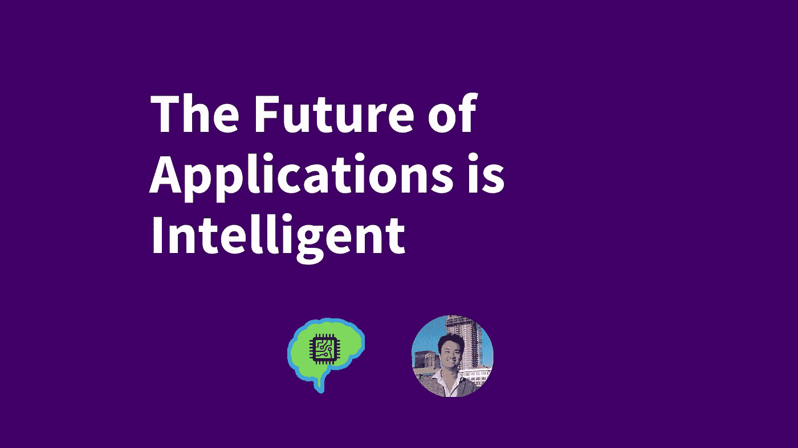

# 应用的未来是智能的

> 原文：<https://blog.devgenius.io/the-future-of-applications-is-intelligent-d1da5bd0c770?source=collection_archive---------12----------------------->

## 技术趋势

## mad Rona 2022 智能应用峰会的思考与评论

有兴趣了解更多关于人工智能的知识吗？参加我们一月份的[*AI 应用及 AI 基础设施大会*](https://ai-educators.org/2022/10/26/applications-of-ai-and-ai-infrastructure/) *！*

如果你问机器学习领域的人 2008 年最重要的部分是什么，他们会说是模型。到 21 世纪 20 年代初，从以模型为中心的 ML 到以数据为中心的 ML 的转变已经很明显了。垃圾输入=垃圾输出(GIGO)是一个众所周知的机器学习术语。将来，ML 将不再关注数据或模型架构。它将关注我们如何评估模型输出。

在这次会议上有很多令人惊讶的演讲，我了解了很多关于这个领域的知识，这些知识是我在创建[文本 API](https://www.thetextapi.com) 之前不知道的。听到所有在这个会议上发言的了不起的人给了我一个框架，让我知道 NLP 领域的前沿技术是什么。我听说过基础模型，但直到现在才意识到它们有多么强大。

在下面的部分，我将描述我从这次会议中学到的东西以及一些个人评论。

## 数据是驱动力

这是第一次会议的标题。这是亚马逊网络服务公司的马特·加曼和马德罗纳公司的马特·麦克欧文之间的一次聊天。这个演讲主要是关于 AWS 和 AWS 目前的产品是如何产生的。

智能应用峰会是关于智能应用的未来，他们从谈论 SageMaker 和它是如何产生的开始。他们使用数据来推动产品决策。他们意识到软件工程师比机器学习工程师多得多。因此，他们可以通过专注于软件工程师来获得更大的业务。

随着他们扩大产品和获得更多客户，他们看到了另一种模式的出现。仅仅因为软件工程师*能够*管理他们的基础设施，并不意味着他们想要这样做。所有这些数据都有助于 AWS 设计他们的产品，以达到更广泛的受众并扩展他们的业务。

最后，他们谈到了 AWS Connect。实际上，我不知道这是什么，直到他们谈到它。AWS Connect 允许您快速启动呼叫中心。它还通过使用人工智能来接听电话，自动化了呼叫中心员工必须完成的许多任务。

这是我认为商业人士最需要注意的部分。他们通过合作伙伴网络实现了 AWS Connect 的大部分销售。他们考虑的一件事是“我们如何才能共同销售”。

我从那部分得到的是:*用数据迭代你的产品，然后你可以用它来收集更多的数据。*

## 智能应用的应用

这一部分有三个专题介绍。官方标题是“公司聚焦”，但对于一篇博客文章的一部分来说，这是一个很无聊的标题。每个演讲都是关于智能应用的应用。

第一位演讲者是 WhyLabs 的首席执行官阿莱西娅·维森吉奇。阿莱西娅来和我们谈了谈“有把握地运行 AI”的重要性。这基本上是关于她为什么创建 WhyLabs 以及他们从一开始就做了什么的故事。我从这次演讲中获得的主要数据是:*机器学习模型增加了数据集中发现的偏差。*

第二位发言者是 SeekOut 首席执行官 Anoop Gupta。Seekout 是一个帮助公司进行内部和外部采购的工具。Anoop 谈到了创立 SeekOut 背后的主要原因:公司不了解他们的员工。那么 SeekOut 是如何帮助人们做到这一点的呢？他们从多个数据源中寻找数据，清理数据，然后创建一个定制的搜索引擎。我从这次演讲中获得的主要数据是:*汇编和比较来自多个数据源的数据提供了更好的数据质量*。

这个阵容中的第三位演讲者是 Cresta 的创始人 Zayd Enam。Cresta 帮助联络中心获得实时数据。这其实让我想起了很多 AWS connect。看起来他们做的事情很相似。他谈到了联络中心在实时获取数据方面面临的挑战，以及在联络中心工作的许多人同时打开一堆不同应用程序的频率。我从这次演讲中获得的主要数据是:*相关的实时数据对多个行业变得越来越重要。*

# 对智能应用未来的思考

> 如果给你一个装在盒子里的大脑(在人工智能(AGI)的背景下)，你会做的第一件事是什么？

这个主题演讲是由微软的李家杰做的。我放在引号里的问题是他这次演讲的开场问题。他提到它主要是因为 AI/ML 处于这个奇怪的边缘空间，它发展非常迅速，而且有很多关于它的炒作。

彼得以定义一些术语和介绍近年来人工智能的历史开始了这次演讲。首先，他谈到了我们所说的机器学习的含义。通常，人们把人工智能和人工智能等同起来，而实际上人工智能是人工智能的一部分。ML 是机器如何随着经验而改进，其中经验是数据。

从 2018 年到 2022 年，我们看到了语言模型中参数的爆炸式增长。2018 年发布了 ELMo，这是一个具有 94M 参数的大型语言模型。到 2022 年，我们看到了一个名为威震天图灵的模型，它拥有超过 530B 个参数。四年时间，参数数量增长超 5000 倍！

他继续称这些庞大的模型为“基础模型”。这些模型不仅能够处理语言，还能处理图像、视频、3D 模型等等。在过去的四年中，模型参数的爆炸式增长导致了通用性的增加。微软拥有的最新模型允许他们分析医疗数据，而无需任何微调。

在过去，事情是基于模型的。今天，一切都是基于数据的。Peter 预测，在未来，所有的 ML 都将在少数基础模型上完成，甚至可能只有一个基础模型。我从这一部分的主要收获是:*机器学习模型似乎正在趋同*。到什么程度？我们还不知道。

## 什么支持应用智能面板

会谈的下一部分是由李家杰主持的三人小组。小组成员是 Starburst Data 的首席执行官贾斯汀·博格曼(Justin Borgman)、Statsig 的产品负责人阿努·夏尔马(Anu Sharma)和潜泳人工智能的首席执行官亚历克斯·拉特纳(Alex Ratner)。他们每个人都来和我们谈论在他们公司学到的东西。

Alex 谈到数据在人工智能中的重要性。他不是第一个和我们谈论这件事的人。他和我们谈到了这一点，因为浮潜人工智能给了我们一种不同的方法来标记 ML 数据。Alex 谈到他在 AI/ML 组织中看到的最大挑战之一是团队的孤立。

他声称，数据是人工智能人士应该考虑的事情，而不应该是仅限于数据工程师的事情。我从 Alex 的演讲中得到的主要启示是:*让某人在 AI/ML 中做端到端的工作可能比把它当作一条装配线更好。*

Statsig 本质上是帮助公司在他们的新 UI/UX 上运行 A/B 测试。他们称之为“产品可观察性”。Anu 讲述了当前的数据团队如何成为评审团队和产品设计师之间的桥梁。在她的学习中，她谈到了人们如何开始想要更多的流数据，并从基于批量的数据中脱离出来。

拥有更多流数据的一个问题是，实时数据往往会出现大量噪声。他们的解决方案是加入更多的上下文信息。我从 Anu 的评论中学到的是:*使用数据驱动的决策可以让你的产品开发更容易*。

> 没有技术问题，只有人的问题。—贾斯汀·博格曼

这个小组的第三个人，贾斯汀，代表《星爆》。Starburst 是一种访问数据湖、数据网格和数据仓库的方法。这也是一种美味的水果味耐嚼糖果。Justin 谈到需要团队的多次买入来证明数据的价值。

他还谈到了提取、转换、加载(ETL)或提取、加载、转换(ELT)管道如何随着时间的推移而变化，以及这个管道中最有价值的部分实际上是转换部分。原因在于，大多数公司都有很多存储数据的地方，他们会不断地从多个地方加载和提取数据。

Justin 提供了许多关于数据的有价值的信息，但我主要想说的是上面的那句话。没有技术问题，只有人的问题。

# ML/AI 的新兴趋势

这一部分由 AI2 的 Orewn Etzioni 和斯坦福大学的 Carlos Guestrin 介绍，由 OctoML 的 Luis Ceze 主持。这个演讲以柳文欢谈论生成式人工智能开始，然后卡洛斯谈论基础模型如何驱动智能应用。在他们两个的陈述之后，他们说了并回答了一些问题。

## 生成人工智能

柳文欢在关于生成式人工智能的演讲中首先谈到了机器学习和大数据是一回事。当他这么说的时候，我想“谢谢你！”我已经说了一段时间了，被认可的感觉很好。他谈到我们如何拥有成吨成吨的数据，但其中大部分都没有被标记为数据。这就是有监督的 ML 的弱点。我们需要有标签的数据。

从这一点出发，他继续谈论 ML 的未来是如何成为无监督或半监督学习的。这自然就引出了生成式 AI。目前，生成式人工智能并不十分可靠。它“幻觉”数据，如术语“生成性”所暗示的。柳文欢的结论是，在研究生殖人工智能时，我们仍然需要人类。

目前的系统首先是人，但他认为我们将转向“人在循环中”的模式。他认为，生成式人工智能向前发展的主要挑战将是成本、控制、专业化和个性化。我的主要观点:*人工智能技术推动数据生成的速度超过了我们训练人们跟上的速度。*

## 基础模型和智能应用

卡洛斯以谈论自 21 世纪以来机器学习的发展开始了他的演讲。ML 在 90 年代停滞不前，但硬件最终在 2000 年代末赶上了软件，行业再次复苏。截至 2008 年，几乎所有的论文都集中在模型结构上。

然而，到 2010 年，大数据革命来了，我们意识到，是的，模型结构更重要，但更多的数据=更好的模型。在接下来的 12 年里，机器学习世界和大数据世界是一体的。直到最近，我们才意识到数据质量和评估模型的方式非常重要。

我们今天在大型语言模型(LLM)中看到的一个最大的弱点，如 GPT-3，是它固有的种族主义。为什么 LLM 是种族主义者？正如 Alessya 在她的演讲中指出的，模型增加了数据中显示的偏差。GPT-3 被训练的数据是种族主义的。

这基本上是互联网的性质决定的。如果我们想阻止这样的事情发生，我们需要确保我们训练的数据不是种族主义的。这是人工智能如何“出轨”的一个例子。卡洛斯提出，下一代人工智能技术将是关于民主化的人工智能。我的主要收获是:*我们拥有的数据质量变得比我们拥有的数据数量更重要。*

## 关于 ML 新兴趋势的问答

> 人类的所有知识都应该开源吗？

这是开始与这两位杰出人士问答的初步问题。我对此的回答是响亮的是，当然是。这就是我创办[人工智能教育机构](https://www.ai-educators.org)的原因。我想帮助提高全世界人工智能和软件素养的水平。

似乎柳文欢和卡洛斯都同意我的观点。然而，他们对此提出了另一个问题——谁应该为此买单？因为这是一群企业家，这不是一个不寻常的问题。

他们还谈到如何处理这些模型的成本。拥有这些模型，训练这些模型，并在这些模型上运行推理。我很高兴他们不仅提到了成本，还提出了他们对成本动因的一些想法。他们提出的最大的成本参数之一是推理的成本。

他们提出推理成本的原因是因为推理比训练运行得多。就像在谷歌上搜索比在网上爬行要频繁得多。这样做的好处是，我们可以训练模型并在其上运行漂移检测，而不必过于频繁地重新训练，人们可以在开源模型的基础上构建并运行它们。

当谈到处理这种成本时，他们提出了一些有趣的想法。我们如何实现价值最大化？我们如何将成本降低一个数量级？最后，我们如何以这种方式赌上人类的聪明才智？还没有人知道答案，但这些是我们都应该考虑的问题。

接下来，问答部分向人群开放。这是我闪耀的时刻。我不得不问——我们如何阻止人工智能“越轨”？柳文欢的回答是“护栏”。现在，我真的不知道这意味着什么，但我的解释是，我们应该让人们确保数据是高质量的。

另外两个被提出的问题是关于像艺术这样的东西的知识产权。这是最近才出现的，特别是随着 DALL-E2 的流行。最近，[一个人工智能生成的艺术作品甚至赢得了一场艺术比赛](https://impakter.com/art-made-by-ai-wins-fine-arts-competition/#:~:text=An%20artwork%20made%20by%20Artificial,used%20to%20compete%20in%20competitions.)。专家组成员回应说，这更多的是一个法律问题，而不是技术问题。我对此有所保留。我认为作为技术人员，我们也应该解决这个问题。

我从本次会议中得到的启示:*很快，任何人都将能够通过基础模型来利用人工智能的力量。*

## 下一代应用程序将是智能的

这次演讲是由微软的查尔斯·拉曼纳主持的。这个人查尔斯是一个伟大的主持人。我参与了整个演示，我想哇，这是超级酷的东西。也许我之所以如此关注查尔斯所说的，是因为我已经同意了他所说的很多东西。[确认偏差](https://medium.com/the-hive-mind/elon-musk-says-to-be-aware-of-these-50-cognitive-biases-bec1cc9c5471)和所有。

总之，他谈到了他所认为的下一代应用程序，以及它们将如何成为“智能应用程序”。Charles 提出下一代智能应用将是低代码应用。他的理由是，bizapps 的市场比云基础设施的市场更大。我完全同意。

科技公司当前的时代精神是成为数据公司。过去 10 年，每个公司都制定了“大数据战略”。大数据不再具有变革性。下一代科技公司将全部是人工智能公司。他们将利用来自数据和业务团队的输入构建跨职能应用。

今天的大数据公司所基于的基础设施是云。查尔斯提出，人工智能公司一代的基础设施将建立在现有的基础模型上。正如柳文欢和卡洛斯在他之前所说，查理也提出人在回路模型。

今天，我们正在积极使用人工智能做事情，在未来，人工智能将做事情，然后提示我们确保它在做正确的事情。人类将充当 AI 工具的护栏。这种时代精神将带来一系列全新的问题——主要围绕合规风险、监管暴露和人工智能的可信度。

接下来，查尔斯继续证明他预先做出的预测是正确的。我真的很喜欢这部分。我想我有一部分真的喜欢用数据来备份东西。尽管我已经接受了这些想法中的大部分，但看到这些数据让我对这个决定更有信心。

你知道全球积压的手机应用程序估计有 5 亿个吗？然而，只有 400 万开发者。软件开发的需求以近乎指数的速度增长，而软件开发人员的供给却没有。所以他问→我们要做什么？教大家编码？或者让人们不用代码就能构建应用？

当涉及到技术时，民主化几乎总是获胜。通过技术降低应用程序的门槛要比教人们如何编码容易得多。从逻辑上讲，这似乎是下一步。我这次演讲的主要收获是什么？人工智能正在取代每个人的工作，它不会夺走你的工作，而是会让你更有效率。

## mad Rona 2022 年信息架构峰会总结

我从这次会议中主要学到的是，哇，这些家伙真的在人工智能领域做了一些惊人的工作和创新。我对这个领域的情况了解得越多，我就越意识到我不知道。我非常兴奋地看到随着 AI/ML 领域的不断发展和成熟会发生什么。

这一领域技术进步的速度意味着我们将在未来几年看到巨大的变化。我很想看看它们是什么。我从这次会议中学到的前三点是:

1.  要求技术进步的速度超过了我们培训能够开发这种技术的人的速度。与此同时，技术发展的速度超过了我们利用该技术的速度。
2.  人工智能严重依赖数据。到目前为止，挑战在于我们有多少数据。现在和将来，挑战将是确保我们拥有高质量的数据。
3.  数据不能再被孤立到业务团队中。向前发展的最有效的公司是那些认识到团队间交叉功能的重要性和那些共享数据的公司。

如果你喜欢这篇文章，请分享到[推特](https://twitter.com/yujian_tang)！为了无限制地访问媒体文章，今天就注册成为[媒体会员](https://www.medium.com/@ytang07/membership)！别忘了关注我，[唐](https://www.medium.com/@ytang07)，获取更多关于增长、技术等方面的文章！