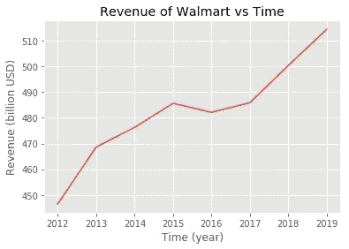
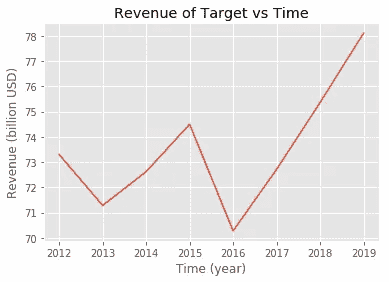
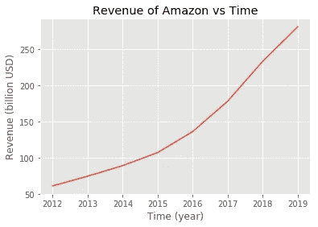
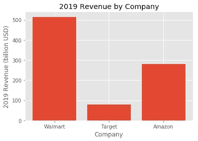

# 面对面零售的未来:沃尔玛和塔吉特与亚马逊

> 原文：<https://blog.devgenius.io/the-future-of-in-person-retail-walmart-and-target-vs-amazon-25c02a20bd6d?source=collection_archive---------15----------------------->

## 亲身零售的故事真的要消亡了吗？让我们来了解一下！

迈克·彼得鲁奇在 [Unsplash](https://unsplash.com/s/photos/store?utm_source=unsplash&utm_medium=referral&utm_content=creditCopyText) 上的照片

今年我们在家的时候，亚马逊成了我们很多最好的朋友。挣扎着决定是否去 Target 以更便宜的价格购买商品，我们都依赖亚马逊安全地将供应品送到我们的家中，而不必走出家门。这种易用性和便利性使人们越来越依赖亚马逊(和其他在线零售场所)，越来越不依赖沃尔玛(和其他面对面零售场所)。但这真的是真的吗？像沃尔玛和塔吉特这样的零售店比以前赚的钱少了吗？亚马逊比以前赚了更多的钱吗？在这篇文章中，我想通过分析这十年的数据来揭穿一些神话，并证实一些关于零售业衰落的说法。

# 数据

我将在本文中使用的数据可以在 Statista 上找到。我使用的一个数据样本可以在[这里](https://www.statista.com/statistics/255957/revenue-of-target-in-north-america/)找到。我不拥有这些数据，仅出于教育目的在本文中发布。这些数据将用于绘制和比较大公司(特别是塔吉特、沃尔玛和亚马逊)产生的收入。

在深入探讨这个问题之前，我想提出一个非常重要的注意事项:我们只关注两家非常大的面对面零售商**这一事实可能会使趋势产生误导**。这是因为即使在困难时期，大公司也往往表现良好。另一方面，在经济衰退和竞争加剧的时期，较小的零售商可能难以创收。

# 面对面零售

我们先来看看像塔吉特和沃尔玛这样的亲临零售店。我们知道这两家都是价值数十亿美元的公司，但这意味着它们都还在增长吗？还是他们在堕落？让我们分析他们的收入来找出答案！

## 沃尔玛

可以看出，自 2012 年以来，沃尔玛的年收入增长了 500 多亿。这表明该公司在过去七年中确实有所增长。那么，这是否意味着零售店并没有真正衰落？

## 目标

与沃尔玛不同，塔吉特百货在同样的 7 年时间里也有过打嗝。尽管我们确实在接近尾声时看到了一个峰值，但它实际上并不像看上去那么剧烈。在过去的七年中，Target 的年收入相对稳定(每年在 700 亿到 800 亿美元之间)。

# 在线零售

我们都知道的在线零售店的主要例子是亚马逊。因此，让我们快速看看亚马逊的利润与沃尔玛相比如何。

这种增长是惊人的。亚马逊的收入从 2012 年的近 500 亿美元增长到 2019 年的近 3000 亿美元。这一增长是沃尔玛的近 5 倍。然而，仍然有一些事情我们需要考虑。尽管这种增长是巨大的，但他们的年收入仍未超过沃尔玛。

当你这样看待它时，亚马逊似乎要赶上沃尔玛还有很长的路要走。但是分析亚马逊的收入年复一年的增长率，我们知道这可能比我们预期的要早。

# 结论

那么这一切意味着什么呢？嗯，有一点是肯定的。沃尔玛似乎在这个新的技术时代做得很好？怎么会？他们一直在适应。他们也上网了。但就像我之前说的，沃尔玛的成功并不意味着所有面对面的零售店都取得了成功。由于网上零售需求的增加，许多，我是说许多商店不得不申请破产。无论如何，我认为大型面对面零售商将保持强劲——当我们看小企业时，问题就来了。他们受到严重影响，这就是问题所在！就这样，我今天就离开你们了。明天见！