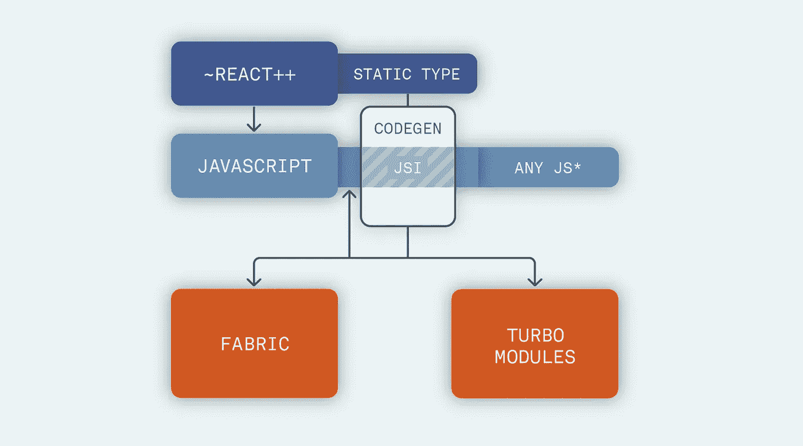
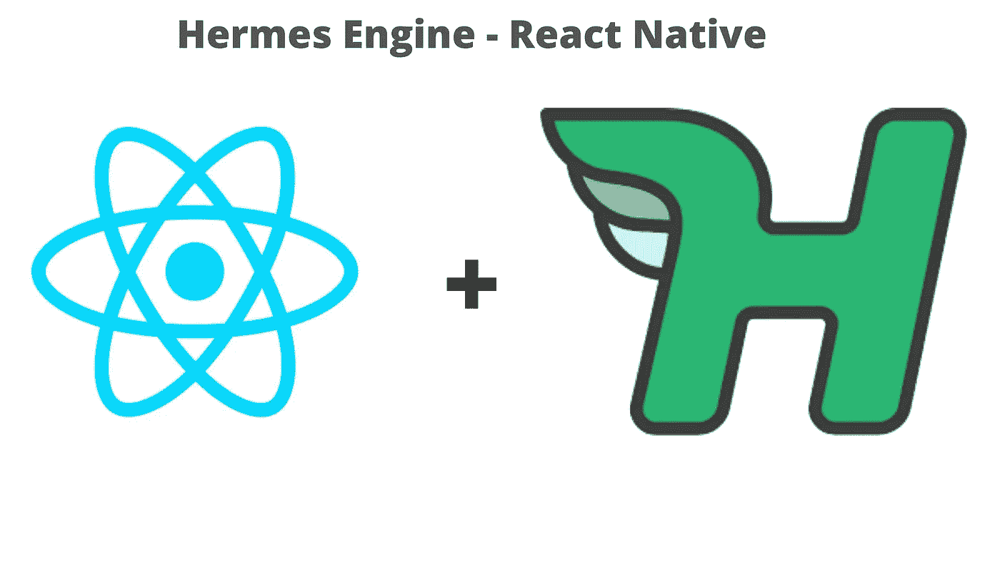

# React Native 的未来

> 原文：<https://blog.devgenius.io/the-future-of-react-native-691f7820f512?source=collection_archive---------4----------------------->

反应自然

React native 现在成为开发人员中最受欢迎的混合移动技术之一，尽管有其所有的缺点和不足，react native 仍然在移动跨平台开发领域占据主导地位。此外，我们必须承认，react native 在市场上有一些严重的竞争对手，他们利用其弱点来吸引开发者，其中一个永久的竞争对手是 flutter。

这里明确的问题是:“react native 的未来是什么？”，“会不会反应原生继续生长？还是旋舞会杀死有反应的土著？”在这篇文章中，我们将尝试回答这些问题，所以，让我们开始吧。

# 绩效问题:

react native 最持久的缺点之一是它的性能，react native 与本机应用程序相比非常慢，与 flutter 相比也是如此，react native 开发团队非常清楚这一点，他们一直在试图解决这个大问题，react native 很快就会拥有的功能之一是 JSI(JavaScript 接口)，那么，JSI 是什么？

目前，react native(或 JS)使用一个桥来与本机 UI 通信，这种通信使用 JSON 进行:

反应本机线程

现在，react 本地开发团队正在开发一种新模式，允许 JS 线程几乎直接与 C++部分通信，这将使性能比以前快得多:

反抗的 JSI 土著

# **UI 渲染:**

此外，react native 中最疯狂的问题之一是渲染，因为有时我们在使用 react native 开发应用程序时会看到一些渲染问题，而且渲染有时会变得非常慢，这个问题代表了 react native 必须克服的巨大障碍。

此外，react native 开发团队正在开发一种新模式，使用所谓的“Rerendrer”来加快渲染速度:

React 本机重新呈现程序

# **启动时间:**

react native 的另一个问题是“启动时间”，这个问题会让用户痛苦，特别是如果他们有一个功能有限的移动设备。

脸书还开发了一种新的方法，在首次加载应用程序时加载原生模块。过去，当你第一次在你的设备上加载应用程序时，react native 会加载所有的本机模块，即使这些模块是无用的，react native 也会加载它们，但现在，有了 Facebook react native 团队开发的 turbo 模块，应用程序将只加载必要的模块，而不是加载所有模块，这将使应用程序的启动速度快得多:

React 本机 Turbo 模块

# **爱马仕:**

当然，我不能在不谈论脸书将为 react native 添加的著名功能的情况下完成这篇文章，这就是 Hermes。Hermes 是一个开源的 javascript 引擎，为在 android 上运行 react 原生应用程序进行了优化，这个 JS 引擎将使您的应用程序变得如此快速响应。

赫尔墨斯的本土反应

# **结论:**

脸书在 react native 的开发上投入了大量资金，使其成为为初创公司开发中小型应用程序的首选，这使我们得出结论，react native 将继续增长，甚至可以在未来消除颤振。

最后，希望这篇文章赢得您的赞赏，感谢您的关注。