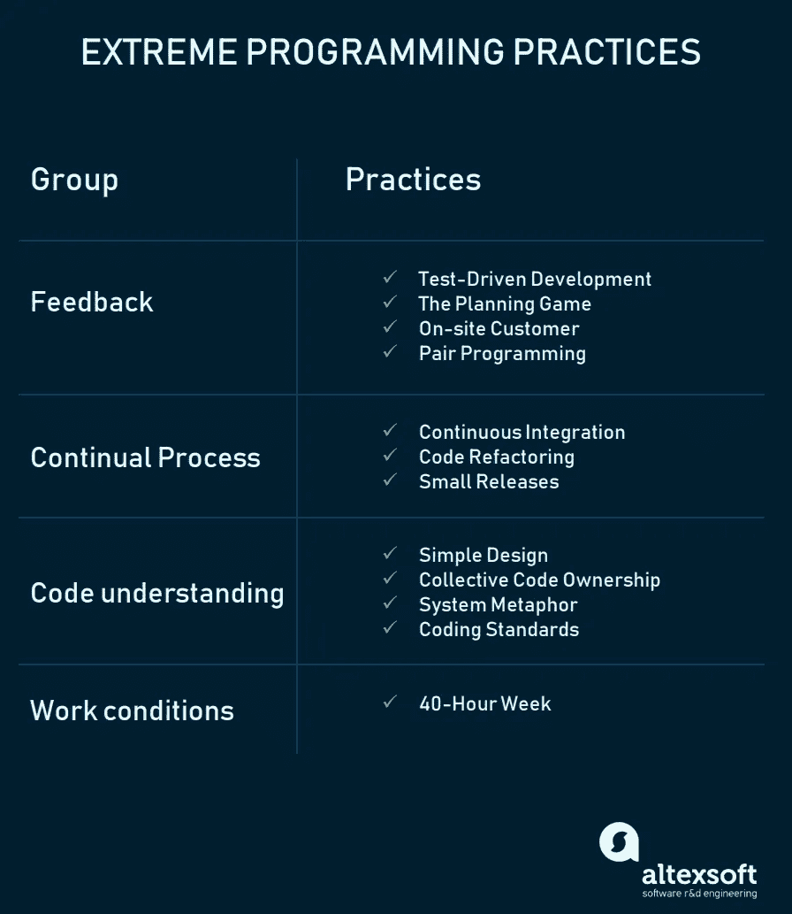

# 好的，坏的和丑陋的

> 原文：<https://blog.devgenius.io/the-good-the-bad-and-the-ugly-ecd721900cc8?source=collection_archive---------2----------------------->

许多开发人员无法区分好的和坏的设计，以及他们代码中的问题。你的代码是好的、坏的还是丑陋的？

[https://it.wikipedia.org/wiki/File:Clint_Eastwood.jpg](https://it.wikipedia.org/wiki/File:Clint_Eastwood.jpg)

我和其他开发人员谈过很多次，当提出解决方案时，他们没有工具在两个选项之间进行选择。甚至他们也没有真正理解他们代码的问题。

我们可以从 Kent Beck 简单设计的 4 个关键规则开始:

1.  通过测试
2.  揭示意图
3.  无重复
4.  最少的元素(删除任何不符合前面三个规则的元素)

我们可以用这 4 条规则来定义我们的代码是“好的”、“坏的”还是“难看的”。如果你的代码是好的，你和你的团队可能比我更了解设计，糟糕和丑陋是最常见的状态。不好是个问题但是丑是好的，那说明你在[的道路上不断进步](https://www.mtu.edu/improvement/learn/what/)。如果你很糟糕，就开始改变，因为如果你跌到谷底，你的公司就会有大麻烦。

## 设计迭代吗？

有没有可能在第一次尝试中编写代码来解决一个新特性而不出现错误？

*   如果你过去做过同样的工作，并且你对这个问题有很深的了解，也许会。这是很难看到的，不是常态。
*   在任何其他情况下，没有。

对于第二种情况，我们需要遵循这些规则来改进设计，但是很难按照它们来写每一行。正如肯特·贝克所说:

“让它工作，让它美丽，让它快速”

首先要做的是解决问题。这是必须的，我们的代码是为了解决问题而做的。所以在开发的时候，我们的首要目标是让我们的代码能够工作。
在 [TDD](https://medium.com/dev-genius/inverted-scientist-method-aka-tdd-e7848c3fd982) 中，这由前两个阶段完成。

*   编写一个失败的测试。
*   编写最少的代码来通过测试。

TDD 的第二步迫使您应用最少元素的规则。一旦我们是绿色的，我们就“通过了测试”。

让它更好，让它更快，就是“重构”。在这个程序块中，你可以按照这个顺序迭代实现这些规则。

*   **揭示意图**:“任何傻瓜都能写出计算机能理解的代码。优秀的程序员会写出人类能理解的代码。”马丁·福勒。
*   **无重复**:“每一项知识都必须在系统中有一个单一的、明确的、权威的表示”[务实的程序员](https://en.wikipedia.org/wiki/The_Pragmatic_Programmer)。这意味着我们需要解决简单的表里不一，还有[重复意图](https://neilonsoftware.com/2020/09/15/code-consistency/)。

重要的是时间的结果。TDD 将帮助我们在每次提交时遵循它，但是每次我们添加代码时，我们都增加了系统的复杂性。有时，我们无法承受功能中间的结构性变化，我们有时会采取增加技术债务的折衷方案。我们如何管理这些情况？。

让我们再和肯特·贝克谈谈:

铁路 2020，肯特·贝克

我们可以用这句话来总结这些想法:

“对于每一个想要的改变，让改变变得容易(警告:这可能很难)，然后让改变变得容易”肯特·贝克。

对我来说，这是你的系统设计和敏捷方法之间的第一道边界。我的经验告诉我，我们无法在短期内承担我们想要在我们的系统中引入的所有改变。

## 软件设计和敏捷

根据[约束理论](https://en.wikipedia.org/wiki/Theory_of_constraints)，我们需要在约束之前定义一个缓冲区，这就是为什么所有敏捷方法都处理积压的项目([思维是瓶颈](https://asierba.net/2015/03/19/thinking-is-the-bottleneck/))。
我的观点是，为了创造一个好的软件设计，我们需要管理两个非开发人员难以理解的概念:

*   技术债务(耦合在这里)
*   疯狂的

因此，为了有效地重构我们的代码，改进我们的设计，必须同时解决这两个问题。在这篇文章 [Bugs Vs Features](https://medium.com/dev-genius/bugs-vs-features-189ebb9f0e26) 中，我谈到了我们如何处理它们。但我只想强调，你的设计也是为了解决实际设计中存在的问题。

好吧，但是技术债务和 bug 如何被用来改进我的设计呢？。遵循帕累托法则，80%的错误来自于 20%的代码。由于 bug 是开发人员创造的，我们应该开始推动重构这 20%的代码，以使其他开发人员更好地理解它，并总体上减少 bug。bug 很容易发现，但是科技债呢如何识别呢？。

我们需要阅读我们的代码(不要相信不开发任何东西的架构师),并遵循简单设计的四条规则:

*   你的代码中有没有没有经过测试的部分？。我向你保证，没有测试的代码是滋生错误的最佳途径。可能那部分代码没有测试，因为设计很烂，很难写出来。
*   你有注释来解释你的代码的某些部分吗？。如果你有技术债务，那是因为仅仅阅读你的代码是不够的。这些地方很容易滋生细菌。你有称为“实用”、“助手”、“管理员”、“经理”的单位吗？。那些名字没用，都是气味。跟随他们来确定你的技术债务，提高你的名字。

> 计算机科学只有两个硬东西:缓存失效和事物命名。
> 
> *——菲尔·卡尔顿*

*   您是否多次复制和粘贴代码来解决代码中的同一个问题？。高耦合、低内聚通常是这个问题的结果。所以你可能需要重构你的代码，这就是为什么你需要测试。
*   你有死代码吗？。你是在试图解决一个没有发生，也不会在下个月出现的问题吗？。删除所有代码，避免[YAGNI](https://en.wikipedia.org/wiki/You_aren%27t_gonna_need_it)，用“最少的元素”简化你的设计。

我们需要将我们的问题放在团队内部的优先位置，因为它们将作为改进我们设计的触发器。

## 团队和设计

你不是独自编写代码，你的设计是你团队中负责代码的现任和前任成员的知识、自主性和原则的综合。所以你的设计向你的团队展示，如果你想改进设计，你需要学习更多的东西。如果团队中没有人关心耦合，那么创建微服务架构是非常困难的。

因此，我们需要提高我们的技能，在不同的方向上改进我们的设计:

*   技术技能
*   团队技能
*   何时做出决定

## 技术技能

当我们谈论技术技能时，人们总是想到框架、库和技术，但是正如鲍勃叔叔所说的[工具不是答案](https://blog.cleancoder.com/uncle-bob/2017/10/04/CodeIsNotTheAnswer.html)。我们需要一种方法，能够快速学习东西，并知道如何与他们合作，做好工作。XP 实践是一个很好的起点:

[https://www . altex soft . com/blog/business/extreme-programming-values-principles-and-practices/](https://www.altexsoft.com/blog/business/extreme-programming-values-principles-and-practices/)

还有很多东西要学:

*   编写更好的测试(TDD，TCR)
*   坚实的原则
*   设计模式( [GOF](https://springframework.guru/gang-of-four-design-patterns/) 、[抓](https://en.wikipedia.org/wiki/GRASP_(object-oriented_design))等)
*   微步骤
*   软件架构(单片、微服务、SOA、分布式系统等)

之前专注于学习技术而没有任何上述科目的技能。

## 团队技能

当我们在团队中发展时，我们需要知道如何作为一个团队工作。团队合作通常意味着整个目标比路上的一块石头更重要。我们需要了解哪些习惯流程违背了我们的目标，为什么我们的[步调](https://medium.com/dev-genius/quality-vs-speed-9a46a6254a4e)不够好，或者我们作为一个团队可以做些什么来减少错误。

来自 [XP](https://www.altexsoft.com/blog/business/extreme-programming-values-principles-and-practices/) 的一些有用的东西会帮助我们:

**沟通:**团队软件开发中最重要的是沟通。没有沟通，你无法改变事情，因为你可能没有能力去做。简单:只要解决你的问题，遵循 YAGNI 原则。但是设计系统要容易改变。
**反馈:**这是我们需要用来改变我们系统的工具。我们需要来自利益相关者、客户的反馈，也需要来自代码和团队成员的反馈。重要的是要知道要改变什么，以及在我们的代码和行为中哪一个是更好的方向。勇气:我们需要战胜恐惧。害怕改变，害怕和队友谈论工作的一部分。害怕改变一个正在运行的、成功的生产系统。为了反对我们的技术领先或我们的管理，我们需要勇气来展示我们的声音，并用我们的经验来改善团队。尊重:这很重要，你需要尊重你的队友，我就不多说了。你需要能够[信任](https://medium.com/dev-genius/do-you-trust-me-19f411708e4d)他们与你的团队相关的一切。

你的团队应该以改善你的实际问题的想法来做任何决定。例如，如果科技债务是一个问题，那么你的团队可以创造[蝙蝠侠](https://gojko.net/2018/08/30/sprints-marathons-root-canals.html)来有效地解决它们。

## 何时做出决定

这篇文章很长，但你可以看看这篇[和另一篇](https://medium.com/dev-genius/to-decide-or-not-to-decide-thats-the-question-f186d5858aba)。

作为一个总结，软件设计/架构**从我们的代码中浮现**，下一个特性，我们的错误，我们的技术债务。但是我们需要倾听他们，了解真正的问题，以提高我们的技术技能，确保我们能够承受这些问题。但是有时候问题在团队中很深，所以我们需要团队合作来解决它们，没有团队合作就不可能有更好的设计/架构。