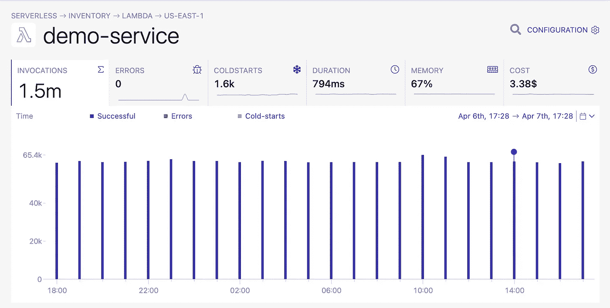
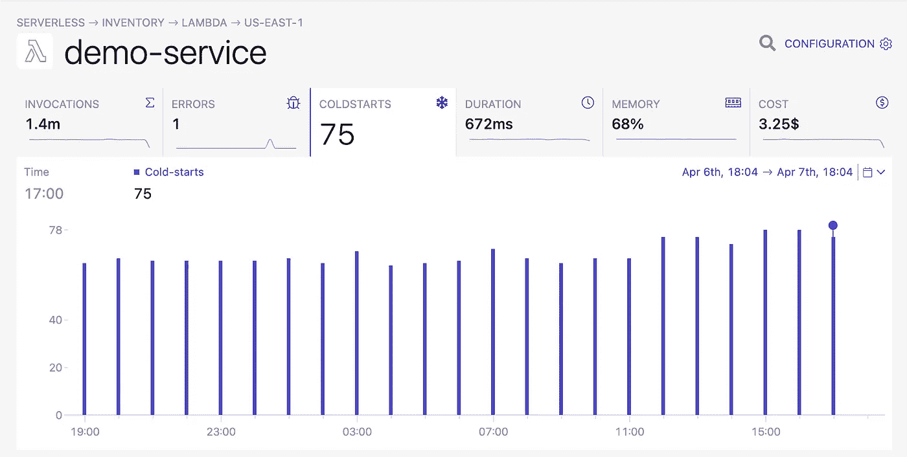

# 无服务器成本大辩论(无服务器=无成本)

> 原文：<https://blog.devgenius.io/the-great-serverless-cost-debate-serverless-costless-d74b5be84d05?source=collection_archive---------5----------------------->

故事最初发表于[https://dashbird.io/blog/cost-of-serverless/](https://dashbird.io/blog/cost-of-serverless/)

如果您担心转向无服务器基础架构对您的企业来说过于昂贵，您并不孤单。到 2024 年，云服务的总支出将超过[2840 亿美元。好消息是，有许多方法可以跟踪和降低您的无服务器运营成本，而不会影响您的业务。Lambda 和它如何帮助您的业务？阅读这些](https://canalys-com-public-prod.s3.eu-west-2.amazonaws.com/static/press_release/2020/Canalys---Cloud-market-share-Q4-2019-and-full-year-2019.pdf)[常见问题](https://dashbird.io/blog/aws-lambda-faq-for-dummies/)，了解更多信息。

# 与亚马逊合作

亚马逊网络服务(AWS)是亚马逊的云计算部门。自 2014 年以来，AWS 通过其 Lambda 服务提供无服务器计算。

因为外包计算能力还很新鲜，所以仍然有许多技术人员在问，“[什么是无服务器？](https://dashbird.io/knowledge-base/basic-concepts/what-is-serverless/)“使用其他人的服务器如何提高效率或成本效益？

让我们来谈谈企业转向无服务器基础架构的主要原因。

# 不用再为闲置的服务器付费

无服务器基础设施最好的一点是，你只需在用户在线时付费。当您的企业发展壮大时，无需购买新设备，即可拥有所需的计算能力。一个新的应用程序可以处理同样的流量，就好像它有一个设备齐全的服务器室一样。

但是没有服务器的不仅仅是小型企业。让我们回顾一下大企业是如何做出改变的。每月有超过 3000 万独立访问者的在线出版物 business 完全在无服务器架构上开始了他们的新品牌 Romper。

为什么这对你很重要？

首先，美国主要新闻和娱乐网站[business](https://aws.amazon.com/solutions/case-studies/bustle/)的 IT 支出下降了 84% 。其中很大一部分原因是，如果他们管理自己的服务器，他们的维护人员规模只有同类网站的一半。

由于您的团队不管理服务器，您不必为 AWS 提供的运营团队付费。这项维护费用包含在您支付的每个 AWS Lambda 请求中。

# 请求如何在无服务器框架上工作

AWS Lambda 将请求视为事件通知或调用。即使从控制台测试应用程序的功能，这些测试也算作请求。让我们看看请求数据需要多少成本。

好消息是，**你的第一百万个请求是免费的**。每个帐户都有 400，000GB 的计算时间。

GB 秒？是的，你支付每毫秒和内存分配。如果你用 128 MB 的内存运行 10 毫秒，你在 1024 MB 的内存上花费的时间不到 10 毫秒。

免费层之外的所有请求在完成免费使用后，每 100 万次请求的费用为 0.20 美元，每 GB 秒的费用为 0.0000166667 美元。

**你还需要考虑其他成本吗？**

是的，让我们深入研究一下所有其他导致你的账单的原因。

# 您是否在使用其他服务？

许多不熟悉无服务器基础设施的企业通常会对额外费用感到惊讶。让我们考虑一下从云上的其他服务传输数据如何增加您的每月请求:

如果你在亚马逊 S3 上存储数据，Lambda 从中读取数据，这些都算作请求。当您的应用启动外部传输时，将适用 EC2 数据传输速率。使用 Amazon DynamoDB 读写存储会引发请求。例如，您为函数设置了 512 MB 的内存。假设用户在一个月内执行你的功能 300 万次。你的费用是多少？

> 300 万次调用 18 美元是一笔大买卖！

3 个[百万请求](https://aws.amazon.com/lambda/pricing/)只需 18.34 美元。但这需要大量的数据传输。你如何跟踪每件事并管理崩溃？

# “我如何跟踪所有这些？”

在无服务器用户中，监视 Lambda 函数是一个日益增长的问题。就像很容易忘记你在手机上使用了多少数据一样，追踪你的请求也会令人困惑。

> 可口可乐北美公司不久前已经从 EC2 转向了无服务器，并且很友好地与我们分享了他们的经验。在改用无服务器后，可口可乐从每年 13000 美元降到每年 4500 美元。

让我们从阅读你的仪表板开始。AWS 在 Lambda 中内置了一些基本的跟踪服务。这些服务包括:

# 支出汇总

预测 Lambda 未来用途的好方法。你可以看到你上个月花了多少钱，这个月的估计使用量，以及下个月的预计使用量。

# 按服务列出的本月至今支出

这显示了**您使用最多的 AWS 服务**以及您预算中用于每项服务的百分比。

# 按支出列出的本月迄今最热门服务

它还显示了您最常使用的服务及其成本明细。这些工具很适合自由层使用，但是当你有多个 Lambda 函数时，有一个更好的选择。

这就是[无服务器追踪器](https://dashbird.io/blog/simplest-way-to-monitor-failures-in-aws-lambda/)让事情变得简单的地方。无服务器跟踪器在一个地方显示所有 Lambda 函数的状态。它可以让你根据数据来决定如何与客户互动。

这些是跟踪者可视化成本的一些方法。

使用 Dashbird，你可以跟踪任何特定项目的成本，让你确切地看到你为 AWS Lambda 花费了多少美元。

此外，您可以看到每个函数的成本以及其他重要信息，如执行时间、调用、错误等。，在 Lambda 函数视图部分下。

# 外包服务器如何为您省钱

既然你已经知道了定价的工作原理以及如何跟踪定价，那么让我们来谈谈无服务器为你省钱的其他方法。

无服务器无前期成本。如果没有云计算，唯一的其他选择是在创建新应用程序之前购买服务器。这意味着您的服务器需要等待更长时间才能获得投资回报。

缩放要便宜得多。与其购买更多的服务器并希望它们能提供你需要的容量，**你可以只为你使用的数量付费**，而不用担心你的系统崩溃。

> 你不付维修费！

现在被迫雇佣一个大的 DevOps 团队对公司来说是一个巨大的成本节约。有很多例子表明，只有两个开发人员在幕后就能成功运行拥有数百万用户的应用程序。通过将他们的基础架构切换到 AWS 并依靠它们来处理日常维护操作，他们可以在晚上睡觉，因为他们知道半夜不会发生崩溃或停机。再也不用睁着一只眼睛睡觉了。

# 在无服务器框架上冷启动

说到崩溃，无服务器以冷启动的形式出现了一个独特的问题。lambda 函数的第一次调用需要一些时间来执行，因为容器需要时间来启动。

使用传统的计算方法，每个请求都被放在一个队列中，然后被一个接一个地处理。

有了 Lambda，每一个请求都会立刻得到服务，前提是它们不会遇到并发限制。

这本身可能是人们对这项技术如此兴奋的主要原因。事实上，使用无服务器，你可以毫不费力地同时为十个人、一百个人甚至一千个人服务；您的应用程序可以很好地伸缩，以满足用户的需求。

## 那么为什么冷启动会发生呢？

为了创建我一直抱怨的这个漂亮的缩放，未使用的 Lambda 容器在一段时间后被销毁。我们已经测试了删除的时间，发现它似乎是 40 到 60 分钟的不活动时间。现在，如果这一点直到现在还不清楚，冷启动是必要的，以允许 AWS 几乎无限地扩展我们的 Lambdas。旧集装箱为新集装箱腾出空间。

不是每个人都会被这些冷启动所困扰，但对于那些被困扰的人来说，有一种方法可以防止这种情况，那就是通过[使用供应的并发](https://dashbird.io/knowledge-base/aws-lambda/provisioned-concurrency/)。

有了这个特性，你可以告诉 Lambda 服务，它不应该在 60 分钟后删除所有的函数实例，而是保持加载特定数量的函数实例。这有点违背了**按需付费的无服务器理念**，但如果你确切知道你的系统是如何使用的，这可能是一个改善延迟的好方法。

如果你的应用程序经历了很多冷启动，试着增加你的内存限制。内存分配更高的 Lambda 函数也可以获得更多的 CPU 能力，这可以大大减少冷启动。虽然这会花费更多，但是你可能会因为长时间的等待而失去顾客。

**了解冷启动发生的时间和频率很重要**，如果需要，利用这些知识进行调整，为用户创造更好的体验。我使用 Dashbird 的函数视图过滤掉冷启动，并记录它们出现的频率。

# AWS 为什么贵？

最有可能的答案是你的代码没有优化。有时 128 MB 可能比 1 GB 更贵，因为该功能运行的时间要长得多。

> [Lambda power tuning](https://github.com/alexcasalboni/aws-lambda-power-tuning) 可以帮助您为您的功能找到最佳的内存配置。

就源代码和资产而言，函数的大小也会产生影响。你的基于 2 GB Docker 的 Lambda 函数不会像 1 MB 的那样运行。

# 我如何降低无服务器成本？

尝试构建没有很多行代码的小函数。找到最佳的内存配置，并在有意义的时候使用缓存。

如果你使用 Lambda 来驱动你的 API，你也应该**考虑在 API Gateway 或者 AppSync** 内部缓存请求，这取决于你选择的服务。毕竟一个没有被调用的函数是最便宜的，甚至没有冷启动。

# 无服务器更便宜吗？

对于许多研究无服务器的人来说，简单的答案是响亮的“是”。

但是，仍然有许多因素需要考虑，组织应该考虑运营复杂性的许多方面。

如果你仍然犹豫不决，决定因素应该是你的业务是否能继续保持竞争力，同时花更长时间为你的应用程序部署新功能。如果答案是否定的，那么走向无服务器绝对是正确的方向。

运营后端运营本身就是一门生意。这就是为什么切换到无服务器并专注于您的业务最擅长的领域是有意义的-为您的用户提供更好的体验。我们写了一篇很棒的文章，内容是关于[切换到无服务器](https://dashbird.io/blog/saving-money-switching-serverless/)可以节省多少成本。我建议你自己看看这实际上有多大的区别。

# 我会用无服务器框架省钱吗？

我们已经研究了一些方法来计算无服务器的成本。

虽然不是免费的，但就前期和维护成本而言，无服务器是无可匹敌的。任何想要尽快启动并运行应用程序的人都应该考虑使用无服务器。