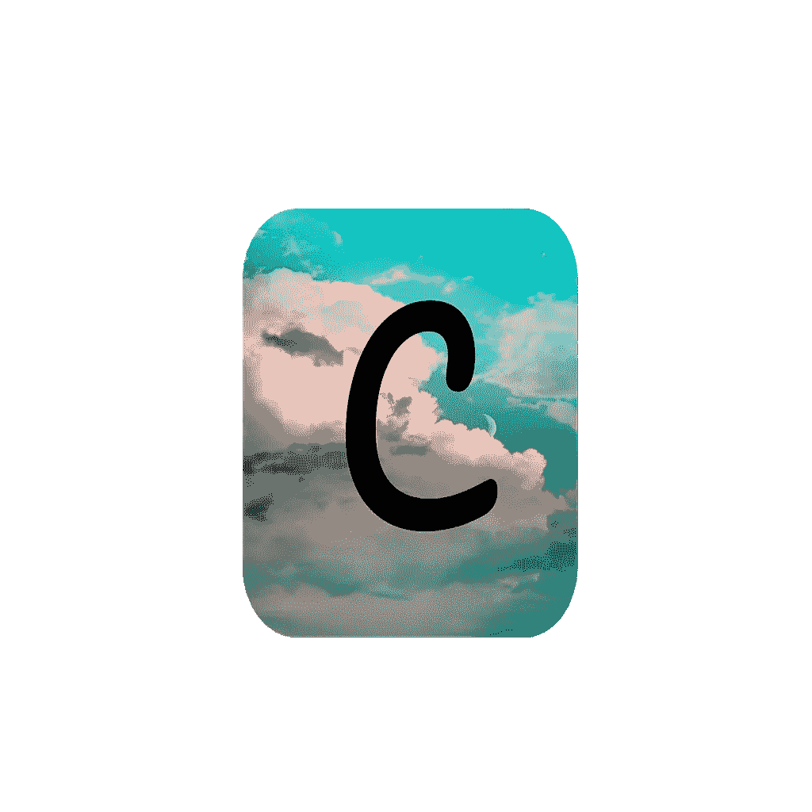
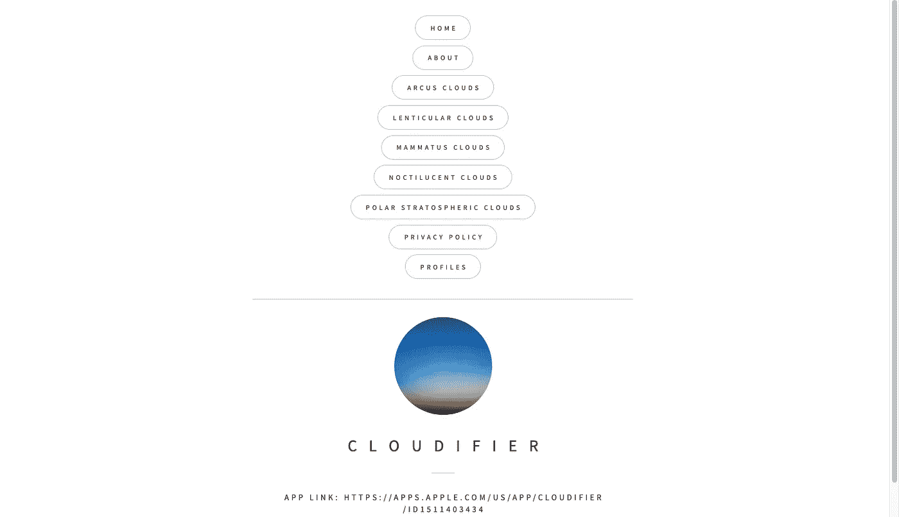
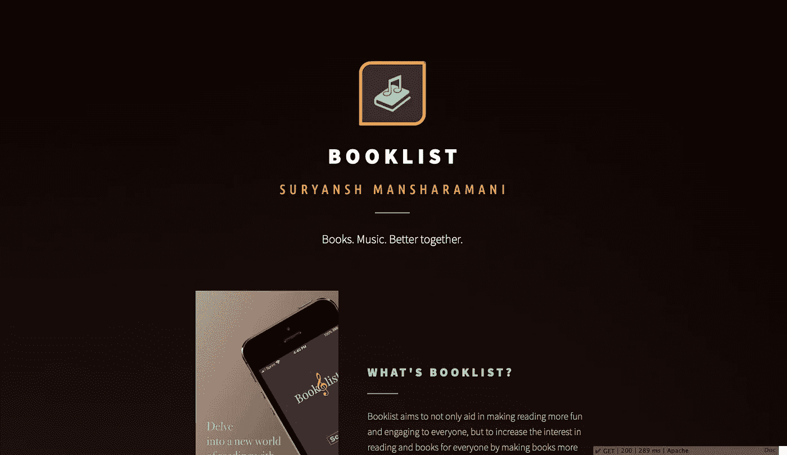

# 从一个应用到另一个应用的伟大旅程

> 原文：<https://blog.devgenius.io/the-great-voyage-from-one-app-to-another-6fa17b6b8588?source=collection_archive---------35----------------------->

我的第一个应用教给我的是…

沙哈达特·拉赫曼在 [Unsplash](https://unsplash.com?utm_source=medium&utm_medium=referral) 上拍摄的照片

那么你能从你的第一个应用中学到什么呢？原来，一个**拍品**。

以下是我所学到的，以及我如何提高自己的技术和技能的故事:

在我得到第一台 Macbook 之前，我从未听说过 Swift 或 Xcode。当我意识到 Swift 是一种简单但功能惊人的应用程序开发语言时，我毫不犹豫地马上开始了。在完成整个 Swift 新兵训练营的几个星期后，我决定结合我新发现的三个爱好，大气科学、机器学习和应用程序开发来创建我的第一个应用程序，cloud ifier([https://apps.apple.com/us/app/cloudifier/id1511403434](https://apps.apple.com/us/app/cloudifier/id1511403434))。

当我准备在 App Store Connect 上提交我的构建供审查时，Xcode 上突然弹出一个错误，说某处有重复的 info.plist 文件。我决定暂时忽略这个问题，然后继续写我的应用更新描述。不幸的是，我养成了一个习惯，一放进文件就马上清理垃圾桶。当我意识到的时候，已经太晚了。所以，我又一次从头开始。旧版本中修复的错误仅仅是在 Stack Overflow 中深入挖掘的结果，而现在，所有的血、汗和泪，所有的辛勤工作都没有了。

[沃伦·王](https://unsplash.com/@wflwong?utm_source=medium&utm_medium=referral)在 [Unsplash](https://unsplash.com?utm_source=medium&utm_medium=referral) 上的照片

我不得不重新开始。

我压力大吗？**是的。幸运的是，我从这一次可怕的经历中学到的是，理解的胜利仅仅是从堆栈溢出中复制粘贴片段。**

如前所述，我被迫记住了以前没有完全意识到的某个代码。这样，我不仅变得好了一点，而且减少了对他人的依赖，更多地依靠自己和解决问题，这是编程本身的主要核心。

所以，做完这些后，我决定休息几天。在放松了几个星期后，一个新的想法突然出现在我的脑海里。

如果有一个应用程序可以阅读你正在阅读的书的摘要，并在阅读时播放最好的、温柔的背景音乐，那会怎么样？

作为一个狂热的读者，我可以说这肯定是其他读者需要的东西。

就这样了。我马上开始了。

首先，我如何制作 OCR 分类器？我决定发挥创意，使用 CreateML 创建一个文本识别模型，其中包含来自不同电影评论的大量数据。至少在我的经验中，大多数评论，无论是正面的还是负面的，都提供了大量的词汇和不同的风格来分析。

Cloudifier 的标志

现在，我不得不做一些我非常不理解我上一个应用程序的事情。UI 设计。因此，我决定对对比度、颜色组合以及某些形状如何增强某些颜色进行深入研究。

在将颜色缩小到 3 种主要颜色后，我必须制作标志。

Cloudifier 的标志非常简单，虽然简单，但看起来并不专业，而且我特别恼火的是，除了字母“C”之外，没有任何象征性的图标。

所以，我花了几天时间制作这个标志，然后调整它的大小，这样它就有资格在应用商店上发布了。

书目的标志

然后花了近一个月的时间做 app，就搞定了。我添加了所有的音乐，情感分类器完全正常工作。

老实说，我会花几个小时坐在椅子上，盯着代码和一条写着“错误”的红线，想知道哪里出了问题，以及如何修复它。每次看到错误都要花几个小时来强调，之后我就习惯了，知道总会有解决方案，而且找到它也不是不可能的。于是，在花了无数天开发调试之后，我终于完成并发布了我的 app——书单([https://apps.apple.com/app/id1516377520](https://apps.apple.com/app/id1516377520))。

现在，是登陆页面的时候了，这是任何成功的应用程序都必须具备的。当我制作 Cloudifier 时，我专注于使登陆页面更像一个完整的网站，有不同的标签、更多的信息、更多的按钮等等。

云网站:【https://cloudifier.carrd.co/】T2

不幸的是，没有人有时间查看每一个按钮和阅读信息段落。所以，我决定为书单做一个简单而漂亮的页面，人们会喜欢的。

书单地点:【https://thebooklist.carrd.co/ 

那么，现在怎么办？

我不确定。如果有什么是我可以确定的，那就是花几个月的时间来制作一个真正优秀的、令人印象深刻的应用，而耐心是关键。如果我们不从过去的错误中吸取教训，那我们还能吸取教训吗？