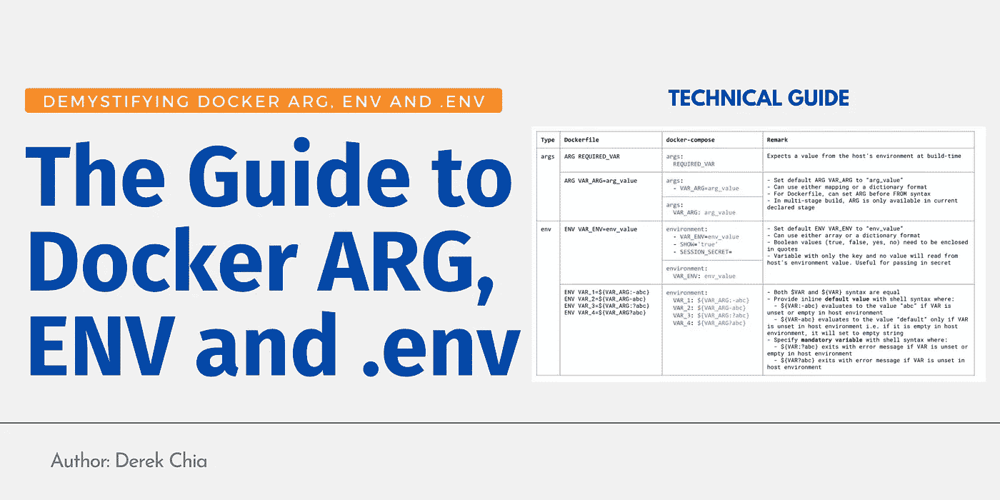
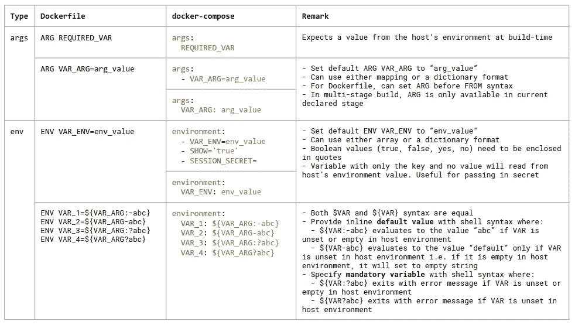

# Docker ARG，ENV 和。包封/包围（动词 envelop 的简写）

> 原文：<https://blog.devgenius.io/the-guide-to-docker-arg-env-and-env-4a7b3ddd5543?source=collection_archive---------3----------------------->

## 揭开 Docker 参数、环境和。包封/包围（动词 envelop 的简写）

对于那些赶时间的人，这里有一个总结这篇文章内容的表格。你可以在这里找到更高分辨率的。

TL；DR 表

## 为什么是这个指南？

很多时候，开发人员在开发和部署的不同阶段都在绞尽脑汁地寻找传递变量的最佳方式。我自己对此感到内疚。为了一劳永逸地解决这个问题，我决定进行实验，并在本文中记录下我的观察结果。[🤗](https://emojipedia.org/hugging-face/)

# 在 Docker 中设置环境变量

在这一节中，我将向您介绍四种不同的方式，您可以在构建期间使用 docker-compose 向 docker 映像的环境变量提供值。

## 1.Docker Dot-Env 文件(环境)

`.env`文件可能是设置环境变量最常见的方式。通过将变量存储在文件中，您可以使用 Git 跟踪它们的变化。通常，`.env`的内容用以下符号表示:

使用当前目录中的`.env`文件和下面的`docker-compose.yml`文件，您可以运行命令`docker-compose up -d`来启动容器。在后台，它将读取`.env`文件中的变量，并按照`command`的指示将值打印到控制台。为了验证，运行`docker logs ubuntu`，您将看到变量`ONE`被记录。

有趣的事实:如果你在 docker-compose 文件中需要一个字面上的美元符号，可以使用双`$$`。这也阻止了 Compose 插入一个值，因此`$$`允许您引用不希望 Compose 处理的环境变量。这就是这里记载的。

## 2.使用主机的环境变量

或者，如果您不希望创建一个`.env`文件，而是希望在您的主机中使用一个现有的环境变量，您也可以使用下面的`docker-compose.yml`文件。这样，Docker 将读入您的主机的环境变量，并将其传递给容器。但是，我不建议使用这种方法，因为它可能会使您难以调试。

## 3.码头环境

另一种设置环境变量的方法是使用`environment:`语法在`docker-compose.yml`文件中直接定义它。

## 4.使用壳参数展开

最后一种方法是在参数本身中设置环境变量。使用 Shell 参数扩展特性，`${VARIABLE_ONE:-ONE}`将默认为值`ONE`，如果它在运行时没有被覆盖的话。有关这种行为的更多信息，请参见 [bash 参考](https://www.gnu.org/savannah-checkouts/gnu/bash/manual/bash.html#Shell-Parameter-Expansion)和 Docker [的文档。](https://docs.docker.com/compose/compose-file/compose-file-v3/#variable-substitution)

# Docker 中有两种类型的变量——ARG 和 ENV

Docker 中有两种类型的环境变量。在 docker 文件中，它们以`ARG`和`ENV`的语法出现。在 Docker 编写文件中，它们是`args:`和`environment:`。为了便于参考，我以要点的形式总结了下面的差异。

**ENV**

*   `ENV`在构建和运行期间**是否可用**
*   使用它在运行时传递秘密，避免在构建时硬编码它们
*   `ENV`不能在`FROM`语法之前声明
*   在多阶段构建中，`ENV`贯穿所有阶段
*   优先于相同变量名的`ARG`。例如，在 docker 文件中，相同的变量名由`ENV`和`ARG`定义，将使用`ENV`的值而不是`ARG`

**ARG**

*   `ARG`也称为构建时环境变量，因为它们**仅在构建时可用，而在运行时不可用**
*   不要用它来设置秘密，因为任何使用`docker history`命令的映像用户都可以看到构建时的值
*   `ARG`可以在`FROM`语法之前声明
*   在多阶段构建中，`ARG`不会持续到第一阶段之后
*   在构建期间，您可以用标志`--build-arg <varname>=<value>`覆盖`ARG`变量，用不同的变量构建映像。注意:如果存在用相同变量名配置的`ENV`，这不起作用，参见下面关于优先级的部分

## ENV 优先于 ARG

在下面的例子中，同一个变量`SOME_VAR`由`ARG`和`ENV`定义。由于来自`ENV`的值优先于`ARG`，使用命令`docker build --no-cache -t demo .`构建图像将在一个层中打印`Build-time: SOME_VAR is set to env-value`，因为它打印来自`ENV`的值。这意味着来自`ARG`的值被忽略。

同样，用标志`--build-arg SOME_VAR=new-value`构建图像也没有效果。

# 使用 ONBUILD 语法的多阶段映像构建

`ONBUILD`的概念允许您在一个阶段中声明`ARG`和`ENV`，并让这些值仅在后续阶段中可用。

在下面的 Dockerfile 示例中，我在第一阶段声明了四个环境变量，即`VAR_ENV`、`VAR_ARG`、`VAR_ENV_ONBUILD`和`VAR_ARG_ONBUILD`。

在构建期间，注意在第 6 步(第一阶段)，只有`VAR_ARG`和`VAR_ENV`被打印。然而，在步骤 8(第二阶段)中，除了`VAR_ARG`之外，打印`VAR_ARG_ONBUILD`、`VAR_ENV_ONBUILD`和`VAR_ENV`。这证明`VAR_ARG`不会持续超过其自身的第一阶段，并且`VAR_*_ONBUILD`仅在随后的第二和第三阶段可用(参见第三阶段的步骤 10)。

# 可选阅读:环境变量与外壳变量的背景

如果您想知道，一个 **shell 变量**对于 Shell 的一个特定实例是本地的，而**环境变量**被任何程序继承，包括从另一个 Shell 会话继承。这也意味着 shell 变量是环境变量的子集，在某种意义上对 Shell 会话是“临时”可用的。

通常，变量存储在键值对结构中。Shell 变量使用命令`SOME_SHELL_VAR=shell-var`设置，环境变量使用`export SOME_ENV_VAR=env-var`设置，并带有额外的`export`关键字。有几种方法可以列出所有当前定义的环境变量，那就是运行命令`set`、`printenv`或`env`。然而，外壳变量(非导出)只能使用`set`命令找到。

**使用** `**set**`查看所有 Shell 和环境变量

**设置和查看外壳变量**

**使用** `**printenv**`查看所有环境变量

**设置和查看环境变量**

更多详细信息，请参见 Ubuntu 的指南[这里](https://help.ubuntu.com/community/EnvironmentVariables)。

# 结论

到目前为止，您应该已经很好地理解了环境变量在 Docker 中是如何工作的——包括 ENV 和 ARG 两种形式。我希望这能成为你学习和使用 Docker 的一个很好的参考。[🤗](https://emojipedia.org/hugging-face/)