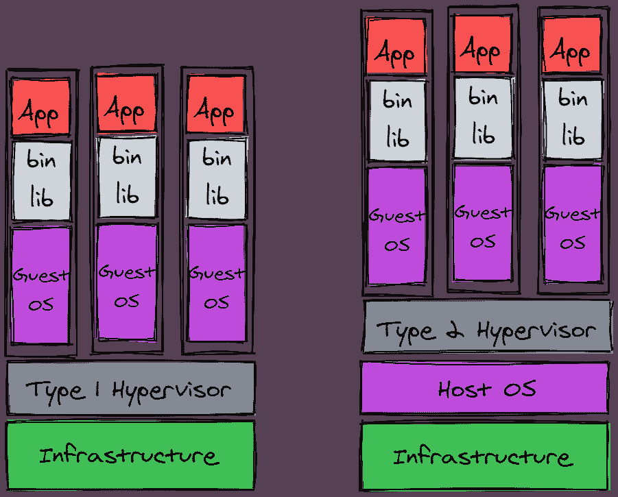
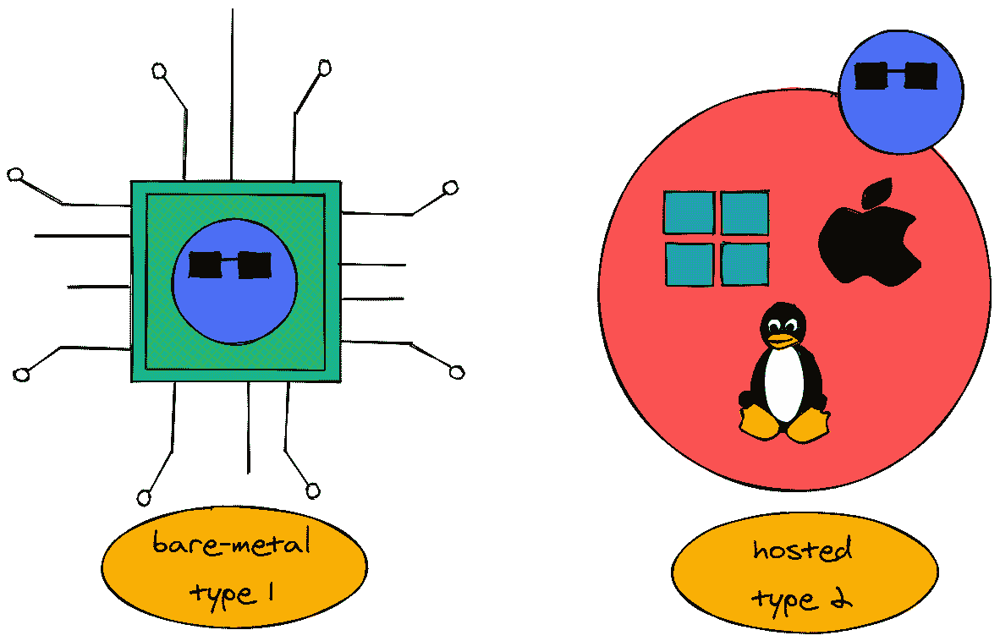
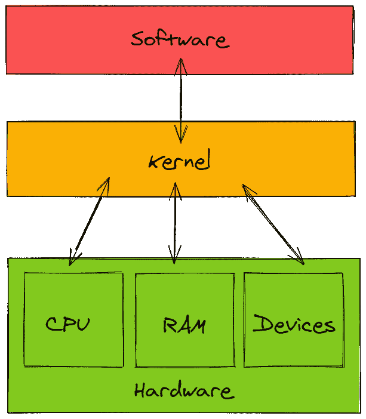
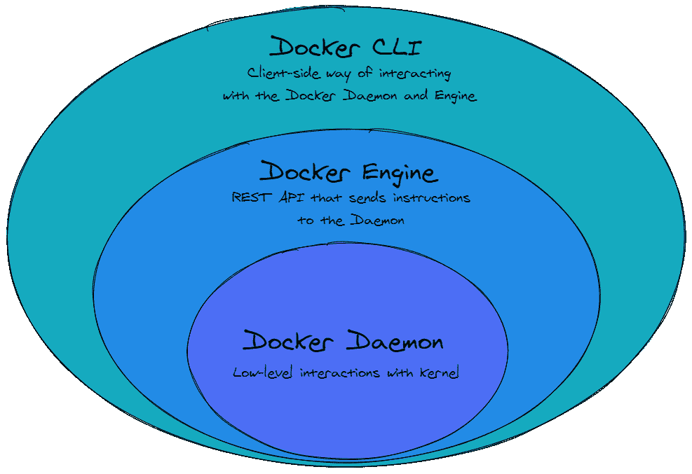
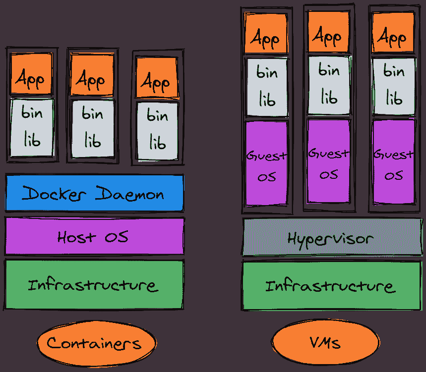
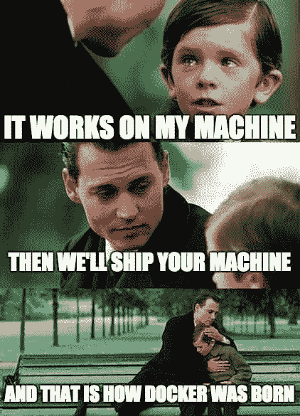
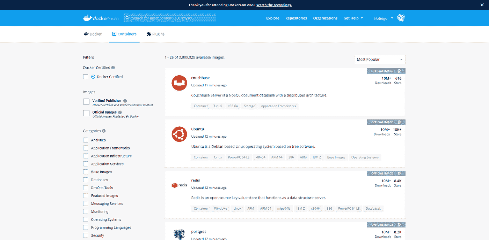
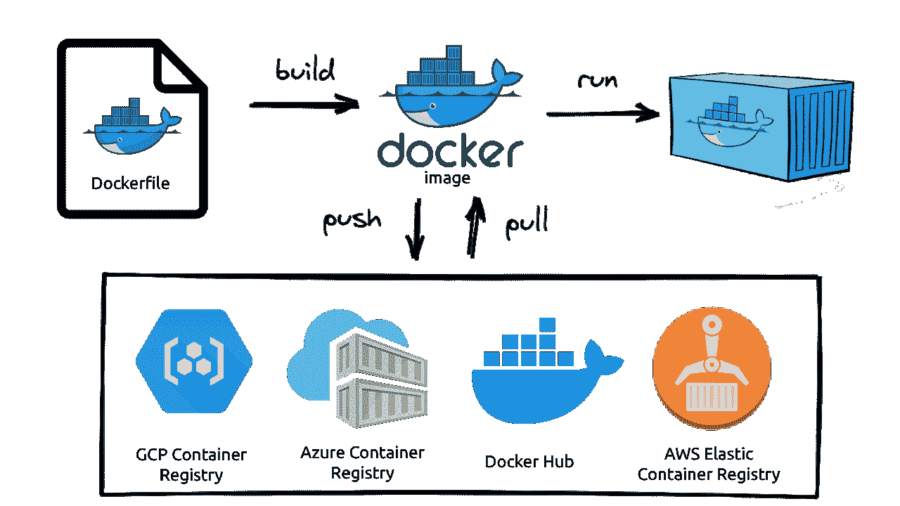

# 集装箱搭便车指南:简单实用的码头工人教程(第一部分)

> 原文：<https://blog.devgenius.io/the-hitchhikers-guide-to-the-containers-a-foolproof-hands-on-docker-tutorial-part-1-499a6ce0a9a9?source=collection_archive---------9----------------------->

对于一个初学者来说，理解 Docker 并不是一件容易的事情。我承认，我在使用和理解容器方面已经挣扎了很长时间，我还有很多工作要做。要牢固地理解 Docker 背后的概念，为什么它如此具有革命性，以及为什么即使是初学编程的人也可能从学习和使用它中受益，这其中有许多微妙之处。

这是我一次小小的尝试，来疏导一小时又一小时的头痛、绝望和啊哈！瞬间变成初学者友好，易消化的格式。这是一系列文章中的第一篇，我希望它能在你的 Docker 之旅中给你一个良好的开端！

# 一些历史

编写软件的典型方式很简单。一个开发人员在他的本地机器上工作，安装一堆包，设置环境，等等。一旦必要的代码处于良好的状态，我们的开发朋友将代码分享给运营人员，然后…它不起作用了。

> ***Ops:***你的代码不行。
> 
> ***Dev:*** *嘿它在我的机器上工作！*
> 
> ***Ops:*** *你运行的* `*XXX*` *是什么版本？*
> 
> ***德夫:*** *我没有主意，伙计……*

可以想象，我们花了很长时间对开发环境进行故障排除，而不是发布特性和改进。

找到的解决方案在**虚拟机管理程序**和**虚拟机(VM)**中。有了虚拟机，您可以将一个完全配置好的操作系统与您的代码一起打包发货，并启动您认为合适的开发和测试环境。编码变成了启动一个虚拟机，配置你需要的环境，开发软件，测试它，你的工作就完成了！但是所有这些是如何工作的呢？什么是虚拟机？让我们看看运行虚拟机的计算机的架构。

有很多术语你可能不知道，所以我们来看一下。**基础设施**是计算机硬件，意味着 CPU、RAM、SSD 和硬盘、主板以及任何其他东西都是主机物理组件的一部分。**主机操作系统**是安装在基础设施上的操作系统。例如，如果你要购买一台 MacBook，铝壳和所有组件都是基础架构的一部分，而 MacOS 是主机操作系统。

**管理程序**是一个处理虚拟机创建的软件。这些虚拟机中的每一个都可以运行它们独立的进程，因为它们相信它们正在使用基础架构中的硬件资源。实际上，虚拟机管理程序从基础架构提供的资源池中分配硬件。简而言之，它创建主机硬件部分的虚拟表示，并让虚拟机在其上运行，管理资源。如图所示，有两种类型的虚拟机管理程序，具体取决于它们在系统体系结构中的位置。

## 裸机虚拟机管理程序(类型 1):

虚拟机管理程序软件直接安装在硬件上，并嵌入其组件中。在这种情况下，这些基础架构上没有主机操作系统。这些是生产环境中使用的最常见的虚拟机管理程序类型，因为它们更安全，并且由于如此接近计算机级别而具有更高的性能。

## 托管的虚拟机管理程序(类型 2):

管理程序软件安装在操作系统上。如果您使用过虚拟机，这很可能是您使用过的虚拟机管理程序类型。简单想想 Oracle VirtualBox、Parallels Desktop、VMWare Fusion 或任何主要的虚拟机提供商。

这里要注意的重要一点是，虽然虚拟机管理程序提供所有资源和虚拟化硬件，但它不提供操作系统。这就是**客户操作系统**发挥作用的地方，因为它是运行在虚拟机上的操作系统。这些都是成熟的操作系统，包括系统运行所需的所有附加软件。这给流程带来了大量额外的膨胀，并减少了单个主机可以运行的虚拟机数量。

考虑安装任何操作系统。例如，全新安装的 Windows 还附带了所有常见的附加应用程序和支持软件。我怀疑我们的生产级 Nginx 服务器会大量使用 Paint 3D 的闪亮副本。

# 输入 Docker

一个集装箱解决了“IDK，伙计”这个永恒的问题。它在我的机器上运行”和虚拟机的性能开销，为您提供了可在任何操作系统上运行的开发环境的可移植、可复制的映像。当一个应用程序被容器化时，它与它所有的依赖项捆绑在一起。这样，如果我想在不同的机器上运行应用程序，我不需要安装除 Docker 之外的任何东西，因为使我的应用程序运行的所有东西都嵌入了 Docker 映像。

这样做的原因是 Docker 直接在我们机器的**内核**上运行它的容器。内核是非常低级的程序，它完全控制计算机中的软件和硬件，允许两者进行通信。

Docker 容器的所有进程都与主操作系统的进程一起运行，尽管在逻辑上是隔离的。这种隔离是通过 Linux 内核中的实用程序实现的，特别是**【LXC】**(Linux 容器)、 **cgroups** (控制组)和**名称空间**。这些工作的细节有点复杂，但是我们将在以后的教程中探索它们。

Docker 是基于这些实用程序构建的，扩展了它们，并使它们易于与一个高级 API(称为 Docker 引擎)一起使用。Docker 引擎是一个 REST API，可以通过 HTTP 访问，或者更常见的是通过命令行界面访问。它向 Docker 守护进程发送指令，Docker 守护进程是一个持续运行的后台进程，管理 Docker 容器和机器内核之间的每一次交互。

## 将 Docker 与虚拟机进行比较

让我们再次看看 VM 架构图，并将其与 Docker 的工作方式进行比较。

这就是 Docker 相对于 VMs 的优势所在。正如我们之前解释的那样，假设容器使用主机的内核来运行它们的进程，那么运行容器就没有开销。容器不需要内核引导，它只使用运行容器化的应用程序所必需的进程，只要我的应用程序停止，它就停止，并且在不使用时不占用硬件资源。

## TL；速度三角形定位法(dead reckoning)

Docker 是一种在开发环境中打包应用程序的快捷方式，确保它们可以在任何基础设施、配置或操作系统下运行。

## 甚至更 TL；速度三角形定位法(dead reckoning)

# 一些码头工人术语

我们解释了 Docker 是什么，为什么它很棒，但是你肯定听说过 Docker 文件、Docker 图像、Docker 容器，或者其他。让我们弄清楚那些东西是什么意思。

## Docker 图像

Docker 图像是用于构建容器的只读文件。它们包括容器化流程运行所需的一切，比如源代码、依赖项、运行时和对象。最重要的是，它为容器提供了一个私有文件系统。映像是轻量级的、可移植的，可用于快速、大规模地部署应用程序。每个图像都是由一个称为 Dockerfile 的 Docker 专用脚本构建的。

## Dockerfile 文件

Dockerfile 是一个配方，它为如何构建映像提供了清晰有序的说明。Dockerfile 由一系列`[action]` `[target]`命令组成，每个命令创建一个新层。我们将在本系列的后续部分中讨论层，但是现在，我们可以把它们看作是可以单独缓存(即保存到内存中)以供将来构建的构建块。

## 码头集装箱

一旦我们从 docker 文件构建了一个映像，我们最终可以将它部署为一个容器。容器只不过是 Docker 图像的实例。多个容器可以同时在同一台机器上运行，并且可以从同一个 Docker 映像实例化多个容器。容器在其进程运行或失败之前一直存在。

结合极快的启动时间，我们可以看出它们在需要快速扩展的环境中的价值。我们可以启动我们的底层基础设施能够处理的容器，或者手动分配的资源允许的容器，并且我们可以很快地摆脱它们。

## Docker 注册表

如果我们想自己控制服务的每一个细节，我们可以写一个 docker 文件来指定实现的每一步。但是在大多数用例中，我们可能对运行我们日常使用的服务的预构建映像感兴趣。出于这个原因，我们可以浏览 [Docker Hub](https://hub.docker.com) ，这是一个各种软件的预建映像的在线注册表，从常用的应用程序，如数据库(MySQL、Redis、Postgres 等)、web 服务器(Nginx、Apache)或 CMS (WordPress)到大多数语言的开发环境(Python、Node.js、Java 等)。

您通过 DockerHub 文件构建的图像可以被推送到各种注册中心，如果我们想让它们公开，可以推送到 DockerHub 如果我们想让它们保密，可以推送到像 [AWS 弹性容器注册中心](https://aws.amazon.com/ecr/)、 [Azure 容器注册中心](https://azure.microsoft.com/en-us/services/container-registry/)或 [GCP 容器注册中心](https://cloud.google.com/container-registry)这样的注册中心。如果我们希望我们的图像是超级私有的，我们也可以通过运行一个本地实例 [Docker Registry](https://hub.docker.com/_/registry) 来托管我们的私有注册中心，Docker Hub 上有一个 Docker 图像。

我们现在对 Docker 的基本构件有了更好的了解。我们还可以识别 Docker 容器的周期，从创建到实例化。

# 下一步？

咻！已经有很多信息需要消化了！请确保您理解 Docker 的基本概念，以及为什么如此多的开发人员喜欢它存在于这个世界上。在本系列的第 2 部分中，我们将开始接触 Docker CLI，从 Docker Hub 中提取一些图像，并获得在各种用例中正确运行容器的经验。

现在，如果你愿意，可以通过推特和我保持联系，让我知道你对这个指南的想法。我希望你喜欢你和 Docker 的第一步，因为这将是一次远足！

*最初发表于*[T5【https://blog.antoniolofiego.com】](https://blog.antoniolofiego.com/the-hitchhikers-guide-to-the-containers-a-foolproof-hands-on-docker-tutorial-part-1-ckdc4tni0031759s14z0pdd2j)*。*