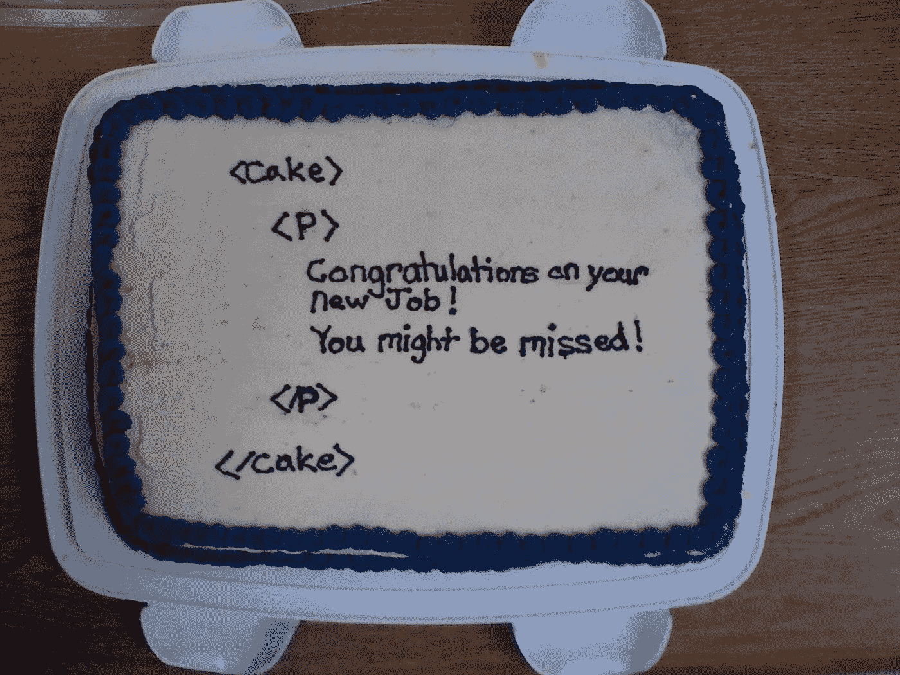

# JavaScript 中 slice()、splice()和 split()方法的恐怖与美妙

> 原文：<https://blog.devgenius.io/the-horror-and-beauty-of-slice-splice-and-split-methods-in-javascript-2126a58b7702?source=collection_archive---------20----------------------->

一些治疗师认为，分享创伤经历是治愈创伤的最佳方式。这就是为什么我用一条大新闻开始这篇博客:我第一次接触 JavaScript 发生在这个星期。

剧透:这完全是一场火车事故。

我的第一门编程语言是 Ruby，我逐渐喜欢上了它。感觉还是比 JavaScript 结构化多了，混乱少了。我可以没完没了地抱怨——语法、逻辑，所有的一切都是如此令人困惑！

是的，这张 gif 总结了我对 JS 及其易变行为的感受。

然而，有时候 Ruby 和 JavaScript 的操作方法非常相似。比如说三种方法——**slice()**、 **splice()** 和 **split()** 。这三个听起来非常相似，对吗？但是不要让 JS(或者 Ruby，但是今天让我们专注于 JavaScript)欺骗了你！这些方法大相径庭。

**I.** 科学地说， **slice()** array 方法提取一个字符串的部分，并将提取的部分返回到一个新的字符串中。人性化来说，它切片数组(请想象一个蛋糕！)并返回我们需要的部分。现在听起来很好吃。

好消息:它是非破坏性的，因此不会改变原始数组。

该方法的模板如下所示:

> arrayFirst.slice(from，until)；

**从**开始——我们从这个元素索引开始。

**直到** —我们正好在直到元素索引之前停止。这意味着它不包括 until 元素！

重要的是:这两个参数都是可选的。

*   如果不从定义**，slice()方法从 0 开始。**
*   如果我们在之前不定义**，slice()方法将沿着数组向下，直到它结束。**
*   如果我们不传递任何参数，slice()将克隆数组。可能也有用！

*别忘了:第一个字符的位置是 0，第二个字符的位置是 1，依此类推。和 Ruby 一样！*

让我们看看这个创造性的例子。

首先，我创建了一个小小的星球大战角色阵列。然后，我从勇敢的卢克·天行者开始，只切了光明面的角色。之后我决定只砍帝国佬(我的最爱，btw！).正如您所看到的，原始数组没有受到伤害。

*加成事实:slice()方法也可用于* ***字符串*** *。*

**二。** **拼接()**

这个方法听起来和 slice()很像，让开发者很困惑。实际上，这可能会导致严重的问题，因为 splice()方法是破坏性的:它通过添加或删除元素来更改数组。as bonus splice()方法返回数组中被删除的项。

这里有一个**移除元素**的模板。

> arrayFirst.splice(from，元素个数)；

**From** —我们开始从这个元素索引中删除

**元素数量** —我们移除多少元素。如果我们不定义这个参数，从声明的索引开始的所有元素都将从数组中删除

让我们看看我们的星球大战飞船阵列。

正如我们所看到的，我们从 starWarsShips[0]开始，删除了一个元素！

现在我们来谈谈**添加元素**。为此，我们需要传递更多的参数——根据我们要添加的元素数量。

> arrayFirst.splice(from，元素个数，元素，元素)；

**从**开始——我们开始添加

**元素数量** —我们移除了多少(如果您只想添加，请传递 ***0*** )

**元素** —我们添加的元素

让我们再看看我们的船。

我重新创建了原始的 ship 数组，删除了第三个元素，并传递了另外两个元素。轻松点。

**三。split()**

**split( )** 方法的主要区别在于:它用于**字符串**。它分割一个字符串，并以数组的形式返回我们得到的部分。如果我们将它用于数组，它将返回一个包含所有元素的数组，包括字符串和逗号之间的空格。不，没用。

但是，我们可以使用 array.toString()方法将数组转换为字符串。是的，就像这样！

split()的模板是:

> stringFirst.split(分隔符，限制)；

这两个参数都是可选的。

**分隔符** —定义我们如何分割字符串(使用逗号、列或其他)

**限制** —定义我们返回多少个元素

我们试试吧！

我们把原来的数组变成了一个字符串，创建了一个新的变量来保存一个新的数组，最后用。拆分("，"，5)。这意味着我们用逗号分隔所有元素，将它们限制为五个元素，并返回一个新数组。

我知道，太多了，而且很混乱。但你会明白的。

说到 JavaScript，我感觉到了其中最大的力量。这种语言真的很强大！对我来说，这只是一个练习的问题。

再多练习一下。

**来源:**

1.  [让我们澄清一下关于 slice()、splice()和 split()](https://www.freecodecamp.org/news/lets-clear-up-the-confusion-around-the-slice-splice-split-methods-in-javascript-8ba3266c29ae/) 的困惑
2.  [slice()方法的三种实用用法](https://www.javascripttutorial.net/javascript-array-slice/)
3.  [array . splice()vs array . slice()](https://www.tothenew.com/blog/javascript-splice-vs-slice/)
4.  Learn.co 资源公司