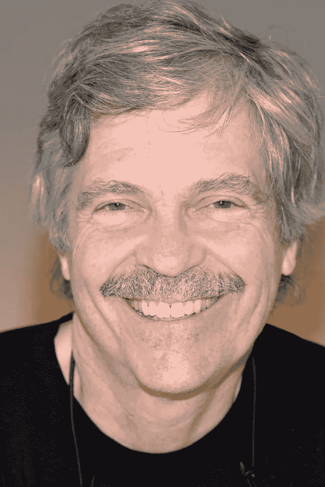

# 组件的概念

> 原文：<https://blog.devgenius.io/the-idea-of-components-18865a4eca59?source=collection_archive---------42----------------------->

最近 Quora 上有人问:*非程序员学习什么语言最好？*

令我高兴的是，回答问题的人正是艾伦·凯。如果你正在读这篇文章，你可能是计算机编程新手。因此，这个名字对你来说并不熟悉。

艾伦·凯是计算机科学史上最有影响力的人物之一。他是图形用户界面(*图形用户界面*)背后的关键人物，后来被苹果公司用于他们的麦金塔电脑。他(字面上)发明了术语*面向对象编程*，它已经成为计算的主导范式。

他发明了 Dynabook 的概念，这是现代笔记本电脑的前身。他赢得了无数奖项，其中包括极负盛名的图灵奖。

艾伦是一种被称为*建构主义的教学风格的强烈支持者。在建构主义中，学习者构建心智模型来理解他们周围的世界。*

建构主义提倡以学生为中心的发现式学习，即学生利用他们已经知道的信息来获取新知识。

*那么，艾伦对学习编程的最佳语言的回答是什么？*

艾伦说学习计算机编程的最好方法根本不是学习计算机语言。更确切地说，这是在培养一种能力，将计算机程序视为一个由独立的、相互作用的组件组成的系统。

这可能是我听过的关于计算机编程的最深刻的想法。我教过数百名程序员编程。最优秀的程序员是那些深刻理解这个概念的人。

这对我们意味着什么？在这一集里，我们将探讨这个想法。在这一集里你不会用到任何代码。(我们将在下一集讨论这个问题。)相反，我们将采纳 Alan 的想法，即我们应该使用人类代理来为系统建模。这有助于我们将程序拟人化。我们可能不太熟悉复杂的数据结构或复杂的算法，但我们都可以想象与人类一起执行一些任务。

让我们试一试。我们的目标是创建一个自动化咖啡机的模型。

[https://component-concepts.halbhelms.com](https://component-concepts.halbhelms.com)