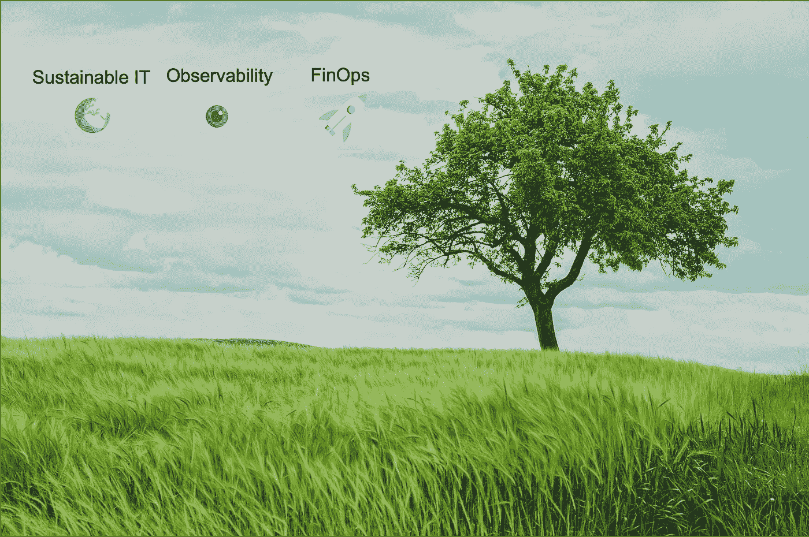
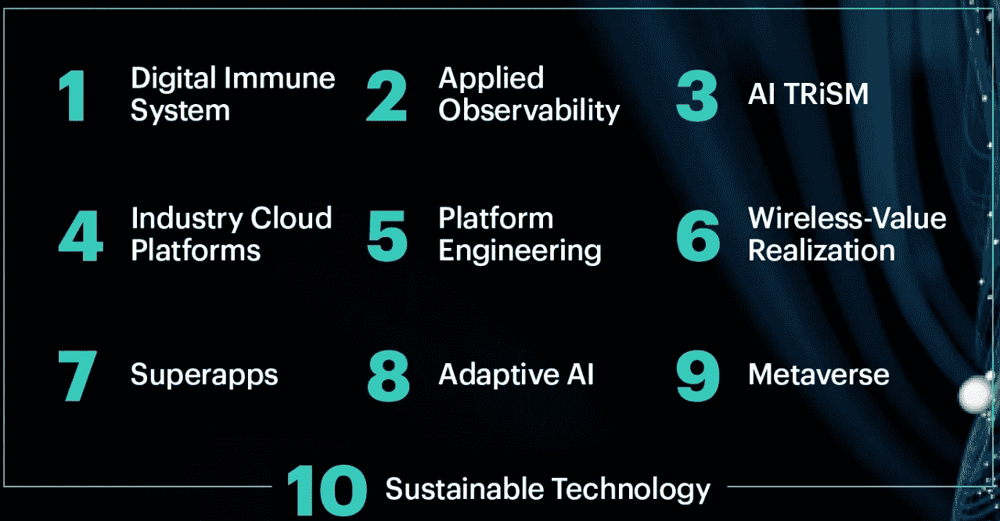
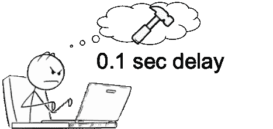
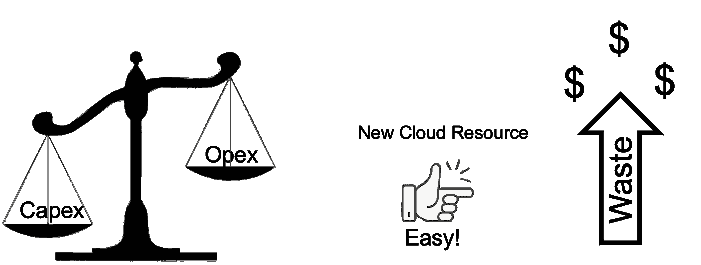
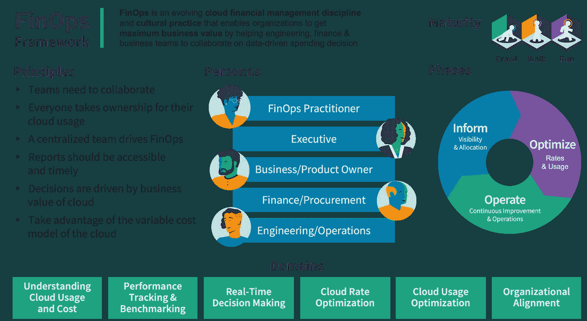
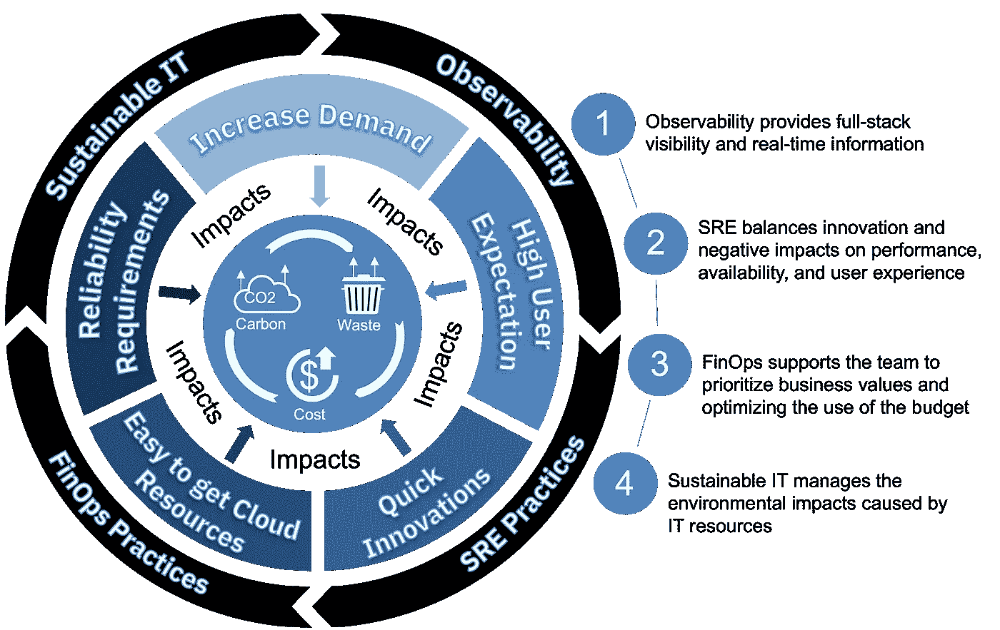

# FinOps、可持续 IT 和可观测性之间的交集。

> 原文：<https://blog.devgenius.io/the-intersections-among-finops-sustainable-it-and-observability-c290724db551?source=collection_archive---------3----------------------->

约翰·西门子在蒂亚戈·迪亚斯·格纳罗索改装的 [Unsplash](https://unsplash.com?utm_source=medium&utm_medium=referral) 上拍照

# 介绍

这篇文章将涵盖一些新的实践和激动人心的趋势，它们将改变和增强 IT 基础设施。

开发人员社区中的一个常见问题是，我为什么要使用可观察性？是的，最常见的回答是监控您系统的基础设施；这样，您的团队就可以看到可见性，并走在变化的前面。为什么这些回答是正确的了解您的业务目标如何与您的云基础架构相关联是观察您的系统的一个重要原因，尤其是对于 Saas 和电子商务行业。

对 FinOps 和 Sustainable 的进一步研究突出了投资可观测性的价值，因为这三种趋势的交汇点使组织能够在满足发展中的可持续世界和客户需求的同时保持领先。

[Gartner 2023 年十大战略技术趋势](https://www.gartner.com/en/articles/gartner-top-10-strategic-technology-trends-for-2023)

根据 Gartner 的 10 大战略趋势，上图中突出显示了这一点。数字化转型的发展和新 IT 创新的激增导致了 IT 公司向云的迁移。同时，这也带来了预期的结果。从内部基础架构迁移到云计算可以显著节约能源。虽然世界各地的组织都在采用云计算，但很少有人意识到它对环境的影响。可持续发展组织开展的一项研究；它发现只有 19%衡量了云的生态影响。由于获得更多云资源很容易，当公司开始追求性能、质量和创新时，浪费开始增加。

# 性能和质量要求

没办法等 0.1 秒

最终用户体验比以往任何时候都更需要不断提高的性能和可用性；没有人能等 0.1 秒就打开一个应用完成一个交易。

在关于 Spotify 故事的网飞系列“播放列表”中，他们讲述了丹尼尔·埃克要求音乐立即开始的要求；他没有接受他们更少；0.001 不够。

对可用性的需求是相同的；应用程序不可用的 10 分钟可能会损失数百万美元，因此 99.999%的正常运行时间是“最低”要求。

新技术和云原生应用的使用正在增长，因为它可以支持开发人员达到新的要求。然而，另一方面，跨混合、多云和异构基础设施管理分布式微服务应用的复杂性也显著增加。

它将我们带到一个场景，在这个场景中，财务团队优先考虑商业价值，降低成本，发展业务，并满足法规(包括可持续性)。应用团队优先考虑新功能、创新、快速交付和高质量的服务器。SRE 应该支持创新，但也应该致力于避免对性能、可用性和用户体验的负面影响。

# 费用要求

主要是在 COVID 疫情之后，云成本大幅增长，浪费居高不下。一旦这些公司将工作负载转移到云，他们就将成本模式从资本支出模式转变为运营支出模式，这在理论上是好的。然而，另一个因素开始出现，在云中创建新组件很简单，请求新服务器也很快很容易，正因为如此，公司开始失去对这些成本的控制。

据[福布斯报道，](https://www.forbes.com/sites/joemckendrick/2020/04/29/one-third-of-cloud-spending-wasted-but-still-accelerates/?sh=2448c075489e) 30%的云支出是浪费。然而，问题是要定义这些浪费在哪里，因为企业希望继续增加新云服务的使用，以允许他们发展业务。

[加速财务运营和可持续 IT](https://www.google.com/url?sa=t&rct=j&q=&esrc=s&source=web&cd=&cad=rja&uact=8&ved=2ahUKEwiFyITlr8r7AhVzLLkGHfTjBlQQFnoECBIQAQ&url=https%3A%2F%2Fwww.ibm.com%2Fdownloads%2Fcas%2FGJRGDWGK&usg=AOvVaw1XslpUD9HWjXeSllpzr80I) 文章称电力约占数据中心运营成本的 70%

[凯捷可持续 IT 报告](https://www.capgemini.com/au-en/wp-content/uploads/sites/9/2021/05/Sustainable-IT_Report.pdf)提供了关于成本和浪费的详细信息。

# 可持续需求

当然，我们知道可持续发展不是什么新鲜事；我们到处都能看到讨论；联合国总是在不同的论坛上讨论它，制定了京都议定书和巴黎协定来减少碳足迹。此外，其他行动正在发生，如在公司应该开会的许多县建立政府规章。

很快，人们期望这项技术能够消耗掉世界总电量的 20%。

一旦 IT 公司对每天产生的大部分碳足迹负责，他们也应该为所有这些行动做出贡献。但不幸的是，如今只有 18%的公司拥有全面的可持续 IT 战略。

你还可以在 Stacey M Gifford 创作的这篇优秀文章中了解更多: [**跨越它的可持续性简史**](https://medium.com/dont-boil-the-ocean/a-brief-history-of-sustainability-across-it-c6f689acdf20) **。**

可持续 IT 可以解释为用于减少 IT 资源造成的环境影响的所有计划。但是为什么公司对它感兴趣呢？基本上是为组织创造效益、遵守政府法规、提高公司声誉和降低成本。

Gartner 还将可持续 IT 列为 2023 年[十大战略技术趋势之一](https://www.gartner.com/en/newsroom/press-releases/2022-10-17-gartner-identifies-the-top-10-strategic-technology-trends-for-2023)，正是因为我之前提到的原因。

但是，当一家公司在云上运行其应用程序时，谁来负责可持续性呢？可持续发展是一项共同的责任，云提供商负责云基础设施，使用耗电量更少的现代 IT 资源(冷却系统、供应链、减少用水量)；云客户负责以最佳方式使用云资源，以涵盖整个堆栈的整体方式评估工作负载。

全栈评估是组织实现弹性和可持续运营的更好策略。

# 解决方案

为了解决这三个主要因素，您的团队可以专注于实现新兴的实践，例如可观测性、FinOps 和 SRE 方法。

您可以调整您的财务运营和可持续 IT，以解决三个主要因素。这个我在这里详细讨论。

# FinOps

> FinOps 是一种不断发展的云财务管理规则和文化实践，通过帮助工程、财务、技术和业务团队协作制定数据驱动的支出决策，使组织能够获得最大的商业价值。— [财务组织](https://www.finops.org/introduction/what-is-finops/)

换句话说，FinOps 为运营增加了财务和成本控制，不仅是为了降低成本，也是为了有效地利用预算来促进创新和提高质量、速度以及可持续发展(GreenOps)。

FinOps.org

正如您在图中看到的，所有的人物角色都应该参与到整个流程中，财务数据应该对每个人都是实时可用的，每个人都应该根据业务目标来推动决策。

**情景您可以使用 FinOps 做出更好的决策:**

*   你整个平台都慢；您在您的可观察性平台上看到，有些应用程序需要改进以解决延迟问题；与此同时，由于您承诺在本月交付新功能，将为平台带来更多客户，因此您的团队工作量很高。根据财务报告，FinOps 团队可以决定是否更好地使用预算来增加云资源，以解决延迟问题并交付新功能，或者更好地重新调整团队工作以解决应用延迟问题，更改代码并推迟新功能。
*   您有一个工作负载每周在云上运行一次，您知道工作负载行为，并且您有不止一个云提供商；一家云提供商按 GB /月收费，另一家云提供商按出口流量收费。基于您的财务报告和工作负载行为，您可以决定将特定的工作负载发送到哪里以降低成本。

**FinOps** 相互支持**可持续 IT** 反之亦然；两者都能带来成本优化和碳足迹减少。当然，我们可以有这样的场景，我们可以降低成本，但不能精确地减少碳足迹(例如，为特定的工作负载使用不同的云提供商)。不过，总的来说，降低成本会减少浪费，减少浪费会减少碳足迹。

# 结论

蒂亚戈·迪亚斯·格纳罗索

上图向我们展示了一些基本需求，比如不断增长的需求、高用户期望、快速创新、轻松获得更多 IT 资源以及可靠性需求。

所有这些都给我们带来了一些我们想要解决的关键问题，例如云浪费的增加、成本的增加以及由此产生的碳足迹的增加。

可观察性将带来与应用程序性能和度量相关的可见性、组件之间的相关性、消耗资源的代码问题的识别，等等。

SRE 实践将支持团队如何处理 Observability 的数据，永久修复应用程序问题，并做出平衡创新和可靠性的决策。

FinOps 将把财务信息带入游戏，让团队不仅可以根据技术数据，还可以根据业务目标和成本做出决策。

可持续 IT 还将为整个团队带来可持续发展数据，使他们能够做出决策，思考解决方案产生的影响，并满足可持续发展法规。

我希望这篇文章能帮助你理解这些概念，并把它们结合起来支持公司的目标。

*Tiago Dias Generoso 是巴西 Pocos de Caldas 的杰出 IT 架构师|高级 SRE |主发明家。以上文章为个人观点，不一定代表雇主的立场、策略或观点。*