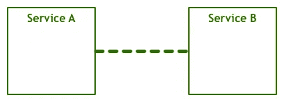
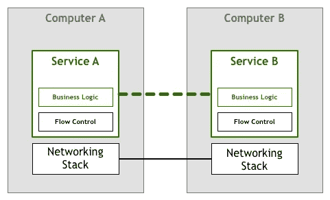
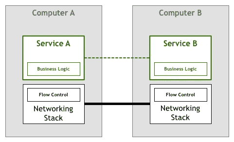
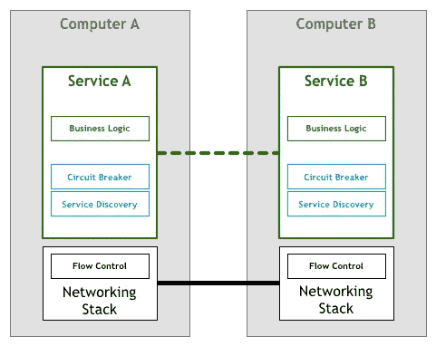
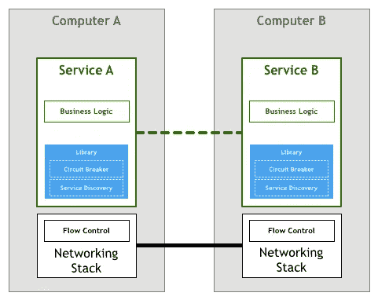
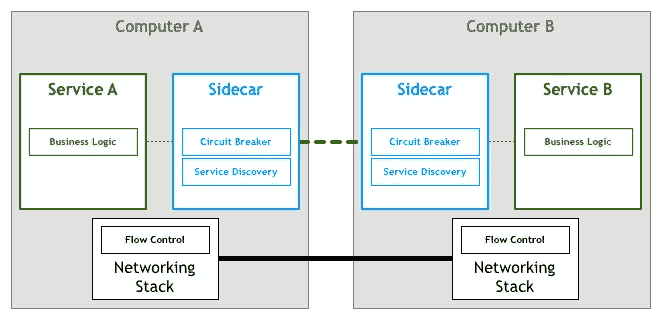
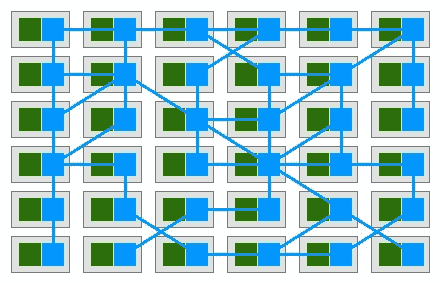
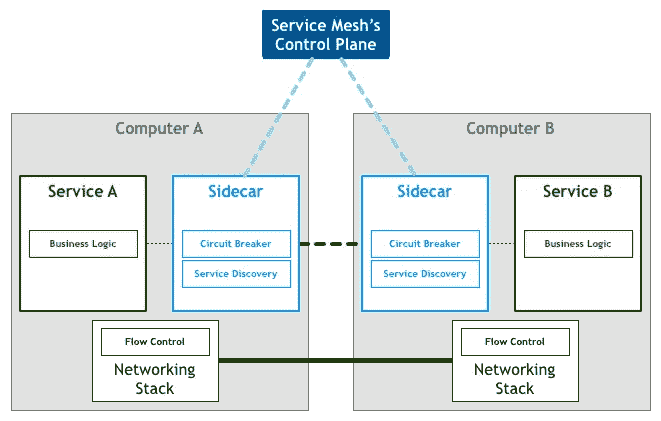
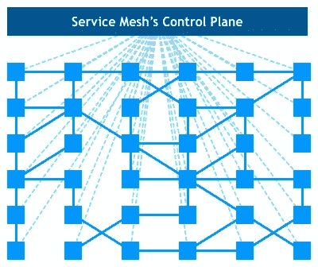
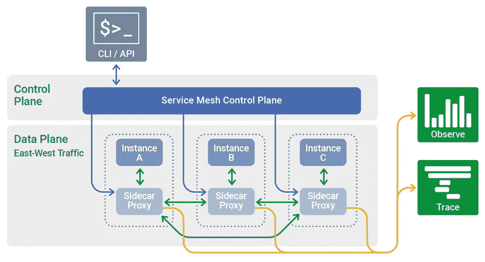

# 服务网格简介

> 原文：<https://blog.devgenius.io/the-introduction-of-service-mesh-710d9b566df0?source=collection_archive---------3----------------------->

[森](https://unsplash.com/@sen7?utm_source=medium&utm_medium=referral)在 [Unsplash](https://unsplash.com?utm_source=medium&utm_medium=referral) 上拍照

## 它是一种网络模型，位于 TCP/IP 之上的抽象层。

> [如果你觉得我为你贡献了价值，请支持我！](https://ko-fi.com/jinlowmedium)

上个月，我感觉我的收入几乎立刻减少了。我越来越难获得我想要的收入，但如果我停下来，我会为我推荐的会员感到难过。请告诉我原因以及如何改进。

这已经不是一个新概念了。随着云原生时代的到来，微服务架构和容器化部署模型正变得流行。单片应用被拥抱微服务的架构师拆分成小而独立的微服务，然后被拥抱容器化的工程师打包成自含式微服务。然而，分布式应用的运维管理成本呈指数级增长。各模块之间的交互可以通过进程间通信直接调用，但现在分成不同的进程甚至节点，只能使用复杂的 **(** [**远程过程调用**](https://en.wikipedia.org/wiki/Remote_procedure_call) **) RPC 通信**。

众所周知，分布式微服务框架有很多，如 Spring Cloud、Dubbo、ServiceComb、Envoy、Service Fabric 等。为什么我们需要服务网格？这是因为它是处理服务间通信的基础设施层。云原生应用具有复杂的服务拓扑，服务网格确保请求通过这些拓扑可靠地传输。实际上，服务网格通常由一系列与应用程序一起部署的轻量级网络代理组成，但它对应用程序是透明的。它被称为下一代微服务架构。

> 基础设施层+请求通过这些网络拓扑可靠地传输+网络代理+对应用透明

为了理清这些复杂的概念，我们先来了解一下微服务和服务网格技术的历史发展。

[**Phil Calcado 的文章《模式:服务网格》**](https://philcalcado.com/2017/08/03/pattern_service_mesh.html) 从开发者的角度详细描述了服务开发模式和服务网格技术的演进。

*   **时代 0** :不同服务之间的沟通方式

图片来源: [**菲尔·卡尔卡多**](https://philcalcado.com/2017/08/03/pattern_service_mesh.html)

*   **纪元 1:** 原始人的交流

图片来源: [**菲尔·卡尔卡多**](https://philcalcado.com/2017/08/03/pattern_service_mesh.html)

然而，通信应该由能够传输字节码和电子信号的底层物理层来完成。在 TCP 协议实现之前，服务必须处理丢包和网络通信紊乱、重试等一系列流量控制问题，网络传输的处理逻辑，以及业务逻辑。

*   **时代 2:**TCP 协议的实施时代

图片来源: [**菲尔·卡尔卡多**](https://philcalcado.com/2017/08/03/pattern_service_mesh.html)

为了避免每个服务实现一套相似的网络传输处理逻辑，TCP 协议的实现可以解决网络传输中一般的流量控制问题。因此，它将流控制从业务逻辑中分离出来，成为操作系统网络层的一部分。

*   **时代 3** :第一代微服务

图片来源: [**菲尔·卡尔卡多**](https://philcalcado.com/2017/08/03/pattern_service_mesh.html)

TCP 出现后，计算机之间的网络通信不再是问题。分布式系统特有的通信语义再次出现，如负载平衡、服务发现、认证和授权、配额限制、跟踪和监控、断路器策略等。开发了很多分布式系统如 [**Google 文件系统**](https://medium.com/geekculture/google-file-system-architecture-cdeabef3f1ea) 、BigTable、MapReduce 等。因此，服务根据一些业务需求实现了一些必需的通信语义。

1.  **服务发现**:解决如何寻找特定服务的问题
2.  **断路器**:减轻服务间依赖的不可靠性
3.  **负载均衡**:通过平均分配流量和请求
4.  **:协议加密( [**传输层安全、TLS**](https://en.wikipedia.org/wiki/Transport_Layer_Security) )、身份认证( [**证书/签名**](https://support.microsoft.com/en-us/office/digital-signatures-and-certificates-8186cd15-e7ac-4a16-8597-22bd163e8e96) )、访问认证( [**基于角色的访问控制、**](https://en.wikipedia.org/wiki/Role-based_access_control) )等**

*   ****时代 4** :第二代微服务**

****

**图片来源: [**菲尔·卡尔卡多**](https://philcalcado.com/2017/08/03/pattern_service_mesh.html)**

**为了避免每个服务实现一套类似的分布式系统的通信语义，出现了一些新的微服务框架。这些框架实现了分布式系统通信所需的各种常见语义功能，比如负载平衡和服务发现。**

*   ****时代 5:第一代服务网****

****

**图片来源: [**菲尔·卡尔卡多**](https://philcalcado.com/2017/08/03/pattern_service_mesh.html)**

**第二代微服务看似完美，但在开发一个系统时却带来了一些本质问题。框架屏蔽了分布式系统中一些常见功能的实现细节，开发人员花费大量时间管理复杂的框架和解决实际应用中的问题。此外，该框架只支持几种特定的语言。在面向微服务的架构系统中，很难因地制宜地用多种语言实现不同的模块。此外，框架中的服务是以库的形式出现的。当复杂项目依赖于框架中的库时，库版本兼容性问题很难解决。**

**于是，以 [**Linkerd**](https://linkerd.io/) **，** [**特使**](https://www.envoyproxy.io/) ，[**NginxMesh**](https://www.nginx.com/products/nginx-service-mesh/)**为代表的代理模式(sidecar 模式)被开发出来。****

********

****图片来源: [**菲尔·卡尔卡多**](https://philcalcado.com/2017/08/03/pattern_service_mesh.html)****

****在这样的模型中，每个服务将有一个代理 sidecar。如果我们忽略服务，网络就是由服务网格的独立组件组成的。就是解决服务间的沟通和治理问题。应用服务通过 Sidecar 进行通信，整个服务通信形成了上图中的网络连接。****

*   ******时代 6** :第二代服务网****

********

****图片来源: [**菲尔·卡尔卡多**](https://philcalcado.com/2017/08/03/pattern_service_mesh.html)****

****第一代服务网格由一系列独立的代理服务组成。集中控制面板用于控制上层操作和维护入口。所有独立代理组件都与控制面板交互，以更新网络拓扑策略。这就是以 Istio 为代表的第二代服务 Mesh。****

********

****图片来源: [**菲尔·卡尔卡多**](https://philcalcado.com/2017/08/03/pattern_service_mesh.html)****

****服务网格的全局部署视图显示了独立代理组件和控制面板。****

******服务网格的主流实现******

1.  ******Linkerd(浮力)**—开发语言使用 Scala。****
2.  ******特使(Lyft)** —开发语言使用 C++11。****
3.  ****Istio (Google & IBM) —开发语言使用 Go。****
4.  ******导管(浮力)** —开发语言使用 Rust 和 Go。****

******Linkerd******

****服务代理的核心逻辑****

1.  ******动态路由** —根据上游服务请求参数确定下游目标服务；和传统的服务路由策略。它还使用这一层来支持非常有价值的场景，如灰度、出版、A/B 测试和环境隔离****
2.  ******服务发现** —确定目标服务后，获取相应对象的地址列表****
3.  ****[**负载均衡**](https://linkerd.io/2016/03/16/beyond-round-robin-load-balancing-for-latency/) —如果列表中有多个地址，它将通过负载均衡算法(循环法、负载最小、峰值 EWMA)选择其中一个合适的低延迟对象****
4.  ******执行请求** —向对象发送请求****
5.  ******重试处理** —如果请求没有得到响应，选择另一个对象重试****
6.  ******断路器处理** —如果对一个对象的请求经常失败，该对象将从地址列表中删除****
7.  ******超时处理** —如果请求过期，将返回失败响应****
8.  ******可观察性** —持续收集并报告行为数据****

******特使******

****其核心特点:****

1.  ******高性能** —使用 C++11 语言****
2.  ******可扩展**—L4 和 L7 层代理功能基于可插拔过滤器链机制****
3.  ******协议升级** —支持双向、透明的 HTTP/1 到 HTTP/2 代理功能****

******Istio******

********

****图片来源:欧文·加勒特于 [**F5 公司**](https://www.nginx.com/blog/what-is-a-service-mesh/)****

****其主要组件:****

1.  ******特使** —与控制平面形成数据平面****
2.  ******驾驶员**——负责交通管理****
3.  ******混合器** —负责策略&控制，核心功能包括预检、配额管理、遥测报告****
4.  ****Istio-Auth —支持多种粒度的 [**基于角色的访问控制(RBAC)**](https://en.wikipedia.org/wiki/Role-based_access_control) 权限控制，支持双向 [**安全套接字层(SSL)**](https://www.cloudflare.com/learning/ssl/what-is-ssl/) 认证**，**包括身份认证、通信安全、密钥管理****

******导管******

****其主要特点:****

1.  ******轻巧快速**——使用 Rust 语言****
2.  ******安全** —默认 [**传输层安全**](https://en.wikipedia.org/wiki/Transport_Layer_Security) (TLS)加密****
3.  ******增强功能** —可靠性、可见性和安全性****
4.  ******端到端可见性** —它衡量服务成功率、延迟和请求量****

****总之，它有一些优点:****

1.  ****屏蔽分布式系统通信的复杂性。开发人员关注业务逻辑****
2.  ****语言并不重要****
3.  ****对应用程序透明****

****它有一些缺点:****

1.  ****它以代理模式计算和转发请求，降低了通信系统的性能，在一定程度上增加了系统资源开销****
2.  ****它接管网络流量。系统的整体稳定性取决于服务网格。****

******参考文献******

**** [## 图案:服务网格

### 自从几十年前第一次引入分布式系统以来，我们了解到分布式系统能够实现我们甚至无法…

philcalcado.com](https://philcalcado.com/2017/08/03/pattern_service_mesh.html)  [## GitHub-link erd/link erd:link erd 1 . x 的旧 repo。请参阅 Linkerd 2.x 的 linkerd2 repo。

### 这个回购是为了 1。Linkerd 的 x 版本。linkerd2 repo 现在正在进行功能开发。这个回购是…

github.com](https://github.com/linkerd/linkerd)  [## 概观

### Linkerd 是 Kubernetes 的一个服务网。它通过为您提供运行时调试，使运行服务更加容易和安全…

linkerd.io](https://linkerd.io/docs/)  [## 边车模式-蔚蓝建筑中心

### 将应用程序的组件部署到单独的进程或容器中，以提供隔离和封装。这个…

docs.microsoft.com](https://docs.microsoft.com/en-us/azure/architecture/patterns/sidecar)  [## Linkerd 与 Istio，2022 年服务网格比较

### Istio 和 Linkerd 都是服务网格。这两个项目有相似的目标:增加可靠性、安全性和…

浮力. io](https://buoyant.io/linkerd-vs-istio)  [## 服务网格平台的探索性指南

### 本周和下周，News Stack 将会发布一系列关于服务网格给…带来的价值的文章

thenewstack.io](https://thenewstack.io/an-exploratory-guide-to-the-service-mesh-platforms/)  [## 什么是服务网状❓ -所有你需要知道的

### 在结构层次上，它指的是网络代理集合。所使用的代理以串联模式排列。这里…

www.wallarm.com](https://www.wallarm.com/what/what-is-service-mesh)  [## 如何选择服务网格- NGINX

### 这篇文章是由 10 部分组成的系列文章的一部分:用生产级 Kubernetes 降低复杂性

www.nginx.com](https://www.nginx.com/blog/how-to-choose-a-service-mesh/)  [## 14 大 Kubernetes 服务网格

### 服务网格解决了由微服务和…引入的流量管理、安全性和可观察性挑战

首席执行官](https://thechief.io/c/editorial/top-14-kubernetes-service-meshes/)  [## 评估关键服务网格优势和架构限制

### 到 2005 年，精通容器的开发人员和操作人员面临着为…安装和管理通信的棘手挑战

www.techtarget.com](https://www.techtarget.com/searchitoperations/tip/Evaluate-the-benefits-drawbacks-of-service-mesh-technologies)  [## 服务网格的兴起:企业如何利用它

### Docker 容器、微服务和 Kubernetes 已经是旧闻了——或者至少，它们已经成为主流，以至于它们…

www.talentica.com](https://www.talentica.com/blogs/the-rise-of-service-mesh-how-can-businesses-use-it/) 

***如果你发现我的任何文章有帮助或有用，那么请考虑给我一杯咖啡，帮助支持我的工作或给我赞助😊，通过使用*中的**

[**Patreon**](https://www.patreon.com/jinlowmedium)

[**Ko-fi.com**](https://ko-fi.com/jinlowmedium)

[buymeacoffee](https://www.buymeacoffee.com/jinlowmedium)

*最后但同样重要的一点是，如果你还不是灵媒会员，并打算成为灵媒会员，我恳请你使用以下链接。我将收取你的一部分会员费，不增加你的额外费用。*

 [## 用我的引荐链接-金加入 Medium

### 阅读金(以及其他成千上万的作家)的每一篇小说。你的会费直接支持金和…

jinlow.medium.com](https://jinlow.medium.com/membership)****