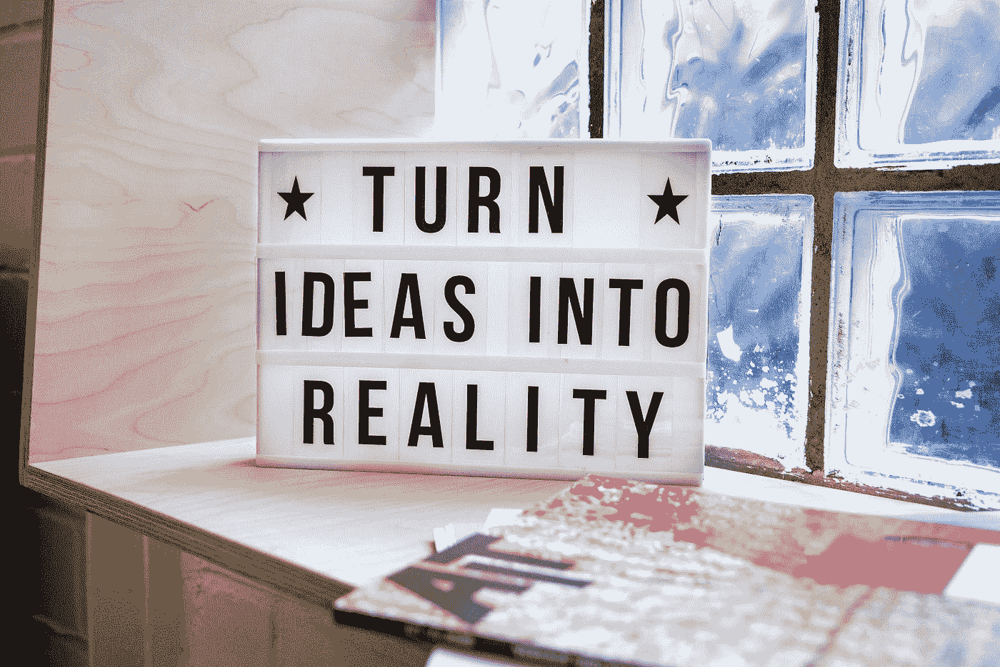

# 看不见的病:分享没关系。

> 原文：<https://blog.devgenius.io/the-invisible-illness-its-okay-to-share-57eae10c518b?source=collection_archive---------11----------------------->

我们大多数人出生并成长在一个社会中，在这个社会中，表现出悲伤往往被认为是软弱的表现。忧郁的人被认为是情感脆弱的，而从不忧郁的人是坚强的。同时，我们也相信“我们都有好的和坏的日子。没有人能一直快乐，那不是人类。但同样真实的是，表现悲伤和分享忧虑是勇敢的冒险。

我们都很熟悉这句话:**【分享就是关爱】**。这是童年时很受欢迎的想法，但成年后就被忽视了。最主要的原因可能是害怕被评判。有些人总是挑毛病，而有些人不值得信任。但是，让我告诉你 ***每个人都不一样*** 。不是你朋友名单上的每个人都在等着评判你或嘲笑你。有些人真的愿意帮忙。他们不会和任何人分享你的烦恼，也不会嘲笑你。

现在，让我告诉你向某人透露你的想法的好处。要么他们会 ***支持*** 和 ***真正的*** 足以帮助你，要么他们会 ***判断心理*** ，如果他们被判断心理，你不需要他们。因此，你将摆脱一个 ***无赖*** 如果一切顺利，你将遇到一个 ***真正真诚的人*** 愿意帮助你。而且，有很多人会乐意帮助任何有需要的人。

有些人会不惜一切代价让你开心。他们只是把 ***支持你的想法当做他们最关心的事情*** 。有些人即使在你最困难的时候也会和你在一起。他们不期待什么，只期待你的幸福。他们会认为自己是足够幸运的，能够以任何方式帮助你。**“是的，这些人确实存在”。**

[达斯汀·贝尔特](https://unsplash.com/@dbeltwrites?utm_source=medium&utm_medium=referral)在 [Unsplash](https://unsplash.com?utm_source=medium&utm_medium=referral) 上拍照

然而，有时这完全取决于你的正确选择。你需要明智地选择它们。如果选择正确，它们可能是最有帮助的，但是如果选择错误，它们可能会对你的健康造成灾难性的影响。他们很大程度上决定了你的情绪，因为他们可能是那些不断激励你成长并在每次失败时更加努力的人，也可能是那些嫉妒你每次成功的人。他们应该是那些会支持你的人，即使你不经常向他们唠叨。因此，与他们分享悲伤和烦恼是值得的。

分享不会让你变得软弱或不独立，相反，它会极大地打开你的思维，让你有伟大的发现。因此，导致 ***最小的过度思考*** 。过度思考通常会导致个人失望。这让你觉得自己什么都不配。它只是制造了一些根本不是问题的问题。它促使你寻找悲伤的理由，并占用你的大部分资源，最终导致痛苦。所以，一个人应该**“停止过度思考，开始行动”**。

照片由[米卡·鲍梅斯特](https://unsplash.com/@mbaumi?utm_source=medium&utm_medium=referral)在 [Unsplash](https://unsplash.com?utm_source=medium&utm_medium=referral) 上拍摄

> “不好也没关系”

这是一个非常有名的俚语，但是绝对不行，不行。你应该可以做任何你想做的事情或者为之奋斗。但是基本的概念应该是**“没关系，无论发生什么，都会发生。”**永远不要满足于**不好**。这是不道德的。这只是一句谚语，让你明白没关系，每个人都在以某种方式战斗，你并不孤单，但你永远不应该惰性。如果你意识到你不好，你应该立即努力工作，而不是在痛苦中寻找安慰。

## 结论:

只是承认，每个人都有自己的战斗。他们是伟大的战士，但除此之外，他们中的一些人会找到理由留下来帮助你，而另一些人会因为一个愚蠢的理由离开你。但是每个人都做得很好。所以，为每一个为实现目标而奋斗的人大声喊出来。

希望你觉得它有帮助，并随时添加注释，我会确保以任何可能的方式帮助你。

谢谢大家！