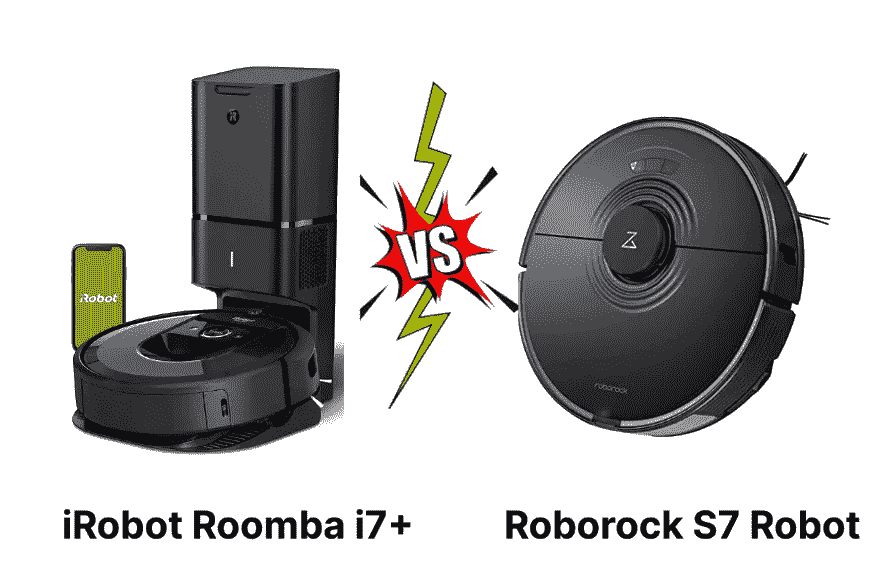
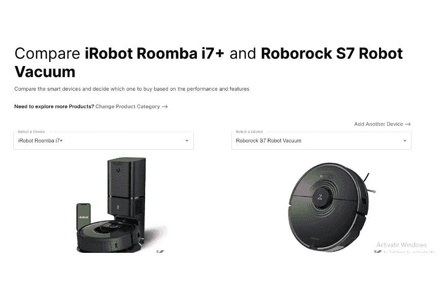
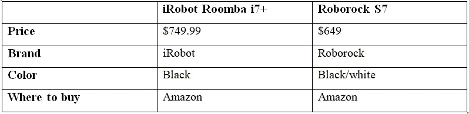

# iRobot Roomba i7+ vs Roborock S7 机器人真空吸尘器

> 原文：<https://blog.devgenius.io/the-irobot-roomba-i7-vs-roborock-s7-robot-vacuum-b1c989172d4e?source=collection_archive---------3----------------------->

如果你有最好的机器人吸尘器，它会为你做得很好。有时候，在忙碌的一生中，你会忘记手动清洁地板。但是，这些机器人吸尘器会拾取各种灰尘和宠物毛发。此外，他们可以在你想去的时候去，你甚至可以在你不在家的时候安排你的机器人吸尘器。还有许多其他功能，如自清空模型、映射功能等。让我们找出最好的机器人真空，下面是 iRobot Roomba i7+和 Roborock S7 的区别。

iRobot Roomba i7+与 Roborock S7 机器人真空吸尘器

***在这篇文章中，你会学到；***

*   「iRobot Roomba i7 +」和「Roborock S7 机器人真空」是什么？
*   iRobot Roomba i7+和 Roborock S7 的功能比较
*   比较工具对我有什么帮助？
*   价格比较
*   Roborock 比 Roomba 好吗？

# 「iRobot Roomba i7 +」和「Roborock S7 机器人真空」是什么？

[iRobot Roomba i7+](https://kodmy.com/the-best-robot-vacuum-in-2021/) 是一款机器人吸尘器，具有自动垃圾处理等神奇功能，可以自行清空。由于它的设计，你不需要定期清空灰尘箱，也不用再担心用吸尘器打扫房间了。它具有 vSLAM 导航功能，允许它了解您的家庭布局并构建个人智能地图。你可以通过 iRobot 应用程序或使用语音来控制它。同样，这个 iRobot 通过智能地图功能从你的客厅知道你的厨房。它也非常适合你的宠物，因为它独特的双多面橡胶刷。

快一点！ [***从亚马逊***](https://amzn.to/3i0sOY6) 获得 iRobot Roomba i7+机器人真空。

[Roborock S7](https://kodmy.com/roborock-s7-robot-vacuum-and-mop/) 是最新的机器人吸尘器和拖把，适合您的家庭使用。它具有特殊的特性，如橡胶侧扫刷、突出的激光雷达传感器阵列和全塑料结构。感谢 S7 基于激光雷达的导航。你现在可以有效地清洁地板了。此外，由于其集成摄像头的优势，它是 Roborock S6 MaxV 的更好替代产品。是的。它具有声波拖地功能，可以有效地拖地。

快一点！ [***从亚马逊***](https://amzn.to/3AzJ35K) 获取之前版本的 Roborock S7。

# iRobot Roomba i7+和 Roborock S7 的功能比较

当我们为家庭选择最佳设备时，我们倾向于比较两个或更多设备。那么，我们来了解一下 iRobot Roomba i7+和 Roborock S7 机器人真空的[对比。](https://kodmy.com/compare/smart-robot-vacuums?modelList=irobot-roomba-i7-plus,roborock-s7-robot-vacuum)

*   **真空功率和拖地速度**

iRobot Roomba 具有 1700pa 的吸力，与 Roomba 600 系列相比，它的吸力大十倍。它还有一个灰尘检测传感器，可以在特别脏和高流量的区域自动增加 Roomba 的吸力。

市场上有许多混合机器人。但 Roborock S7 与它们不同。它可以同时拖地和吸尘，可以一次性清洁整个地板。此外，它在光滑的地板上擦洗，只是用湿布擦拭地板。它有 2500 帕的吸力。因此，它足以松动和提升低绒和中绒地毯上的灰尘，去除宠物毛发等。

*   **地毯识别技术**

S7 用地毯识别技术解决了拖地问题。它可以扫描表面，并识别它是光滑的还是铺有地毯的地板。一旦检测到地毯，它会自动停止供水，并增加吸力。此外，iRobot Roomba 是地毯和硬地板的理想选择。它有独特的双多面橡胶刷。此外，这些刷子可以弯曲和调整，以保持与硬地板和地毯的持续接触。

*   **App 和语音支持**

iRobot Home 应用程序适用于 iRobot Roomba i7+。一旦 i7 第一次绕着房子转，这个应用程序就会显示一张地图。此外，您还可以使用该应用程序安排每天、每周或每天的日程。它也给你充电时间，清洁时间，箱子被清空的次数，和平方英尺真空。

S7 机器人真空系统通过 Roborock 应用程序支持亚马逊 Alexa 和谷歌助手以及智能手机。放心吧！您可以控制日程安排功能、无拖把区域、接收实时进度警报、手动操纵机器人，以及选择要清洁的房间和时间。

*   **多级映射能力**

Roborock S7 可以在内存中存储四张地图，因此可以轻松地在多层住宅中导航。首次将 Roborock S7 放在任何房间，它都会自动检测您所在的楼层。您还可以使用该应用程序定义无清洁区和特定房间。

iRobot Roomba 具有印记智能映射。因此，它可以学习房子周围的路，并创建一个平面图。你的机器人可以决定在哪里清洁，什么时候清洁。它知道你的客厅和厨房，并避开敏感区域，如宠物碗或游戏区。

*   **自动清空坞站**

iRobot Roomba i7+有一个污物处理坞站。所以，你不需要清空它的垃圾箱。i7+带有自动污物处理功能，可自行清空。一旦 iRobot 在码头上，码头上的塔就会把箱子里的东西吸到一次性袋子里。你不需要担心忘记更换垃圾袋。你可以通过智能手机应用程序获得满袋提醒。

Roborock 自动清空坞站现可用于 S7。您想与 Roborock S7 一起单独购买。清理后，灰尘会自动清空。它有一些特定的功能，如集尘袋支持，多层空气过滤，应用程序控制的清空，等等。

# 比较工具对我有什么帮助？

iRobot 和 Roborock 机器人都很棒。但我想为我的家选择最好的机器人吸尘器。当我在寻找合适的吸尘器时，我发现了最好的智能设备比较工具来比较我最喜欢的吸尘器。

我认为这是比较你最喜欢的智能家居设备的最好方式，我从中得到了一些好东西。您可以轻松比较设备的所有特性，如一般信息、定价、尺寸&重量、设计、功率、辅助功能、特殊功能、其他信息、最佳价格链接、优点和缺点。

如果你希望买到最好的设备，你可以尝试这个智能工具来比较和选择合适的设备。您最多可以比较 3 台设备。我得到了正确的信息，我想为我的智能家居购买最好的设备。您只想选择类别和设备。我确定。这对你有好处。

# 价格比较

# Roborock 比 Roomba 好吗？

两种机器人吸尘器各有所长，因此您可以根据自己的具体需求选择其中一种。Roborock 需要定期维护的部件更少，构造更好，经常性成本更低，在裸露的地板上清洁更有效。它也有更长的最大运行时间，但比 iRobot 需要更长的充电时间。然而，iRobot 的充电底座内置了一个外部灰尘隔间，在低绒和高绒地毯上表现更好。