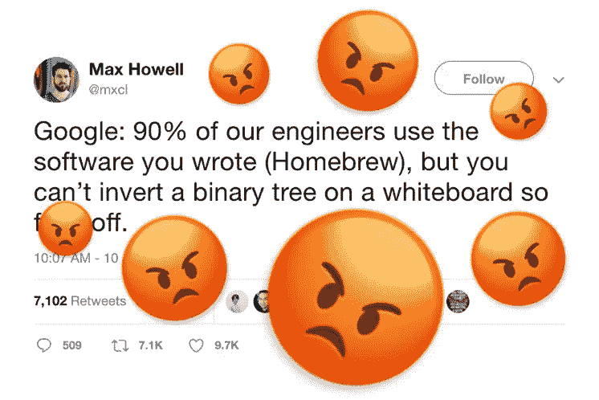

# 他们应该问的 Javascript 面试问题

> 原文：<https://blog.devgenius.io/the-javascript-interview-questions-they-should-ask-fb07ae2cd070?source=collection_archive---------35----------------------->


你说你懂 Javascript，那你用 Typescript 实现 Djikstra 的算法怎么样？

好的——这些年来我做了不少采访，可能总共至少有 20 次。在这段时间里，我也面试了十几个候选人，我不得不承认，我掉进了一个陷阱，问了一些和我被问到的基本相同的 Javascript 问题。我想 [Kyle Simpson](https://medium.com/@getify) 可能每次我让候选人在一个数组中寻找重复的时候内心都会有点死🤦‍♂.

有些问题被提了太多次，以至于变得老生常谈:找到一个复制品，FizzBuzz，3sum，2sum 等等。这些玩具问题可以提供一些关于候选人如何处理问题的见解，但更多的时候，它们实际上只是显示了这个人花了多少时间学习 Leetcode。公平地说，有些时候您需要遍历一个树状结构，或者想出一个高效的方法来存储数据，并进行持续的时间查找。我还认为，学习数据结构和通用算法是一种优秀的品质，显示了奉献精神和学习意愿，这是大多数工程团队希望他们的成员具备的品质。但是让我们现实一点——作为一名 JS 开发人员，你的日常工作将会少很多 Djikstra，多很多`npm install`

这些测试真正想要确定的是什么？候选人将会知道足够的 JS 来成功地使用你的代码库？他们对 Javascript 的掌握整体是什么水平(他们懂闭包、继承、函数式编程吗)？或者是为了看看他们在与陌生人共处一室的尴尬环境下，如何更好地交流他们的思维过程？也许以上所有的一些组合？

无论是谷歌、脸书还是你的公司，它们可能认为自己是下一个谷歌或脸书——我见过面试中提出的问题，归结为在理解普通 CS 基础知识的同时巧妙运用 JS，或者更糟糕的是，你可以很容易地查找模糊的 JS 概念(如果你运行`isNaN === isNaN`，会发生什么)。一定有更好的方法。

为了大致了解一个人对 JS 的理解程度，以及他们将如何着手构建某个东西，我认为以下问题是一个更好的指标，可以表明一个人在典型的前端团队中的表现如何:

1.  仅使用 HTML、CSS 和 JS，在屏幕上显示这个数据数组，分页，因此一次只能显示 10 个项目。
2.  让我们使用一些你从未使用过的库(HighCharts，Victory 或 D3，如果你想成为一个混蛋)制作一个图表——如果时间允许，添加一些点击事件。
3.  对于以反应为中心的角色，使用生命周期方法如`componentDidMount or componentDidUnmount`将这个基于类的组件重构为使用钩子的功能组件
4.  通过将这两个对象数组与具有相同 id 的另一个对象进行匹配来合并它们:

```
//data 1
[
 {
   id: 1,
   val: 100
 },
 ...
]//data 2
[
 {
   id: 1,
   name: 'Entity 1'
 },
 ...
]//result
[
 {
   id: 1,
   val: 100,
   name: 'Entity 1'
  },
  ...
]
```

5.这是一个带有密钥的第三方 API 创建一个用户界面来使用这个用户界面中的数据，看起来像这样(*向候选人展示简单用户界面的图片)

显然，这些建议并不适用于所有的 JS 开发人员角色。也许你真的需要一个有很强的 CS 基础和对 Typescript 或像 Vue 这样晦涩的 JS 框架有专家级理解的人😉因为他们将是你的第一个工程雇员，或者使用这项技术来制造最初的产品。

然而，我认为基于真实世界场景的挑战比一个人能颠倒一棵二叉树更能洞察编码能力……尽管这也令人印象深刻。

