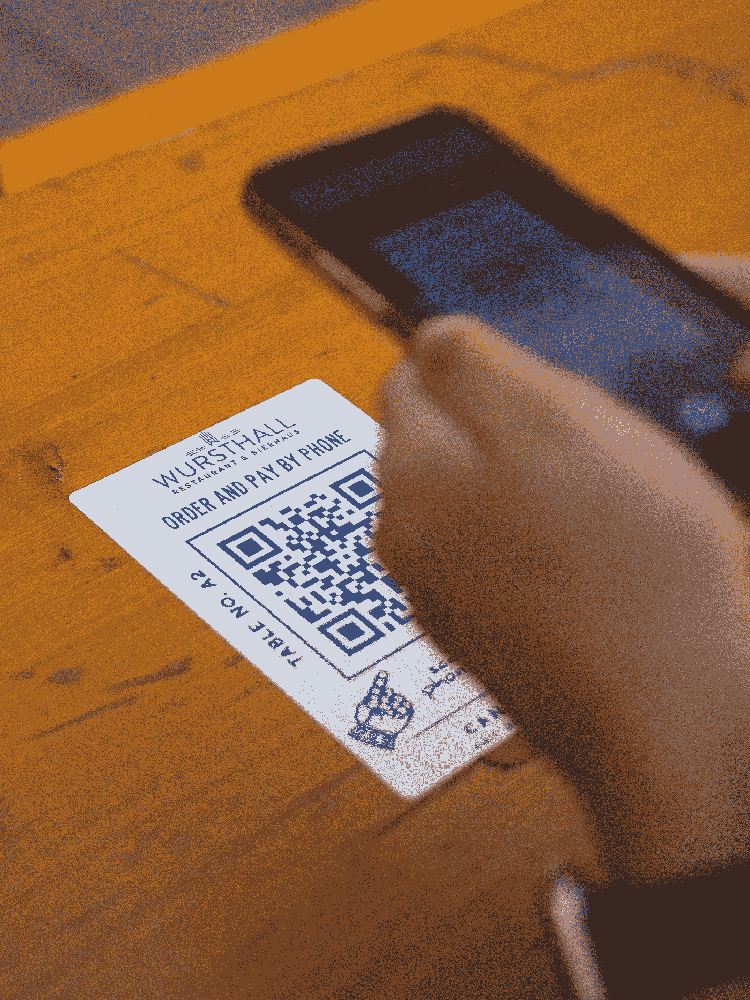

# 我希望在 2021 年看到的工作

> 原文：<https://blog.devgenius.io/the-jobs-i-would-love-to-see-in-2021-5769c5cf08dd?source=collection_archive---------9----------------------->

Clem Onojeghuo 在 [Unsplash](https://unsplash.com?utm_source=medium&utm_medium=referral) 拍摄的照片

2020 年过去了。毫无疑问，这一年将被载入史册。当我们受到全球疫情的打击时，我们被迫重新思考和调整我们的生活。在家工作是新的工作方式。保持距离作为新的社会结构。在线活动是聚会的新方式。

既然各国都开始了疫苗接种计划，我们只能希望 2021 年是我们摆脱隔离和社会距离的一年。然而，我认为疫情从根本上改变了我们体验世界和相互交往的方式。作为一个乐观主义者，我期待着疫情改善我们生活的方式。我们中的许多人可能会回到我们的老套路，但我预计许多公司也会在不同的工作方式中看到机会和潜力。

以下是我列出的 5 个已经存在了一段时间的工作，但我预计随着公司向数字化转型，它们将在明年蓬勃发展。

# 数字助理角色设计师

世界各国都使用封锁来阻止病毒的传播。由于公司面临这些锁定，他们增加了他们的在线存在。这突然意味着在网上提供他们的产品和服务，同时也数字化地处理问题和客户服务。大多数公司会将部分员工转移到他们的客户服务中心。人们在社交渠道上发布内容，通过聊天、社交媒体或视频电话帮助客户。随着封锁的解除，公司的在线存在将会保留，但他们很快就会发现，他们无法配备足够的人员来处理大量涌入的请求和问题。举个例子:我们中有多少人一直在和一家公司打电话，要求退款或者取消假期。

为了解决那些希望通过数字方式联系到一家公司，但没有足够的员工来管理所有这些渠道的客户的紧张情绪，我预计聊天机器人形式的数字助理将会出现。这些聊天机器人将首先回答最常见的常见问题，向客户推荐某些产品，或者提供状态更新。随着公司对这些聊天机器人获得更多的经验，他们将会知道它不仅仅是一个简单的问答机器人。相反，一家公司会希望有一个聊天机器人作为其品牌的延伸。完整的在线体验应该感觉类似于进入商店或与真正的客户服务代理交谈。随着时间的推移，我们可以预期“聊天机器人”这个词会有负面含义，我们将开始谈论“数字助理”。

随着我们的发展，开发和维护数字助理的角色将成为人们的主流工作。每个品牌都希望在与他们的数字助理互动时提供独特的体验。高端时尚商店将提供时尚的数字助理，并能与顾客快速互动。银行将倾向于更正式的数字助理，他们更保守，语气严肃。各公司将根据外表、主动性、语调、用词、回答长度和联系频率来区分他们的数字助理。

该角色的合适候选人将需要独特的艺术素质组合(例如，您可能在戏剧教育中学习的那些)，以便能够理解和设计数字助理的期望行为，以及对实现和塑造助理角色的技术的亲和力。

# 无代码流程设计机构

由[阿尔伯特·胡](https://unsplash.com/@alberthu?utm_source=medium&utm_medium=referral)在 [Unsplash](https://unsplash.com?utm_source=medium&utm_medium=referral) 上拍摄的照片

2020 年对所有厌恶技术的公司来说都是一个大爆炸。IT 实施通常需要年复一年的时间，采用新技术被视为一件麻烦事(而不是一个机会),而 2020 年已经永远改变了这种思维模式。今年年初，当全世界突然加入微软团队进行在线会议时，微软几乎崩溃。

技术通常是设计机构为客户定制实现的领域，我预计提供无代码或低代码解决方案的设计机构的数量会大幅增加。大多数技术平台都为他们的服务提供某种形式的低代码或无代码解决方案。这使得他们的技术更容易获得，并缩短实施时间。

我们可以看到已经有一个[大型基地的领跑者](https://nocodelist.co/agencies/)采用了无代码的工作方式。由于对在线业务的需求将会保持，甚至会增长，我们可以预计许多较小的设计机构或自由职业者将会采用无代码的工作方式。他们将专注于某些平台，并将在无代码框架之上开发高级应用程序。这将为中小型公司带来一场数字革命。以前，全自动流程仅适用于拥有大量技术实施和采用预算的公司，现在这将成为主流。我预计这将是典型的用例，如即使是最小的公司的忠诚度计划，或跨通信渠道的外卖或提货和交付订单，或通过自动提醒安排约会(基本上在任何地方)。

该职位的合适候选人应具备设计和技术背景，并对创业充满热情。你需要钻研几种技术平台来理解它的本质细节。另一方面，你需要一种创造性的设计方法，以便理解你的客户想要解决的问题，并为他们设计合适的流程。

# 远程事件管理器

整个活动和会议部门将在 2020 年被淘汰。它在几天内基本上被消灭了。我记得第一个被取消的大型活动是 2020 年 2 月的世界移动通信大会。许多人跟随其后。

今年，我们看到了相当多的在线活动。取得了不同程度的成功。在某种程度上，似乎每个公司都想通过自己的“网络研讨会”或“研讨会”来获得关注。这些事件的质量各不相同，但远程事件的执行却非常出色。显然[苹果](https://www.apple.com/apple-events/october-2020/)已经成为在线赛事中领先的公司之一。

虽然大型活动肯定会回归，但我预计许多公司和活动组织者将会看到远程活动的巨大优势。我预计，对于不会被在线版本取代的事件，将会有远程事件。这将是对真实活动的补充。通过这种方式，活动可以吸引更多的观众，对于不想在旅行上投入时间和金钱的人来说，他们仍然可以加入。

然而，策划这样的在线活动需要一套不同于常规活动管理的技能。作为远程活动经理，您不必担心步行路线、浴室位置、消防条例以及人们可以在哪里吃饭。相反，你必须确保人们会发现你的在线活动，他们参与其中，与演讲者互动，或者彼此互动。你必须确保你的扬声器有合适的设备和合适的环境。技术不应该成为这些活动的限制，而是一种资产。

这份工作的合适候选人具备普通活动经理的资格:你是一个优秀的计划者，能够轻松地转换任务，能够与许多人合作，并迅速安排事情。最重要的是，你是音频视频技术的大师。你简化了任何远程会议，知道远程吸引观众的技巧。

# 数字健康蔻驰

远程工作不仅仅是彩虹和蝴蝶。也是压力大。很孤独。这“比在办公室里有趣多了”。你与团队中其他人的接触时间更有功能性，更适合需要讨论的内容。

此外，最近几个月的研究已经表明，当人们在家工作时，他们倾向于工作更长时间。他们通常利用通勤时间开始工作。晚饭后做一些额外的工作也简单多了，因为你的办公室已经布置好了，触手可及。

对于雇主和团队领导来说，很难把握人们的感受。在你通常能看到或感觉到某人发生了什么的地方，你缺少这些接触的时刻。

我希望的是，公司会任命数字健康教练。他们不仅会在设置您的远程工作场所时提供建议和支持。我希望他们也能监督我们的网上行为，并就此与我们进行诚实的对话。如果你长时间工作，晚上工作，周末也没有社交控制。如果你每天晚上和周末都呆在办公室，人们可能会叫你出去。检查你是否一切都好。这在远程设置中是不可能的。随着许多公司将转向完全远程或混合的工作地点，我希望他们也将任命人员来照顾他们员工的(数字)健康。

合适的候选人综合了人力资源、心理学和数据分析背景。您应该能够阅读和解释您的人员的使用数据，并能够与人们进行私下交谈。因为这是一个需要讨论的微妙问题，所以对谈话技巧的深入了解是必须的。

# 图书管理员

Slack、微软团队、JIRA、OneDrive、概念、Dropbox、InVision、Gitlab、Confluence、Wiki、Outlook、Google Drive、Sharepoint、Monday.com。我到处都有文件和数据。几乎无处不在。这些只是我和我的团队的文件。与其他团队合作会使我拥有的文件数量成倍增加。随着我们开始远程工作，通过数字工具进行协作变得至关重要。到目前为止，我们的经验是，这些工具和平台中有许多对一件事非常有用。但对其他事情就没那么好了。问题是:我把那个文档存储在哪里了？我在哪里记录设计决策？我在哪里读到过这个问题？我迷路了。每天都有。

[丹尼尔](https://unsplash.com/@setbydaniel?utm_source=medium&utm_medium=referral)在 [Unsplash](https://unsplash.com?utm_source=medium&utm_medium=referral) 上的照片

如果公司里有人能主动为我们组织所有的数据，那不是很好吗？这将告诉我们应该在哪里存储我们的文件和数据，并可以帮助我们访问数据。我喜欢图书管理员的比喻。它不是主动参与生成新文件和数据的人，而是帮助排序和访问数据的人。知道哪些文件属于哪里，甚至可能知道其他人是否在做类似的事情的人。

如果组织中至少有一个人对此负责，我会很高兴。一个能给我们正在制造的数字混乱带来结构和清晰的人。

一个合适的候选人应该有项目管理和软件开发的背景。一个有组织有条理的人，一个能理解人们为什么需要某种工具的人。这个人也将能够快速查询不同的工具和平台。理想情况下，它是主动组织和分类数据，并给人们指出正确方向的人。可以说是轻轻一推。

# 2021，我们来了

让我们看看 2021 年有什么。我很想听听你对你想看到的工作的看法。如果你有好主意，请在评论中发表。

**喜欢这篇文章吗？** *请在我的个人资料下找到我的其他文章！*

 [## Remco Magielse -中等

### 对积压工作进行优先排序可能是一项繁琐而困难的任务。这很难，因为这是一个纯粹的决策…

remcomagielse.medium.com](https://remcomagielse.medium.com/) 

Remco Magielse *是 Remco 的一名产品经理。CM.com 是一家专注于荷兰商务会话的高科技公司。他曾在飞利浦 Hue 担任系统工程师和产品经理。Remco 的博士论文题目是“如何为适应性照明环境设计:拥抱设计中的复杂性”。他撰写关于产品和软件开发以及产品管理所需的硬技能和软技能的文章。他对创新充满热情，并促成了大约 50 项专利。*