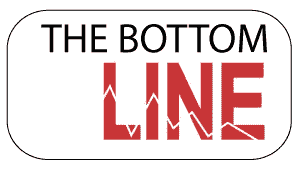

# 成为专业软件工程师的关键

> 原文：<https://blog.devgenius.io/the-key-to-becoming-a-professional-software-engineer-964a9954acfa?source=collection_archive---------18----------------------->

[Zan](https://unsplash.com/@zanilic?utm_source=medium&utm_medium=referral) 在 [Unsplash](https://unsplash.com?utm_source=medium&utm_medium=referral) 上的照片

在满足问题的功能需求并且不违反其非功能约束的同时构建程序的过程被称为软件设计。

设计是软件开发过程中最具创造性的部分。

它通常分为两个主要部分，架构设计和细节设计。

**建筑设计:**

将行为方面的责任识别和分配给软件的各种模块或组件的过程。

**详细设计:**

它是关于处理每一个特定的组件。

此外，它也是指定您在体系结构设计期间确定的每个系统组件的行为的过程。

它包括数据结构和算法。

关于软件设计，我最喜欢的一句话是来自*乏色曼的:*

> “数据设计期间的主要活动是选择在需求定义和规范阶段确定的数据对象的逻辑表示。
> 
> 选择过程可以包括对替代结构的算法分析，以便确定最有效的设计，或者可以简单地包括使用一组模块，这些模块提供对对象的某种表示的操作。"

软件设计有许多方法，有些是针对如何最好地构建系统，比如面向对象设计。

其中一些是为特定类别的应用而设计的。这就是实时系统的设计。

其中一些是为处理某种应用而构建的，比如用户界面设计。

设计的所有方面可能包括可以比较的三个方面:设计方法、设计表示以及如何验证设计。

## 设计法

方法是软件工程师或设计师用来解决问题的一系列系统步骤。

它暗示了一种审视问题的特殊方式。

## 设计表现

该表示独立于软件实现中使用的编程语言，并且涵盖了软件设计的某些基本概念:控制流、数据流和数据抽象。

## 设计验证

它是检查规范是否抓住了客户需求的过程。

底线是你不能在不知道应该做什么的情况下设计一个复杂的系统。

这就是我们使用分析模型的原因，分析模型关注的是要解决的问题，而设计关注的是该问题的解决方案。

图表可以帮助表达这种理解，并表达你对问题解决方案。

# 结论:

UML(统一建模语言)为您提供了丰富的图类型，以及 OCL(对象约束语言)和元模型。

一般来说，你对问题理解得越准确，你对系统历史的后续问题就越少。

作为这篇文章的额外收获，我想与您分享一些改变了我在软件设计工程领域的生活的书籍:

1- [干净的代码:敏捷软件技术手册](https://amzn.to/2XSyWbg)

2- [干净的架构:软件结构和设计的工匠指南(Robert C. Martin 系列)](https://amzn.to/30BYfzR)

3- [务实的程序员:你的精通之旅，20 周年纪念版](https://amzn.to/3fgZmJr)

# 感谢阅读！

如果你喜欢我的工作，喜欢支持我…

*   在 twitter 上关注我[这里](https://twitter.com/zelakioui)
*   在 facebook 上关注我[这里](https://www.facebook.com/zelakioui)
*   在我的 [**Youtube 频道**](https://www.youtube.com/channel/UCU_LhClyNOtEQw7R0q9ovoQ) 上订阅，我分享了许多类似这样的精彩内容，但都是视频
*   查看我的博客网站[selcote.com](http://selcote.com/)