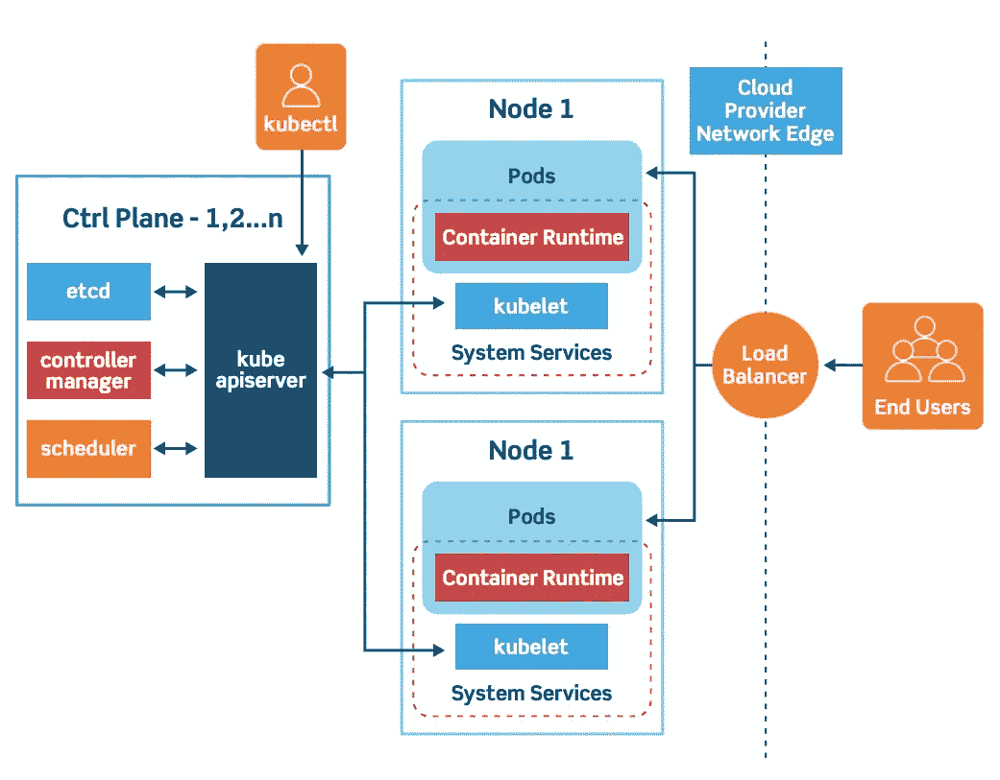
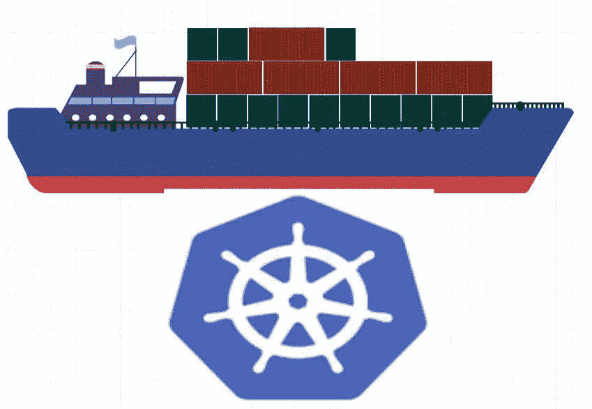
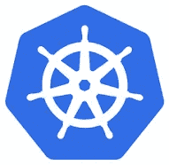

# 简化的 Kubernetes 集群架构

> 原文：<https://blog.devgenius.io/the-kubernetes-cluster-architecture-simplified-3c4a5fb41449?source=collection_archive---------0----------------------->

读完这篇文章后，你将能够:

-确定并理解 kubernetes 集群中各种组件的职责。

我们将首先从较高的层次来看架构，然后深入到每个组件，同时解释它们的职责以及应该如何配置它们。

让我们开始吧。

**使用 Kubernetes 的目的是什么？**

Kubernetes 的目的是以自动化的方式以容器的形式托管您的应用程序，以便您可以根据需要轻松地部署尽可能多的应用程序实例，并轻松地实现应用程序中不同服务之间的通信。

为了简单起见，我将使用船只的类比来理解 Kubernetes 的架构。

在这个例子中，我们有两种船:

1.**货船:**从事将集装箱运送到海上的实际工作。

2.**控制船**:负责监控和管理货船。

Kubernetes 集群由一组节点组成，这些节点可以是物理的、虚拟的、本地的或云上的，以容器的形式托管应用程序。在这个类比中，这些与货船有关。

集群中的工作节点是可以装载集装箱的船只。

但是除了其他任务之外，有人需要将集装箱装载到船上，例如:

-计划如何装载。

-确定合适的船只。

-存储船只的信息。

-监测和跟踪集装箱在船上的位置。

-管理整个装载过程等..

这由控制船来完成，控制船上有不同的办公室和部门、监控设备、通信设备、用于在船之间移动集装箱的起重机等。控制船与 kubernetes 集群中负责管理集群的主节点相关。控制船完成的任务包括:

存储关于不同节点的信息。

-计划哪些集装箱去哪里。

-监控节点以及节点上的容器。

主节点在一组称为**控制平面组件**的组件的帮助下完成所有这些任务。

**控制平面组件**

我们现在来看看这些组件。

**ETCD**

你可以想象每天都有许多集装箱从船上装卸。因此，我们必须跟踪不同船只的信息，例如:

哪艘船上有什么集装箱。

-每个集装箱是什么时候装货的？

所有这些都存储在一个高度可用的键值存储中，称为 **ETCD** ，这是一个以键值格式存储信息的数据库。

在另一篇文章中，我们将更多地了解 ETCD 集群实际上是什么，其中存储了什么数据，以及它是如何存储数据的。

**调度程序**

当船只到达时，您使用起重机将集装箱装载到船只上，起重机会根据船只的大小、容量、船只上已有的集装箱数量以及其他任何条件(例如:

-船的目的地。

-允许运输的集装箱类型。

这些被称为**调度器**。

在 Kubernetes 集群中，as scheduler 根据以下条件确定放置容器的正确节点:

-集装箱资源需求。

-工作节点容量。

-任何其他政策或约束，如**污染和容忍**或**节点关联**规则。

我们将在下一节通过例子更详细地讨论这些。我们有一整个部门专门负责日程安排。

**控制器**

在主船上有不同的办公室被分配到特殊的任务或部门。例如，运营团队负责船舶处理、交通控制等。他们处理与损害有关的问题，不同船只的航线等。货运团队负责集装箱，当集装箱损坏或毁坏时，他们会确保提供新的集装箱。此外，还有一个服务办公室，负责不同船只之间的信息技术和通信。

同样，在 Kubernetes，我们有负责不同区域的控制器。

节点控制器**负责管理节点。他们负责将新节点加入集群，处理节点变得不可用或被破坏的情况。**

**复制控制器**确保所需数量的容器始终在您的复制组中运行。

**集群中的通信**

我们已经看到了不同的组件，比如不同的办公室、不同的船只、数据存储和起重机。

但是这些是如何相互交流的呢？

一个办公室如何联系到另一个办公室，谁对它们进行高级管理？

kube-api 服务器是 kubernetes 的主要管理组件。kube-api 服务器负责协调集群中的所有操作。

它公开了 Kubernetes API，外部用户使用该 API 在集群上执行管理操作，各种控制器监视集群的状态，并根据需要进行必要的更改，工作节点使用该 API 与服务器进行通信。

**集装箱呢？**

现在，我们在这里使用容器。容器无处不在，所以我们需要一切都与容器兼容。

我们的应用程序采用容器的形式:主节点上构成整个管理系统的不同组件可以以容器的形式托管。

DNS 服务网络解决方案都可以以容器的形式部署。所以我们需要一些可以运行容器的软件，那就是**容器运行时引擎**。一个受欢迎的是**码头工人**。

因此，如果您希望将控制平面组件作为容器托管，我们需要在集群中的所有节点(包括主节点)上安装 Docker 或受支持的等效软件。

**只能是 Docker 吗？**

不，不一定是码头工人。Kubernetes 支持其他运行时引擎，如 ContainerD 或 Rocket。

**移动到货船(节点)**

每艘货船都有一名船长，负责:

-管理这些船上的所有活动。

-与船长联系，首先让船长知道他们有兴趣加入该小组

-接收关于要装载到船上的集装箱的信息。

-根据需要装载适当的容器。

-向船长发回关于本船状况和船上集装箱状况等的报告。

现在，这艘船的船长是库伯内特斯的**库伯莱特**。kubelet 是在集群中的每个节点上运行的代理。它监听来自 kube-api 服务器的指令，并根据需要在节点上部署或销毁容器。

kube-api 服务器定期从 kubelet 获取状态报告，以监控节点和容器的状态。

库伯勒号更像是一艘管理船上集装箱的船长。但是在工作节点上运行的应用程序需要能够相互通信。

例如，您可能在一个节点上的一个容器中运行一个 web 服务器，在另一个容器中运行一个数据库服务器。

web 服务器如何到达另一个节点上的数据库服务器？

**工人节点间的通信**

工作节点之间的通信由运行在工作节点上的另一个组件实现，该组件称为 **Kube 代理服务**。Kube-proxy 服务确保在 worker 节点上有必要的规则，以允许在其上运行的容器相互访问。

**总结**

在这篇文章中，我们讨论了很多主题和 kubernetes 对象。让我们快速总结一下到目前为止我们所学到的内容:

**Kubernetes 集群有一个主节点和一个工作节点**。

-在主船上，ETCD 服务器运行，它存储有关集群的信息。

-**Kube 调度器**负责调度节点上的应用程序或容器。

-各种**控制器**负责不同的功能，如节点控制器、复制控制器等。

-**Kube API 服务器**负责在 worker 节点上协调集群内的所有操作。

- **Kubelets** 监听来自 **Kube-API 服务器**的指令并管理容器。

-最后， **Kube-proxy** 帮助实现集群内服务之间的通信。

这是对各种组件的高度概括。我们将在接下来的文章中深入探讨这些问题。

本帖最初发表于[https://static-blog-gamma . vercel . app/posts/kubernetes/core-concepts/cluster-architecture](https://static-blog-gamma.vercel.app/posts/kubernetes/core-concepts/cluster-architecture)。